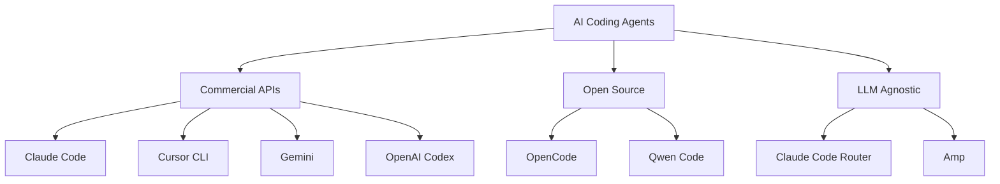

## Overview

Forge supports **8 different AI coding agents** - giving you the freedom to choose the best tool for each task. This is the core of Forge's **BYOL (Bring Your Own LLM)** philosophy.

---

## The Agent Landscape



---

## Supported Agents

### Commercial API-Based

<CardGroup cols={2}>
  <Card title="Claude Code" icon="anthropic" href="/forge/agents/claude-code">
    **By**: Anthropic
    **Models**: Claude 3.5 Sonnet, Opus, Haiku
    **Best for**: Complex logic, architecture
    **Cost**: $3-15/MTok

    Excellent reasoning, great for system design
  </Card>

  <Card title="Cursor CLI" icon="cursor" href="/forge/agents/cursor-cli">
    **By**: Cursor
    **Models**: Multiple (via Cursor account)
    **Best for**: UI/UX, rapid iteration
    **Cost**: Subscription-based

    Intuitive for frontend work, fast iterations
  </Card>

  <Card title="Gemini" icon="google" href="/forge/agents/gemini">
    **By**: Google
    **Models**: Gemini 2.0 Flash, 1.5 Pro
    **Best for**: Fast tasks, experimentation
    **Cost**: Free tier available!

    Blazing fast, generous free tier
  </Card>

  <Card title="OpenAI Codex" icon="openai" href="/forge/agents/openai-codex">
    **By**: OpenAI
    **Models**: GPT-4 Turbo, GPT-3.5
    **Best for**: General purpose coding
    **Cost**: $0.50-30/MTok

    Reliable, well-documented
  </Card>
</CardGroup>

### Open Source & Local

<CardGroup cols={2}>
  <Card title="OpenCode" icon="code" href="/forge/agents/open-source#opencode">
    **Type**: Open source
    **Run**: Locally via Ollama
    **Best for**: Privacy-sensitive work
    **Cost**: Free (your hardware)

    Fully local, no data leaves your machine
  </Card>

  <Card title="Qwen Code" icon="code" href="/forge/agents/open-source#qwen">
    **Type**: Open source (Alibaba)
    **Run**: Locally via Ollama
    **Best for**: Cost-conscious development
    **Cost**: Free (your hardware)

    Strong performance, competitive with commercial
  </Card>
</CardGroup>

### LLM-Agnostic

<CardGroup cols={2}>
  <Card title="Claude Code Router" icon="route">
    **Type**: LLM proxy
    **Use**: Any OpenAI-compatible API
    **Best for**: Flexibility, vendor independence
    **Cost**: Varies by backend

    Route to ANY model - OpenAI, Anthropic, local, custom
  </Card>

  <Card title="Amp" icon="sourcegraph">
    **By**: Sourcegraph
    **Type**: Code intelligence
    **Best for**: Large codebase navigation
    **Cost**: Based on usage

    Excels at understanding existing code
  </Card>
</CardGroup>

---

## Choosing the Right Agent

### By Task Type

| Task Type | Best Agent | Why |
|-----------|------------|-----|
| **Complex Architecture** | Claude Sonnet/Opus | Superior reasoning |
| **Quick Fixes** | Gemini Flash | Fastest, free |
| **UI Components** | Cursor | UI/UX intuition |
| **Refactoring** | Claude Sonnet | Maintains coherence |
| **Testing** | Claude/GPT-4 | Comprehensive coverage |
| **Documentation** | GPT-4 | Clear writing |
| **Privacy-Critical** | OpenCode/Qwen | Runs locally |
| **Experimentation** | Gemini | Free tier, fast |

### By Budget

**💰 Budget-Conscious**:
1. Gemini Flash (free tier!)
2. OpenCode (local, free)
3. GPT-3.5 Turbo (cheap)

**💵 Balanced**:
1. Claude Haiku (fast + cheap)
2. Gemini Pro
3. Cursor (subscription)

**💎 Premium**:
1. Claude Opus (best quality)
2. GPT-4 Turbo
3. Claude Sonnet

### By Context Window

| Agent | Context | Best For |
|-------|---------|----------|
| Gemini 1.5 Pro | 2M tokens | Massive codebases |
| Claude 3.5 | 200K tokens | Large projects |
| GPT-4 Turbo | 128K tokens | Standard projects |
| GPT-3.5 | 16K tokens | Small files |

---

## Agent Comparison

### Speed vs Quality

```
Quality
  ↑
  │     Claude Opus ●
  │            Claude Sonnet ●
  │                    GPT-4 ●
  │                         Cursor ●
  │                              Claude Haiku ●
  │                                   Gemini Pro ●
  │                                        GPT-3.5 ●
  │                                             Gemini Flash ●
  └──────────────────────────────────────────────────────────→
                                                          Speed
```

### Cost vs Capability

```
Capability
  ↑
  │     Claude Opus ●
  │            GPT-4 ●
  │                Claude Sonnet ●
  │                     Gemini Pro ●
  │                          Claude Haiku ●
  │                               GPT-3.5 ●
  │                                    Gemini Flash ●
  │                                         OpenCode/Qwen ●
  └──────────────────────────────────────────────────────────→
                                                          Cost
                                                      (cheaper)
```

---

## Real-World Performance

### Benchmark: "Add JWT Authentication"

Same task, different agents:

```
╭───────────┬──────────┬─────────┬────────┬───────╮
│ Agent     │ Duration │ Quality │ Tests  │ Cost  │
├───────────┼──────────┼─────────┼────────┼───────┤
│ Claude S  │ 5m 22s   │ A+      │ 95%    │ $0.23 │
│ Gemini F  │ 2m 15s   │ B+      │ 78%    │ $0.00 │
│ GPT-4     │ 6m 01s   │ A       │ 88%    │ $0.45 │
│ Cursor    │ 4m 18s   │ A-      │ 85%    │ $0.19 │
│ OpenCode  │ 8m 33s   │ B       │ 70%    │ $0.00 │
╰───────────┴──────────┴─────────┴────────┴───────╯

Winner: Claude Sonnet (best balance)
Budget: Gemini Flash (free!)
Speed: Gemini Flash (2m 15s)
```

---

## Switching Between Agents

One of Forge's superpowers: **try multiple agents on the same task**!

```bash
# Start with fast, cheap agent
forge task create "Add authentication" --llm gemini

# If not satisfied, try Claude
forge task fork 1 --llm claude

# Compare results
forge task compare 1

# Choose winner
forge task merge 1 --attempt 2
```

---

## Agent Configuration

### Quick Setup

See detailed setup for each agent:

- [Claude Code Setup](/forge/agents/claude-code)
- [Cursor CLI Setup](/forge/agents/cursor-cli)
- [Gemini Setup](/forge/agents/gemini)
- [OpenAI Setup](/forge/agents/openai-codex)
- [Open Source Setup](/forge/agents/open-source)

### Configuration File

`.forge/config.json`:

```json
{
  "llms": {
    "claude": {
      "apiKey": "sk-ant-...",
      "model": "claude-3-5-sonnet-20241022"
    },
    "gemini": {
      "apiKey": "AIza...",
      "model": "gemini-2.0-flash-exp"
    },
    "openai": {
      "apiKey": "sk-...",
      "model": "gpt-4-turbo"
    },
    "cursor": {
      "enabled": true
    }
  }
}
```

---

## Specialized Agent Profiles

Apply "personas" to any base agent:

```bash
# Security-focused Claude
forge task create "Add auth" \
  --llm claude \
  --agent "security-expert"

# Test-focused Gemini
forge task create "Add feature" \
  --llm gemini \
  --agent "test-writer"

# Performance-focused GPT-4
forge task create "Optimize query" \
  --llm openai \
  --agent "performance-optimizer"
```

See [Specialized Agents](/forge/advanced/specialized-agents) for details.

---

## Agent Strengths & Weaknesses

### Claude Code

**Strengths** ✅:
- Complex reasoning
- System design
- Edge case handling
- Clear explanations

**Weaknesses** ⚠️:
- Can be verbose
- Sometimes over-engineers
- More expensive

**Best for**: Architecture, refactoring, security

### Gemini

**Strengths** ✅:
- Blazing fast
- Free tier (!)
- Good for simple tasks
- Concise code

**Weaknesses** ⚠️:
- May miss edge cases
- Less sophisticated reasoning
- Shorter responses

**Best for**: Quick fixes, iteration, experimentation

### Cursor CLI

**Strengths** ✅:
- Great UI/UX intuition
- Fast iterations
- Context-aware
- Good for frontend

**Weaknesses** ⚠️:
- Subscription required
- Less depth on algorithms
- Tied to Cursor ecosystem

**Best for**: UI components, rapid prototyping

### OpenAI Codex (GPT-4)

**Strengths** ✅:
- Reliable and consistent
- Well-documented
- Good all-rounder
- Strong community

**Weaknesses** ⚠️:
- Expensive
- Slower than alternatives
- Nothing exceptional

**Best for**: General coding, documentation

### Open Source (OpenCode/Qwen)

**Strengths** ✅:
- Fully local
- Privacy guaranteed
- Free (your hardware)
- No rate limits

**Weaknesses** ⚠️:
- Slower
- Lower quality
- Requires powerful hardware
- More setup needed

**Best for**: Privacy-sensitive, learning, cost control

---

## Multi-Agent Workflows

### Sequential Workflow

Use different agents for different stages:

```bash
# 1. Design with Claude (best at architecture)
forge task create "Build payment system" --llm claude

# 2. Implement with Cursor (fast iteration)
forge task create "Build UI components" --llm cursor

# 3. Test with GPT-4 (comprehensive tests)
forge task create "Add integration tests" --llm openai

# 4. Document with Gemini (fast, cheap)
forge task create "Write API docs" --llm gemini
```

### Parallel Comparison

Run multiple agents simultaneously:

```bash
# Try 3 agents at once
forge task create "Optimize database query" --llm claude &
forge task fork 1 --llm gemini &
forge task fork 1 --llm openai &

wait

# Compare and choose best
forge task compare 1
```

---

## Cost Tracking

Monitor spending per agent:

```bash
# This month's costs
forge cost summary --month january

# Output:
╭──────────┬─────────┬────────╮
│ Agent    │ Tasks   │ Cost   │
├──────────┼─────────┼────────┤
│ Claude   │ 24      │ $5.67  │
│ Gemini   │ 48      │ $0.00  │
│ GPT-4    │ 12      │ $8.23  │
│ Cursor   │ 15      │ (sub)  │
╰──────────┴─────────┴────────╯
Total: $13.90
```

---

## Best Practices

<CardGroup cols={2}>
  <Card title="Start with Free Tier" icon="coins">
    Begin with Gemini Flash (free!) to validate approach, then use premium agents for refinement
  </Card>

  <Card title="Match Agent to Task" icon="bullseye">
    Don't use Claude Opus for simple fixes. Don't use Gemini Flash for architecture.
  </Card>

  <Card title="Learn Agent Strengths" icon="chart-line">
    Track which agent works best for which task types in your codebase
  </Card>

  <Card title="Keep Options Open" icon="door-open">
    Configure multiple agents. Vendor lock-in is the enemy of productivity.
  </Card>
</CardGroup>

---

## Troubleshooting

<AccordionGroup>
  <Accordion title="Agent not available">
    **Error**: "Agent 'claude' not configured"

    **Solution**:
    - Check `.forge/config.json` has API key
    - Verify API key is valid
    - Run `forge config validate`
  </Accordion>

  <Accordion title="All agents slow">
    **Issue**: Even "fast" agents are slow

    **Possible causes**:
    - Network latency
    - Large context window
    - Complex task description

    **Solutions**:
    - Check internet speed
    - Reduce context
    - Simplify task description
  </Accordion>

  <Accordion title="Results inconsistent">
    **Issue**: Same task, different results each time

    **This is normal!**

    AI is non-deterministic. Use temperature=0 for more consistency:

    ```json
    {
      "llms": {
        "claude": {
          "temperature": 0
        }
      }
    }
    ```
  </Accordion>
</AccordionGroup>

---

## Next Steps

<CardGroup cols={2}>
  <Card title="Claude Code Setup" icon="anthropic" href="/forge/agents/claude-code">
    Configure Claude for Forge
  </Card>

  <Card title="Gemini Setup" icon="google" href="/forge/agents/gemini">
    Setup Gemini (free tier!)
  </Card>

  <Card title="Open Source Agents" icon="code" href="/forge/agents/open-source">
    Run agents locally
  </Card>

  <Card title="Specialized Agents" icon="user-gear" href="/forge/advanced/specialized-agents">
    Create custom agent personas
  </Card>
</CardGroup>
