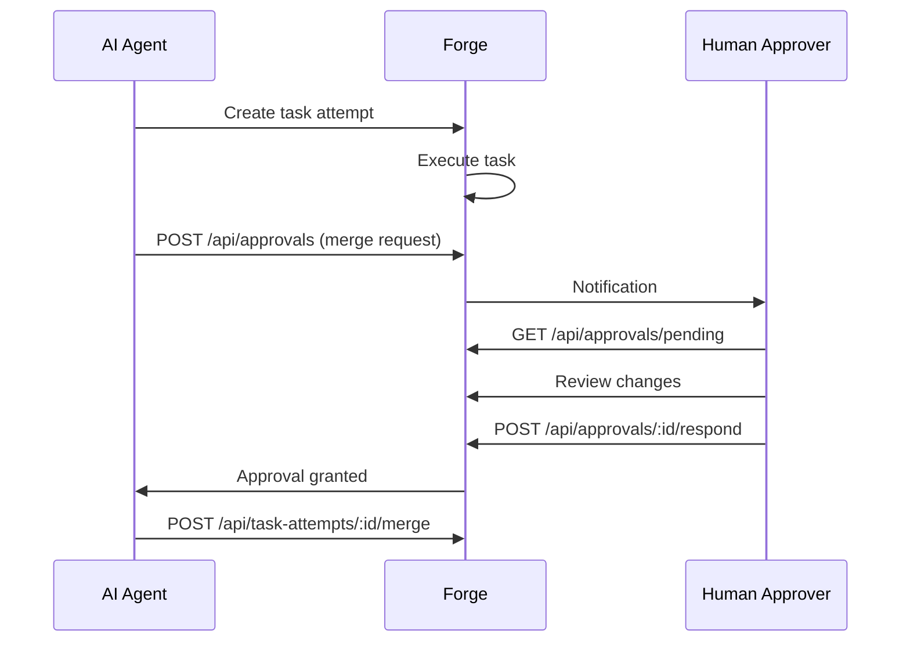
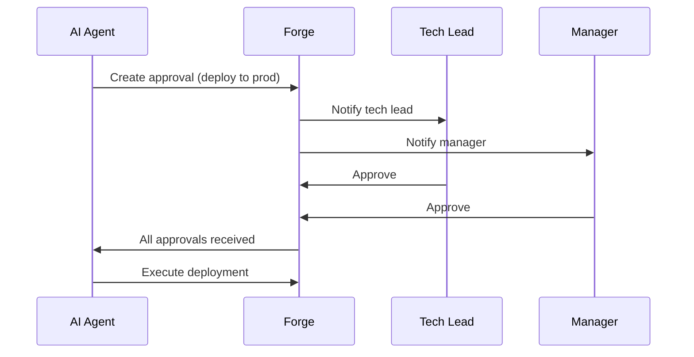

## Overview

The Approvals API enables approval workflows where task attempts can request human approval before proceeding with critical operations like merging or deployment.

**Base URL**: `http://localhost:8887/api/approvals`

---

## Create Approval Request

Create a new approval request for a task attempt.

```http
POST /api/approvals
```

### Request Body

```json
{
  "taskAttemptId": "attempt_abc123",
  "type": "merge",
  "title": "Approve merge for authentication system",
  "description": "This will merge 8 files with 245 additions into main branch",
  "metadata": {
    "filesChanged": 8,
    "linesAdded": 245,
    "linesRemoved": 12,
    "targetBranch": "main"
  },
  "approvers": [
    "user@example.com",
    "lead@example.com"
  ],
  "expiresAt": "2024-01-16T10:00:00Z"
}
```

### Parameters

| Parameter | Type | Required | Description |
|-----------|------|----------|-------------|
| `taskAttemptId` | string | ✅ | Task attempt ID requesting approval |
| `type` | enum | ✅ | Approval type: `merge`, `deploy`, `custom` |
| `title` | string | ✅ | Approval request title |
| `description` | string | ⚠️ | Detailed description |
| `metadata` | object | ⚠️ | Additional context data |
| `approvers` | array | ⚠️ | List of approver emails (all users if omitted) |
| `expiresAt` | string | ⚠️ | Expiration timestamp |

### Example Response

```json
{
  "success": true,
  "data": {
    "id": "approval_def456",
    "taskAttemptId": "attempt_abc123",
    "type": "merge",
    "title": "Approve merge for authentication system",
    "description": "This will merge 8 files with 245 additions into main branch",
    "status": "pending",
    "createdBy": "ai@automagik.ai",
    "createdAt": "2024-01-15T11:00:00Z",
    "expiresAt": "2024-01-16T10:00:00Z",
    "approvers": [
      "user@example.com",
      "lead@example.com"
    ],
    "responses": []
  }
}
```

---

## Get Approval Status

Get detailed information about an approval request.

```http
GET /api/approvals/:id
```

### Example Response

```json
{
  "success": true,
  "data": {
    "id": "approval_def456",
    "taskAttemptId": "attempt_abc123",
    "type": "merge",
    "title": "Approve merge for authentication system",
    "status": "approved",
    "createdBy": "ai@automagik.ai",
    "createdAt": "2024-01-15T11:00:00Z",
    "expiresAt": "2024-01-16T10:00:00Z",
    "approvers": [
      "user@example.com",
      "lead@example.com"
    ],
    "responses": [
      {
        "approver": "user@example.com",
        "decision": "approved",
        "comment": "Looks good to me",
        "respondedAt": "2024-01-15T11:15:00Z"
      },
      {
        "approver": "lead@example.com",
        "decision": "approved",
        "comment": "LGTM, ship it!",
        "respondedAt": "2024-01-15T11:20:00Z"
      }
    ],
    "metadata": {
      "filesChanged": 8,
      "linesAdded": 245,
      "linesRemoved": 12,
      "targetBranch": "main"
    }
  }
}
```

### Status Values

- `pending` - Awaiting approval responses
- `approved` - All required approvers approved
- `rejected` - At least one approver rejected
- `expired` - Expired before all approvals received
- `cancelled` - Cancelled by requester

---

## Respond to Approval

Approve or reject an approval request.

```http
POST /api/approvals/:id/respond
```

### Request Body

```json
{
  "decision": "approved",
  "comment": "Looks good, merge approved!"
}
```

### Parameters

| Parameter | Type | Required | Description |
|-----------|------|----------|-------------|
| `decision` | enum | ✅ | Response: `approved`, `rejected` |
| `comment` | string | ⚠️ | Optional comment explaining decision |

### Example Response

```json
{
  "success": true,
  "data": {
    "approvalId": "approval_def456",
    "decision": "approved",
    "comment": "Looks good, merge approved!",
    "respondedAt": "2024-01-15T11:15:00Z",
    "approvalStatus": "approved"
  }
}
```

**Note**: `approvalStatus` indicates the overall approval request status after this response.

---

## Get Pending Approvals

List all pending approval requests for the current user.

```http
GET /api/approvals/pending
```

### Query Parameters

| Parameter | Type | Description |
|-----------|------|-------------|
| `type` | enum | Filter by type: `merge`, `deploy`, `custom` |
| `page` | integer | Page number (default: 1) |
| `limit` | integer | Items per page (default: 20) |

<RequestExample>

```bash cURL
curl "http://localhost:8887/api/approvals/pending?type=merge&limit=10"
```

```javascript JavaScript
const response = await fetch('http://localhost:8887/api/approvals/pending?type=merge&limit=10');
const data = await response.json();
```

```python Python
import requests

response = requests.get('http://localhost:8887/api/approvals/pending?type=merge&limit=10')
data = response.json()
```

</RequestExample>

<ResponseExample>

```json 200 Success
{
  "success": true,
  "data": [
    {
      "id": "approval_def456",
      "taskAttemptId": "attempt_abc123",
      "type": "merge",
      "title": "Approve merge for authentication system",
      "status": "pending",
      "createdBy": "ai@automagik.ai",
      "createdAt": "2024-01-15T11:00:00Z",
      "expiresAt": "2024-01-16T10:00:00Z"
    },
    {
      "id": "approval_ghi789",
      "taskAttemptId": "attempt_xyz456",
      "type": "merge",
      "title": "Approve merge for payment integration",
      "status": "pending",
      "createdBy": "ai@automagik.ai",
      "createdAt": "2024-01-15T10:30:00Z",
      "expiresAt": "2024-01-16T09:00:00Z"
    }
  ],
  "pagination": {
    "page": 1,
    "limit": 10,
    "total": 2,
    "pages": 1
  }
}
```

```json 401 Unauthorized
{
  "success": false,
  "error": {
    "code": "UNAUTHORIZED",
    "message": "Authentication required"
  }
}
```

</ResponseExample>

---

## Approval Workflows

### Merge Approval Workflow



### Deployment Approval Workflow



---

## SDK Examples

### JavaScript/TypeScript

```typescript
import { ForgeClient } from '@automagik/forge-sdk';

const forge = new ForgeClient();

// Create approval request
const approval = await forge.approvals.create({
  taskAttemptId: 'attempt_abc123',
  type: 'merge',
  title: 'Approve merge for authentication system',
  description: 'Merging 8 files with 245 additions',
  approvers: ['tech-lead@example.com', 'manager@example.com']
});

// Get pending approvals
const pending = await forge.approvals.pending({
  type: 'merge'
});

// Respond to approval
await forge.approvals.respond('approval_def456', {
  decision: 'approved',
  comment: 'LGTM!'
});

// Check approval status
const status = await forge.approvals.get('approval_def456');
console.log(`Approval status: ${status.status}`);
```

### Python

```python
from automagik_forge import ForgeClient

forge = ForgeClient()

# Create approval request
approval = forge.approvals.create(
    task_attempt_id='attempt_abc123',
    type='merge',
    title='Approve merge for authentication system',
    approvers=['tech-lead@example.com']
)

# Get pending approvals
pending = forge.approvals.pending(type='merge')

# Respond to approval
forge.approvals.respond(
    'approval_def456',
    decision='approved',
    comment='Looks good!'
)
```

---

## Best Practices

<AccordionGroup>
  <Accordion title="Use Descriptive Titles">
    ```json
    // Good ✅
    {
      "title": "Approve merge: Add JWT authentication with refresh tokens",
      "description": "Changes: 8 files, +245/-12 lines. Adds auth middleware and user routes."
    }

    // Avoid ❌
    {
      "title": "Approve merge",
      "description": "Code changes"
    }
    ```
  </Accordion>

  <Accordion title="Include Context in Metadata">
    ```json
    {
      "metadata": {
        "filesChanged": 8,
        "linesAdded": 245,
        "linesRemoved": 12,
        "targetBranch": "main",
        "diffUrl": "/api/task-attempts/abc123/diff",
        "tests": "all passing",
        "securityScan": "no issues found"
      }
    }
    ```
  </Accordion>

  <Accordion title="Set Appropriate Expiration">
    ```javascript
    // For urgent changes - 4 hours
    expiresAt: new Date(Date.now() + 4 * 60 * 60 * 1000)

    // For normal changes - 24 hours
    expiresAt: new Date(Date.now() + 24 * 60 * 60 * 1000)

    // For low priority - 3 days
    expiresAt: new Date(Date.now() + 3 * 24 * 60 * 60 * 1000)
    ```
  </Accordion>

  <Accordion title="Specify Relevant Approvers">
    ```json
    // Good - specific approvers ✅
    {
      "approvers": [
        "security-lead@example.com",  // For auth changes
        "tech-lead@example.com"       // For code review
      ]
    }

    // Avoid - too many approvers ❌
    {
      "approvers": [
        "user1@example.com",
        "user2@example.com",
        "user3@example.com",
        "user4@example.com",
        "user5@example.com"
      ]
    }
    ```
  </Accordion>
</AccordionGroup>

---

## Next Steps

<CardGroup cols={2}>
  <Card title="Attempts API" icon="flask" href="/forge/api/attempts">
    Manage task attempts that require approval
  </Card>

  <Card title="Workflows" icon="diagram-project" href="/forge/workflows/code-review">
    Approval workflow patterns
  </Card>

  <Card title="WebSockets" icon="bolt" href="/forge/api/websockets">
    Real-time approval notifications
  </Card>

  <Card title="Tasks API" icon="list-check" href="/forge/api/tasks">
    Create tasks that trigger approvals
  </Card>
</CardGroup>
