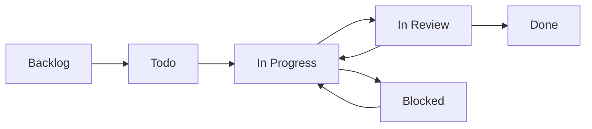

## Overview

Forge tasks are managed primarily through the **Web UI** at `http://localhost:3000`. While there's no dedicated CLI for task operations, you can interact with tasks programmatically via REST API or MCP tools.

---

## Web UI Task Management

The primary way to work with tasks:

```bash
# Start Forge
automagik-forge

# Open browser at http://localhost:3000
# Use the visual Kanban board to:
# - Create tasks
# - Drag & drop to change status
# - Assign to AI agents
# - Monitor execution
# - Review results
```

---

## Task Lifecycle

Tasks flow through these states:



<Tabs>
  <Tab title="Backlog">
    **Initial State**: Tasks waiting to be prioritized

    - Created but not yet scheduled
    - Can be refined and estimated
    - Not assigned to agents yet
  </Tab>

  <Tab title="Todo">
    **Ready for Work**: Prioritized and ready to execute

    - Clear acceptance criteria
    - Assigned to agent (optional)
    - Dependencies resolved
  </Tab>

  <Tab title="In Progress">
    **Active Execution**: AI agent working on task

    - Git worktree created
    - Agent executing code changes
    - Real-time logs streaming
  </Tab>

  <Tab title="In Review">
    **Awaiting Approval**: Implementation complete

    - Code changes ready
    - Tests passing (ideally)
    - Waiting for human review
  </Tab>

  <Tab title="Done">
    **Completed**: Merged to main branch

    - Changes merged
    - Worktree cleaned up
    - Task archived
  </Tab>

  <Tab title="Blocked">
    **Waiting**: Dependencies or issues blocking progress

    - Missing information
    - External dependencies
    - Technical blockers
  </Tab>
</Tabs>

---

## Task Properties

Each task has these fields:

```typescript
interface Task {
  id: string;                    // Unique identifier
  title: string;                 // Short description
  description: string;           // Detailed requirements
  status: TaskStatus;            // Current lifecycle state
  priority: "low" | "medium" | "high" | "critical";
  labels: string[];              // Tags for organization
  assignee?: string;             // AI agent or human
  createdAt: Date;
  updatedAt: Date;
  dueDate?: Date;

  // Execution details
  attempts: TaskAttempt[];       // Multiple AI agent tries
  worktreePath?: string;         // Git worktree location
  branchName?: string;           // Associated git branch

  // Integration
  githubIssue?: number;          // Linked GitHub issue
  dependsOn?: string[];          // Task dependencies
}
```

---

## REST API Task Operations

Interact with tasks programmatically when Forge is running:

### List Tasks

```bash
# Get all tasks
curl http://localhost:5000/api/tasks

# Filter by status
curl "http://localhost:5000/api/tasks?status=in_progress"

# Filter by label
curl "http://localhost:5000/api/tasks?labels=bug,high-priority"
```

### Create Task

```bash
curl -X POST http://localhost:5000/api/tasks \
  -H "Content-Type: application/json" \
  -d '{
    "title": "Add user authentication",
    "description": "Implement JWT-based authentication with login and signup",
    "priority": "high",
    "labels": ["feature", "backend", "security"]
  }'
```

### Get Task Details

```bash
curl http://localhost:5000/api/tasks/{task-id}
```

### Update Task

```bash
curl -X PATCH http://localhost:5000/api/tasks/{task-id} \
  -H "Content-Type: application/json" \
  -d '{
    "status": "in_progress",
    "assignee": "claude-code"
  }'
```

### Delete Task

```bash
curl -X DELETE http://localhost:5000/api/tasks/{task-id}
```

---

## MCP Task Tools

When running in MCP mode (`--mcp` or `--mcp-advanced`), use these tools:

<Tabs>
  <Tab title="list_tasks">
    **List and filter tasks**

    ```json
    {
      "tool": "list_tasks",
      "arguments": {
        "project_id": "uuid-here",
        "status": "in_progress",
        "labels": ["bug"]
      }
    }
    ```

    Returns array of tasks matching filters.
  </Tab>

  <Tab title="create_task">
    **Create new task**

    ```json
    {
      "tool": "create_task",
      "arguments": {
        "project_id": "uuid-here",
        "title": "Fix memory leak in WebSocket handler",
        "description": "Connections not cleaned up on disconnect",
        "priority": "high",
        "labels": ["bug", "performance"]
      }
    }
    ```

    Returns created task with ID.
  </Tab>

  <Tab title="get_task">
    **Get task details**

    ```json
    {
      "tool": "get_task",
      "arguments": {
        "task_id": "task-uuid-here"
      }
    }
    ```

    Returns complete task object with attempts and execution history.
  </Tab>

  <Tab title="update_task">
    **Modify task properties**

    ```json
    {
      "tool": "update_task",
      "arguments": {
        "task_id": "task-uuid-here",
        "status": "done",
        "labels": ["bug", "performance", "fixed"]
      }
    }
    ```

    Returns updated task.
  </Tab>

  <Tab title="delete_task">
    **Remove task**

    ```json
    {
      "tool": "delete_task",
      "arguments": {
        "task_id": "task-uuid-here"
      }
    }
    ```

    Returns success confirmation.
  </Tab>
</Tabs>

---

## Task Attempts

Each task can have multiple attempts from different AI agents.

### Creating Attempts

```bash
# Via Web UI: Click "New Attempt" button
# Select agent: Claude Code, Gemini, Cursor CLI, etc.

# Via API
curl -X POST http://localhost:5000/api/tasks/{task-id}/attempts \
  -H "Content-Type: application/json" \
  -d '{
    "agent": "claude-code",
    "prompt": "Implement this feature following best practices"
  }'
```

### Comparing Attempts

```bash
# Get all attempts for a task
curl http://localhost:5000/api/tasks/{task-id}/attempts

# Get specific attempt
curl http://localhost:5000/api/task-attempts/{attempt-id}

# Stream diff for attempt
curl http://localhost:5000/api/events/task-attempts/{attempt-id}/diff
```

### Attempt States

- **pending**: Queued for execution
- **running**: AI agent actively working
- **completed**: Finished successfully
- **failed**: Execution failed
- **cancelled**: Manually stopped

---

## Common Task Workflows

### Feature Development

```bash
# 1. Create feature task
POST /api/tasks
{
  "title": "Add dark mode toggle",
  "type": "feature",
  "labels": ["frontend", "ui"]
}

# 2. Try with multiple agents (via UI)
# - Attempt 1: Claude Code
# - Attempt 2: Cursor CLI

# 3. Compare results (via UI)
# Choose best implementation

# 4. Merge to main
PATCH /api/tasks/{id}
{
  "status": "done"
}
```

### Bug Fix

```bash
# 1. Create bug task
POST /api/tasks
{
  "title": "Fix API timeout",
  "type": "bug",
  "priority": "high",
  "description": "API returns 504 after 30 seconds"
}

# 2. Assign to agent
PATCH /api/tasks/{id}
{
  "assignee": "claude-code"
}

# 3. Monitor execution
GET /api/events/processes/{process-id}/logs

# 4. Review and merge
# Via Web UI
```

### Code Refactoring

```bash
# 1. Create refactor task
POST /api/tasks
{
  "title": "Extract AuthService from UserController",
  "type": "refactor",
  "labels": ["backend", "cleanup"]
}

# 2. Try multiple approaches
# Attempt 1: Extract methods
# Attempt 2: Strategy pattern
# Attempt 3: Service layer

# 3. Compare and choose
# Via Web UI comparison view

# 4. Verify tests still pass
# Check attempt test results

# 5. Merge chosen approach
```

---

## Task Labels

Organize tasks with labels:

<CardGroup cols={2}>
  <Card title="Type Labels" icon="tag">
    - `feature` - New functionality
    - `bug` - Bug fixes
    - `refactor` - Code improvements
    - `docs` - Documentation
    - `test` - Testing
    - `chore` - Maintenance
  </Card>

  <Card title="Area Labels" icon="layer-group">
    - `frontend` - UI/React code
    - `backend` - API/server code
    - `database` - Schema/queries
    - `devops` - Infrastructure
    - `security` - Security issues
  </Card>

  <Card title="Priority Labels" icon="exclamation">
    - `critical` - Urgent, blocking
    - `high` - Important, soon
    - `medium` - Normal priority
    - `low` - Nice to have
  </Card>

  <Card title="Custom Labels" icon="wand-magic-sparkles">
    Create your own:
    - `sprint-24` - Sprint tracking
    - `customer-reported` - Source
    - `technical-debt` - Cleanup
    - `experiment` - Exploratory
  </Card>
</CardGroup>

---

## Task Templates

Create reusable task templates:

```json
// API Endpoint Template
{
  "title": "Add {resource} API endpoint",
  "description": "Create REST API endpoint for {resource}\n\nRequirements:\n- Input validation\n- Error handling\n- Tests\n- Documentation",
  "labels": ["feature", "backend", "api"],
  "checklist": [
    "Create route handler",
    "Add validation",
    "Write tests",
    "Update OpenAPI spec"
  ]
}
```

---

## Next Steps

<CardGroup cols={2}>
  <Card title="Project Commands" icon="folder" href="/forge/cli/project-commands">
    Manage projects and repositories
  </Card>
  <Card title="Task API Reference" icon="code" href="/forge/api/tasks">
    Complete API documentation
  </Card>
  <Card title="MCP Tools" icon="plug" href="/forge/api/mcp-tools">
    MCP integration details
  </Card>
  <Card title="Workflows" icon="diagram-project" href="/forge/workflows/feature-development">
    Task workflow examples
  </Card>
</CardGroup>
