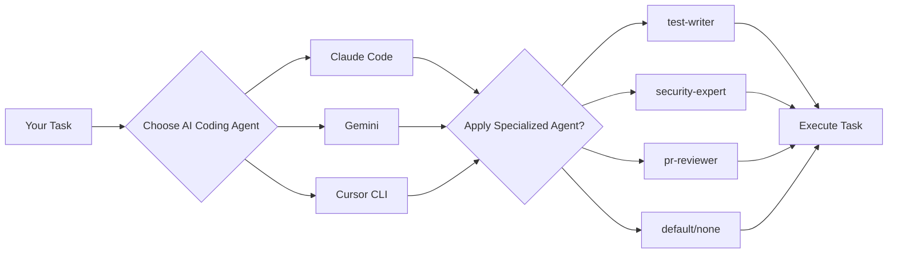
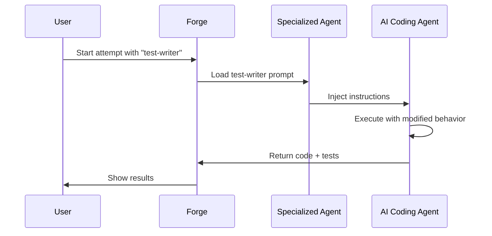

## Introduction

Forge supports **two types of agents** that work together to give you ultimate flexibility in AI-assisted development. Understanding the distinction is key to mastering Forge.

<Info>
**The Key Distinction:**
- **AI Coding Agents** = The execution platforms (CLI tools that run AI models)
- **Specialized Agents** = Custom prompts that work with ANY coding agent
- **Example**: Your "test-writer" specialized agent can run on Claude today, Gemini tomorrow
</Info>

---

## AI Coding Agents vs Specialized Agents

### The Concept

Think of it like this:



### Quick Comparison

| Aspect | AI Coding Agents | Specialized Agents |
|--------|------------------|-------------------|
| **What it is** | The AI execution platform | Custom prompt/instructions |
| **Examples** | Claude Code, Gemini, Cursor CLI | test-writer, security-expert |
| **How many per task** | Pick ONE | Optional, pick ZERO or ONE |
| **Reusability** | Locked to that agent | Works with ANY coding agent |
| **Configuration** | API keys, models | Custom prompts, instructions |

---

## The 8 AI Coding Agents

Forge can execute tasks using these AI coding agents - including open-source and LLM-agnostic options:

<CardGroup cols={2}>
  <Card title="Claude Code" icon="brain">
    **Provider**: Anthropic
    **Type**: Commercial
    **Best for**: Complex reasoning, refactoring, architecture

    ```bash
    forge task attempt 42 --llm claude
    ```
  </Card>

  <Card title="Claude Code Router" icon="route">
    **Provider**: Open-source
    **Type**: LLM-agnostic router
    **Best for**: Using ANY model instead of Claude

    ```bash
    forge task attempt 42 --llm claude-router
    ```

    <Tip>Use this to route to local models, Groq, or any other provider!</Tip>
  </Card>

  <Card title="Cursor CLI" icon="terminal">
    **Provider**: Cursor
    **Type**: Commercial
    **Best for**: Fast iterations, UI work, quick fixes

    ```bash
    forge task attempt 42 --llm cursor
    ```
  </Card>

  <Card title="Gemini" icon="google">
    **Provider**: Google
    **Type**: Commercial
    **Best for**: Cost-effective, multimodal, large context

    ```bash
    forge task attempt 42 --llm gemini
    ```
  </Card>

  <Card title="Codex" icon="openai">
    **Provider**: OpenAI
    **Type**: Commercial
    **Best for**: Code completion, established patterns

    ```bash
    forge task attempt 42 --llm codex
    ```
  </Card>

  <Card title="Amp" icon="code">
    **Provider**: Sourcegraph
    **Type**: Commercial
    **Best for**: Code intelligence, search-augmented

    ```bash
    forge task attempt 42 --llm amp
    ```
  </Card>

  <Card title="OpenCode" icon="code-branch">
    **Provider**: Open-source
    **Type**: Fully local
    **Best for**: Privacy, offline work, cost savings

    ```bash
    forge task attempt 42 --llm opencode
    ```
  </Card>

  <Card title="Qwen Code" icon="code-simple">
    **Provider**: Alibaba (open-source)
    **Type**: Fully local
    **Best for**: Multilingual, Asian languages, local execution

    ```bash
    forge task attempt 42 --llm qwen
    ```
  </Card>
</CardGroup>

### The Power of Choice

<Accordion title="Not Locked to Subscriptions">
  Unlike other platforms, Forge doesn't force you into specific subscriptions:

  - **Use open-source models** - OpenCode, Qwen Code run fully local
  - **Route to any LLM** - Claude Code Router lets you use any provider
  - **Bring your own API keys** - Pay providers directly, not through Forge
  - **Mix and match** - Use Claude for architecture, Gemini for tests, OpenCode for refactoring
</Accordion>

<Accordion title="Compare Agents on Same Task">
  Try multiple agents and choose the best result:

  ```bash
  # Attempt 1 with Claude
  forge task attempt 42 --llm claude

  # Attempt 2 with Gemini
  forge task attempt 42 --llm gemini

  # Attempt 3 with Cursor
  forge task attempt 42 --llm cursor

  # Compare all three
  forge task compare 42

  # Merge the best one
  forge task merge 42 2  # Gemini won!
  ```
</Accordion>

---

## Specialized Agent System

**Specialized agents** are custom prompts that modify how any AI coding agent approaches a task. They're reusable, portable, and work with ALL coding agents.

### How They Work



### Built-in Specialized Agents

| Agent | Purpose | What it does |
|-------|---------|--------------|
| **test-writer** | Testing focus | Ensures comprehensive test coverage |
| **security-expert** | Security hardening | Reviews for vulnerabilities, adds security measures |
| **pr-reviewer** | Code review | Analyzes code quality, suggests improvements |
| **auth-specialist** | Authentication | Expert in OAuth, JWT, session management |
| **performance-optimizer** | Optimization | Focuses on speed, memory, efficiency |
| **documentation-writer** | Documentation | Adds JSDoc, README, examples |

### Using Specialized Agents

```bash
# Use with any coding agent
forge task attempt 42 --llm claude --specialized test-writer
forge task attempt 42 --llm gemini --specialized security-expert
forge task attempt 42 --llm cursor --specialized pr-reviewer

# Or configure as default for a task type
forge config set task.type.test.specialized test-writer
```

### Creating Custom Specialized Agents

Create your own in `.forge/specialized/`:

```yaml
# .forge/specialized/api-expert.yaml
name: api-expert
description: Expert in REST API design and implementation
prompt: |
  You are an expert in REST API design. When implementing this task:

  1. Follow RESTful principles strictly
  2. Use proper HTTP methods and status codes
  3. Implement comprehensive error handling
  4. Add request/response validation
  5. Include OpenAPI/Swagger documentation
  6. Write integration tests for all endpoints

  Focus on:
  - Clean resource naming
  - Versioning strategy
  - Authentication/authorization
  - Rate limiting
  - Caching headers
```

Use it:
```bash
forge task attempt 42 --llm claude --specialized api-expert
```

---

## Agent Selection Matrix

Choose the right agent for the job:

<Tabs>
  <Tab title="By Task Type">
    | Task Type | Recommended Agent | Why |
    |-----------|------------------|-----|
    | **Architecture** | Claude Code | Best reasoning, handles complexity |
    | **Refactoring** | Claude Code, Cursor | Strong code understanding |
    | **New Features** | Gemini, Cursor | Fast, cost-effective |
    | **Bug Fixes** | Cursor CLI | Quick iterations |
    | **UI Work** | Cursor CLI | Visual focus |
    | **Security** | Claude + security-expert | Deep analysis |
    | **Testing** | Gemini + test-writer | Comprehensive, cheap |
    | **Documentation** | Any + documentation-writer | Consistent style |
    | **Privacy-sensitive** | OpenCode, Qwen Code | Fully local |
  </Tab>

  <Tab title="By Priority">
    | Priority | Strategy | Agents |
    |----------|----------|--------|
    | **Speed** | Fast iteration | Cursor CLI, Gemini |
    | **Quality** | Multiple attempts | Claude + Gemini + Cursor |
    | **Cost** | Cheap models | Gemini, OpenCode, Qwen |
    | **Privacy** | Local execution | OpenCode, Qwen Code |
    | **Reliability** | Proven models | Claude Code |
  </Tab>

  <Tab title="By Budget">
    | Budget | Approach | Mix |
    |--------|----------|-----|
    | **No budget** | Open-source only | OpenCode, Qwen Code |
    | **Limited** | Cheap + selective premium | Gemini (default), Claude (critical) |
    | **Flexible** | Best tool for job | Claude (complex), Cursor (UI), Gemini (tests) |
    | **Unlimited** | Quality first | Claude Code everywhere + multiple attempts |
  </Tab>
</Tabs>

---

## Performance Comparison

Real-world data from Namastex Labs (50+ projects):

### Speed (Average task completion)

```
Cursor CLI:     ████████░░ 3-5 min
Gemini:         █████████░ 4-6 min
Claude Code:    ██████████ 5-8 min
Codex:          ████████░░ 4-6 min
OpenCode:       ████░░░░░░ 8-12 min (local)
```

### Quality (Code review score)

```
Claude Code:       ██████████ 9.2/10
Cursor CLI:        █████████░ 8.7/10
Gemini:            ████████░░ 8.3/10
Codex:             ████████░░ 8.1/10
OpenCode:          ███████░░░ 7.5/10
```

### Cost (Per 1000 tasks)

```
OpenCode:          Free (local hardware)
Qwen Code:         Free (local hardware)
Gemini:           $45-60
Codex:            $80-120
Cursor CLI:       $120-160
Claude Code:      $180-240
```

<Warning>
Costs are estimates and vary based on task complexity, context size, and model versions. Always monitor your actual usage.
</Warning>

---

## Best Practices

### Multiple Attempts Strategy

For important features, use this proven workflow:

<Steps>
  <Step title="Fast prototype">
    ```bash
    # Attempt 1: Quick iteration with Cursor
    forge task attempt 42 --llm cursor
    ```

    Get a working prototype fast to validate approach.
  </Step>

  <Step title="Quality improvement">
    ```bash
    # Attempt 2: Refined version with Claude
    forge task attempt 42 --llm claude --specialized security-expert
    ```

    Get production-quality code with security review.
  </Step>

  <Step title="Cost-effective alternative">
    ```bash
    # Attempt 3: Budget option with Gemini
    forge task attempt 42 --llm gemini
    ```

    See if cheaper model can match quality.
  </Step>

  <Step title="Compare and choose">
    ```bash
    # Review all attempts side-by-side
    forge task compare 42

    # Merge the best
    forge task merge 42 2
    ```
  </Step>
</Steps>

### Agent-Specific Tips

<AccordionGroup>
  <Accordion title="Claude Code: Use for complex reasoning">
    Claude excels at:
    - System architecture decisions
    - Complex refactoring
    - Security-critical code
    - Understanding large codebases

    ```bash
    # Good use case
    forge task create \
      --title "Redesign authentication system" \
      --llm claude \
      --specialized security-expert
    ```
  </Accordion>

  <Accordion title="Gemini: Best value for testing">
    Gemini is perfect for:
    - Writing comprehensive tests
    - Documentation generation
    - Simple feature implementation
    - High-volume tasks

    ```bash
    # Excellent cost/quality ratio
    forge task create \
      --title "Add unit tests for API" \
      --llm gemini \
      --specialized test-writer
    ```
  </Accordion>

  <Accordion title="Cursor CLI: Speed matters">
    Cursor is fastest for:
    - Quick bug fixes
    - UI tweaks
    - Iterative development
    - Real-time experimentation

    ```bash
    # When speed is priority
    forge task create \
      --title "Fix button alignment" \
      --llm cursor
    ```
  </Accordion>

  <Accordion title="OpenCode/Qwen: Privacy + cost savings">
    Local models when you need:
    - Complete privacy (sensitive code)
    - Offline development
    - Zero API costs
    - Full control

    ```bash
    # For sensitive projects
    forge task create \
      --title "Implement payment processing" \
      --llm opencode  # Runs 100% locally
    ```
  </Accordion>
</AccordionGroup>

---

## Next Steps

<CardGroup cols={2}>
  <Card title="Agent Setup Guides" icon="wrench" href="/forge/agents/overview">
    Configure each AI coding agent
  </Card>
  <Card title="Creating Tasks" icon="plus" href="/forge/working/creating-tasks">
    Start using agents in your workflow
  </Card>
  <Card title="Task Attempts" icon="flask" href="/forge/concepts/tasks-and-attempts">
    Master the multiple attempts system
  </Card>
  <Card title="Workflows" icon="diagram-project" href="/forge/workflows/feature-development">
    See agents in action
  </Card>
</CardGroup>
