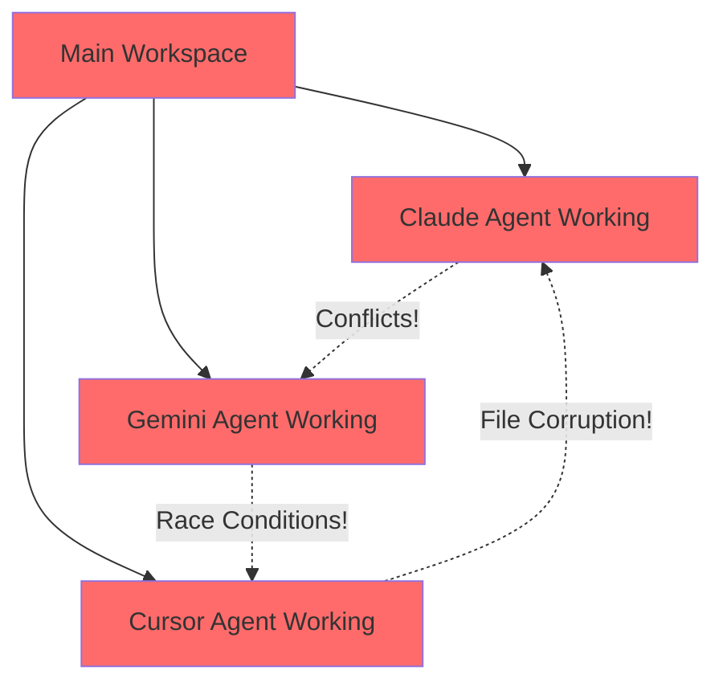
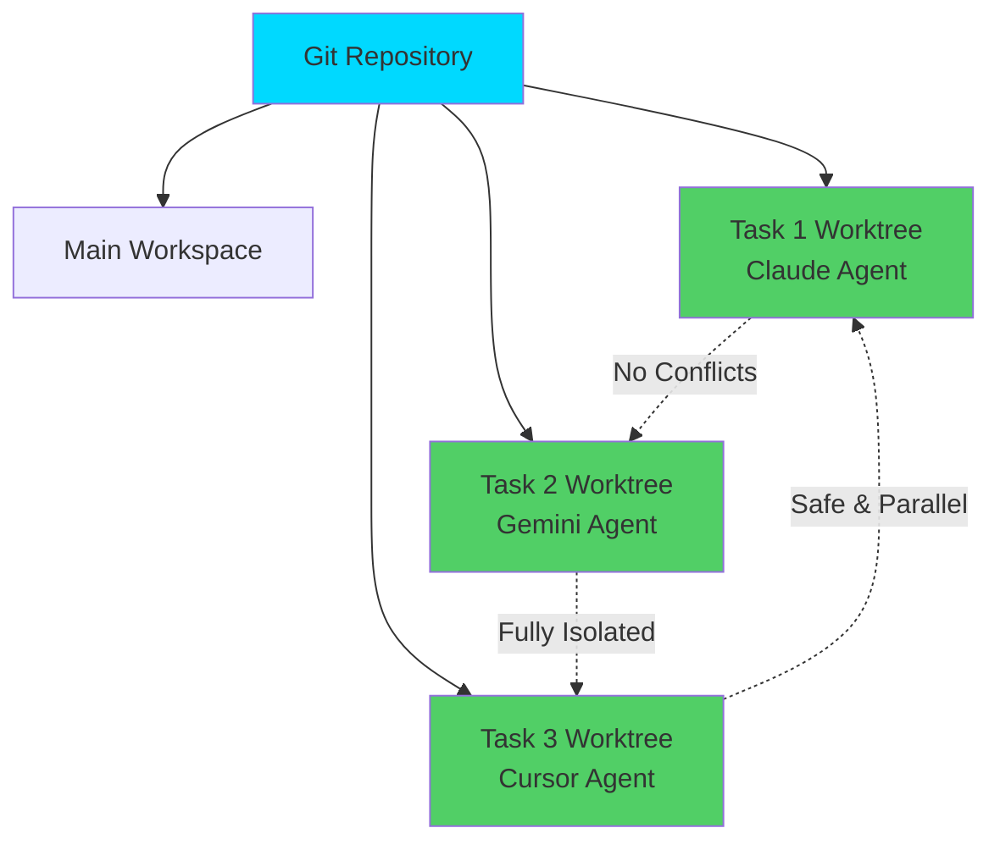
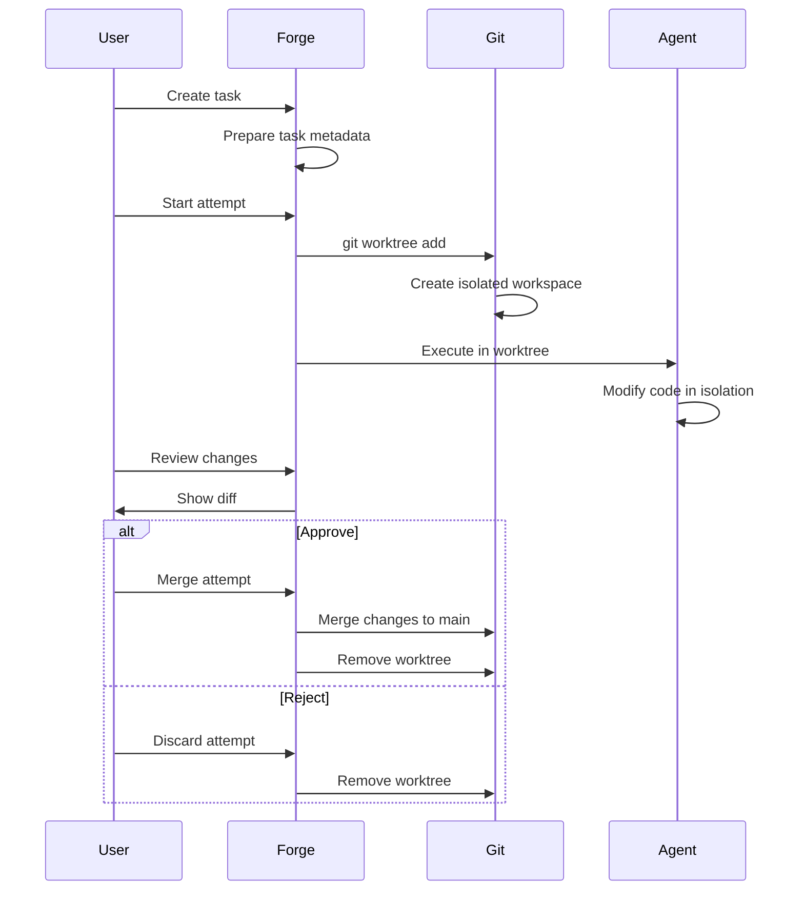

## Introduction

Forge uses **Git worktrees** to provide complete isolation for every task attempt. This means each AI agent works in its own separate workspace, eliminating conflicts, race conditions, and the fear of breaking your main codebase.

<Info>
**Think of it this way**: Instead of one workspace where everyone fights for control, each task gets its own private sandbox to play in safely.
</Info>

---

## What are Git Worktrees?

Git worktrees allow you to check out multiple branches of the same repository simultaneously in different directories. Unlike traditional branching where you switch contexts in a single workspace, worktrees give you **parallel, isolated environments**.

### Traditional Git vs Git Worktrees

<Tabs>
  <Tab title="Traditional Git">
    ```bash
    # You have ONE working directory
    ~/my-project/

    # Switch branches (context switching)
    git checkout feature-a  # Work on feature A
    git checkout feature-b  # Oops, lost context of feature A

    # Can only work on one branch at a time
    # AI agents would conflict with each other
    ```

    **Problem**: Context switching, conflicts, can't run multiple agents simultaneously
  </Tab>

  <Tab title="Git Worktrees">
    ```bash
    # You have MULTIPLE working directories
    ~/my-project/              # Main workspace
    .forge/worktrees/task-1/   # Feature A workspace
    .forge/worktrees/task-2/   # Feature B workspace
    .forge/worktrees/task-3/   # Bug fix workspace

    # All share the same .git repository
    # All exist simultaneously
    # No conflicts between tasks
    ```

    **Solution**: Parallel development, zero conflicts, multiple agents working at once
  </Tab>
</Tabs>

---

## Why Forge Uses Worktrees

### The Problem Without Worktrees

Imagine running multiple AI agents on the same codebase:



**Result**: Chaos, file conflicts, unpredictable behavior

### The Solution With Worktrees

Each task gets its own isolated environment:



**Result**: Safe parallel execution, no conflicts, easy comparison

### Key Benefits

<CardGroup cols={2}>
  <Card title="Complete Isolation" icon="shield">
    Each attempt runs in its own directory. No risk of agents interfering with each other or your main codebase.
  </Card>

  <Card title="Parallel Execution" icon="bolt">
    Run multiple agents simultaneously. Try Claude and Gemini on the same task at once.
  </Card>

  <Card title="Safe Experimentation" icon="flask">
    Your main branch stays pristine. Experiment fearlessly knowing you can always discard attempts.
  </Card>

  <Card title="Easy Comparison" icon="code-compare">
    Review different approaches side-by-side. See exactly what each agent produced.
  </Card>
</CardGroup>

---

## Automatic Worktree Management

Forge handles all worktree operations automatically. You don't need to know git worktree commands!

### What Forge Does For You

<Steps>
  <Step title="Task Creation">
    When you create a task, Forge prepares to create worktrees for attempts:

    ```bash
    # You do this
    forge task create --title "Add authentication"

    # Forge prepares (but doesn't create worktree yet)
    # Waits for actual attempt execution
    ```
  </Step>

  <Step title="Attempt Start">
    When an agent starts working, Forge creates the worktree:

    ```bash
    # You do this
    forge task attempt --llm claude

    # Forge does this automatically
    $ git worktree add .forge/worktrees/task-42-attempt-1 -b task-42-attempt-1
    $ cd .forge/worktrees/task-42-attempt-1
    $ # Agent works here in isolation
    ```
  </Step>

  <Step title="Agent Execution">
    The AI agent works in complete isolation:

    ```
    Main repo:                      Worktree:
    ~/my-project/                   .forge/worktrees/task-42-attempt-1/
    ├── src/                        ├── src/
    │   └── app.js (unchanged)      │   └── app.js (modified by agent)
    ├── tests/                      ├── tests/
    │   └── ... (unchanged)         │   └── auth.test.js (new file!)
    ```

    Your main code is **never touched** during execution.
  </Step>

  <Step title="Review">
    You review changes in the isolated worktree:

    ```bash
    # See what the agent changed
    forge task diff 42 1

    # Compare multiple attempts
    forge task compare 42
    ```
  </Step>

  <Step title="Merge or Discard">
    Choose to merge good work or discard bad attempts:

    ```bash
    # Merge attempt 1 into main
    forge task merge 42 1

    # Or discard attempt 2
    forge task discard 42 2
    ```
  </Step>

  <Step title="Cleanup">
    Forge removes worktrees when done:

    ```bash
    # Automatic cleanup after merge/discard
    $ git worktree remove .forge/worktrees/task-42-attempt-1
    ```
  </Step>
</Steps>

---

## Worktree Lifecycle



### Worktree States

| State | Description | Location |
|-------|-------------|----------|
| **Pending** | Task created, no worktree yet | N/A |
| **Active** | Agent working in worktree | `.forge/worktrees/task-N-attempt-M/` |
| **Review** | Work complete, awaiting review | `.forge/worktrees/task-N-attempt-M/` |
| **Merged** | Changes merged to main, worktree removed | Deleted |
| **Discarded** | Attempt rejected, worktree removed | Deleted |

---

## Best Practices

### DO ✅

<AccordionGroup>
  <Accordion title="Let Forge manage worktrees automatically">
    Forge handles all worktree operations. Don't create/remove worktrees manually unless you know what you're doing.

    ```bash
    # Good: Let Forge handle it
    forge task attempt --llm claude

    # Bad: Manual worktree creation
    git worktree add .forge/worktrees/my-task
    ```
  </Accordion>

  <Accordion title="Review changes before merging">
    Always check what the agent did before merging:

    ```bash
    # Review the diff
    forge task diff 42 1

    # Then merge if satisfied
    forge task merge 42 1
    ```
  </Accordion>

  <Accordion title="Use multiple attempts for important tasks">
    Try different agents on critical features:

    ```bash
    # Try Claude
    forge task attempt 42 --llm claude

    # Try Gemini
    forge task attempt 42 --llm gemini

    # Compare results
    forge task compare 42
    ```
  </Accordion>

  <Accordion title="Clean up old attempts">
    Discard failed or unwanted attempts promptly:

    ```bash
    # Remove attempt 2 if not needed
    forge task discard 42 2
    ```
  </Accordion>
</AccordionGroup>

### DON'T ❌

<Warning>
**Don't manually modify worktree files** while an agent is running. Let the agent complete its work first.
</Warning>

<Warning>
**Don't delete `.forge/worktrees/` manually**. Use `forge task discard` or `forge task merge` to properly clean up.
</Warning>

<Warning>
**Don't commit directly in worktrees**. Forge manages all git operations. Manual commits can break the workflow.
</Warning>

---

## Troubleshooting

### Worktree Already Exists

```bash
Error: worktree '.forge/worktrees/task-42-attempt-1' already exists
```

**Solution**:
```bash
# List all worktrees
git worktree list

# Remove the stuck worktree
forge task cleanup 42

# Or manually remove it
git worktree remove .forge/worktrees/task-42-attempt-1
```

### Disk Space Issues

Worktrees create full copies of your working directory. For large repos:

```bash
# Check worktree disk usage
du -sh .forge/worktrees/*

# Remove old attempts
forge task cleanup --all

# Configure max concurrent attempts
forge config set max_attempts 3
```

### Locked Worktrees

```bash
Error: 'task-42-attempt-1' is locked
```

**Solution**:
```bash
# Unlock the worktree
git worktree unlock .forge/worktrees/task-42-attempt-1

# Remove it
git worktree remove .forge/worktrees/task-42-attempt-1
```

---

## Advanced: Manual Worktree Operations

<Tip>
You rarely need to do this! Forge handles everything automatically. But if you need manual control:
</Tip>

```bash
# Create a worktree manually
git worktree add .forge/worktrees/my-experiment -b feature-xyz

# Work in the worktree
cd .forge/worktrees/my-experiment
# Make changes...

# List all worktrees
git worktree list

# Remove when done
cd ../..
git worktree remove .forge/worktrees/my-experiment
```

---

## Next Steps

<CardGroup cols={2}>
  <Card title="Tasks & Attempts" icon="list-check" href="/forge/concepts/tasks-and-attempts">
    Learn about task lifecycle and attempts
  </Card>
  <Card title="AI Agents" icon="robot" href="/forge/concepts/agents-and-executors">
    Understand the 8 AI coding agents
  </Card>
  <Card title="Creating Tasks" icon="plus" href="/forge/working/creating-tasks">
    Start creating tasks with worktree isolation
  </Card>
  <Card title="Troubleshooting" icon="wrench" href="/forge/troubleshooting/git-worktree-errors">
    Fix common worktree issues
  </Card>
</CardGroup>
