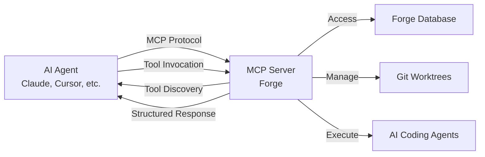
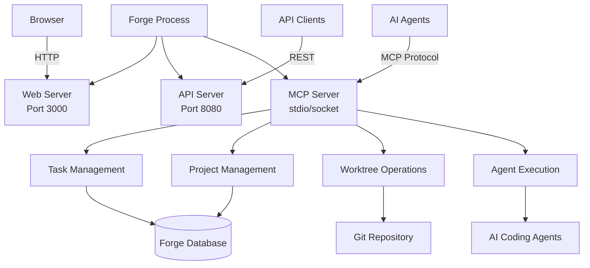
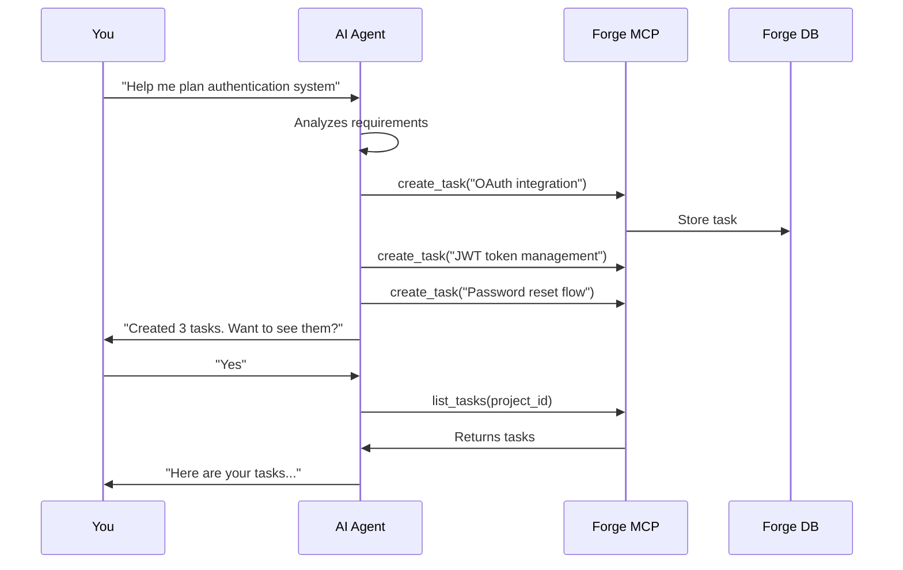

## Introduction

Forge implements the **Model Context Protocol (MCP)** as a built-in server, enabling any MCP-compatible AI agent to programmatically manage your tasks. Think of it as **remote control for your Forge kanban** - control everything without leaving your coding environment.

<Info>
**MCP in one sentence**: A standardized protocol that lets AI agents interact with external tools and services in a structured, secure way.
</Info>

---

## What is Model Context Protocol?

### The Concept

MCP is an open standard that allows AI agents to:
- **Discover** available tools and capabilities
- **Invoke** operations with structured parameters
- **Receive** structured responses
- **Maintain** context across multiple operations



### Why MCP Matters

<Tabs>
  <Tab title="Before MCP">
    **The Old Way**: Manual context switching

    ```
    1. Code in your editor
    2. Switch to Forge UI
    3. Create task manually
    4. Copy task details
    5. Switch back to editor
    6. Continue coding
    7. Switch to Forge to check status
    8. Repeat...
    ```

    **Result**: Constant interruptions, lost context, broken flow
  </Tab>

  <Tab title="With MCP">
    **The New Way**: Stay in flow

    ```
    You: "Create a task to add Redis caching"
    AI: [Uses MCP to create task in Forge]
    AI: "Task #47 created. Would you like me to start working on it?"

    You: "Yes, use Claude agent"
    AI: [Uses MCP to start attempt with Claude]
    AI: "Attempt started in isolated worktree. I'll implement caching..."

    You: "Show me all pending tasks"
    AI: [Uses MCP to list tasks]
    AI: "You have 3 pending tasks: #45, #46, #47..."
    ```

    **Result**: Never leave your editor, AI handles Forge management
  </Tab>
</Tabs>

---

## Forge's MCP Implementation

### Architecture Overview

Forge runs as both a **web application** AND an **MCP server** simultaneously:



### Communication Flow

<Steps>
  <Step title="Agent Connects">
    When you start your AI agent (Claude Code, Cursor, etc.), it connects to Forge's MCP server:

    ```bash
    # Forge starts MCP server automatically
    $ npx automagik-forge --mcp

    # AI agent connects via stdio
    AI Agent → MCP Server: CONNECT
    ```
  </Step>

  <Step title="Tool Discovery">
    The AI agent asks what tools are available:

    ```json
    AI Agent → Forge: "What tools do you have?"

    Forge → AI Agent: {
      "tools": [
        {
          "name": "list_tasks",
          "description": "Get tasks with filters",
          "parameters": { "projectId": "string", "status": "string" }
        },
        {
          "name": "create_task",
          "description": "Create a new task",
          "parameters": { "title": "string", "description": "string" }
        },
        // ... more tools
      ]
    }
    ```
  </Step>

  <Step title="Tool Invocation">
    You ask the AI to do something, it calls the appropriate tool:

    ```
    You: "Create a task to add dark mode"

    AI Agent → Forge MCP: call create_task({
      "projectId": "proj_abc123",
      "title": "Add dark mode toggle",
      "description": "Implement dark mode with LocalStorage persistence"
    })

    Forge → AI Agent: {
      "success": true,
      "taskId": "task_xyz789",
      "status": "pending"
    }
    ```
  </Step>

  <Step title="Response Handling">
    The AI processes the response and tells you:

    ```
    AI: "Task #47 created successfully. It's in pending status.
         Would you like me to start working on it?"
    ```
  </Step>
</Steps>

---

## Two Modes: Basic vs Advanced

Forge offers two MCP modes with different tool sets:

### Basic Mode (7 Tools)

**Use when**: You only need task management

```bash
# Start in basic mode
npx automagik-forge --mcp
```

**Available Tools**:

| Tool | Purpose | Example |
|------|---------|---------|
| `list_projects` | Get all projects | "Show my projects" |
| `list_tasks` | Get tasks with filters | "Show pending tasks" |
| `create_task` | Create new task | "Add task: Fix bug in auth" |
| `get_task` | Get task details | "Show task #42" |
| `update_task` | Modify task | "Mark task #42 complete" |
| `delete_task` | Remove task | "Delete task #38" |

<Tip>
**Best for**: Most users. Lighter weight, faster startup, clearer AI responses.
</Tip>

### Advanced Mode (56 Tools)

**Use when**: You need full Forge control including worktrees, processes, filesystem

```bash
# Start in advanced mode
npx automagik-forge --mcp-advanced
```

**Available Tools** (Basic 7 + Additional 49):

<AccordionGroup>
  <Accordion title="Project Management (8 tools)">
    - `create_project`
    - `update_project`
    - `delete_project`
    - `get_project_stats`
    - `list_project_tasks`
    - `sync_project_repo`
    - `configure_project_llms`
    - `export_project`
  </Accordion>

  <Accordion title="Task Attempts (12 tools)">
    - `create_attempt`
    - `list_attempts`
    - `get_attempt`
    - `start_attempt`
    - `stop_attempt`
    - `retry_attempt`
    - `compare_attempts`
    - `merge_attempt`
    - `discard_attempt`
    - `get_attempt_diff`
    - `get_attempt_logs`
    - `set_attempt_status`
  </Accordion>

  <Accordion title="Process Management (9 tools)">
    - `list_processes`
    - `get_process`
    - `start_process`
    - `stop_process`
    - `restart_process`
    - `get_process_logs`
    - `kill_process`
    - `process_health_check`
    - `cleanup_processes`
  </Accordion>

  <Accordion title="Git Worktrees (7 tools)">
    - `list_worktrees`
    - `create_worktree`
    - `remove_worktree`
    - `cleanup_worktrees`
    - `worktree_status`
    - `worktree_diff`
    - `lock_worktree`
  </Accordion>

  <Accordion title="Drafts & Templates (5 tools)">
    - `list_drafts`
    - `create_draft`
    - `apply_draft`
    - `list_templates`
    - `create_from_template`
  </Accordion>

  <Accordion title="Filesystem Operations (6 tools)">
    - `read_file`
    - `write_file`
    - `list_files`
    - `file_diff`
    - `search_files`
    - `get_file_info`
  </Accordion>

  <Accordion title="Omni Integration (8 tools)">
    - `send_notification`
    - `list_integrations`
    - `configure_webhook`
    - `send_message` (to WhatsApp, Discord, etc.)
    - `get_message_status`
    - And more...
  </Accordion>
</AccordionGroup>

<Warning>
**Advanced mode can overwhelm AI agents** with too many tools. They may struggle to choose the right one or give verbose responses. Use basic mode unless you specifically need advanced features.
</Warning>

---

## Security & Authentication

### Project ID Requirement

All MCP operations require a **Project ID** for security and isolation:

```json
{
  "mcpServers": {
    "automagik-forge": {
      "command": "npx",
      "args": ["automagik-forge", "--mcp"],
      "env": {
        "PROJECT_ID": "proj_abc123"  // ← Required!
      }
    }
  }
}
```

**Why?**
- **Isolation**: Agent can only access specified project
- **Multi-project**: Run multiple Forge instances with different agents
- **Security**: Prevents accidental cross-project operations

### Getting Your Project ID

<Steps>
  <Step title="Start Forge UI">
    ```bash
    npx automagik-forge
    ```

    Opens browser at `http://localhost:3000`
  </Step>

  <Step title="Create or Select Project">
    - Create new project or select existing one
    - Navigate to the project's task board
  </Step>

  <Step title="Get ID from URL">
    ```
    http://localhost:3000/projects/a1b2c3d4-e5f6-7890-abcd-ef1234567890/tasks
                                    ^^^^^^^^^^^^^^^^^^^^^^^^^^^^^^^^^^^^^^^^
                                                  Your Project ID
    ```

    Or find it in **Project Settings** panel.
  </Step>

  <Step title="Add to MCP Config">
    Copy the UUID and add to your AI agent's MCP configuration.
  </Step>
</Steps>

### Data Privacy

<Info>
**Forge MCP server runs locally on your machine**. No data is sent to external servers. All operations happen on localhost.
</Info>

---

## Typical Workflows

### Planning Workflow



### Bug Discovery Workflow

```mermaid
sequenceDiagram
    participant You
    participant AI as AI Agent
    participant MCP as Forge MCP

    You->>AI: "Found a bug: API crashes on empty JSON"
    AI->>MCP: create_task({
      title: "Fix API crash on empty JSON",
      type: "bug",
      priority: "high",
      description: "..."
    })
    MCP->>AI: Task created #47
    AI->>You: "Bug #47 logged. Start fixing now?"
    You->>AI: "Yes"
    AI->>MCP: create_attempt(task_id: 47, llm: "claude")
    MCP->>AI: Attempt started in worktree
    AI->>You: "Working on fix in isolated environment..."
```

### Status Update Workflow

```
You: "Mark auth tasks as complete"

AI → MCP: list_tasks(filter: "auth")
MCP → AI: [Returns 3 auth tasks]

AI → MCP: update_task(task_45, status: "completed")
AI → MCP: update_task(task_46, status: "completed")
AI → MCP: update_task(task_47, status: "completed")

AI: "Marked 3 authentication tasks as completed ✅"
```

---

## Best Practices

### DO ✅

<AccordionGroup>
  <Accordion title="Use Basic Mode First">
    Start with `--mcp` (7 tools). Only upgrade to `--mcp-advanced` if you need specific advanced features.

    ```bash
    # Start here
    npx automagik-forge --mcp

    # Only if needed
    npx automagik-forge --mcp-advanced
    ```
  </Accordion>

  <Accordion title="One Project ID Per Agent">
    Configure each AI agent with a specific project ID:

    ```json
    // Claude Code → Project A
    {
      "env": { "PROJECT_ID": "proj_frontend123" }
    }

    // Cursor → Project B
    {
      "env": { "PROJECT_ID": "proj_backend456" }
    }
    ```
  </Accordion>

  <Accordion title="Use Natural Language">
    MCP tools work best with conversational requests:

    ```
    ✅ "Create a task to add Redis caching with TTL config"
    ✅ "Show me all high-priority bugs"
    ✅ "Mark task #42 as complete and create a follow-up for documentation"

    ❌ create_task(title="Redis", desc="cache")
    ❌ list_tasks()
    ```

    Let the AI translate your intent to MCP calls.
  </Accordion>
</AccordionGroup>

### DON'T ❌

<Warning>
**Don't mix MCP modes for the same project**. Pick basic OR advanced, not both.
</Warning>

<Warning>
**Don't share Project IDs across users**. Each developer should have their own project or use different IDs.
</Warning>

<Warning>
**Don't forget to restart your AI agent** after changing MCP configuration.
</Warning>

---

## Troubleshooting

### MCP Server Not Found

```
Error: MCP server 'automagik-forge' not found
```

**Solution**:
1. Make sure Forge is installed: `npm install -g @automagik/forge`
2. Verify command in config is correct: `"command": "npx"`
3. Check args: `"args": ["automagik-forge", "--mcp"]`
4. Restart your AI agent

### Project ID Invalid

```
Error: Project 'proj_abc123' not found
```

**Solution**:
1. Open Forge UI: `npx automagik-forge`
2. Verify project exists
3. Copy correct UUID from browser URL
4. Update MCP config with correct ID
5. Restart AI agent

### Too Many Tools (Advanced Mode)

```
AI: "I see many tools available. Which one should I use?"
```

**Solution**: Switch to basic mode
```json
{
  "args": ["automagik-forge", "--mcp"]  // Remove -advanced
}
```

---

## Next Steps

<CardGroup cols={2}>
  <Card title="MCP Setup Guides" icon="wrench" href="/forge/mcp/overview">
    Configure MCP for your AI agent
  </Card>
  <Card title="MCP Tools Reference" icon="book" href="/forge/api/mcp-tools">
    Complete list of all available tools
  </Card>
  <Card title="Claude Code Setup" icon="brain" href="/forge/mcp/claude-code-setup">
    MCP configuration for Claude Code
  </Card>
  <Card title="Cursor Setup" icon="terminal" href="/forge/mcp/cursor-setup">
    MCP configuration for Cursor
  </Card>
</CardGroup>
