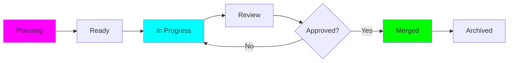

## The Power of Structured Task Management

In Forge, every piece of work is organized as a **Task** - a persistent, trackable unit of work that maintains complete context, history, and results. Unlike chat-based AI interactions that disappear, Forge tasks live forever in your Kanban board.

---

## What is a Task?


A **Forge Task** is a structured work unit that contains:

- **Title & Description**: Clear statement of what needs to be done
- **Context**: Files, screenshots, diagrams attached for AI understanding
- **Agent Assignment**: Which AI coding agent will execute it
- **Attempts**: Multiple execution attempts with different agents or approaches
- **Git Worktree**: Isolated environment for each attempt
- **Diffs & Results**: Complete history of changes made
- **Status**: Lifecycle state (planning, in-progress, review, merged, archived)

**Example Task Structure:**
```yaml
Task: "Implement JWT authentication"
├── Title: "Add JWT-based user authentication"
├── Description: "Create login/signup endpoints with JWT tokens"
├── Labels: ["feature", "auth", "priority:high"]
├── Context: [auth-flow-diagram.png, requirements.md]
├── Attempts:
│   ├── Attempt 1: Claude Code (completed)
│   ├── Attempt 2: Gemini (completed)
│   └── Attempt 3: Cursor CLI (in-progress)
└── Status: in-review
```

Tasks are **not temporary** - they persist in your board, maintaining full context even weeks or months later.


---

## Task Lifecycle


Every task moves through a well-defined lifecycle:



### Lifecycle States

| State | Description | Actions Available |
|-------|-------------|-------------------|
| **Planning** | Task created, context being gathered | Add context, assign agent, edit description |
| **Ready** | Ready for execution | Start attempt, assign different agent |
| **In Progress** | AI agent actively working | Monitor logs, cancel if needed |
| **Review** | Attempt completed, awaiting human review | View diffs, compare with other attempts, approve/reject |
| **Merged** | Approved changes merged to main branch | Archive task, create follow-up tasks |
| **Archived** | Task completed and stored | View history, reference in future tasks |

### State Transitions

- **Planning → Ready**: When you've added enough context and assigned an agent
- **Ready → In Progress**: When you start an attempt
- **In Progress → Review**: When the agent completes execution
- **Review → In Progress**: If you reject and want to retry
- **Review → Merged**: When you approve and merge changes
- **Merged → Archived**: After verification and cleanup


---

## Multiple Attempts Strategy


The **killer feature** of Forge: **every task can have multiple attempts** with different AI agents, configurations, or approaches.

### Why Multiple Attempts?

Different AI models excel at different things:

| Agent | Strengths | Best For |
|-------|-----------|----------|
| **Claude Code** | Complex logic, architecture | Large refactors, system design |
| **Gemini** | Simplicity, speed | Quick features, straightforward implementations |
| **Cursor CLI** | Balance, pragmatism | Production code, balanced solutions |
| **OpenAI Codex** | Broad knowledge | General-purpose tasks |

**The Problem with Single-Attempt AI:**
- You're stuck with one agent's approach
- No way to compare quality
- Can't learn which agent works best for which task type
- Miss better solutions from other models

**The Forge Solution:**
```yaml
Task: "Optimize database queries"

Attempt 1: Claude Code
├── Approach: Complex indexing strategy with materialized views
├── Result: 10x faster but complex to maintain
└── Verdict: Too complex

Attempt 2: Gemini
├── Approach: Simple query optimization, added indexes
├── Result: 3x faster, easy to understand
└── Verdict: Good but could be better

Attempt 3: Cursor CLI
├── Approach: Balanced - smart indexes + query rewrite
├── Result: 7x faster, maintainable
└── Verdict: ✅ Perfect! Merge this one
```

### Isolation is Key

Each attempt runs in its own **Git worktree**:
- No conflicts between attempts
- Main branch stays clean
- Easy to compare approaches side-by-side
- Safe to experiment without fear


---

## When to Use Multiple Attempts


Not every task needs multiple attempts. Here's when to use them:

### ✅ Use Multiple Attempts For:

<CardGroup cols={2}>
  <Card title="Critical Features" icon="star">
    Features affecting many users or core business logic

    **Example**: Payment processing, authentication systems
  </Card>

  <Card title="Complex Refactoring" icon="code">
    Major architectural changes with high risk

    **Example**: Migrating from REST to GraphQL
  </Card>

  <Card title="Performance Optimization" icon="gauge-high">
    When you need the best possible solution

    **Example**: Database query optimization, API response times
  </Card>

  <Card title="Learning Opportunities" icon="graduation-cap">
    When you want to see different approaches

    **Example**: Learning new patterns or best practices
  </Card>
</CardGroup>

### ❌ Single Attempt is Fine For:

- Simple bug fixes
- Documentation updates
- Minor UI tweaks
- Quick configuration changes
- Low-risk experiments

### The Cost-Benefit Analysis

**Multiple Attempts Cost:**
- More time (each agent runs separately)
- More API usage (multiple LLM calls)
- More review time (comparing results)

**Multiple Attempts Benefit:**
- Higher quality solutions
- Better understanding of the problem
- Learning which agents work best
- Reduced risk of bugs in production

<Tip>
**Rule of Thumb**: If a bug would cost more than 30 minutes to fix in production, use multiple attempts during development.
</Tip>


---

## Comparing Attempts


Forge makes it easy to compare different attempts:

### Comparison Features

**1. Side-by-Side Diffs**
```
Attempt 1 (Claude)          Attempt 2 (Gemini)
──────────────────          ──────────────────
function authenticate() {   function auth() {
  // 50 lines of complex     // 20 lines simple
  // logic with comments     // straightforward
}                           }
```

**2. Metrics Comparison**

| Metric | Attempt 1 | Attempt 2 | Attempt 3 |
|--------|-----------|-----------|-----------|
| Lines Changed | 250 | 120 | 180 |
| Files Modified | 8 | 4 | 5 |
| Tests Added | 15 | 8 | 12 |
| Execution Time | 8 min | 3 min | 5 min |
| Complexity | High | Low | Medium |

**3. Code Quality Indicators**
- Test coverage added
- Documentation quality
- Code complexity metrics
- Performance impact
- Security considerations

### Making the Choice

<Steps>
  <Step title="Review All Attempts">
    Read through each attempt's changes carefully
  </Step>

  <Step title="Run Tests">
    Verify all attempts pass your test suite
  </Step>

  <Step title="Consider Maintainability">
    Which code will you understand in 6 months?
  </Step>

  <Step title="Check Performance">
    Run benchmarks if relevant
  </Step>

  <Step title="Choose Winner">
    Select the best attempt or cherry-pick from multiple
  </Step>

  <Step title="Merge">
    Merge the chosen attempt to your main branch
  </Step>
</Steps>

### Cherry-Picking Best Parts

Sometimes you want parts from multiple attempts:

```bash
# Forge makes it easy to combine attempts
forge attempt merge 1 --files src/auth.ts
forge attempt merge 2 --files src/tests/
forge attempt merge 3 --files src/config.ts
```


---

## Best Practices

<Warning>
**Anti-Pattern**: Creating 10 attempts for every tiny task. This wastes time and API credits.

**Best Practice**: Use judgment - critical features get 2-3 attempts, simple tasks get 1.
</Warning>

### Task Creation Tips

1. **Clear Titles**: "Add user auth" ✅ vs "Do stuff" ❌
2. **Detailed Descriptions**: Include acceptance criteria, edge cases, examples
3. **Attach Context**: Screenshots, diagrams, related code files
4. **Label Appropriately**: feature, bug, refactor, docs, etc.
5. **Set Realistic Scope**: Smaller tasks = better AI results

### Attempt Management Tips

1. **Start with Your Best Agent**: Use the agent you trust most first
2. **Try Different Approaches**: Second attempt should use a different strategy
3. **Cancel Bad Attempts Early**: Don't waste time on obviously wrong directions
4. **Document Learnings**: Note which agents work best for which task types
5. **Review Before Merging**: Never auto-merge without human review

---

## Real-World Example

### Scenario: Adding File Upload Feature

**Task Created:**
```
Title: "Add file upload with progress tracking"
Description: "Users should be able to upload images/PDFs with real-time progress bars"
Labels: ["feature", "frontend", "priority:medium"]
Context: [design-mockup.png, API-spec.md]
```

**Attempt 1: Claude Code**
- Generated comprehensive solution with chunked uploads
- Added retry logic, error handling
- 300 lines of code, very robust
- **Review**: Too complex for MVP, over-engineered

**Attempt 2: Gemini**
- Simple FormData upload with progress event
- Basic error handling
- 80 lines of code
- **Review**: Too simple, missing edge cases

**Attempt 3: Cursor CLI**
- Balanced approach with FormData + basic chunking
- Good error handling without complexity
- 150 lines of code
- **Review**: ✅ Perfect balance - merged!

**Outcome**: Shipped a maintainable feature by comparing 3 approaches in isolated environments.

---

## Next Steps

<CardGroup cols={2}>
  <Card title="Git Worktrees" icon="code-branch" href="/forge/concepts/git-worktrees">
    Learn how isolation works under the hood
  </Card>

  <Card title="AI Agents" icon="robot" href="/forge/concepts/agents-and-executors">
    Understand the 8 different AI coding agents
  </Card>

  <Card title="Creating Tasks" icon="plus" href="/forge/working/creating-tasks">
    Start creating your first task
  </Card>

  <Card title="Comparing Results" icon="code-compare" href="/forge/working/comparing-results">
    Deep dive into attempt comparison
  </Card>
</CardGroup>
