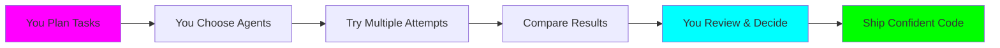

## The Evolution of AI-Assisted Development

Forge introduces **Vibe Coding++™** - a revolutionary approach that transforms chaotic AI interactions into structured, maintainable development workflows.

---

## The Problem: Regular Vibe Coding

### The "2-Week Curse"

You've experienced it: AI generates perfect code today. Two weeks later, something breaks, and you can't fix it because you don't understand what was built.

<Warning>
**The 2-Week Curse**: Code that works perfectly when shipped but becomes unmaintainable within weeks because the developer never understood the AI-generated solution.
</Warning>

### Why Regular Vibe Coding Fails

| Problem | Impact |
|---------|--------|
| **Lost Context** | Conversations scattered across chat histories |
| **No Structure** | Random .md files, no task tracking |
| **No Control** | AI makes all decisions autonomously |
| **No Memory** | "What did we build last week?" Lost forever |
| **No Experimentation** | Stuck with one agent's approach |
| **No Review** | Code applied immediately without understanding |

---

## The Solution: Vibe Coding++™

### Philosophy: You Orchestrate, AI Executes

Vibe Coding++™ flips the script - **humans stay in control** while leveraging AI power:



### The Key Differences

<CardGroup cols={2}>
  <Card title="Regular Vibe Coding" icon="skull">
    - AI acts autonomously
    - Lost in chat conversations
    - One AI, one approach
    - Direct code changes
    - Auto-applies changes
    - Black box magic
    - Mysterious bugs in 2 weeks
  </Card>

  <Card title="Vibe Coding++™" icon="sparkles">
    - You orchestrate every decision
    - Persistent Kanban board
    - Try 8+ different AI agents
    - Isolated Git worktrees
    - Review before merge
    - You understand the code
    - Code that won't break mysteriously
  </Card>
</CardGroup>

---

## How Vibe Coding++™ Works

### 1. You Own the Kanban

Tasks live in a persistent board, not lost in chat history or scattered .md files:

<Tip>
Every task card contains complete context, attempts, results, and diffs - **permanent structured memory**.
</Tip>

### 2. You Pick the Agent

Not happy with Claude's approach? Try Gemini. Want a third opinion? Use Cursor CLI:

```yaml
Task: "Implement user authentication"
├── Attempt 1: Claude Code → Too complex
├── Attempt 2: Gemini → Missing edge cases
├── Attempt 3: Cursor CLI → Perfect! ✅
└── Result: You choose Attempt 3 to merge
```

### 3. Git Worktree Isolation

Every attempt runs in its own isolated environment:

- **No conflicts** between experiments
- **No broken main branch** while testing
- **Easy cleanup** after choosing the winner

### 4. You Review & Understand

Before any code touches your main branch:

- See **exactly what changed**
- Understand **why** changes were made
- Compare **different approaches** side-by-side
- **Approve or reject** with full knowledge

---

## The Vibe Coding++™ Manifesto

<Card title="AI that elevates human potential, not replaces it" icon="users">
  ### Our Core Principles

  - **You orchestrate** - AI executes
  - **You decide** - AI suggests
  - **You understand** - AI explains
  - **You own** - No vendor lock-in
  - **You experiment** - AI delivers options
  - **You review** - AI waits for approval
</Card>

---

## Real-World Example

### Before: Regular Vibe Coding

```
Developer: "Build an auth system"
AI: *generates code*
Developer: "Looks good!" *ships it*

[2 weeks later]
Developer: "Why is auth broken?"
AI: "Let me regenerate it..."
Developer: "But I don't know what it does!"
```

### After: Vibe Coding++™

```
Developer: Creates task "Implement JWT authentication"

Developer: Try Claude Code
→ Review: Too complex, over-engineered

Developer: Try Gemini
→ Review: Simple but missing refresh tokens

Developer: Try Cursor CLI
→ Review: Perfect balance! ✅

Developer: Merges Cursor's approach
→ Understands every line
→ Can maintain and extend it
→ No mysterious bugs in 2 weeks
```

---

## The Power of Multiple Attempts

Each task can have multiple attempts with different agents:

<AccordionGroup>
  <Accordion title="Why Multiple Attempts?">
    Different AI models have different strengths:
    - Claude excels at complex logic
    - Gemini is great for simplicity
    - Cursor CLI balances both

    **Multiple attempts let you find the perfect fit.**
  </Accordion>

  <Accordion title="When to Use Multiple Attempts?">
    Use multiple attempts for:
    - Critical features affecting many users
    - Complex refactoring with high risk
    - Security-sensitive implementations
    - Learning different approaches to a problem
  </Accordion>

  <Accordion title="Comparing Results">
    Forge shows side-by-side diffs:
    - See implementation differences
    - Compare code complexity
    - Review test coverage
    - Choose the best or combine approaches
  </Accordion>
</AccordionGroup>

---

## Breaking the 2-Week Curse

Vibe Coding++™ breaks the curse through **structured human control**:

<Steps>
  <Step title="Task Planning">
    You break down work into clear, focused tasks
  </Step>

  <Step title="Experimentation">
    Try different agents in isolated worktrees
  </Step>

  <Step title="Understanding">
    Review diffs and understand every change
  </Step>

  <Step title="Conscious Choice">
    Merge only what you understand and approve
  </Step>

  <Step title="Maintainability">
    Code you understand is code you can maintain
  </Step>
</Steps>

---

## Comparison Table

| Feature | Regular Vibe Coding | Vibe Coding++™ (Forge) |
|---------|---------------------|------------------------|
| **Human Control** | ❌ AI acts autonomously | ✅ You orchestrate every decision |
| **Task Persistence** | ❌ Lost in chat | ✅ Kanban board forever |
| **Multiple Attempts** | ❌ One AI, one shot | ✅ Try 8+ agents per task |
| **AI Coding Agents** | ❌ Single model | ✅ Claude, Cursor, Gemini, etc. |
| **Specialized Agents** | ❌ Fixed behavior | ✅ Custom prompts for any agent |
| **Git Isolation** | ❌ Direct changes | ✅ Worktree per attempt |
| **Code Review** | ❌ Auto-applies | ✅ Review before merge |
| **2-Week Protection** | ❌ Black box code | ✅ You understand everything |
| **Visual Context** | ⚠️ Limited | ✅ Attach screenshots to tasks |
| **Open Source** | ⚠️ Varies | ✅ 100% MIT licensed |
| **Self-Hostable** | ⚠️ Varies | ✅ Your infrastructure |
| **Vendor Lock-in** | ❌ Often locked | ✅ Agent-agnostic |

---

## Next Steps

<CardGroup cols={2}>
  <Card title="Tasks & Attempts" icon="list-check" href="/forge/concepts/tasks-and-attempts">
    Learn about the task lifecycle and multiple attempts
  </Card>

  <Card title="Git Worktrees" icon="code-branch" href="/forge/concepts/git-worktrees">
    Understand isolation strategy
  </Card>

  <Card title="AI Agents" icon="robot" href="/forge/concepts/agents-and-executors">
    Explore the 8 AI coding agents
  </Card>

  <Card title="Quick Start" icon="rocket" href="/forge/quickstart">
    Try Vibe Coding++™ in 5 minutes
  </Card>
</CardGroup>

---

<Card title="Remember" icon="star">
**Vibe Coding++™ is not about replacing AI - it's about amplifying human potential through structured collaboration.**

The future is not humans vs AI. It's humans **amplified** by AI. And Forge is the platform that makes this a reality.
</Card>
