## Introduction

Forge's **Model Context Protocol (MCP) integration** lets you control your entire task board from inside your AI coding agent. Never leave your editor - your AI manages Forge for you via natural language.

<Info>
**Quick value**: Ask Claude "create a task to add dark mode" and it's done. No UI clicking, no context switching, just flow.
</Info>

---

## What is MCP?

**Model Context Protocol (MCP)** is an open standard that allows AI agents to interact with external tools and services in a structured way.

Think of it as **"API for AI agents"** - instead of you making HTTP requests, your AI agent does it automatically based on your conversation.

### The Magic

```
❌ Without MCP:
You → Switch to Forge UI → Create task → Copy details → Switch back → Code

✅ With MCP:
You → "Create a task to add Redis caching"
AI → [Automatically creates task in Forge]
AI → "Task #47 created. Want me to start on it?"
You → Continue coding
```

---

## Why Use MCP with Forge?

<CardGroup cols={2}>
  <Card title="Stay in Flow" icon="brain">
    Never leave your editor. AI handles all Forge interactions while you focus on coding.
  </Card>

  <Card title="Natural Language" icon="message">
    Use conversational commands. No need to remember CLI syntax or navigate UIs.
  </Card>

  <Card title="Faster Planning" icon="bolt">
    "Plan an auth system" creates multiple tasks instantly. Seconds vs minutes.
  </Card>

  <Card title="Context Aware" icon="link">
    AI sees your Forge tasks and suggests next steps based on your workflow.
  </Card>
</CardGroup>

---

## Getting Started

### Step 1: Get Your Project ID

<Steps>
  <Step title="Start Forge">
    ```bash
    npx automagik-forge
    ```
    Opens browser at `http://localhost:3000`
  </Step>

  <Step title="Navigate to Project">
    Create or select a project and go to its task board.
  </Step>

  <Step title="Copy Project ID">
    Find it in the browser URL:
    ```
    http://localhost:3000/projects/a1b2c3d4-e5f6-7890-abcd-ef1234567890/tasks
                                    ^^^^^^^^^^^^^^^^^^^^^^^^^^^^^^^^^^^^^^^^
                                                  Copy this UUID
    ```

    Or go to **Project Settings** and copy from there.
  </Step>
</Steps>

###Step 2: Choose Your Mode

Forge offers two MCP modes:

<Tabs>
  <Tab title="Basic Mode (Recommended)">
    **7 core tools** for task management

    ```bash
    npx automagik-forge --mcp
    ```

    **Best for**: Most users. Clean, focused, fast.

    **Tools**:
    - `list_projects` - View all projects
    - `list_tasks` - Get tasks with filters
    - `create_task` - Add new tasks
    - `get_task` - View task details
    - `update_task` - Modify tasks
    - `delete_task` - Remove tasks

    <Tip>Start here! Upgrade to advanced only if you need it.</Tip>
  </Tab>

  <Tab title="Advanced Mode">
    **56 tools** including worktrees, processes, filesystem

    ```bash
    npx automagik-forge --mcp-advanced
    ```

    **Best for**: Power users needing full control.

    **Additional capabilities**:
    - Git worktree management
    - Process control
    - File operations
    - Attempt management
    - Template system
    - Omni integration

    <Warning>Can overwhelm AI agents with too many options. Use basic mode first!</Warning>
  </Tab>
</Tabs>

### Step 3: Configure Your AI Agent

Choose your setup guide:

<CardGroup cols={2}>
  <Card title="Claude Code" icon="brain" href="/forge/mcp/claude-code-setup">
    Setup for Claude Desktop and Claude Code
  </Card>

  <Card title="Cursor" icon="terminal" href="/forge/mcp/cursor-setup">
    Setup for Cursor IDE
  </Card>

  <Card title="VSCode + Cline" icon="code" href="/forge/mcp/vscode-cline-setup">
    Setup for VSCode with Cline extension
  </Card>

  <Card title="Custom Client" icon="wrench" href="/forge/mcp/custom-clients">
    Generic setup for any MCP client
  </Card>
</CardGroup>

---

## Example Use Cases

### Planning & Task Creation

```
You: "Help me plan a complete authentication system with OAuth, JWT,
     and role-based access control"

AI: [Uses MCP tools to analyze and create tasks]

AI: "I've created 8 tasks for your auth system:
     #42 - OAuth provider integration (Google, GitHub)
     #43 - JWT token generation and validation
     #44 - Refresh token mechanism
     #45 - Role-based permission middleware
     #46 - User session management
     #47 - Password reset flow
     #48 - Email verification
     #49 - Security audit and rate limiting

     Want me to prioritize them or start on any?"
```

### Bug Tracking

```
You: "Add bug: API returns 500 on malformed JSON input in /api/users endpoint.
     Priority high, affects production"

AI: [Uses create_task via MCP]

AI: "Bug #50 logged:
     Title: Fix API crash on malformed JSON
     Priority: High
     Type: Bug
     Description: Production issue in /api/users endpoint

     Should I create an attempt to fix this now?"
```

### Status Updates

```
You: "Show me all high-priority tasks that are blocked or pending"

AI: [Uses list_tasks with filters via MCP]

AI: "You have 3 high-priority tasks:

     Blocked:
     #45 - Waiting on OAuth library decision

     Pending:
     #47 - Ready to start password reset flow
     #48 - Email verification implementation ready

     Want me to start working on #47 or #48?"
```

### Batch Operations

```
You: "Mark all database migration tasks as complete and move
     API tasks to in-progress"

AI: [Uses list_tasks + update_task via MCP]

AI: "Done:
     ✅ Marked 4 migration tasks complete
     🔄 Moved 3 API tasks to in-progress

     Current status:
     - 12 completed tasks
     - 3 in progress (API endpoints)
     - 5 pending

     Next priority is #52 - API documentation"
```

---

## MCP Workflow Patterns

### The Planning Flow


### The Execution Flow


### The Review Flow

```mermaid
sequenceDiagram
    You->>AI: "Show me task #42 results"
    AI->>MCP: get_task(42)
    MCP->>AI: Task details + attempts
    AI->>You: "2 attempts completed:<br/>Attempt 1 (Claude): Production-ready<br/>Attempt 2 (Gemini): Needs refinement"
    You->>AI: "Merge attempt 1"
    AI->>MCP: merge_attempt(42, 1)
    MCP->>Git: Merge to main
    MCP->>You: "✅ Merged to main branch"
```



---

## Basic vs Advanced Comparison

| Feature | Basic Mode | Advanced Mode |
|---------|------------|---------------|
| **Tools** | 7 core tools | 56 total tools |
| **Task Management** | ✅ Full | ✅ Full |
| **Worktree Control** | ❌ Automatic only | ✅ Manual control |
| **Process Management** | ❌ No | ✅ Yes |
| **File Operations** | ❌ No | ✅ Yes |
| **Template System** | ❌ No | ✅ Yes |
| **Omni Integration** | ❌ No | ✅ Yes |
| **AI Response Speed** | ⚡ Fast | 🐢 Slower (more options) |
| **AI Response Quality** | 📝 Focused | 🔀 Can be verbose |
| **Best For** | 👥 Most users | 🔧 Power users |

<Tip>
**90% of users should use Basic Mode**. It's faster, clearer, and does everything most people need.
</Tip>

---

## Security & Privacy

### Local-First

<Info>
**Forge MCP server runs 100% locally**. No data leaves your machine. All operations happen on localhost.
</Info>

### Project Isolation

Each AI agent connects to a specific project ID:

```json
{
  "env": {
    "PROJECT_ID": "proj_abc123"  // Agent can ONLY access this project
  }
}
```

**Benefits**:
- No accidental cross-project operations
- Multiple agents, multiple projects
- Secure team collaboration

---

## Troubleshooting

<AccordionGroup>
  <Accordion title="MCP server not connecting">
    **Check**:
    1. Forge is installed: `npm list -g automagik-forge`
    2. Correct command in config: `"command": "npx"`
    3. Correct args: `"args": ["automagik-forge", "--mcp"]`
    4. Restart your AI agent after config changes

    **Solution**: Reinstall Forge if needed:
    ```bash
    npm install -g automagik-forge
    ```
  </Accordion>

  <Accordion title="Project ID not found">
    **Error**: `Project 'proj_xyz' not found`

    **Solution**:
    1. Open Forge: `npx automagik-forge`
    2. Verify project exists in UI
    3. Copy correct UUID from browser URL
    4. Update MCP config
    5. Restart AI agent
  </Accordion>

  <Accordion title="AI gives confusing responses">
    **Symptom**: AI lists too many tools or seems uncertain

    **Solution**: You're in advanced mode with 56 tools. Switch to basic:
    ```json
    {
      "args": ["automagik-forge", "--mcp"]  // Remove -advanced
    }
    ```
  </Accordion>

  <Accordion title="Changes not appearing in UI">
    **Solution**: Refresh your browser. MCP changes happen in the database; UI needs refresh to show them.
  </Accordion>
</AccordionGroup>

---

## Next Steps

<Steps>
  <Step title="Choose Your Agent">
    Pick which AI coding agent you use:
    - [Claude Code Setup](/forge/mcp/claude-code-setup)
    - [Cursor Setup](/forge/mcp/cursor-setup)
    - [VSCode + Cline Setup](/forge/mcp/vscode-cline-setup)
    - [Custom Client Setup](/forge/mcp/custom-clients)
  </Step>

  <Step title="Configure MCP">
    Follow the setup guide for your chosen agent. Takes 2-3 minutes.
  </Step>

  <Step title="Test It Out">
    Try a simple command:
    ```
    "Create a task to add a README file"
    ```

    Your AI should create the task via MCP!
  </Step>

  <Step title="Explore Workflows">
    Learn advanced patterns:
    - [MCP Architecture](/forge/concepts/mcp-architecture)
    - [MCP Tools Reference](/forge/api/mcp-tools)
    - [Workflows & Use Cases](/forge/workflows/feature-development)
  </Step>
</Steps>

---

## Learn More

<CardGroup cols={2}>
  <Card title="MCP Architecture" icon="diagram-project" href="/forge/concepts/mcp-architecture">
    Deep dive into how MCP works in Forge
  </Card>

  <Card title="MCP Tools Reference" icon="book" href="/forge/api/mcp-tools">
    Complete list of all available tools
  </Card>

  <Card title="Workflows" icon="flow" href="/forge/workflows/feature-development">
    See MCP in action with real examples
  </Card>

  <Card title="Troubleshooting" icon="wrench" href="/forge/troubleshooting/common-issues">
    Fix common MCP issues
  </Card>
</CardGroup>
