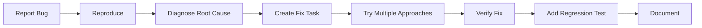

## Overview

Bug fixing with Forge combines human debugging intuition with AI agent execution power. You identify and reproduce the bug, AI agents help fix it, and you verify the solution actually works.

---

## The Bug Fixing Cycle



---

## Step 1: Capture the Bug Report

Start with clear bug documentation.

### Bug Report Template

Create a detailed task card with:

<Tabs>
  <Tab title="Via UI">
    ```yaml
    Title: "API returns 500 on malformed JSON input"

    Description:
      Environment: Production API v2.3.1
      Endpoint: POST /api/users

      Steps to Reproduce:
      1. Send POST request with malformed JSON
      2. Missing closing brace in request body

      Expected: 400 Bad Request with error message
      Actual: 500 Internal Server Error

      Impact: High - crashes API server
      Frequency: ~50 requests/day

      Example Request:
      {
        "name": "John Doe",
        "email": "john@example.com"
        # Missing closing brace

    Labels: bug, backend, priority:high, security
    ```
  </Tab>

  <Tab title="Via CLI">
    ```bash
    forge task create \
      --title "API returns 500 on malformed JSON input" \
      --type bug \
      --priority high \
      --labels "backend,security" \
      --description "$(cat <<EOF
    Environment: Production API v2.3.1
    Endpoint: POST /api/users

    Steps to Reproduce:
    1. Send POST request with malformed JSON
    2. Missing closing brace crashes server

    Expected: 400 Bad Request
    Actual: 500 Internal Server Error

    Impact: High - crashes API server
    EOF
    )"
    ```
  </Tab>

  <Tab title="Via MCP (Claude Code)">
    ```plaintext
    "I found a bug in production. Create a bug task:

    Title: API returns 500 on malformed JSON input
    Type: bug
    Priority: high
    Labels: backend, security

    The POST /api/users endpoint crashes with 500 when receiving malformed JSON.
    It should return 400 Bad Request instead.

    This happens about 50 times per day and crashes the API server.
    High priority security issue."
    ```
  </Tab>
</Tabs>

---

## Step 2: Reproduce the Bug

Before fixing, ensure you can reliably reproduce it.

### Create Reproduction Task

```bash
# Create a task specifically for reproduction
forge task create \
  --title "Reproduce: API 500 on malformed JSON" \
  --description "Write failing test that demonstrates the bug" \
  --labels "bug,reproduction" \
  --agent claude-code
```

### Why Reproduction Matters

<Card title="Benefits of Reproduction" icon="flask">
  ✅ **Confirms the bug exists**
  ✅ **Provides regression test**
  ✅ **Documents exact conditions**
  ✅ **Verifies fix actually works**
</Card>

### Example Reproduction Test

The AI agent might create:

```typescript
// test/api/users.test.ts
describe('POST /api/users - Error Handling', () => {
  it('should return 400 for malformed JSON', async () => {
    const malformedJson = '{"name":"John","email":"john@example.com"'; // Missing }

    const response = await request(app)
      .post('/api/users')
      .set('Content-Type', 'application/json')
      .send(malformedJson);

    expect(response.status).toBe(400); // Currently fails with 500
    expect(response.body).toHaveProperty('error');
    expect(response.body.error).toContain('Invalid JSON');
  });
});
```

---

## Step 3: Diagnose Root Cause

Use AI agents to help analyze the problem.

### Diagnostic Approaches

<Tabs>
  <Tab title="Code Analysis">
    ```bash
    # Let agent analyze the codebase
    forge task create \
      --title "Analyze root cause: API 500 error" \
      --description "Review error handling middleware and JSON parsing logic" \
      --agent claude-code \
      --labels "analysis,bug"
    ```

    Agent might find:
    ```typescript
    // Missing error handling in middleware
    app.use(express.json()); // ❌ No error handler
    ```
  </Tab>

  <Tab title="Log Analysis">
    ```bash
    # Provide logs to agent for analysis
    forge task create \
      --title "Analyze error logs for JSON parsing bug" \
      --description "Review last 100 error logs from production" \
      --agent gemini \
      --attach-file logs/error-2024-10-31.log
    ```
  </Tab>

  <Tab title="Stack Trace Analysis">
    ```bash
    # Analyze stack trace
    forge task create \
      --title "Trace error: SyntaxError in JSON.parse" \
      --description "Follow stack trace to find unhandled exception" \
      --agent claude-code
    ```
  </Tab>
</Tabs>

---

## Step 4: Create Fix Tasks

Break down the fix into focused tasks.

### Example: JSON Parsing Bug Fix

```bash
# Task 1: Add error handling middleware
forge task create \
  --title "Add JSON parsing error handler" \
  --description "Catch SyntaxError from express.json() and return 400" \
  --agent claude-code \
  --labels "bug,fix"

# Task 2: Add validation
forge task create \
  --title "Add request validation middleware" \
  --description "Validate request body structure before processing" \
  --agent cursor-cli \
  --labels "bug,validation"

# Task 3: Improve error messages
forge task create \
  --title "Add detailed error messages for malformed JSON" \
  --description "Return helpful error messages indicating what's wrong" \
  --agent gemini \
  --labels "bug,ux"
```

---

## Step 5: Try Multiple Approaches

Use Forge's multi-attempt feature to explore different solutions.

### Approach Comparison

<Steps>
  <Step title="Attempt 1: Middleware Approach (Claude)">
    ```typescript
    // Add error handling middleware
    app.use((err, req, res, next) => {
      if (err instanceof SyntaxError && err.status === 400 && 'body' in err) {
        return res.status(400).json({
          error: 'Invalid JSON',
          message: err.message
        });
      }
      next();
    });
    ```

    **Pros**: Standard Express pattern
    **Cons**: Only handles middleware errors
  </Step>

  <Step title="Attempt 2: Custom Parser (Gemini)">
    ```typescript
    // Replace express.json() with custom parser
    app.use((req, res, next) => {
      try {
        req.body = JSON.parse(req.body);
        next();
      } catch (err) {
        return res.status(400).json({
          error: 'Malformed JSON',
          details: err.message
        });
      }
    });
    ```

    **Pros**: Full control over parsing
    **Cons**: Reinventing the wheel
  </Step>

  <Step title="Attempt 3: Wrapper with Validation (Cursor)">
    ```typescript
    // Use express-json-validator-middleware
    import { Validator } from 'express-json-validator-middleware';

    const validator = new Validator({});

    app.use(express.json({
      verify: (req, res, buf) => {
        try {
          JSON.parse(buf);
        } catch (err) {
          throw new SyntaxError('Invalid JSON format');
        }
      }
    }));
    ```

    **Pros**: Validates before parsing
    **Cons**: Additional dependency
  </Step>
</Steps>

### Compare Attempts

```bash
# Run all three approaches
forge task start task-1 --agent claude-code
forge task fork task-1 --agent gemini
forge task fork task-1 --agent cursor-cli

# Compare results
forge task compare task-1

# Test each approach
forge task test task-1-attempt-1
forge task test task-1-attempt-2
forge task test task-1-attempt-3
```

**Decision Matrix:**

| Criterion | Claude (Middleware) | Gemini (Custom) | Cursor (Validation) |
|-----------|---------------------|-----------------|---------------------|
| Code Quality | ⭐⭐⭐⭐⭐ | ⭐⭐⭐ | ⭐⭐⭐⭐ |
| Performance | ⭐⭐⭐⭐⭐ | ⭐⭐⭐⭐ | ⭐⭐⭐⭐ |
| Maintainability | ⭐⭐⭐⭐⭐ | ⭐⭐ | ⭐⭐⭐⭐ |
| Security | ⭐⭐⭐⭐ | ⭐⭐⭐ | ⭐⭐⭐⭐⭐ |
| **Winner** | ✅ **Best overall** | ❌ | ⚠️ Good alternative |

---

## Step 6: Verify the Fix

Never trust a fix without verification.

### Verification Checklist

<AccordionGroup>
  <Accordion title="1. Reproduction Test Passes">
    ```bash
    # Run the original failing test
    forge task test task-reproduction

    # Should now pass ✅
    ```
  </Accordion>

  <Accordion title="2. Edge Cases Covered">
    ```bash
    # Create additional test task
    forge task create \
      --title "Test edge cases for JSON parsing fix" \
      --description "Test various malformed JSON scenarios" \
      --agent claude-code
    ```

    Tests should cover:
    - Missing closing bracket
    - Extra commas
    - Invalid escape sequences
    - Empty request body
    - Non-JSON content type
  </Accordion>

  <Accordion title="3. No Regressions">
    ```bash
    # Run full test suite
    forge task create \
      --title "Run full test suite" \
      --agent cursor-cli
    ```

    Ensure the fix didn't break existing functionality.
  </Accordion>

  <Accordion title="4. Performance Impact">
    ```bash
    # Benchmark before and after
    forge task create \
      --title "Benchmark JSON parsing performance" \
      --description "Compare performance before and after fix" \
      --agent gemini
    ```
  </Accordion>
</AccordionGroup>

---

## Step 7: Add Regression Test

Prevent the bug from coming back.

```bash
# Create comprehensive test task
forge task create \
  --title "Add regression test suite for JSON parsing" \
  --description "Cover all malformed JSON scenarios found in production" \
  --agent claude-code \
  --labels "testing,regression"
```

### Example Regression Test Suite

```typescript
describe('JSON Parsing - Regression Tests', () => {
  test.each([
    ['missing closing brace', '{"name":"John"'],
    ['extra comma', '{"name":"John",}'],
    ['invalid escape', '{"name":"John\\x"}'],
    ['trailing text', '{"name":"John"}extra'],
    ['leading text', 'extra{"name":"John"}'],
  ])('should return 400 for: %s', async (scenario, malformed) => {
    const response = await request(app)
      .post('/api/users')
      .send(malformed);

    expect(response.status).toBe(400);
    expect(response.body.error).toBeDefined();
  });
});
```

---

## Step 8: Document the Fix

Update documentation to help prevent similar bugs.

<Tabs>
  <Tab title="Code Comments">
    ```typescript
    // ⚠️ IMPORTANT: JSON parsing error handler
    // This middleware catches SyntaxError from malformed JSON
    // and returns 400 instead of crashing with 500.
    // See: https://github.com/yourorg/repo/issues/123
    app.use((err, req, res, next) => {
      if (err instanceof SyntaxError && 'body' in err) {
        return res.status(400).json({
          error: 'Invalid JSON',
          message: 'Request body contains malformed JSON'
        });
      }
      next();
    });
    ```
  </Tab>

  <Tab title="CHANGELOG">
    ```markdown
    ## [2.3.2] - 2024-10-31

    ### Fixed
    - API now returns 400 Bad Request instead of 500 when receiving malformed JSON
    - Added comprehensive error messages for JSON parsing errors
    - Added regression test suite for JSON validation

    ### Security
    - Fixed crash vulnerability when processing malformed JSON input
    ```
  </Tab>

  <Tab title="API Documentation">
    **Error Response Documentation:**

    ### 400 Bad Request - Invalid JSON

    Returned when request body contains malformed JSON.

    **Example Response:**
    ```json
    {
      "error": "Invalid JSON",
      "message": "Unexpected token } in JSON at position 42"
    }
    ```

    **Common Causes:**
    - Missing closing braces or brackets
    - Trailing commas
    - Invalid escape sequences
  </Tab>
</Tabs>

---

## Real-World Example: Memory Leak Bug

Here's a complete bug fix workflow for a production memory leak:

<Steps>
  <Step title="Day 1 - Investigation">
    ```bash
    # Create investigation tasks
    forge task create --title "Analyze memory usage patterns" --agent claude-code
    forge task create --title "Review event listener registrations" --agent gemini
    forge task create --title "Check for unclosed connections" --agent cursor-cli

    # Run parallel analysis
    forge task start-batch task-1 task-2 task-3

    # Finding: WebSocket connections not cleaned up on disconnect
    ```
  </Step>

  <Step title="Day 2 - Fix Attempts">
    ```bash
    # Try different fix approaches
    forge task create --title "Add connection cleanup on disconnect" --agent claude-code
    forge task fork task-4 --agent gemini  # Alternative approach

    # Compare solutions
    forge task compare task-4

    # Claude's approach wins - more comprehensive
    ```
  </Step>

  <Step title="Day 3 - Verification & Ship">
    ```bash
    # Add monitoring and tests
    forge task create --title "Add memory leak regression tests" --agent claude-code
    forge task create --title "Add connection pool monitoring" --agent gemini

    # Verify fix in staging
    forge task create --title "Load test in staging environment" --agent cursor-cli

    # All passed - merge and deploy
    forge task merge-all-approved
    ```
  </Step>
</Steps>

---

## Bug Severity & Agent Strategy

Choose your approach based on bug severity:

<Tabs>
  <Tab title="Critical (P0)">
    **Characteristics**: Production down, data loss, security breach

    **Strategy**:
    ```bash
    # Use fastest, most reliable agent
    forge task create --title "URGENT: Fix auth bypass" --agent claude-code

    # No time for multiple attempts - go with proven agent
    # Document and refactor later if needed
    ```
  </Tab>

  <Tab title="High (P1)">
    **Characteristics**: Feature broken, bad UX, performance issue

    **Strategy**:
    ```bash
    # Try 2-3 approaches, choose best
    forge task create --title "Fix slow API response" --agent claude-code
    forge task fork task-1 --agent gemini

    # Compare and pick winner
    forge task compare task-1
    ```
  </Tab>

  <Tab title="Medium (P2)">
    **Characteristics**: Minor issue, edge case, cosmetic

    **Strategy**:
    ```bash
    # Experiment with different agents
    forge task create --title "Fix button alignment" --agent cursor-cli
    forge task fork task-1 --agent gemini
    forge task fork task-1 --agent claude-code

    # Good opportunity to learn which agent handles CSS best
    ```
  </Tab>

  <Tab title="Low (P3)">
    **Characteristics**: Nice-to-have, typos, cleanup

    **Strategy**:
    ```bash
    # Use fastest agent, batch with other low-priority tasks
    forge task create --title "Fix typo in error message" --agent gemini --batch-id cleanup-sprint
    ```
  </Tab>
</Tabs>

---

## Pro Tips for Bug Fixing

<AccordionGroup>
  <Accordion title="Always Reproduce First">
    Never start fixing until you have a failing test:

    ```bash
    # ✅ Correct order
    1. Write failing test
    2. Run test (confirms it fails)
    3. Fix the bug
    4. Run test (confirms it passes)

    # ❌ Wrong order
    1. Make changes hoping to fix bug
    2. Deploy and pray
    ```
  </Accordion>

  <Accordion title="Use Git Bisect for Regression Bugs">
    ```bash
    # Create bisect task
    forge task create \
      --title "Bisect: Find commit that introduced bug" \
      --description "Use git bisect to find regression commit" \
      --agent claude-code
    ```
  </Accordion>

  <Accordion title="Label Bugs Clearly">
    Good labels help with prioritization and analytics:

    ```bash
    --labels "bug,security,database,priority:high,customer-reported"
    ```
  </Accordion>

  <Accordion title="Link to Issues and PRs">
    ```bash
    forge task create \
      --title "Fix #123: API timeout" \
      --github-issue 123 \
      --related-pr 456
    ```
  </Accordion>
</AccordionGroup>

---

## Common Bug Patterns

<CardGroup cols={2}>
  <Card title="Null/Undefined Errors" icon="circle-xmark">
    **Best Agent**: Claude Code (thorough type checking)

    ```bash
    forge task create \
      --title "Add null checks to user profile" \
      --agent claude-code
    ```
  </Card>

  <Card title="Race Conditions" icon="stopwatch">
    **Best Agent**: Claude Code (complex async logic)

    ```bash
    forge task create \
      --title "Fix race condition in payment processing" \
      --agent claude-code
    ```
  </Card>

  <Card title="Memory Leaks" icon="memory">
    **Best Agent**: Claude Code or Cursor CLI

    ```bash
    forge task create \
      --title "Fix memory leak in event listeners" \
      --agent claude-code
    ```
  </Card>

  <Card title="Performance Issues" icon="gauge">
    **Best Agent**: Try multiple, compare benchmarks

    ```bash
    forge task create \
      --title "Optimize slow database query" \
      --agent claude-code

    forge task fork task-1 --agent gemini
    ```
  </Card>
</CardGroup>

---

## Next Steps

<CardGroup cols={2}>
  <Card title="Feature Development" icon="plus" href="/forge/workflows/feature-development">
    Build new features with confidence
  </Card>
  <Card title="Refactoring Workflow" icon="code" href="/forge/workflows/refactoring">
    Safe code improvements with AI
  </Card>
  <Card title="Code Review" icon="magnifying-glass" href="/forge/workflows/code-review">
    Multi-agent PR review process
  </Card>
  <Card title="Testing Guide" icon="vial" href="/forge/workflows/testing">
    Comprehensive testing strategies
  </Card>
</CardGroup>

---

**Remember**: Bugs are opportunities to improve. With Forge, you can experiment with multiple fix approaches in isolation, choose the best solution, and ensure it never happens again.
