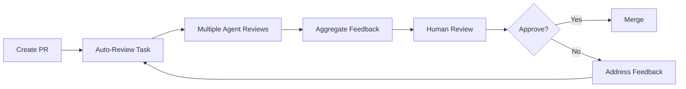

## Overview

Code review with Forge uses multiple AI agents as additional reviewers, each bringing different perspectives. Combine human judgment with AI analysis to catch more issues and ship higher quality code.

---

## The Multi-Agent Review Process



---

## Step 1: Prepare for Review

Before requesting review, ensure your PR is review-ready.

###Pre-Review Checklist

```bash
# Create pre-review task
forge task create \
  --title "Pre-review checklist for PR #123" \
  --description "$(cat <<EOF
- [ ] All tests pass
- [ ] Linter passes
- [ ] Type checker passes
- [ ] No console.logs or debugging code
- [ ] CHANGELOG updated
- [ ] Documentation updated
- [ ] Self-review completed
EOF
)" \
  --agent gemini
```

---

## Step 2: Multi-Agent Review

Use different AI agents to review from different angles.

<Tabs>
  <Tab title="Security Review (Claude)">
    ```bash
    forge task create \
      --title "Security review: PR #123 authentication changes" \
      --description "Review for: SQL injection, XSS, auth bypasses, secret exposure" \
      --agent claude-code \
      --labels "review,security" \
      --attach-pr 123
    ```

    **Claude excels at:**
    - Security vulnerabilities
    - Logic errors
    - Edge cases
    - Complex algorithms
  </Tab>

  <Tab title="Performance Review (Gemini)">
    ```bash
    forge task create \
      --title "Performance review: PR #123" \
      --description "Check for: N+1 queries, memory leaks, inefficient algorithms" \
      --agent gemini \
      --labels "review,performance" \
      --attach-pr 123
    ```

    **Gemini excels at:**
    - Performance issues
    - Resource usage
    - Scalability concerns
    - Quick scans
  </Tab>

  <Tab title="Best Practices Review (Cursor)">
    ```bash
    forge task create \
      --title "Best practices review: PR #123" \
      --description "Check: Code style, patterns, naming, structure" \
      --agent cursor-cli \
      --labels "review,quality" \
      --attach-pr 123
    ```

    **Cursor excels at:**
    - Modern patterns
    - Framework best practices
    - Code organization
    - TypeScript idioms
  </Tab>

  <Tab title="Testing Review (Specialized Agent)">
    ```bash
    forge task create \
      --title "Test coverage review: PR #123" \
      --description "Verify: Test coverage, edge cases, integration tests" \
      --agent claude-code \
      --specialized-agent "test-reviewer" \
      --labels "review,testing" \
      --attach-pr 123
    ```

    **Test reviewer checks:**
    - Test coverage percentage
    - Missing edge cases
    - Test quality
    - Integration test gaps
  </Tab>
</Tabs>

---

## Step 3: Run Reviews in Parallel

Execute all reviews simultaneously for faster feedback.

```bash
# Launch all review tasks at once
forge task start-batch \
  task-security \
  task-performance \
  task-best-practices \
  task-testing \
  --parallel

# Monitor progress
forge task watch-batch --all-reviews

# Results ready in ~5-10 minutes
```

---

## Step 4: Aggregate Feedback

Collect and organize feedback from all agents.

### Example Review Aggregation

```bash
forge task create \
  --title "Aggregate all PR #123 reviews" \
  --description "Combine feedback from all agents into single report" \
  --agent gemini \
  --depends-on task-security,task-performance,task-best-practices,task-testing
```

**Aggregated Report Structure:**

```markdown
# PR #123 Review Summary

## 🔴 Critical Issues (3)
1. **[Security]** SQL injection vulnerability in user search
   - Agent: Claude Code
   - File: `src/api/users.ts:45`
   - Fix: Use parameterized queries

2. **[Performance]** N+1 query in order list endpoint
   - Agent: Gemini
   - File: `src/api/orders.ts:120`
   - Fix: Use eager loading with joins

3. **[Testing]** Missing tests for error scenarios
   - Agent: Test Reviewer
   - Coverage: 45% (target: 80%)
   - Fix: Add error case tests

## 🟡 Medium Issues (7)
...

## 🟢 Minor Issues (12)
...

## ✅ Positive Feedback
- Good separation of concerns
- Clear naming conventions
- Comprehensive error handling
```

---

## Step 5: Address Feedback

Create tasks to address review feedback.

```bash
# Critical issues - fix immediately
forge task create \
  --title "Fix SQL injection in user search" \
  --description "Use parameterized queries, validate input" \
  --priority critical \
  --agent claude-code \
  --labels "bugfix,security"

# Medium issues - fix before merge
forge task create \
  --title "Optimize order list query" \
  --description "Replace N+1 with JOIN query" \
  --priority high \
  --agent gemini

# Minor issues - address or defer
forge task create \
  --title "Improve variable naming in auth module" \
  --priority low \
  --agent cursor-cli \
  --labels "refactor,nice-to-have"
```

---

## Review Patterns for Different PR Types

<Tabs>
  <Tab title="Feature PRs">
    ```bash
    # Comprehensive multi-agent review
    forge review create \
      --pr 123 \
      --agents claude-code,gemini,cursor-cli \
      --focus security,performance,best-practices,testing \
      --parallel
    ```

    **Review Focus:**
    - Feature completeness
    - Test coverage
    - Security implications
    - Performance impact
    - Documentation
  </Tab>

  <Tab title="Bug Fix PRs">
    ```bash
    # Focus on regression prevention
    forge review create \
      --pr 124 \
      --agents claude-code,gemini \
      --focus security,testing,regression \
      --specialized-agent "bug-fix-reviewer"
    ```

    **Review Focus:**
    - Root cause addressed
    - Regression tests added
    - No new bugs introduced
    - Similar bugs elsewhere
  </Tab>

  <Tab title="Refactoring PRs">
    ```bash
    # Ensure no behavior changes
    forge review create \
      --pr 125 \
      --agents cursor-cli,claude-code \
      --focus behavior-preservation,testing \
      --require-benchmark
    ```

    **Review Focus:**
    - All tests still pass
    - No behavior changes
    - Code quality improved
    - Performance not degraded
  </Tab>

  <Tab title="Hotfix PRs">
    ```bash
    # Fast security/critical review only
    forge review create \
      --pr 126 \
      --agents claude-code \
      --focus security,correctness \
      --fast-track
    ```

    **Review Focus:**
    - Fixes the critical issue
    - No new vulnerabilities
    - Minimal scope
    - Can be rolled back
  </Tab>
</Tabs>

---

## Specialized Review Agents

Create custom review agents for specific needs.

### Creating a Custom Reviewer

```yaml
# .forge/agents/security-reviewer.yml
name: security-reviewer
description: "Security-focused code reviewer"
base_agent: claude-code

system_prompt: |
  You are a security-focused code reviewer. Review code for:

  OWASP Top 10 vulnerabilities:
  - SQL Injection
  - XSS (Cross-Site Scripting)
  - CSRF
  - Authentication/Authorization flaws
  - Security misconfigurations
  - Sensitive data exposure
  - Insufficient logging
  - XML External Entities (XXE)
  - Broken access control
  - Using components with known vulnerabilities

  Also check for:
  - Hardcoded secrets
  - Weak cryptography
  - Insecure dependencies
  - Input validation
  - Output encoding
  - Rate limiting
  - Error message information leakage

  Provide specific, actionable feedback with:
  - Severity (Critical/High/Medium/Low)
  - Exact file and line number
  - Vulnerability explanation
  - Remediation steps
  - Example secure code

checklist:
  - SQL injection prevention
  - XSS prevention
  - Authentication checks
  - Authorization checks
  - Input validation
  - Output encoding
  - Secret management
  - Dependency security
```

### Using Custom Reviewers

```bash
forge task create \
  --title "Deep security review: Payment processing PR" \
  --agent claude-code \
  --specialized-agent "security-reviewer" \
  --attach-pr 127
```

---

## Review Automation

### Auto-Review on PR Creation

```yaml
# .forge/workflows/auto-review.yml
name: Auto-Review PR

on:
  pull_request:
    types: [opened, synchronize]

jobs:
  multi-agent-review:
    runs-on: forge-server
    steps:
      - name: Security Review
        run: |
          forge task create \
            --title "Security review: PR ${{ github.event.number }}" \
            --agent claude-code \
            --specialized-agent "security-reviewer" \
            --attach-pr ${{ github.event.number }} \
            --auto-comment

      - name: Performance Review
        run: |
          forge task create \
            --title "Performance review: PR ${{ github.event.number }}" \
            --agent gemini \
            --specialized-agent "performance-reviewer" \
            --attach-pr ${{ github.event.number }} \
            --auto-comment

      - name: Best Practices Review
        run: |
          forge task create \
            --title "Best practices review: PR ${{ github.event.number }}" \
            --agent cursor-cli \
            --attach-pr ${{ github.event.number }} \
            --auto-comment

      - name: Aggregate Results
        run: |
          forge review aggregate \
            --pr ${{ github.event.number }} \
            --post-summary
```

### GitHub Integration

```bash
# Configure Forge to comment on PRs
forge config set github.auto_comment true
forge config set github.review_threshold "critical,high"

# Agents will automatically post comments
```

**Example Auto-Comment:**

```markdown
## 🤖 Forge Security Review

**Agent:** Claude Code (security-reviewer)
**Status:** ⚠️ Issues Found

### 🔴 Critical Issues (1)

**SQL Injection in User Search**
- **File:** `src/api/users.ts`
- **Line:** 45
- **Severity:** Critical

**Current Code:**
```typescript
const query = `SELECT * FROM users WHERE name = '${searchTerm}'`;
```

**Issue:** User input is directly interpolated into SQL query.

**Fix:**
```typescript
const query = 'SELECT * FROM users WHERE name = ?';
const results = await db.query(query, [searchTerm]);
```

---

*Reviewed by Automagik Forge • [View Full Report](https://forge.example.com/reviews/123)*
```

---

## Measuring Review Quality

Track metrics to improve review process.

### Issue Detection Rate

**Measure effectiveness:**
```bash
forge analytics review-effectiveness --period last-30-days
```

**Metrics tracked:**
- Issues caught by AI vs humans
- False positive rate
- Severity distribution
- Time to fix

### Agent Performance

**Compare agent effectiveness:**
```bash
forge analytics agent-review-performance
```

**Comparison:**
- Claude: Best at security, logic
- Gemini: Best at performance
- Cursor: Best at patterns

### Review Coverage

**Track review metrics:**
```bash
forge analytics review-coverage
```

**Metrics:**
- Files reviewed per PR
- Lines of code reviewed
- Review time per PR
- Issues found per KLOC

---

## Real-World Example: Complete PR Review

### Large Feature PR Review Workflow

<Steps>
  <Step title="Initial Automated Review">
    ```bash
    # PR #150: Add payment processing with Stripe
    # Files changed: 25
    # Lines: +1,200 -150

    # Launch parallel reviews
    forge review create \
      --pr 150 \
      --agents claude-code,gemini,cursor-cli \
      --specialized-agents security-reviewer,payment-specialist \
      --parallel

    # Results: 45 minutes
    # - 2 critical security issues
    # - 8 high priority issues
    # - 15 medium issues
    # - 23 minor suggestions
    ```
  </Step>

  <Step title="Address Critical Issues">
    ```bash
    # Create fix tasks
    forge task create \
      --title "Fix: Validate webhook signatures" \
      --agent claude-code \
      --priority critical

    forge task create \
      --title "Fix: Add idempotency keys" \
      --agent claude-code \
      --priority critical

    # Push fixes
    # Re-run security review
    forge review rerun --pr 150 --agent security-reviewer

    # ✅ Critical issues resolved
    ```
  </Step>

  <Step title="Human Review">
    ```markdown
    # Human reviewer sees:
    - AI found 2 critical issues (now fixed)
    - 8 high priority items addressed
    - AI review notes on 15 medium items
    - Human focuses on:
      - Business logic correctness
      - UX considerations
      - Edge cases AI might miss
      - Overall architecture

    # Human review time: 30 minutes (vs 2 hours without AI)
    ```
  </Step>

  <Step title="Final Approval">
    ```bash
    # All reviews passed
    # Human approved
    # Merge PR

    forge review complete --pr 150 --approved
    ```
  </Step>
</Steps>

---

## Pro Tips

<AccordionGroup>
  <Accordion title="Start with Automated Reviews">
    Let AI catch the obvious issues first:

    ```bash
    # ✅ Good workflow
    1. Push PR
    2. AI review runs automatically
    3. Fix critical/high issues
    4. Request human review
    5. Human focuses on nuanced issues

    # ❌ Bad workflow
    1. Push PR
    2. Request human review immediately
    3. Human finds obvious issues
    4. Waste reviewer time
    ```
  </Accordion>

  <Accordion title="Use Severity Thresholds">
    ```bash
    # Only block merge on critical/high
    forge config set review.block_on "critical,high"

    # Auto-approve if only minor issues
    forge config set review.auto_approve_threshold "minor"
    ```
  </Accordion>

  <Accordion title="Review in Stages">
    ```bash
    # Stage 1: Quick scan (Gemini - 2 mins)
    # Stage 2: Deep dive (Claude - 10 mins)
    # Stage 3: Specialized (Custom agents - 15 mins)

    forge review create --pr 151 --staged \
      --stage-1 gemini \
      --stage-2 claude-code \
      --stage-3 security-reviewer
    ```
  </Accordion>

  <Accordion title="Learn from Review History">
    ```bash
    # Analyze what agents catch most often
    forge analytics common-issues --by-agent

    # Improve specialized agents based on patterns
    forge agent improve security-reviewer \
      --based-on-history last-50-reviews
    ```
  </Accordion>
</AccordionGroup>

---

## Next Steps

<CardGroup cols={2}>
  <Card title="Team Collaboration" icon="users" href="/forge/workflows/team-collaboration">
    Coordinate reviews across teams
  </Card>
  <Card title="CI/CD Integration" icon="gear" href="/forge/advanced/ci-cd">
    Automate reviews in your pipeline
  </Card>
  <Card title="Custom Agents" icon="robot" href="/forge/advanced/specialized-agents">
    Create specialized review agents
  </Card>
  <Card title="GitHub Integration" icon="github" href="/forge/config/github-oauth">
    Set up GitHub PR integration
  </Card>
</CardGroup>

---

**Remember**: AI agents are additional reviewers, not replacements for human judgment. They catch common issues quickly, freeing humans to focus on architecture, business logic, and user experience.
