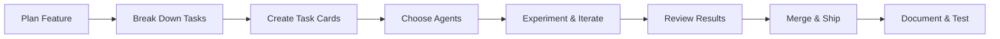

## Overview

Feature development with Forge follows the **Vibe Coding++™** approach: you plan and orchestrate, AI agents execute, you review and ship. This workflow ensures you ship production-ready code that you understand and can maintain.

---

## The Feature Development Cycle



---

## Step 1: Plan Your Feature

Before jumping into code, plan your feature at a high level.

### Example: Building a Real-Time Notification System

**Feature Goal**: Add real-time notifications with WebSocket support, browser notifications, and notification history.

**Initial Planning Questions:**
- What are the core components needed?
- What are the technical dependencies?
- What's the order of implementation?
- Are there any risks or unknowns?

---

## Step 2: Break Down Into Tasks

Decompose your feature into small, focused tasks. Each task should be completable in 15-30 minutes of AI execution.

<Tip>
**Golden Rule**: If you can't describe a task in 1-2 sentences, it's too big. Break it down further.
</Tip>

### Example Task Breakdown

```yaml
Epic: Real-Time Notification System

Tasks:
  1. Design notification data model and database schema
  2. Create WebSocket server with Socket.io
  3. Build notification API endpoints (CRUD)
  4. Implement browser notification permissions
  5. Create notification UI component
  6. Add notification history view
  7. Write integration tests for WebSocket
  8. Add notification settings panel
  9. Document notification API
```

---

## Step 3: Create Task Cards in Forge

Open Forge and create your task cards:

<Tabs>
  <Tab title="Via UI">
    ```bash
    # Start Forge UI
    npx automagik-forge

    # Open http://localhost:3000
    # Click "New Task" button
    # Fill in task details
    ```

    **Task Card Template:**
    - **Title**: Short, action-oriented (e.g., "Create WebSocket server")
    - **Description**: Detailed requirements and acceptance criteria
    - **Labels**: Type (feature, refactor, etc.) and priority
    - **Dependencies**: Link related tasks
  </Tab>

  <Tab title="Via CLI">
    ```bash
    # Create task via CLI
    forge task create \
      --title "Create WebSocket server with Socket.io" \
      --description "Set up Socket.io server, handle connections, implement room-based notifications" \
      --labels "feature,backend,notifications" \
      --priority high
    ```
  </Tab>

  <Tab title="Via MCP">
    ```plaintext
    # From Claude Code or any MCP client
    "Create a new task:
    - Title: Create WebSocket server with Socket.io
    - Description: Set up Socket.io server, handle connections, implement room-based notifications
    - Labels: feature, backend, notifications
    - Priority: high"
    ```
  </Tab>
</Tabs>

---

## Step 4: Choose Your Agents Strategically

Different AI agents have different strengths. Choose based on the task type:

<CardGroup cols={2}>
  <Card title="Backend/API Work" icon="server">
    **Best Agents:**
    - **Claude Code**: Excellent for complex logic
    - **Cursor CLI**: Great for boilerplate
    - **Gemini**: Fast iterations
  </Card>

  <Card title="Frontend/UI Work" icon="palette">
    **Best Agents:**
    - **Cursor CLI**: Modern React patterns
    - **Claude Code**: Accessible UI
    - **Gemini**: Quick prototypes
  </Card>

  <Card title="Database/Schema" icon="database">
    **Best Agents:**
    - **Claude Code**: Complex migrations
    - **GPT-4 Codex**: SQL optimization
    - **Gemini**: Schema design
  </Card>

  <Card title="Testing" icon="vial">
    **Best Agents:**
    - **Claude Code**: Comprehensive tests
    - **Cursor CLI**: Integration tests
    - **Specialized "test-writer" agent**
  </Card>
</CardGroup>

### Example: WebSocket Server Task

```bash
# Try multiple agents to compare approaches
forge task create \
  --title "Create WebSocket server" \
  --agent claude-code

# Create alternative attempt with different agent
forge task fork task-123 --agent gemini
```

---

## Step 5: Experiment & Iterate

Forge's git worktree isolation lets you experiment fearlessly.

### Running Multiple Attempts

<Steps>
  <Step title="Start First Attempt">
    ```bash
    # Claude Code attempts the task
    forge task start task-123 --agent claude-code

    # Forge creates: .forge/worktrees/task-123-attempt-1/
    ```
  </Step>

  <Step title="Create Alternative Approach">
    ```bash
    # Try Gemini's approach
    forge task fork task-123 --agent gemini

    # Forge creates: .forge/worktrees/task-123-attempt-2/
    ```
  </Step>

  <Step title="Monitor Progress">
    ```bash
    # Watch real-time execution
    forge task watch task-123

    # Or check status
    forge task status task-123
    ```
  </Step>
</Steps>

### When to Create Multiple Attempts

✅ **Use multiple attempts when:**
- Task is complex or critical
- You want to compare different approaches
- Previous attempt didn't meet requirements
- Learning which agent works best for task type

❌ **Single attempt is fine when:**
- Task is straightforward
- You trust the chosen agent for this task type
- Time is constrained

---

## Step 6: Review and Compare Results

Never merge without understanding what changed.

### Review Checklist

<AccordionGroup>
  <Accordion title="Code Quality">
    - Does the code follow project conventions?
    - Are there any code smells or anti-patterns?
    - Is error handling comprehensive?
    - Are edge cases covered?
  </Accordion>

  <Accordion title="Functionality">
    - Does it meet all acceptance criteria?
    - Are there any missing features?
    - Does it handle the happy path AND edge cases?
    - Are there any security concerns?
  </Accordion>

  <Accordion title="Testing">
    - Are there tests for new functionality?
    - Do existing tests still pass?
    - Is test coverage adequate?
    - Are tests meaningful (not just for coverage)?
  </Accordion>

  <Accordion title="Documentation">
    - Is the code self-documenting?
    - Are complex parts commented?
    - Is API documentation updated?
    - Are there usage examples?
  </Accordion>
</AccordionGroup>

### Comparing Multiple Attempts

```bash
# Side-by-side comparison
forge task compare task-123

# See detailed diff between attempts
forge diff \
  .forge/worktrees/task-123-attempt-1 \
  .forge/worktrees/task-123-attempt-2

# Run tests on both attempts
forge task test task-123-attempt-1
forge task test task-123-attempt-2
```

**Example Comparison:**

| Aspect | Claude Code Attempt | Gemini Attempt | Winner |
|--------|---------------------|----------------|--------|
| Code Quality | Comprehensive, well-structured | Simple, concise | Claude ✅ |
| Performance | Optimized with connection pooling | Basic implementation | Claude ✅ |
| Testing | Full test suite | Basic tests | Claude ✅ |
| Documentation | Extensive JSDoc | Minimal comments | Claude ✅ |
| Time Taken | 8 minutes | 4 minutes | Gemini ⚡ |

**Decision**: Choose Claude's approach for production quality.

---

## Step 7: Merge & Ship

Once you're satisfied with an attempt, merge it to your main branch.

```bash
# Review one final time
forge task review task-123-attempt-1

# Merge to main
forge task merge task-123-attempt-1

# Clean up other attempts
forge task cleanup task-123
```

### Merge Best Practices

<Warning>
**Before merging, always:**
1. Run the full test suite
2. Check for conflicts with main branch
3. Verify no secrets or sensitive data committed
4. Update CHANGELOG if applicable
</Warning>

---

## Step 8: Document & Test Integration

After merging individual tasks, test how they work together.

### Integration Testing

```bash
# Create integration test task
forge task create \
  --title "Integration test: Notification system end-to-end" \
  --description "Test full flow: send notification → WebSocket → browser → history" \
  --labels "testing,integration" \
  --agent claude-code
```

### Documentation Task

```bash
# Document the feature
forge task create \
  --title "Document notification API and usage" \
  --description "Update API docs, add usage examples, create user guide" \
  --labels "documentation" \
  --agent gemini  # Gemini is fast for docs
```

---

## Real-World Example: Complete Feature

Here's a complete workflow for building a user dashboard:

<Steps>
  <Step title="Day 1 - Planning & Backend">
    ```bash
    # Morning: Plan and create tasks
    forge task create --title "Design dashboard data model" --agent claude-code
    forge task create --title "Create dashboard API endpoints" --agent claude-code
    forge task create --title "Add caching layer with Redis" --agent gemini

    # Afternoon: Execute and review
    forge task start-batch task-1 task-2 task-3
    forge task review-all
    forge task merge-selected task-1 task-2  # Merge what's ready
    ```
  </Step>

  <Step title="Day 2 - Frontend">
    ```bash
    # Morning: UI components
    forge task create --title "Build dashboard layout component" --agent cursor-cli
    forge task create --title "Create chart components" --agent cursor-cli
    forge task create --title "Add real-time data updates" --agent claude-code

    # Try multiple approaches for charts
    forge task fork task-5 --agent gemini  # Compare approaches
    ```
  </Step>

  <Step title="Day 3 - Polish & Ship">
    ```bash
    # Morning: Testing and docs
    forge task create --title "Write dashboard integration tests" --agent claude-code
    forge task create --title "Add dashboard user guide" --agent gemini

    # Afternoon: Final review and ship
    forge task review-all
    forge task merge-all-approved

    # Create PR
    git checkout -b feature/user-dashboard
    git push origin feature/user-dashboard
    gh pr create --title "Add user dashboard with real-time charts"
    ```
  </Step>
</Steps>

---

## Pro Tips for Feature Development

<AccordionGroup>
  <Accordion title="Start Small, Iterate Fast">
    Build the simplest version first, then enhance:

    ```bash
    # Iteration 1: Basic functionality
    forge task create --title "Basic dashboard - static data"

    # Iteration 2: Add real-time
    forge task create --title "Add real-time data updates"

    # Iteration 3: Polish
    forge task create --title "Add animations and loading states"
    ```
  </Accordion>

  <Accordion title="Use Task Dependencies">
    Link tasks that must be completed in order:

    ```bash
    forge task create --title "Create API" --id api-task
    forge task create --title "Build UI" --depends-on api-task
    ```
  </Accordion>

  <Accordion title="Label Everything">
    Good labeling makes filtering and tracking easier:

    ```bash
    --labels "feature,frontend,priority:high,sprint-12"
    ```
  </Accordion>

  <Accordion title="Keep Your Main Branch Clean">
    Never merge half-finished work. Use Forge's isolation:

    - Each task in its own worktree
    - Only merge when tests pass
    - Review every change before merging
  </Accordion>
</AccordionGroup>

---

## Common Pitfalls to Avoid

<Warning>
### Don't Do This:

1. **Creating Tasks That Are Too Big**
   - ❌ "Build entire authentication system"
   - ✅ "Create user registration endpoint"

2. **Not Reviewing Before Merging**
   - ❌ Blindly merging AI-generated code
   - ✅ Understanding every change

3. **Using Only One Agent**
   - ❌ Always using the same agent
   - ✅ Experimenting to find best fit

4. **Forgetting Tests**
   - ❌ "I'll add tests later"
   - ✅ Tests are part of the feature

5. **Poor Task Descriptions**
   - ❌ "Fix the thing"
   - ✅ "Add validation to email field in signup form"
</Warning>

---

## Next Steps

<CardGroup cols={2}>
  <Card title="Bug Fixing Workflow" icon="bug" href="/forge/workflows/bug-fixing">
    Learn how to squash bugs with multiple AI agents
  </Card>
  <Card title="Refactoring Workflow" icon="code" href="/forge/workflows/refactoring">
    Safe refactoring with isolated experiments
  </Card>
  <Card title="Code Review Workflow" icon="magnifying-glass" href="/forge/workflows/code-review">
    Multi-agent PR review process
  </Card>
  <Card title="Team Collaboration" icon="users" href="/forge/workflows/team-collaboration">
    Coordinating AI-assisted development across teams
  </Card>
</CardGroup>

---

**Remember**: Vibe Coding++™ means you're always in control. The AI agents are powerful tools, but you're the maestro orchestrating them to create production-ready features.
