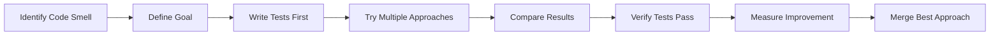

## Overview

Refactoring with Forge lets you improve code structure without fear. Git worktree isolation means you can experiment boldly, compare different refactoring approaches, and only merge when you're certain the code is better.

---

## The Refactoring Cycle



---

## When to Refactor

<CardGroup cols={2}>
  <Card title="Code Smells" icon="nose">
    - Duplicated code
    - Long functions (>50 lines)
    - Complex conditions
    - Poor naming
    - God objects/classes
  </Card>

  <Card title="Right Time" icon="clock">
    - Before adding new features
    - After fixing bugs
    - During code review
    - When tests are green
    - NOT under pressure
  </Card>
</CardGroup>

<Warning>
**Never refactor:**
- Without tests
- Under deadline pressure
- Multiple things at once
- Based on guesswork
</Warning>

---

## Step 1: Safety First - Write Tests

Before refactoring, ensure comprehensive test coverage.

```bash
# Check current test coverage
forge task create \
  --title "Measure test coverage for auth module" \
  --description "Generate coverage report, identify gaps" \
  --agent claude-code \
  --labels "testing,refactor-prep"

# Add missing tests
forge task create \
  --title "Add tests for auth edge cases" \
  --description "Ensure 100% coverage before refactoring" \
  --agent claude-code \
  --labels "testing"
```

<Tip>
**Golden Rule**: All tests must be green before starting refactoring. If tests fail, fix them first.
</Tip>

---

## Step 2: Define Clear Goals

Know exactly what you're improving and how you'll measure it.

### Example Goals

<Tabs>
  <Tab title="Readability">
    **Before**: "Clean up the code"
    **Better**: "Split 300-line UserService into 3 focused classes, each under 100 lines"

    ```bash
    forge task create \
      --title "Refactor: Split UserService into focused modules" \
      --description "Create AuthService, ProfileService, PreferencesService" \
      --agent claude-code
    ```
  </Tab>

  <Tab title="Performance">
    **Before**: "Make it faster"
    **Better**: "Reduce API response time from 500ms to under 200ms by optimizing database queries"

    ```bash
    forge task create \
      --title "Refactor: Optimize user lookup queries" \
      --description "Add indexes, use eager loading, cache results" \
      --agent claude-code \
      --attach-benchmark baseline-performance.json
    ```
  </Tab>

  <Tab title="Maintainability">
    **Before**: "Improve the structure"
    **Better**: "Extract business logic from controllers into service layer"

    ```bash
    forge task create \
      --title "Refactor: Extract business logic from UserController" \
      --description "Move all business logic to UserService" \
      --agent cursor-cli
    ```
  </Tab>

  <Tab title="Reusability">
    **Before**: "Remove duplication"
    **Better**: "Extract 5 duplicate validation functions into shared ValidationUtils"

    ```bash
    forge task create \
      --title "Refactor: Create shared validation utilities" \
      --description "Extract email, phone, date, credit card, zip validation" \
      --agent gemini
    ```
  </Tab>
</Tabs>

---

## Step 3: Experiment with Multiple Approaches

Try different refactoring strategies using different agents.

### Example: Refactoring Large Function

<Steps>
  <Step title="Approach 1: Extract Methods (Claude)">
    ```typescript
    // Original: 150-line processOrder function

    // Claude's approach: Extract small, focused methods
    class OrderProcessor {
      processOrder(order: Order) {
        this.validateOrder(order);
        this.calculateTotal(order);
        this.applyDiscounts(order);
        this.processPayment(order);
        this.updateInventory(order);
        this.sendConfirmation(order);
      }

      private validateOrder(order: Order) { /* ... */ }
      private calculateTotal(order: Order) { /* ... */ }
      // etc.
    }
    ```

    **Pros**: Clear, testable methods
    **Cons**: Many small methods
  </Step>

  <Step title="Approach 2: Pipeline Pattern (Gemini)">
    ```typescript
    // Gemini's approach: Functional pipeline
    const processOrder = pipe(
      validateOrder,
      calculateTotal,
      applyDiscounts,
      processPayment,
      updateInventory,
      sendConfirmation
    );
    ```

    **Pros**: Functional, composable
    **Cons**: Requires pipeline utility
  </Step>

  <Step title="Approach 3: Strategy Pattern (Cursor)">
    ```typescript
    // Cursor's approach: Strategy objects
    class OrderProcessor {
      constructor(
        private validator: OrderValidator,
        private calculator: PriceCalculator,
        private payment: PaymentProcessor,
        private inventory: InventoryManager,
        private notifications: NotificationService
      ) {}

      processOrder(order: Order) {
        this.validator.validate(order);
        const total = this.calculator.calculate(order);
        this.payment.process(order, total);
        this.inventory.update(order);
        this.notifications.sendConfirmation(order);
      }
    }
    ```

    **Pros**: Highly testable, SOLID
    **Cons**: More boilerplate
  </Step>
</Steps>

### Compare Approaches

```bash
# Create all three attempts
forge task create --title "Refactor processOrder" --agent claude-code
forge task fork task-1 --agent gemini
forge task fork task-1 --agent cursor-cli

# Compare results
forge task compare task-1

# Metrics to compare
forge task metrics task-1-attempt-1 \
  --measure "lines-of-code,cyclomatic-complexity,test-coverage"
```

**Comparison Matrix:**

| Metric | Claude (Methods) | Gemini (Pipeline) | Cursor (Strategy) |
|--------|------------------|-------------------|-------------------|
| Lines of Code | 180 | 120 | 220 |
| Cyclomatic Complexity | 8 | 3 | 5 |
| Test Coverage | 95% | 90% | 98% |
| Readability Score | ⭐⭐⭐⭐ | ⭐⭐⭐⭐⭐ | ⭐⭐⭐ |
| Testability | ⭐⭐⭐⭐ | ⭐⭐⭐ | ⭐⭐⭐⭐⭐ |
| **Winner** | Good | ✅ **Best balance** | Overengineered |

---

## Step 4: Verify Everything Still Works

After refactoring, run comprehensive verification.

<AccordionGroup>
  <Accordion title="1. Run All Tests">
    ```bash
    # Run full test suite in refactored worktree
    forge task test task-1-attempt-2

    # Compare test results with main branch
    forge task test-diff main task-1-attempt-2
    ```

    All tests must pass. No exceptions.
  </Accordion>

  <Accordion title="2. Check Performance">
    ```bash
    # Benchmark before and after
    forge task create \
      --title "Benchmark refactored code vs original" \
      --description "Compare memory usage, execution time, throughput" \
      --agent gemini

    # Results should show improvement or no regression
    ```
  </Accordion>

  <Accordion title="3. Verify Behavior">
    ```bash
    # Integration tests
    forge task create \
      --title "Run integration tests for order processing" \
      --agent claude-code

    # Manual smoke tests
    forge task create \
      --title "Manual testing checklist for order flow" \
      --description "Test happy path, edge cases, error scenarios" \
      --agent gemini
    ```
  </Accordion>

  <Accordion title="4. Code Quality Checks">
    ```bash
    # Linting
    forge task run "npm run lint" task-1-attempt-2

    # Type checking
    forge task run "npm run typecheck" task-1-attempt-2

    # Code complexity analysis
    forge task run "npm run complexity" task-1-attempt-2
    ```
  </Accordion>
</AccordionGroup>

---

## Common Refactoring Patterns

### 1. Extract Function/Method

**When**: Function is too long or has multiple responsibilities

```bash
forge task create \
  --title "Refactor: Extract calculateShipping from processOrder" \
  --description "Move shipping calculation to separate function" \
  --agent gemini  # Gemini is fast for simple extractions
```

### 2. Extract Class

**When**: Class has too many responsibilities

```bash
forge task create \
  --title "Refactor: Extract EmailService from UserService" \
  --description "Move all email-related logic to EmailService" \
  --agent claude-code  # Claude handles complex extractions well
```

### 3. Rename for Clarity

**When**: Names are unclear or misleading

```bash
forge task create \
  --title "Refactor: Rename ambiguous variables in auth module" \
  --description "data->userData, temp->sessionToken, flag->isAuthenticated" \
  --agent cursor-cli  # Cursor's LSP integration helps with safe renames
```

### 4. Introduce Parameter Object

**When**: Function has too many parameters

```bash
forge task create \
  --title "Refactor: Replace parameters with UserCreateDTO" \
  --description "Combine name, email, phone, address into single object" \
  --agent claude-code
```

### 5. Replace Conditional with Polymorphism

**When**: Complex if/switch statements

```bash
forge task create \
  --title "Refactor: Replace payment type switch with strategy pattern" \
  --description "Create PaymentStrategy interface with CreditCard, PayPal, Crypto implementations" \
  --agent cursor-cli
```

### 6. Remove Duplication

**When**: Same code appears in multiple places

```bash
forge task create \
  --title "Refactor: Extract duplicate validation logic" \
  --description "DRY principle - create shared validator utilities" \
  --agent gemini
```

---

## Real-World Example: Legacy Code Modernization

Complete refactoring of a legacy authentication module:

<Steps>
  <Step title="Week 1: Assessment & Testing">
    ```bash
    # Day 1-2: Understand current code
    forge task create --title "Document legacy auth flow" --agent claude-code
    forge task create --title "Map dependencies and touch points" --agent gemini

    # Day 3-5: Add tests
    forge task create --title "Add unit tests (target 80% coverage)" --agent claude-code
    forge task create --title "Add integration tests" --agent cursor-cli
    forge task create --title "Create performance baseline" --agent gemini
    ```
  </Step>

  <Step title="Week 2: Incremental Refactoring">
    ```bash
    # Day 1: Extract services
    forge task create --title "Extract AuthService from monolithic auth.js" --agent claude-code

    # Day 2: Modernize syntax
    forge task create --title "Convert callbacks to async/await" --agent gemini

    # Day 3: Improve error handling
    forge task create --title "Add proper error handling and logging" --agent claude-code

    # Day 4: Type safety
    forge task create --title "Add TypeScript types to auth module" --agent cursor-cli

    # Day 5: Testing
    forge task create --title "Verify all tests pass with refactored code" --agent claude-code
    ```
  </Step>

  <Step title="Week 3: Optimization & Review">
    ```bash
    # Day 1-2: Performance optimization
    forge task create --title "Optimize token validation" --agent claude-code
    forge task create --title "Add caching layer" --agent gemini

    # Day 3-4: Security audit
    forge task create --title "Security review of auth refactoring" --agent claude-code

    # Day 5: Documentation
    forge task create --title "Update auth documentation" --agent gemini

    # Ship it!
    forge task merge-all-approved
    ```
  </Step>
</Steps>

---

## Refactoring Anti-Patterns to Avoid

<Warning>
### Don't Do This:

1. **Big Bang Refactoring**
   - ❌ "Rewrite everything at once"
   - ✅ Small, incremental changes

2. **Refactoring Without Tests**
   - ❌ "Tests are old, we'll add them later"
   - ✅ Tests first, then refactor

3. **Changing Behavior**
   - ❌ "While I'm here, I'll also fix this bug"
   - ✅ Refactor OR fix bugs, not both

4. **Premature Optimization**
   - ❌ "This might be slow someday"
   - ✅ Profile first, optimize only if needed

5. **Over-Engineering**
   - ❌ "Let's use 5 design patterns here"
   - ✅ Simplest solution that works
</Warning>

---

## Measuring Refactoring Success

Track these metrics to ensure refactoring improved the code:

<Tabs>
  <Tab title="Code Metrics">
    ```bash
    # Before and after comparison
    forge task create \
      --title "Generate code metrics report" \
      --agent gemini

    # Compare:
    # - Lines of code (should decrease)
    # - Cyclomatic complexity (should decrease)
    # - Code duplication (should decrease)
    # - Test coverage (should increase)
    ```
  </Tab>

  <Tab title="Performance">
    ```bash
    # Benchmark comparison
    forge task create \
      --title "Performance comparison" \
      --agent claude-code

    # Metrics:
    # - Execution time
    # - Memory usage
    # - Database queries
    # - API response time
    ```
  </Tab>

  <Tab title="Maintainability">
    ```bash
    # SonarQube or similar
    forge task create \
      --title "Code quality analysis" \
      --agent cursor-cli

    # Scores:
    # - Maintainability index
    # - Technical debt ratio
    # - Code smells count
    ```
  </Tab>

  <Tab title="Developer Experience">
    - Time to understand code (ask team)
    - Time to add new feature
    - Bugs introduced per month
    - Code review feedback
  </Tab>
</Tabs>

---

## Pro Tips

<AccordionGroup>
  <Accordion title="Refactor in Small Steps">
    Each commit should pass all tests:

    ```bash
    # ✅ Good: One refactoring per task
    forge task create --title "Extract calculateTax method"
    forge task create --title "Extract calculateShipping method"
    forge task create --title "Extract applyDiscounts method"

    # ❌ Bad: Everything at once
    forge task create --title "Refactor entire order processing"
    ```
  </Accordion>

  <Accordion title="Use Feature Flags for Big Refactorings">
    ```typescript
    // Deploy refactored code behind feature flag
    const orderProcessor = featureFlags.isEnabled('new-order-processor')
      ? new RefactoredOrderProcessor()
      : new LegacyOrderProcessor();

    // Gradually roll out, monitor for issues
    ```
  </Accordion>

  <Accordion title="Document Your Decisions">
    ```bash
    forge task create \
      --title "Document refactoring decisions" \
      --description "ADR: Why we chose pipeline pattern over strategy pattern" \
      --agent gemini
    ```
  </Accordion>

  <Accordion title="Pair Different Agents">
    ```bash
    # One agent refactors, another reviews
    forge task create --title "Refactor auth module" --agent gemini
    forge task create --title "Review auth refactoring" --agent claude-code
    ```
  </Accordion>
</AccordionGroup>

---

## Next Steps

<CardGroup cols={2}>
  <Card title="Code Review Workflow" icon="magnifying-glass" href="/forge/workflows/code-review">
    Multi-agent PR review process
  </Card>
  <Card title="Testing Strategies" icon="vial" href="/forge/workflows/testing">
    Comprehensive testing with AI
  </Card>
  <Card title="Feature Development" icon="plus" href="/forge/workflows/feature-development">
    Build features the Vibe Coding++™ way
  </Card>
  <Card title="Team Collaboration" icon="users" href="/forge/workflows/team-collaboration">
    Coordinate refactoring across teams
  </Card>
</CardGroup>

---

**Remember**: Refactoring is not about making code "perfect". It's about making it better, safer, and easier to maintain. With Forge's isolation, you can experiment freely and choose the approach that truly improves your codebase.
