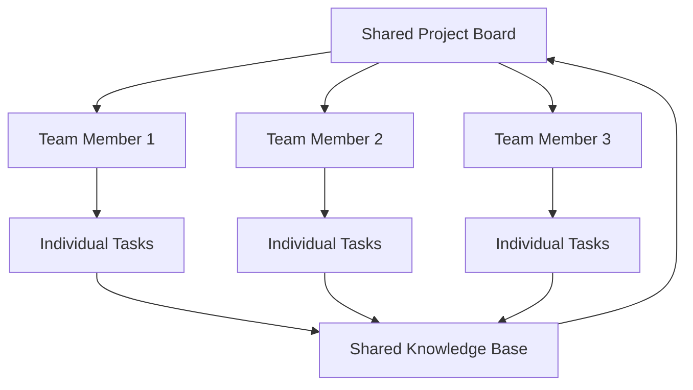
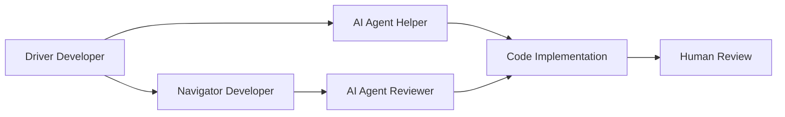

## Overview

Team collaboration with Forge means everyone has their own AI-powered workflow, but tasks, decisions, and knowledge are shared. Scale Vibe Coding++™ across your entire team without losing the human orchestration that makes it work.

---

## Team Collaboration Model



---

## Setup: Team Instance vs Individual

<Tabs>
  <Tab title="Shared Team Instance">
    **Best for:** Small co-located teams (2-5 people)

    ```bash
    # One Forge instance, shared database
    # Central server: forge.company.com

    # Team members connect to shared instance
    FORGE_URL=https://forge.company.com forge connect
    ```

    **Pros:**
    - Single source of truth
    - Real-time collaboration
    - Shared task board

    **Cons:**
    - Requires server setup
    - Network dependency
    - Potential conflicts
  </Tab>

  <Tab title="Individual + Sync">
    **Best for:** Distributed teams, async work

    ```bash
    # Each team member runs local Forge
    npx automagik-forge

    # Sync via GitHub/GitLab issues
    forge config set sync.enabled true
    forge config set sync.provider github
    forge config set sync.repo org/project
    ```

    **Pros:**
    - Work offline
    - No server needed
    - Personal workflows

    **Cons:**
    - Sync latency
    - Potential conflicts
    - More setup
  </Tab>

  <Tab title="Hybrid Model">
    **Best for:** Large teams with sub-teams

    ```bash
    # Shared project, individual worktrees
    # Team A: forge-team-a.company.com
    # Team B: forge-team-b.company.com

    # Cross-team sync
    forge sync configure \
      --teams team-a,team-b \
      --sync-frequency 1h
    ```

    **Pros:**
    - Team autonomy
    - Cross-team visibility
    - Scalable

    **Cons:**
    - Complex setup
    - Sync overhead
  </Tab>
</Tabs>

---

## Workflow 1: Sprint Planning

Use Forge for structured sprint planning with AI assistance.

### Step 1: Epic Breakdown

```bash
# Product manager creates epic
forge task create \
  --title "EPIC: User notification system" \
  --type epic \
  --description "Real-time notifications with WebSocket, email, push" \
  --assignee team \
  --labels "epic,q4-2024"

# Use AI to help break down epic
forge task create \
  --title "Break down notification epic into stories" \
  --agent claude-code \
  --description "Analyze epic, suggest user stories and technical tasks"
```

**AI Output:**

```markdown
## Suggested User Stories

1. **As a user**, I want to receive real-time notifications so I stay updated
   - Subtasks: WebSocket server, client connection, notification UI

2. **As a user**, I want to configure notification preferences
   - Subtasks: Settings UI, preferences API, email opt-out

3. **As a user**, I want notification history so I can review past alerts
   - Subtasks: History table, API endpoints, history UI

## Technical Tasks

- Design notification database schema
- Set up WebSocket server infrastructure
- Create notification service
- Build notification UI components
- Write integration tests
```

### Step 2: Team Estimation

```bash
# Create estimation task
forge task create \
  --title "Team estimation: Notification system" \
  --description "Estimate all subtasks, identify dependencies" \
  --assignee team \
  --labels "planning"

# Individual estimates via MCP
# Each team member adds estimates:
# "Update task NOTIF-01 estimate: 5 points, depends on NOTIF-00"
```

### Step 3: Assignment

```bash
# Assign based on expertise
forge task assign NOTIF-01 --to alice  # Backend expert
forge task assign NOTIF-02 --to bob    # Frontend expert
forge task assign NOTIF-03 --to carol  # Full-stack

# AI suggests assignments
forge task auto-assign \
  --based-on expertise,workload,velocity \
  --sprint sprint-24
```

---

## Workflow 2: Parallel Development

Multiple developers working on related features simultaneously.

### Example: Building Dashboard Feature

<Steps>
  <Step title="Day 1: Initial Setup (All Team)">
    ```bash
    # Tech lead creates structure
    forge task create --title "Design dashboard architecture" --agent claude-code
    forge task create --title "Set up shared types and interfaces" --agent cursor-cli

    # All team members review architecture
    forge task review DASH-00 --reviewers alice,bob,carol
    ```
  </Step>

  <Step title="Day 2-3: Parallel Development">
    ```bash
    # Alice: Backend API
    forge task create \
      --title "Build dashboard API endpoints" \
      --assignee alice \
      --agent claude-code \
      --labels "backend,api"

    # Bob: Frontend components
    forge task create \
      --title "Create dashboard UI components" \
      --assignee bob \
      --agent cursor-cli \
      --labels "frontend,ui"

    # Carol: Data layer
    forge task create \
      --title "Implement dashboard data aggregation" \
      --assignee carol \
      --agent gemini \
      --labels "backend,data"

    # All work in isolated worktrees, no conflicts
    ```
  </Step>

  <Step title="Day 4: Integration">
    ```bash
    # Integration task
    forge task create \
      --title "Integrate dashboard components" \
      --assignee team \
      --depends-on DASH-01,DASH-02,DASH-03 \
      --labels "integration"

    # Test integration
    forge task create \
      --title "End-to-end dashboard tests" \
      --assignee carol \
      --agent claude-code \
      --labels "testing"
    ```
  </Step>
</Steps>

### Handling Dependencies

```yaml
# Task dependency tree
DASH-00: Design architecture
  ├─ DASH-01: API endpoints (Alice)
  │   └─ DASH-04: API tests (Alice)
  │
  ├─ DASH-02: UI components (Bob)
  │   ├─ DASH-05: Component tests (Bob)
  │   └─ DASH-06: Storybook stories (Bob)
  │
  └─ DASH-03: Data aggregation (Carol)
      └─ DASH-07: Performance tests (Carol)

DASH-08: Integration (All, after DASH-01,02,03 complete)
DASH-09: E2E tests (After DASH-08)
```

```bash
# Forge automatically tracks dependencies
forge task status --show-blockers

# Output:
# ✅ DASH-00: Complete
# 🔄 DASH-01: In progress (Alice)
# 🔄 DASH-02: In progress (Bob)
# ⏸️  DASH-08: Blocked by DASH-01, DASH-02, DASH-03
```

---

## Workflow 3: Knowledge Sharing

Share learnings, patterns, and agent strategies across the team.

### Agent Performance Tracking

```bash
# Track which agents work best for each task type
forge analytics agent-performance --team

# Share findings
forge knowledge create \
  --title "Best agents for our stack" \
  --content "$(cat <<EOF
## Backend API (Node.js + Express)
- **Best:** Claude Code (handles async/await well)
- **Alternative:** Gemini (faster for CRUD)
- **Avoid:** Codex (outdated patterns)

## Frontend (React + TypeScript)
- **Best:** Cursor CLI (modern React patterns)
- **Alternative:** Claude Code (accessible UI)
- **Avoid:** GPT-3.5 (hallucinates hooks)

## Database (PostgreSQL)
- **Best:** Claude Code (complex queries)
- **Alternative:** Gemini (migrations)

## Testing
- **Best:** Claude Code (comprehensive)
- **Specialized:** test-writer agent
EOF
)"
```

### Sharing Successful Prompts

```bash
# Create reusable task templates
forge template create \
  --name "api-endpoint" \
  --description "Standard REST API endpoint with validation" \
  --content "$(cat <<EOF
Create a REST API endpoint:

Requirements:
- Input validation with Joi
- Error handling with proper status codes
- OpenAPI documentation
- Unit tests with >80% coverage
- Integration tests

Technical details:
- Express router
- Async/await
- TypeScript types
- Swagger annotations
EOF
)"

# Team members use template
forge task create --from-template api-endpoint \
  --title "Add user profile endpoint"
```

### Code Review Guidelines

```yaml
# .forge/team/review-guidelines.yml
security:
  - Check OWASP Top 10
  - Review authentication/authorization
  - Scan for secret exposure
  - Validate input sanitization

performance:
  - No N+1 queries
  - Efficient algorithms (< O(n²) for large data)
  - Proper caching
  - Lazy loading where appropriate

testing:
  - Minimum 80% coverage
  - Tests for edge cases
  - Integration tests for new endpoints
  - E2E tests for user flows

documentation:
  - JSDoc for public APIs
  - README updated
  - CHANGELOG entry
  - OpenAPI specs updated
```

---

## Workflow 4: Pair Programming with AI

Combine human pair programming with AI agents.

### Traditional Pairing + AI



### Example Session

```bash
# Alice (driver) and Bob (navigator) pair on auth feature

# Alice creates task
forge task create \
  --title "Implement OAuth2 login flow" \
  --assignee alice,bob \
  --agent claude-code

# Alice codes with AI agent help
# Bob reviews in real-time
# AI agent (Claude) implements based on conversation

# Bob creates parallel security review task
forge task create \
  --title "Security review: OAuth implementation" \
  --agent security-reviewer \
  --depends-on AUTH-01

# At end of session, both human review and AI review complete
```

### Mob Programming with AI

**Team of 4+ developers + multiple AI agents**

```bash
# Rotate driver every 15 minutes
# All developers contribute to prompt
# Multiple agents work on different aspects

# Agent 1: Implementation (Claude)
forge task start AUTH-01 --agent claude-code

# Agent 2: Test generation (Cursor)
forge task create --title "Tests for AUTH-01" --agent cursor-cli

# Agent 3: Documentation (Gemini)
forge task create --title "Document AUTH-01" --agent gemini

# Team reviews all outputs together
```

---

## Workflow 5: Async Collaboration

Distributed team across timezones.

### Handoff Protocol

```bash
# End of day: Alice (US West Coast)
forge task update AUTH-01 --status in-progress \
  --note "Completed login endpoint, starting logout. DB schema in schema.sql"

# AI summary for next shift
forge task summarize AUTH-01 --for-handoff

# Output:
# "Alice implemented OAuth login endpoint with JWT tokens.
#  Completed: Login endpoint, JWT generation, token validation
#  Remaining: Logout endpoint, token refresh, cleanup
#  Blockers: None
#  Next steps: Implement logout, add refresh token logic
#  Files changed: auth.controller.ts, auth.service.ts, schema.sql"

# Morning: Bob (Europe)
forge task resume AUTH-01 --read-handoff
# Bob sees context and continues work
```

### Async Code Review

```bash
# Alice pushes PR before EOD
gh pr create --title "OAuth login implementation"

# Automated review starts
forge review create --pr 200 \
  --agents claude-code,gemini \
  --post-results

# Morning: Bob sees review results
# Bob addresses issues
# Alice reviews when back online

# Async but efficient - no waiting
```

---

## Team Dashboard & Metrics

Monitor team velocity and agent effectiveness.

```bash
# Team dashboard
forge dashboard team --sprint current

# Shows:
# - Tasks completed
# - Agent usage by team member
# - Blockers and dependencies
# - Velocity trends
# - Code review metrics
```

### Example Team Metrics

| Developer | Tasks | AI Agents Used | Avg Time | Quality Score |
|-----------|-------|----------------|----------|---------------|
| Alice | 12 | Claude (70%), Gemini (30%) | 2.5h | 4.8/5 |
| Bob | 15 | Cursor (80%), Claude (20%) | 1.8h | 4.6/5 |
| Carol | 10 | Claude (50%), Gemini (40%), Cursor (10%) | 3.2h | 4.9/5 |

**Insights:**
- Bob is fastest (uses Cursor for frontend work)
- Carol has highest quality (uses multiple agents for comparison)
- Alice focuses on complex backend (Claude Code)

---

## Communication Patterns

### Daily Standup

```bash
# Generate standup update
forge standup generate --developer alice --since yesterday

# Output:
# Alice - Yesterday:
# ✅ Completed AUTH-01: OAuth login endpoint (2 attempts, Claude Code)
# ✅ Reviewed PR #199 from Bob
# 🔄 In Progress AUTH-02: Logout endpoint
#
# Today:
# - Complete AUTH-02
# - Start AUTH-03: Token refresh
# - Review Carol's PR #200
#
# Blockers: None
```

### Sprint Retrospective

```bash
# Generate retro insights
forge retrospective --sprint 24

# AI-generated insights:
#
# ✅ What went well:
# - 95% of tasks completed on time
# - No production bugs from sprint
# - Effective use of Claude for complex backend tasks
#
# ⚠️ What could improve:
# - 3 tasks blocked by unclear requirements
# - 2 merge conflicts (better coordination needed)
# - Some agents underutilized (GPT-4 Codex only 5%)
#
# 💡 Action items:
# - Define clearer acceptance criteria upfront
# - Daily sync on overlapping work
# - Experiment with GPT-4 Codex for specific tasks
```

---

## Handling Conflicts

### Code Conflicts

```bash
# Forge's worktree isolation minimizes conflicts
# But when merging to main:

# Detect potential conflicts before merge
forge task check-conflicts AUTH-01

# If conflicts detected
forge task resolve-conflicts AUTH-01 \
  --strategy ours|theirs|manual \
  --agent claude-code  # AI helps resolve

# AI suggests resolution
forge task suggest-resolution AUTH-01
```

### Task Conflicts (Multiple people on same task)

```bash
# Lock task when starting work
forge task lock AUTH-01 --developer alice

# If Bob tries to work on it:
# ⚠️  Task AUTH-01 is locked by alice (started 2h ago)
# Suggest: Coordinate with alice or pick different task

# Unlock when done
forge task unlock AUTH-01
```

---

## Best Practices

<AccordionGroup>
  <Accordion title="Establish Team Conventions">
    ```yaml
    # .forge/team/conventions.yml
    naming:
      tasks: "JIRA-123: Brief description"
      branches: "feature/JIRA-123-description"
      commits: "feat(module): description [JIRA-123]"

    agents:
      backend: claude-code (default)
      frontend: cursor-cli (default)
      security: security-reviewer (required for auth)
      performance: gemini (for optimization)

    review:
      required: 2 humans + 1 AI
      blocking_severity: critical, high
      auto_merge: false
    ```
  </Accordion>

  <Accordion title="Regular Sync Points">
    ```bash
    # Daily: Quick sync
    forge sync --type daily --duration 15min

    # Weekly: In-depth coordination
    forge sync --type weekly --review-blockers

    # Sprint: Planning and retro
    forge sync --type sprint --generate-reports
    ```
  </Accordion>

  <Accordion title="Share Knowledge Actively">
    ```bash
    # Document learnings
    forge knowledge add \
      --title "How to fix N+1 queries in our ORM" \
      --tags "performance,database,howto"

    # Share successful agent prompts
    forge template share "api-with-validation" \
      --visibility team
    ```
  </Accordion>

  <Accordion title="Celebrate Wins">
    ```bash
    # Track and celebrate
    forge achievements --team --sprint 24

    # 🏆 Sprint 24 Achievements:
    # - Alice: First time using multi-agent review (10 issues caught!)
    # - Bob: Fastest task completion (1.2h average)
    # - Carol: Highest quality score (4.9/5)
    # - Team: Zero production bugs 🎉
    ```
  </Accordion>
</AccordionGroup>

---

## Scaling to Larger Teams

### Department Level (20-50 developers)

```bash
# Multiple Forge instances per team
# Cross-team board for dependencies
forge config set org.structure "$(cat <<EOF
teams:
  - name: Backend
    forge_instance: forge-backend.company.com
    members: [alice, bob, carol, david, eve]

  - name: Frontend
    forge_instance: forge-frontend.company.com
    members: [frank, grace, henry, iris]

  - name: Platform
    forge_instance: forge-platform.company.com
    members: [jack, kate, leo]

cross_team_board: forge-org.company.com
EOF
)"
```

### Enterprise Level (100+ developers)

- **Central Forge Registry**: Track all team instances
- **Shared Knowledge Base**: Company-wide templates, agents, patterns
- **Analytics Dashboard**: Cross-team metrics and insights
- **Governance**: Security policies, compliance checks, audit logs

---

## Next Steps

<CardGroup cols={2}>
  <Card title="CI/CD Integration" icon="gear" href="/forge/advanced/ci-cd">
    Automate team workflows in CI/CD
  </Card>
  <Card title="Custom Agents" icon="robot" href="/forge/advanced/specialized-agents">
    Create team-specific agents
  </Card>
  <Card title="Analytics" icon="chart-line" href="/forge/advanced/analytics">
    Team performance and insights
  </Card>
  <Card title="Security & Governance" icon="shield" href="/forge/advanced/security">
    Enterprise security features
  </Card>
</CardGroup>

---

**Remember**: Vibe Coding++™ scales when teams maintain human orchestration. AI agents amplify each individual's productivity, but humans coordinate, decide, and own the architecture and outcomes.
