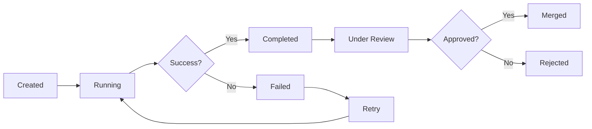

## Overview

Each Forge task can have **multiple attempts** - different executions with different AI agents, prompts, or approaches. This is Forge's superpower: experiment until you find what works!

---

## What Are Attempts?

An **attempt** is a single execution of a task by an AI coding agent in an isolated Git worktree.

```
Task: "Add user authentication"
├── Attempt 1: Claude Sonnet → Too complex
├── Attempt 2: Gemini Flash → Missing edge cases
├── Attempt 3: Claude Haiku → Perfect! ✅
└── Result: You choose Attempt 3 to merge
```

<Info>
Each attempt runs in complete isolation - no conflicts, no mess!
</Info>

---

## Creating Attempts

### First Attempt (via UI)

<Steps>
  <Step title="Create Task">
    Create a task in Forge with title and description
  </Step>

  <Step title="Click 'Start Task'">
    Click the task card → **Start Task** button
  </Step>

  <Step title="Choose Agent">
    Select your AI coding agent (Claude, Gemini, etc.)
  </Step>

  <Step title="Monitor Progress">
    Watch real-time logs as the agent works
  </Step>
</Steps>

### Additional Attempts (via CLI)

```bash
# Try the same task with a different agent
forge task fork 1 --llm gemini

# Try with a specialized agent profile
forge task fork 1 --llm claude --agent "test-writer"

# Try with different context
forge task fork 1 --llm cursor --description "Focus on performance"
```

### Via MCP

```
You: "Try that authentication task again but with Gemini this time"

Claude Code: I'll create a new attempt with Gemini...

[Uses MCP to fork task]

Attempt #2 started with Gemini
```

---

## Attempt Lifecycle



### Status Explained

| Status | Meaning | Actions Available |
|--------|---------|-------------------|
| **Created** | Attempt queued, not started | Start, Delete |
| **Running** | Agent is working | Monitor, Cancel |
| **Completed** | Finished successfully | Review, Merge, Fork |
| **Failed** | Execution failed | Retry, View Logs |
| **Under Review** | Awaiting your approval | Approve, Reject, Compare |
| **Merged** | Changes merged to main | View, Rollback |
| **Rejected** | You decided not to use it | Delete, Retry |

---

## Running Attempts

### Sequential Execution

```bash
# Run one at a time
forge task start 1 --llm claude
# Wait for completion...

forge task start 1 --llm gemini
# Wait for completion...
```

### Parallel Execution

```bash
# Run multiple attempts simultaneously!
forge task start 1 --llm claude &
forge task start 1 --llm gemini &
forge task start 1 --llm cursor &

# All three run in isolated worktrees
wait
```

<Tip>
**Parallel execution** is perfect for comparing approaches quickly!
</Tip>

---

## Monitoring Attempts

### View Attempt Status

```bash
# List all attempts for a task
forge task attempts 1

# Output:
# Attempt #1 (claude)     [Completed]  5 minutes ago
# Attempt #2 (gemini)     [Running]    Started 30s ago
# Attempt #3 (cursor)     [Failed]     2 minutes ago
```

### Real-Time Logs

```bash
# Follow logs as agent works
forge task logs 1 --follow

# View specific attempt
forge task logs 1 --attempt 2 --follow
```

### Web UI Monitoring

The Forge UI shows live progress:
- Current file being edited
- Lines added/removed
- Test results (if running)
- Agent's thinking process

---

## Comparing Attempts

See [Comparing Results](/forge/working/comparing-results) for detailed guide.

Quick comparison:

```bash
# Compare two attempts
forge diff 1-claude 1-gemini

# Compare all attempts
forge task compare 1

# See just the stats
forge task compare 1 --stats-only
```

---

## Specialized Agent Profiles

Use the same task with different "personas":

### Test Writer

```bash
forge task fork 1 \
  --llm claude \
  --agent "test-writer" \
  --description "Focus on comprehensive test coverage"
```

### Security Expert

```bash
forge task fork 1 \
  --llm gemini \
  --agent "security-expert" \
  --description "Add input validation and sanitization"
```

### Performance Optimizer

```bash
forge task fork 1 \
  --llm cursor \
  --agent "performance-optimizer" \
  --description "Optimize for speed, add caching"
```

### Documentation Writer

```bash
forge task fork 1 \
  --llm claude \
  --agent "docs-writer" \
  --description "Add comprehensive documentation and examples"
```

<Info>
Specialized agents are just different system prompts applied to the base LLM!
</Info>

---

## Attempt Metadata

Each attempt stores:

```json
{
  "id": "attempt-abc123",
  "taskId": "task-1",
  "llm": "claude",
  "agent": "default",
  "status": "completed",
  "worktreePath": ".forge/worktrees/task-1-claude",
  "startedAt": "2024-01-15T10:30:00Z",
  "completedAt": "2024-01-15T10:35:22Z",
  "duration": 322000,
  "filesChanged": 8,
  "linesAdded": 245,
  "linesRemoved": 12,
  "cost": {
    "inputTokens": 15420,
    "outputTokens": 3890,
    "totalCost": 0.23
  }
}
```

View metadata:

```bash
forge task attempt-info 1 --attempt 2
```

---

## Handling Failed Attempts

### View Failure Reason

```bash
# Check logs
forge task logs 1 --attempt 3

# Get error summary
forge task attempt-info 1 --attempt 3 --errors-only
```

### Common Failure Reasons

<AccordionGroup>
  <Accordion title="Syntax Errors">
    **Issue**: Agent generated invalid code

    **Solutions**:
    - Retry with more specific instructions
    - Try different agent
    - Add example code in task description
  </Accordion>

  <Accordion title="Test Failures">
    **Issue**: Tests didn't pass

    **Solutions**:
    - Check test output in logs
    - Add "make tests pass" to description
    - Use `--agent "test-aware"` profile
  </Accordion>

  <Accordion title="Timeout">
    **Issue**: Agent took too long

    **Solutions**:
    - Increase timeout: `--timeout 600`
    - Break task into smaller pieces
    - Use faster agent (Haiku, Flash)
  </Accordion>

  <Accordion title="API Errors">
    **Issue**: LLM API failed

    **Solutions**:
    - Check API key is valid
    - Verify rate limits
    - Check network connectivity
    - Retry after a few minutes
  </Accordion>
</AccordionGroup>

### Retry Failed Attempt

```bash
# Retry with same configuration
forge task retry 1 --attempt 3

# Retry with modifications
forge task retry 1 --attempt 3 \
  --llm gemini \
  --description "Try simpler approach"
```

---

## Cost Tracking

### View Attempt Costs

```bash
# Cost for specific attempt
forge task cost 1 --attempt 2

# Output:
# Input tokens:  15,420 ($0.046)
# Output tokens:  3,890 ($0.058)
# Total cost:            $0.104

# Total cost for all attempts
forge task cost 1 --all

# Output:
# Attempt 1 (claude):  $0.234
# Attempt 2 (gemini):  $0.104
# Attempt 3 (cursor):  $0.187
# Total:               $0.525
```

### Cost Optimization Strategies

<CardGroup cols={2}>
  <Card title="Start Cheap" icon="coins">
    Use fast, cheap models first:
    - Gemini Flash (free tier!)
    - Claude Haiku
    - GPT-3.5 Turbo

    Save expensive models for complex tasks
  </Card>

  <Card title="Cancel Bad Attempts" icon="stop">
    If agent is going wrong direction, cancel early:

    ```bash
    forge task cancel 1 --attempt 2
    ```

    Saves tokens and money
  </Card>

  <Card title="Reuse Good Results" icon="recycle">
    Once you find an approach that works, save it as a template:

    ```bash
    forge template save 1 --attempt 2 \
      --name "user-auth-pattern"
    ```
  </Card>

  <Card title="Track Spending" icon="chart-line">
    Monitor total costs:

    ```bash
    forge cost summary --month january
    ```

    Set budgets per project
  </Card>
</CardGroup>

---

## Attempt Best Practices

<Steps>
  <Step title="Start with One Agent">
    Don't create 5 attempts immediately. Start with your preferred agent (Claude or Gemini)
  </Step>

  <Step title="Review Before More Attempts">
    If first attempt is close but not perfect, fork it with specific feedback rather than starting fresh
  </Step>

  <Step title="Use Different Agents for Different Strengths">
    - Claude: Complex logic, architecture
    - Gemini: Fast iterations, simple tasks
    - Cursor: UI/UX focused work
    - Local models: Privacy-sensitive work
  </Step>

  <Step title="Clean Up Rejected Attempts">
    ```bash
    forge task cleanup 1 --remove-rejected
    ```

    Keeps your workspace tidy
  </Step>
</Steps>

---

## Advanced: Attempt Hooks

Run custom scripts on attempt events:

```yaml .forge/hooks.yaml
on_attempt_complete:
  - run: "npm test"
  - run: "npm run lint"
  - notify: "slack"

on_attempt_fail:
  - run: "cat logs/error.log"
  - notify: "email"
```

---

## Troubleshooting

<AccordionGroup>
  <Accordion title="Can't start new attempt">
    **Error**: "Maximum attempts reached for task"

    **Solution**:
    - Default limit is 10 attempts per task
    - Clean up old attempts: `forge task cleanup 1`
    - Or increase limit: `forge config set max-attempts 20`
  </Accordion>

  <Accordion title="Worktree conflicts">
    **Error**: "Worktree path already exists"

    **Solution**:
    ```bash
    # Clean orphaned worktrees
    forge worktree cleanup

    # Or remove specific worktree
    git worktree remove .forge/worktrees/task-1-old
    ```
  </Accordion>

  <Accordion title="Attempt stuck in 'Running'">
    **Issue**: Attempt shows running but nothing happening

    **Solution**:
    ```bash
    # Cancel the attempt
    forge task cancel 1 --attempt 2

    # Check for zombie processes
    ps aux | grep forge

    # Restart Forge
    forge restart
    ```
  </Accordion>
</AccordionGroup>

---

## Next Steps

<CardGroup cols={2}>
  <Card title="Comparing Results" icon="code-compare" href="/forge/working/comparing-results">
    Learn to compare attempt outputs
  </Card>

  <Card title="Merging & Cleanup" icon="code-merge" href="/forge/working/merging-cleanup">
    Merge approved attempts to main branch
  </Card>

  <Card title="Specialized Agents" icon="user-gear" href="/forge/advanced/specialized-agents">
    Create custom agent profiles
  </Card>

  <Card title="Git Worktrees" icon="code-branch" href="/forge/concepts/git-worktrees">
    Deep dive into isolation strategy
  </Card>
</CardGroup>
