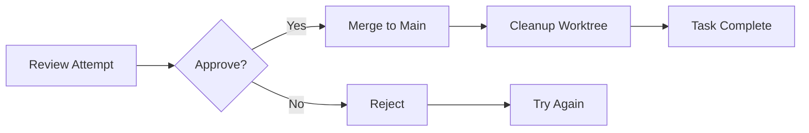

## Overview

After comparing attempts and choosing the best approach, it's time to **merge** those changes into your main branch and **clean up** temporary worktrees.

---

## The Merge Process



---

## Merging Attempts

### Via Web UI

<Steps>
  <Step title="Review Changes">
    Open task details → Click on completed attempt
  </Step>

  <Step title="Review Diff">
    Check all file changes carefully:
    - Files modified
    - Lines added/removed
    - Tests passing
  </Step>

  <Step title="Approve">
    Click **"Approve & Merge"** button
  </Step>

  <Step title="Confirm">
    Confirm merge in dialog:
    ```
    Merge attempt #2 (gemini) into main?

    Files changed: 8
    Additions: +269
    Deletions: -16

    [Cancel] [Merge]
    ```
  </Step>

  <Step title="Success">
    Task moves to "Done" column
    Worktree auto-cleaned
  </Step>
</Steps>

### Via CLI

```bash
# Basic merge
forge task merge 1 --attempt 2

# Merge with message
forge task merge 1 --attempt 2 \
  --message "Add JWT authentication (Gemini implementation)"

# Merge and close task
forge task merge 1 --attempt 2 --close

# Merge without cleanup (keep worktree)
forge task merge 1 --attempt 2 --no-cleanup
```

---

## Merge Strategies

### Fast-Forward Merge (Default)

Clean, linear history:

```bash
forge task merge 1 --attempt 2 --ff

# Git history:
# * abc123 Add authentication (gemini)
# * def456 Previous commit
# * ...
```

**When to use**: Single-developer, clean history preferred

### Merge Commit

Preserves attempt branch history:

```bash
forge task merge 1 --attempt 2 --no-ff

# Git history:
# *   abc123 Merge task-1-gemini
# |\
# | * def456 Implement JWT tokens
# | * ghi789 Add login endpoint
# |/
# * jkl012 Previous commit
```

**When to use**: Multiple developers, want to preserve attempt context

### Squash Merge

Combine all commits into one:

```bash
forge task merge 1 --attempt 2 --squash

# Git history:
# * abc123 Add user authentication
#   - Implemented JWT tokens
#   - Added login/signup endpoints
#   - Added tests
# * def456 Previous commit
```

**When to use**: Clean up messy attempt history, single commit per feature

---

## Pre-Merge Checks

Forge runs automatic checks before merging:

### Test Suite

```bash
forge task merge 1 --attempt 2

# Automatic checks:
Running pre-merge checks...
✓ All tests pass (24/24)
✓ Linting passed
✓ Type checking passed
✓ No merge conflicts
✓ Branch up to date with main

Ready to merge!
```

### Custom Pre-Merge Hooks

Configure in `.forge/hooks.yaml`:

```yaml
pre_merge:
  - run: "npm test"
    required: true
  - run: "npm run lint"
    required: true
  - run: "npm run build"
    required: true
  - run: "npm audit"
    required: false  # Warn but don't block
```

If any required check fails, merge is blocked:

```
❌ Pre-merge checks failed

  ✓ Tests passed
  ✓ Linting passed
  ❌ Build failed: TypeScript errors in src/auth/login.ts

Merge blocked. Fix errors and try again.

[View Errors] [Override] [Cancel]
```

---

## Handling Merge Conflicts

### Detecting Conflicts

```bash
forge task merge 1 --attempt 2

# Output:
❌ Merge conflicts detected

Conflicts in:
  - src/auth/login.ts (3 conflicts)
  - package.json (1 conflict)

[Resolve Manually] [Use Ours] [Use Theirs] [Abort]
```

### Resolving Conflicts

<Tabs>
  <Tab title="Manual Resolution">
    ```bash
    # Open conflicted files
    forge task conflicts 1 --attempt 2

    # Edit conflicts in your editor:
    <<<<<<< HEAD (main)
    const PORT = 3000;
    =======
    const PORT = 8080;
    >>>>>>> task-1-gemini

    # Choose one or combine:
    const PORT = process.env.PORT || 3000;

    # Mark as resolved
    git add src/auth/login.ts

    # Continue merge
    forge task merge 1 --attempt 2 --continue
    ```
  </Tab>

  <Tab title="Interactive Resolution">
    ```bash
    # Launch merge tool
    forge task resolve 1 --attempt 2 --tool

    # Opens visual diff tool:
    # - Left: Current (main)
    # - Middle: Result
    # - Right: Incoming (attempt)

    # Click to choose sections
    # Save when done
    ```
  </Tab>

  <Tab title="Automated Strategies">
    ```bash
    # Keep main version
    forge task merge 1 --attempt 2 --strategy ours

    # Keep attempt version
    forge task merge 1 --attempt 2 --strategy theirs

    # Smart merge (prefer new code)
    forge task merge 1 --attempt 2 --strategy theirs-if-newer
    ```
  </Tab>
</Tabs>

---

## Post-Merge Actions

### Automatic Actions

After successful merge, Forge can:

```yaml .forge/hooks.yaml
post_merge:
  - run: "npm run build"
  - run: "git push origin main"
  - notify:
      slack: "#engineering"
      message: "Task #{{task.id}} merged by {{user.name}}"
  - create_pr:  # If feature branch
      title: "{{task.title}}"
      body: "Closes #{{task.id}}"
```

### Manual Post-Merge Steps

Common things you might do:

```bash
# Push to remote
git push origin main

# Tag release
git tag -a v1.2.0 -m "Add authentication"
git push origin v1.2.0

# Deploy
npm run deploy

# Notify team
forge task comment 1 \
  --message "@team Authentication is live in production!"
```

---

## Cleanup

### Automatic Cleanup (Default)

Forge automatically cleans up after merge:

```bash
forge task merge 1 --attempt 2

# Automatic cleanup:
✓ Merged to main
✓ Removed git worktree
✓ Cleaned up temporary files
✓ Archived attempt logs
✓ Updated task status

Done! 🎉
```

### Manual Cleanup

Sometimes you want to keep the worktree:

```bash
# Merge without cleanup
forge task merge 1 --attempt 2 --no-cleanup

# Later, clean up manually
forge worktree remove task-1-gemini

# Or clean all merged worktrees
forge worktree cleanup --merged
```

### Cleanup Rejected Attempts

```bash
# Remove specific attempt
forge task remove-attempt 1 --attempt 1

# Remove all rejected attempts
forge task cleanup 1 --rejected-only

# Remove all attempts except winner
forge task cleanup 1 --keep-merged
```

---

## Worktree Management

### List Worktrees

```bash
# List all worktrees
forge worktree list

# Output:
/Users/you/project           abc123 [main]
.forge/worktrees/task-1      def456 [task-1-claude]
.forge/worktrees/task-2      ghi789 [task-2-gemini]

# Git's native command
git worktree list
```

### Remove Worktrees

```bash
# Remove specific worktree
forge worktree remove task-1-claude

# Or use git directly
git worktree remove .forge/worktrees/task-1-claude

# Force remove (if needed)
git worktree remove --force .forge/worktrees/task-1-claude
```

### Clean Orphaned Worktrees

Sometimes worktrees get orphaned (branch deleted but directory remains):

```bash
# Detect and remove orphaned worktrees
forge worktree cleanup

# Output:
Found 3 orphaned worktrees:
  - .forge/worktrees/task-old-1
  - .forge/worktrees/task-old-2
  - .forge/worktrees/temp-experiment

Remove all? [y/N] y

✓ Cleaned 3 orphaned worktrees
Freed 156 MB of disk space
```

<Info>
Forge runs this automatically, but you can trigger it manually if needed
</Info>

---

## Rolling Back Merges

Made a mistake? Undo the merge:

### Immediate Rollback

```bash
# If you just merged
git reset --hard HEAD~1

# Via Forge
forge task rollback 1
```

### Revert Merge

After pushing to remote:

```bash
# Create revert commit
git revert -m 1 abc123

# Via Forge
forge task revert 1 --create-issue
```

This creates a new commit that undoes the merge, preserving history.

---

## Merge Best Practices

<CardGroup cols={2}>
  <Card title="Always Review First" icon="eye">
    Never merge without reviewing:
    ```bash
    # Good workflow
    forge task review 1 --attempt 2
    forge task test 1 --attempt 2
    forge task merge 1 --attempt 2

    # Bad workflow
    forge task merge 1 --attempt 2 --force
    ```
  </Card>

  <Card title="Keep Main Stable" icon="shield">
    Main branch should always work:
    - All tests must pass
    - No known bugs
    - Builds successfully
    - Deployed confidently
  </Card>

  <Card title="Meaningful Commit Messages" icon="message">
    ```bash
    # Good
    forge task merge 1 --message \
      "Add JWT authentication with refresh tokens

      - Implemented login/signup endpoints
      - Added bcrypt password hashing
      - Configured JWT with 24h expiry
      - Added comprehensive tests (95% coverage)"

    # Bad
    forge task merge 1 --message "auth stuff"
    ```
  </Card>

  <Card title="Clean Up Regularly" icon="broom">
    Don't let worktrees accumulate:
    ```bash
    # Weekly cleanup
    forge worktree cleanup

    # Check disk usage
    du -sh .forge/worktrees
    ```

    Old worktrees waste disk space
  </Card>
</CardGroup>

---

## Advanced: Partial Merges

Sometimes you want only specific files from an attempt:

```bash
# Merge only specific files
forge task cherry-pick 1 --attempt 2 \
  --files "src/auth/*.ts"

# Or manually
git checkout task-1-gemini -- src/auth/login.ts
git commit -m "Cherry-pick login from attempt #2"
```

---

## Integration with CI/CD

### Trigger Builds on Merge

```yaml .github/workflows/forge-merge.yml
name: Forge Merge

on:
  push:
    branches: [ main ]
    # Only when Forge merges
    paths:
      - '!.forge/**'

jobs:
  deploy:
    runs-on: ubuntu-latest
    steps:
      - uses: actions/checkout@v3
      - name: Deploy
        run: npm run deploy
```

### Merge Gates

Require CI checks before merge:

```yaml .forge/config.json
{
  "mergeGates": {
    "requireCI": true,
    "requireReview": true,
    "requireTests": true,
    "minCoverage": 80
  }
}
```

---

## Troubleshooting

<AccordionGroup>
  <Accordion title="Merge fails with 'detached HEAD'">
    **Error**: "Cannot merge: worktree is in detached HEAD state"

    **Solution**:
    ```bash
    # Checkout proper branch in worktree
    cd .forge/worktrees/task-1-attempt
    git checkout task-1-claude

    # Retry merge
    forge task merge 1 --attempt 1
    ```
  </Accordion>

  <Accordion title="'Worktree still in use' error">
    **Error**: "Cannot remove worktree: directory is locked"

    **Solution**:
    ```bash
    # Check for running processes
    lsof | grep ".forge/worktrees/task-1"

    # Kill processes if needed
    pkill -f task-1

    # Force remove
    git worktree remove --force .forge/worktrees/task-1
    ```
  </Accordion>

  <Accordion title="Merge creates huge commit">
    **Issue**: Merge commit contains unintended files

    **Solution**:
    - Check `.gitignore` is proper
    - Ensure `node_modules/` not committed
    - Review files before merge:
      ```bash
      forge task files 1 --attempt 2
      ```
    - Abort and fix:
      ```bash
      git merge --abort
      # Fix .gitignore
      git add .gitignore
      git commit -m "Update .gitignore"
      # Retry merge
      ```
  </Accordion>

  <Accordion title="Can't push after merge">
    **Error**: "Updates were rejected because the remote contains work that you do not have locally"

    **Solution**:
    ```bash
    # Pull and rebase
    git pull --rebase origin main

    # Resolve conflicts if any
    git add .
    git rebase --continue

    # Push
    git push origin main
    ```
  </Accordion>
</AccordionGroup>

---

## Cleanup Schedule

Recommended cleanup schedule:

| Frequency | Action | Command |
|-----------|--------|---------|
| **Daily** | Remove merged worktrees | `forge worktree cleanup --merged` |
| **Weekly** | Remove old attempt logs | `find .forge/logs -mtime +7 -delete` |
| **Monthly** | Archive old tasks | `forge task archive --older-than 30d` |
| **Quarterly** | Compact database | `sqlite3 .forge/forge.db "VACUUM;"` |

---

## Next Steps

<CardGroup cols={2}>
  <Card title="Git Worktrees" icon="code-branch" href="/forge/concepts/git-worktrees">
    Understand isolation strategy
  </Card>

  <Card title="Workflows" icon="diagram-project" href="/forge/workflows/feature-development">
    Complete development workflows
  </Card>

  <Card title="CI/CD Integration" icon="rocket" href="/forge/advanced/webhooks-events">
    Automate deployments
  </Card>

  <Card title="Troubleshooting" icon="wrench" href="/forge/troubleshooting/git-worktree-errors">
    Fix common issues
  </Card>
</CardGroup>
