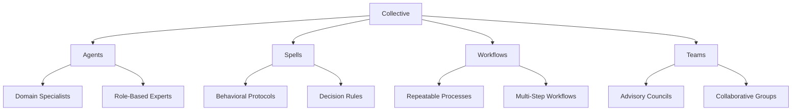

## What are Collectives?

**Collectives** are domain-specific containers that organize everything needed for specialized work: agents, spells (behavioral protocols), workflows (repeatable processes), and advisory teams.

Think of a Collective as a **department in your AI organization** - each with its own experts, playbooks, and processes.

<CardGroup cols={2}>
  <Card title="Code Collective" icon="code">
    Software development, technical execution, and engineering excellence
  </Card>
  <Card title="Create Collective" icon="wand-magic-sparkles">
    Content creation, documentation, marketing, and human-world communication
  </Card>
  <Card title="Custom Collectives" icon="plus">
    Build your own: Finance, Health, Legal, Sales, or any domain you need
  </Card>
  <Card title="Collaborative Intelligence" icon="handshake">
    Collectives work together seamlessly across domain boundaries
  </Card>
</CardGroup>

---

## Collective Structure

Each Collective contains four key components:



### 1. Agents (Domain Specialists)

Specialized AI agents with deep expertise in the collective's domain:

<Tabs>
  <Tab title="Code Agents">
    - **implementor** - Feature implementation
    - **tests** - Test creation and validation
    - **git** - Git operations, PRs, releases
    - **debug** - Bug investigation
    - **audit** - Security analysis
    - 29+ more specialists
  </Tab>

  <Tab title="Create Agents">
    - **researcher** - Information gathering
    - **writer** - Content creation
    - **editor** - Refinement and polish
    - **release-notes** - Beautiful release docs
    - **announcements** - Multi-platform messaging
    - 4+ more specialists
  </Tab>

  <Tab title="Custom Agents">
    Create your own:
    - **analyst** - Financial analysis
    - **compliance** - Legal review
    - **designer** - UI/UX design
    - Whatever your domain needs
  </Tab>
</Tabs>

### 2. Spells (Behavioral Protocols)

Reusable behavioral instructions that shape how agents work:

```markdown
# Example Spell: commit-advisory.md

## Purpose
Guide commit message creation following Conventional Commits

## Protocol
1. Analyze staged changes
2. Categorize change type (feat, fix, refactor, etc.)
3. Write concise, meaningful message
4. Include breaking change warnings if needed

## Output Format
type(scope): description

[optional body]

[optional footer]
```

### 3. Workflows (Repeatable Processes)

Multi-step processes that coordinate agents:

<Steps>
  <Step title="Wish Workflow">
    Define what you want to build with structured specifications
  </Step>

  <Step title="Forge Workflow">
    Execute implementation with coordinated agents
  </Step>

  <Step title="Review Workflow">
    Validate quality and ensure standards are met
  </Step>
</Steps>

### 4. Teams (Advisory Councils)

Groups of agents that collaborate on complex decisions:

- **Tech Council** (Code) - Architecture and technical decisions
- **Creative Council** (Create) - Content strategy and messaging
- **Custom Teams** - Domain-specific advisory groups

---

## Built-In Collectives

### Code Collective

<Card title="Software Development Excellence" icon="code">
**Purpose**: Technical execution, engineering best practices, and software delivery

**Capabilities**:
- 34 specialized development agents
- Git workflow automation
- Test-driven development
- Security auditing
- Publishing protocols

**When to Use**: Building features, fixing bugs, refactoring code, technical tasks

[View Code Collective Documentation →](/genie/collectives/code-collective)
</Card>

### Create Collective

<Card title="Content and Communication" icon="wand-magic-sparkles">
**Purpose**: Content creation, documentation, marketing, and human-world work

**Capabilities**:
- Shape-shifting content creation
- Beautiful documentation
- Multi-platform announcements
- Meta-creation (generate agents, spells, workflows)

**When to Use**: Writing docs, creating content, marketing materials, release notes

[View Create Collective Documentation →](/genie/collectives/create-collective)
</Card>

---

## How Collectives Work Together

Collectives are designed to **collaborate across domain boundaries**:

```mermaid
sequenceDiagram
    participant User
    participant Code
    participant Create
    participant Custom

    User->>Code: "Build authentication feature"
    Code->>Code: implementor builds code
    Code->>Code: tests validates
    Code->>Create: "Need docs for auth API"
    Create->>Create: writer creates documentation
    Create->>Create: editor refines content
    Create->>Code: Returns documentation
    Code->>Custom: "Need compliance check"
    Custom->>Custom: compliance reviews security
    Custom->>Code: Approval with recommendations
    Code->>User: Complete feature with docs & compliance
```

### Cross-Collective Workflow Example

**Scenario**: Launch a new feature

<Steps>
  <Step title="Code Collective Builds">
    - **implementor** writes the feature code
    - **tests** creates comprehensive tests
    - **audit** runs security analysis
  </Step>

  <Step title="Create Collective Documents">
    - **writer** creates user documentation
    - **editor** refines and polishes
    - **release-notes** generates beautiful release notes
  </Step>

  <Step title="Create Collective Announces">
    - **announcements** creates multi-platform messages
    - Blog post, Twitter thread, Discord announcement
    - Email newsletter content
  </Step>

  <Step title="Code Collective Ships">
    - **git** agent creates release
    - **publish** agent deploys to production
    - Feature is live!
  </Step>
</Steps>

---

## When to Use Which Collective

<AccordionGroup>
  <Accordion title="Use Code Collective When">
    - Building new features
    - Fixing bugs
    - Refactoring code
    - Writing tests
    - Reviewing pull requests
    - Managing git operations
    - Security auditing
    - Performance optimization
    - Technical architecture decisions
  </Accordion>

  <Accordion title="Use Create Collective When">
    - Writing documentation
    - Creating release notes
    - Producing marketing content
    - Generating announcements
    - Researching information
    - Creating tutorials
    - Writing blog posts
    - Developing content strategy
    - Syncing version numbers
  </Accordion>

  <Accordion title="Use Custom Collectives When">
    - Domain-specific work outside Code/Create
    - Industry-specific requirements
    - Specialized workflows
    - Unique organizational needs
    - Custom business processes
  </Accordion>
</AccordionGroup>

---

## Creating Custom Collectives

You can create your own Collectives for any domain:

```bash
# Create a new collective
genie collective create finance

# Add agents to the collective
genie agent create analyst --collective finance
genie agent create auditor --collective finance

# Add spells (behavioral protocols)
genie spell create risk-assessment --collective finance

# Add workflows
genie workflow create quarterly-report --collective finance
```

Example Custom Collectives:

<CardGroup cols={2}>
  <Card title="Finance Collective" icon="chart-line">
    - analyst - Financial analysis
    - auditor - Compliance checking
    - forecaster - Predictions
    - reporter - Report generation
  </Card>

  <Card title="Health Collective" icon="heart-pulse">
    - diagnostician - Health analysis
    - researcher - Medical research
    - educator - Patient education
    - tracker - Health monitoring
  </Card>

  <Card title="Legal Collective" icon="scale-balanced">
    - reviewer - Contract review
    - researcher - Legal research
    - drafter - Document drafting
    - compliance - Compliance checking
  </Card>

  <Card title="Sales Collective" icon="handshake">
    - prospector - Lead generation
    - qualifier - Lead qualification
    - closer - Deal closing
    - analyst - Sales analytics
  </Card>
</CardGroup>

[Learn How to Create Custom Collectives →](/genie/collectives/custom-collectives)

---

## Collective Directory Structure

Here's how Collectives are organized in your `.genie/` directory:

```
.genie/
├── collectives/
│   ├── code/
│   │   ├── agents/
│   │   │   ├── implementor.md
│   │   │   ├── tests.md
│   │   │   ├── git.md
│   │   │   └── ... (34 total)
│   │   ├── spells/
│   │   │   ├── commit-advisory.md
│   │   │   ├── pr-standards.md
│   │   │   └── ... (13 total)
│   │   ├── workflows/
│   │   │   ├── wish.md
│   │   │   ├── forge.md
│   │   │   └── review.md
│   │   └── teams/
│   │       └── tech-council.md
│   │
│   ├── create/
│   │   ├── agents/
│   │   │   ├── researcher.md
│   │   │   ├── writer.md
│   │   │   ├── editor.md
│   │   │   └── ... (9 total)
│   │   ├── spells/
│   │   │   ├── content-excellence.md
│   │   │   ├── clarity-focus.md
│   │   │   └── ... (10 total)
│   │   ├── workflows/
│   │   │   ├── agent-generation.md
│   │   │   ├── skill-generation.md
│   │   │   └── workflow-generation.md
│   │   └── teams/
│   │       └── creative-council.md
│   │
│   └── custom/
│       └── your-collective/
│           ├── agents/
│           ├── spells/
│           ├── workflows/
│           └── teams/
```

---

## Key Concepts

### Shape-Shifting

Collectives (especially Create) can **become what you need**:

```bash
# Create becomes a technical writer
genie summon writer "Document the authentication API"

# Create becomes a marketer
genie summon announcements "Launch announcement for v2.0"

# Create becomes a researcher
genie summon researcher "Research best practices for JWT tokens"
```

### Collaborative Intelligence

Agents from different Collectives work together automatically:

- **Code** agent asks **Create** agent for documentation
- **Create** agent asks **Code** agent for technical details
- **Custom** agent consults **Code** and **Create** for cross-functional work

### Specialization vs. Flexibility

- **Code Collective**: Highly specialized, role-based agents
- **Create Collective**: Flexible, shape-shifting agents
- **Custom Collectives**: You decide the balance

---

## Best Practices

<AccordionGroup>
  <Accordion title="Keep Collectives Focused">
    Each Collective should have a clear domain:

    - **Good**: Code (technical), Create (content), Finance (financial)
    - **Bad**: "Everything" collective (too broad)
  </Accordion>

  <Accordion title="Design for Collaboration">
    Enable cross-Collective workflows:

    - Code agents can request documentation from Create
    - Create agents can query Code for technical details
    - Custom agents can leverage both
  </Accordion>

  <Accordion title="Use Spells for Consistency">
    Create spells (behavioral protocols) for:

    - Consistent formatting
    - Decision-making rules
    - Quality standards
    - Domain-specific guidelines
  </Accordion>

  <Accordion title="Build Reusable Workflows">
    Create workflows for:

    - Frequent multi-step processes
    - Cross-agent coordination
    - Quality gates
    - Publishing protocols
  </Accordion>
</AccordionGroup>

---

## Next Steps

<CardGroup cols={2}>
  <Card title="Code Collective" icon="code" href="/genie/collectives/code-collective">
    Explore 34 specialized development agents
  </Card>

  <Card title="Create Collective" icon="wand-magic-sparkles" href="/genie/collectives/create-collective">
    Discover shape-shifting content creation
  </Card>

  <Card title="Custom Collectives" icon="plus" href="/genie/collectives/custom-collectives">
    Learn to build your own domain-specific collectives
  </Card>

  <Card title="Workflows" icon="diagram-project" href="/genie/workflows">
    Deep dive into workflow orchestration
  </Card>
</CardGroup>
