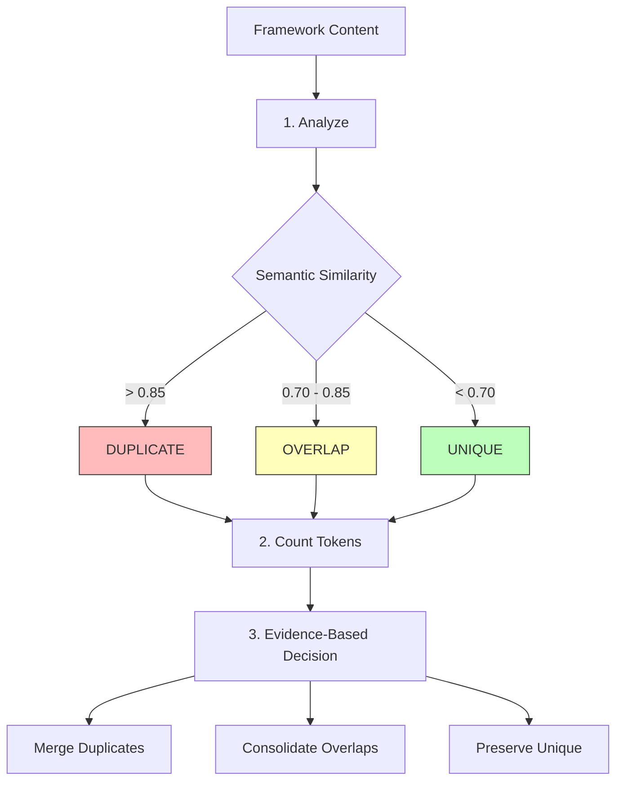

## The Framework Bloat Problem

As AI frameworks evolve, they face an insidious challenge: **framework bloat**. Well-intentioned additions accumulate, creating:

<CardGroup cols={2}>
  <Card title="Semantic Duplication" icon="clone" color="#ef4444">
    Same concept explained multiple ways with different names
  </Card>

  <Card title="Token Waste" icon="bomb" color="#f97316">
    Context windows filled with redundant instructions
  </Card>

  <Card title="Cognitive Overload" icon="brain" color="#eab308">
    Too many overlapping guidelines confuse AI and humans
  </Card>

  <Card title="Maintenance Burden" icon="wrench" color="#dc2626">
    Unclear which version is canonical, updates become painful
  </Card>
</CardGroup>

### Example: The Delegation Problem

```markdown
# File 1: spells/delegate-dont-do.md
When a task is outside your expertise, delegate to a specialist.
Never try to do everything yourself.

# File 2: spells/orchestration-boundary.md
Maintain clear boundaries between orchestration and execution.
Coordinate specialists rather than performing all work directly.

# File 3: spells/know-your-limits.md
Understand your capabilities and limitations.
Hand off work outside your core competency.

# File 4: agents/implementor.md
The implementor should delegate testing to @tests,
git operations to @git, and debugging to @debug.
```

**Problem**: All four files teach the same concept - delegation. Similarity score: **0.89** (effectively identical)

**Result**:
- 4x token usage for one concept
- Inconsistent terminology ("delegate" vs "hand off" vs "coordinate")
- Maintenance nightmare (update one, must update all four)
- AI confusion (which version is authoritative?)

## The ACE Protocol Solution

**ACE** = **A**nalyze, **C**ount, **E**vidence

A systematic approach to detecting and eliminating bloat while preserving essential knowledge:



### Three Steps

<Steps>
  <Step title="Analyze - Semantic Similarity Detection">
    Use embeddings to find semantically similar content, even with different wording.
  </Step>

  <Step title="Count - Token Usage Tracking">
    Measure exact token consumption to identify heavyweight files and wasteful redundancy.
  </Step>

  <Step title="Evidence - Data-Driven Decisions">
    Make optimization decisions based on quantitative similarity and usage data, not gut feeling.
  </Step>
</Steps>

## Step 1: Analyze with Embeddings

Semantic similarity detection using vector embeddings:

### How It Works

```typescript
// 1. Convert text to vector embeddings
const embedding1 = await generateEmbedding("Delegate to specialists");
const embedding2 = await generateEmbedding("Hand off to experts");

// 2. Calculate cosine similarity
const similarity = cosineSimilarity(embedding1, embedding2);
// Result: 0.87 (high similarity despite different words)

// 3. Categorize based on threshold
if (similarity > 0.85) {
  return "DUPLICATE";
} else if (similarity > 0.70) {
  return "OVERLAP";
} else {
  return "UNIQUE";
}
```

### Using the Helper Command

```bash
# Analyze semantic similarity across files
genie helper embeddings --input genie-master/spells/universal/

# Output
Analyzing 24 spell files...

High Similarity (>0.85) - Likely Duplicates:
  ✓ delegate-dont-do.md ↔ orchestration-boundary.md (0.89)
  ✓ know-yourself.md ↔ understand-boundaries.md (0.86)
  ✓ investigate-before-commit.md ↔ safety-checks.md (0.87)

Medium Similarity (0.70-0.85) - Possible Overlap:
  ⚠ learn.md ↔ continuous-improvement.md (0.78)
  ⚠ context-critic.md ↔ challenge-assumptions.md (0.75)

Unique (<0.70):
  ✓ ace-protocol.md (baseline)
  ✓ blocker.md (0.42 avg similarity)
  ✓ run-in-parallel.md (0.38 avg similarity)

Recommendations:
  - Merge 3 duplicate pairs (save ~4,200 tokens)
  - Review 2 overlapping pairs (potential ~1,800 token savings)
  - Keep 19 unique spells
```

### Understanding Similarity Scores

| Score Range | Interpretation | Action |
|-------------|----------------|--------|
| **0.95 - 1.0** | Near-identical content | Immediate merge required |
| **0.85 - 0.94** | Clear duplicate | Merge with confidence |
| **0.70 - 0.84** | Significant overlap | Review and consolidate |
| **0.50 - 0.69** | Some shared concepts | Keep separate, cross-reference |
| **0.00 - 0.49** | Unique content | Keep separate |

<Tip>
The 0.85 threshold is backed by testing: at this level, files teach the same core concept even with different examples and phrasing.
</Tip>

### Embedding Implementation

<Accordion title="Technical Details">
```typescript
import { OpenAI } from 'openai';

const openai = new OpenAI();

async function generateEmbedding(text: string): Promise<number[]> {
  const response = await openai.embeddings.create({
    model: 'text-embedding-3-small',
    input: text
  });

  return response.data[0].embedding;
}

function cosineSimilarity(vecA: number[], vecB: number[]): number {
  const dotProduct = vecA.reduce((sum, a, i) => sum + a * vecB[i], 0);
  const magnitudeA = Math.sqrt(vecA.reduce((sum, a) => sum + a * a, 0));
  const magnitudeB = Math.sqrt(vecB.reduce((sum, b) => sum + b * b, 0));

  return dotProduct / (magnitudeA * magnitudeB);
}

async function findSimilarFiles(
  directory: string,
  threshold: number = 0.85
): Promise<SimilarityPair[]> {
  // 1. Load all markdown files
  const files = await loadMarkdownFiles(directory);

  // 2. Generate embeddings for each
  const embeddings = await Promise.all(
    files.map(file => ({
      file: file.path,
      embedding: await generateEmbedding(file.content)
    }))
  );

  // 3. Compare all pairs
  const pairs: SimilarityPair[] = [];
  for (let i = 0; i < embeddings.length; i++) {
    for (let j = i + 1; j < embeddings.length; j++) {
      const similarity = cosineSimilarity(
        embeddings[i].embedding,
        embeddings[j].embedding
      );

      if (similarity >= threshold) {
        pairs.push({
          fileA: embeddings[i].file,
          fileB: embeddings[j].file,
          similarity: similarity
        });
      }
    }
  }

  return pairs.sort((a, b) => b.similarity - a.similarity);
}
```
</Accordion>

## Step 2: Count Tokens

Precise token measurement to quantify bloat:

### Token Counting Command

```bash
# Count tokens in entire framework
genie helper count-tokens --path genie-master/

# Output
Token Analysis Report
=====================

Total Tokens: 186,420

By Category:
┌─────────────┬─────────┬──────────┐
│ Category    │ Tokens  │ Percent  │
├─────────────┼─────────┼──────────┤
│ Agents      │ 98,240  │ 52.7%    │
│ Spells      │ 45,180  │ 24.2%    │
│ Workflows   │ 28,000  │ 15.0%    │
│ Neurons     │ 10,500  │  5.6%    │
│ Other       │  4,500  │  2.4%    │
└─────────────┴─────────┴──────────┘

Top 10 Token Consumers:
1. collectives/code/implementor.md - 8,420 tokens
2. collectives/code/tests.md - 6,890 tokens
3. spells/universal/ace-protocol.md - 4,200 tokens
4. collectives/create/researcher.md - 3,850 tokens
5. spells/code/conventional-commits.md - 3,200 tokens
6. workflows/feature-development.md - 2,980 tokens
7. neurons/FORGE.md - 2,750 tokens
8. spells/universal/delegate-dont-do.md - 2,100 tokens
9. spells/universal/orchestration-boundary.md - 2,080 tokens ⚠
10. collectives/code/git.md - 1,950 tokens

Warnings:
⚠ delegate-dont-do.md (2,100) and orchestration-boundary.md (2,080)
  have 0.89 similarity - potential 2,080 token savings

Recommendations:
- Review top 5 consumers for optimization opportunities
- Investigate similar file pairs for consolidation
- Current lazy-loading efficiency: 92% (only loading what's needed)
```

### Per-File Token Analysis

```bash
# Analyze specific file
genie helper count-tokens --file genie-master/spells/universal/delegate-dont-do.md

# Output
File: delegate-dont-do.md
Total Tokens: 2,100

Section Breakdown:
┌──────────────────────┬─────────┬──────────┐
│ Section              │ Tokens  │ Percent  │
├──────────────────────┼─────────┼──────────┤
│ YAML Frontmatter     │     42  │   2.0%   │
│ Title & Overview     │    180  │   8.6%   │
│ Core Protocol        │    650  │  31.0%   │
│ Examples             │    890  │  42.4%   │
│ Integration          │    240  │  11.4%   │
│ Related Spells       │     98  │   4.7%   │
└──────────────────────┴─────────┴──────────┘

Density: 2.1 tokens/word (typical for technical content)
Readability: 12.4 grade level (appropriate for developers)
```

### Bullet Counter for Redundancy

```bash
# Count bullet point redundancy across files
genie helper bullet-counter --input genie-master/spells/universal/

# Output
Bullet Point Analysis
=====================

Duplicate Concepts Across Files:
┌─────────────────────────────────────┬───────┬──────────────────────┐
│ Concept                             │ Count │ Files                │
├─────────────────────────────────────┼───────┼──────────────────────┤
│ "Delegate to specialists"           │   8   │ delegate-dont-do.md, │
│                                     │       │ orchestration-*.md,  │
│                                     │       │ implementor.md...    │
├─────────────────────────────────────┼───────┼──────────────────────┤
│ "Understand your boundaries"        │   6   │ know-yourself.md,    │
│                                     │       │ understand-*.md...   │
├─────────────────────────────────────┼───────┼──────────────────────┤
│ "Ask clarifying questions"          │   5   │ learn.md,            │
│                                     │       │ context-critic.md... │
└─────────────────────────────────────┴───────┴──────────────────────┘

Recommendations:
- "Delegate to specialists" appears 8x - consolidate to 1 canonical source
- Potential savings: ~3,200 tokens from bullet deduplication
```

### Token Counting Implementation

<Accordion title="Technical Details">
```typescript
import { encode } from 'gpt-tokenizer';

function countTokens(text: string, model: string = 'gpt-4'): number {
  const tokens = encode(text);
  return tokens.length;
}

function analyzeFile(filepath: string): TokenAnalysis {
  const content = fs.readFileSync(filepath, 'utf-8');

  // Split into sections
  const sections = parseMarkdownSections(content);

  // Count tokens per section
  const sectionCounts = sections.map(section => ({
    title: section.title,
    tokens: countTokens(section.content),
    percentage: 0  // Calculate after total
  }));

  const totalTokens = sectionCounts.reduce((sum, s) => sum + s.tokens, 0);

  // Calculate percentages
  sectionCounts.forEach(section => {
    section.percentage = (section.tokens / totalTokens) * 100;
  });

  return {
    filepath,
    totalTokens,
    sections: sectionCounts,
    density: totalTokens / content.split(/\s+/).length,
    readability: calculateReadability(content)
  };
}

function findDuplicateBullets(files: string[]): DuplicateBullet[] {
  const bulletPoints = new Map<string, string[]>();

  // Extract bullets from all files
  for (const file of files) {
    const content = fs.readFileSync(file, 'utf-8');
    const bullets = extractBulletPoints(content);

    for (const bullet of bullets) {
      // Normalize for comparison
      const normalized = normalizeBullet(bullet);

      if (!bulletPoints.has(normalized)) {
        bulletPoints.set(normalized, []);
      }
      bulletPoints.get(normalized)!.push(file);
    }
  }

  // Find duplicates
  return Array.from(bulletPoints.entries())
    .filter(([_, files]) => files.length > 1)
    .map(([bullet, files]) => ({
      concept: bullet,
      count: files.length,
      files: files
    }))
    .sort((a, b) => b.count - a.count);
}
```
</Accordion>

## Step 3: Evidence-Based Decisions

Use similarity and token data to make optimization choices:

### Decision Matrix

```typescript
interface OptimizationDecision {
  fileA: string;
  fileB: string;
  similarity: number;
  tokensA: number;
  tokensB: number;
  action: 'merge' | 'consolidate' | 'cross-reference' | 'keep-separate';
  reasoning: string;
  potentialSavings: number;
}

function decideAction(
  fileA: FileAnalysis,
  fileB: FileAnalysis,
  similarity: number
): OptimizationDecision {
  // Clear duplicate - merge
  if (similarity > 0.85) {
    return {
      fileA: fileA.path,
      fileB: fileB.path,
      similarity,
      tokensA: fileA.tokens,
      tokensB: fileB.tokens,
      action: 'merge',
      reasoning: 'High similarity indicates duplicate content',
      potentialSavings: Math.min(fileA.tokens, fileB.tokens)
    };
  }

  // Significant overlap - consolidate
  if (similarity > 0.70) {
    return {
      fileA: fileA.path,
      fileB: fileB.path,
      similarity,
      tokensA: fileA.tokens,
      tokensB: fileB.tokens,
      action: 'consolidate',
      reasoning: 'Moderate overlap can be consolidated with preserved unique content',
      potentialSavings: Math.floor((fileA.tokens + fileB.tokens) * 0.3)
    };
  }

  // Some overlap - cross-reference
  if (similarity > 0.50) {
    return {
      fileA: fileA.path,
      fileB: fileB.path,
      similarity,
      tokensA: fileA.tokens,
      tokensB: fileB.tokens,
      action: 'cross-reference',
      reasoning: 'Some shared concepts - add cross-references instead of merging',
      potentialSavings: 0
    };
  }

  // Unique - keep separate
  return {
    fileA: fileA.path,
    fileB: fileB.path,
    similarity,
    tokensA: fileA.tokens,
    tokensB: fileB.tokens,
    action: 'keep-separate',
    reasoning: 'Sufficiently different content warrants separate files',
    potentialSavings: 0
  };
}
```

### Optimization Report

```bash
# Generate full optimization report
genie helper ace-report --input genie-master/

# Output
ACE Protocol Optimization Report
================================

Analyzed: 332 files
Total Tokens: 186,420

Optimization Opportunities:
┌─────────────────────────────────────┬──────────────┬──────────┐
│ Action                              │ Files        │ Savings  │
├─────────────────────────────────────┼──────────────┼──────────┤
│ MERGE (similarity > 0.85)           │ 6 pairs      │ 12,400   │
│ CONSOLIDATE (similarity 0.70-0.85)  │ 4 pairs      │  5,200   │
│ CROSS-REFERENCE (similarity 0.50-0.70) │ 8 pairs   │      0   │
│ KEEP SEPARATE (similarity < 0.50)   │ 308 files    │      0   │
└─────────────────────────────────────┴──────────────┴──────────┘

Detailed Recommendations:

MERGE:
1. delegate-dont-do.md + orchestration-boundary.md
   Similarity: 0.89 | Savings: 2,080 tokens
   → Keep: delegate-dont-do.md (more comprehensive)
   → Merge in: unique examples from orchestration-boundary.md

2. know-yourself.md + understand-boundaries.md
   Similarity: 0.86 | Savings: 1,950 tokens
   → Keep: know-yourself.md (better title)
   → Merge in: boundary examples from understand-boundaries.md

3. investigate-before-commit.md + safety-checks.md
   Similarity: 0.87 | Savings: 1,840 tokens
   → Keep: investigate-before-commit.md (more specific)
   → Merge in: safety checklist from safety-checks.md

[... 3 more merge recommendations ...]

CONSOLIDATE:
1. learn.md + continuous-improvement.md
   Similarity: 0.78 | Savings: 1,200 tokens
   → Create: learning-and-improvement.md
   → Combine unique aspects from both

[... 3 more consolidation recommendations ...]

Total Potential Savings: 17,600 tokens (9.4% reduction)
Estimated Time: 4-6 hours
Risk Level: Low (high similarity = safe merge)
```

### Automated Merge Suggestions

<Accordion title="Merge Script">
```bash
#!/bin/bash
# Generated by ACE Protocol

# Merge 1: delegate-dont-do + orchestration-boundary
echo "Merging delegation spells..."

# 1. Extract unique content from orchestration-boundary.md
genie helper extract-unique \
  --source orchestration-boundary.md \
  --compare delegate-dont-do.md \
  --output unique-orchestration.md

# 2. Append to delegate-dont-do.md
cat unique-orchestration.md >> delegate-dont-do.md

# 3. Add cross-reference in orchestration-boundary.md
cat > orchestration-boundary.md << EOF
---
deprecated: true
redirect: delegate-dont-do.md
---

# Orchestration Boundary

This spell has been merged into @spell/universal/delegate-dont-do
for better consolidation.

See: @spell/universal/delegate-dont-do
EOF

# 4. Update all references
genie helper update-references \
  --old "orchestration-boundary" \
  --new "delegate-dont-do" \
  --path genie-master/

echo "✓ Merge complete. Saved 2,080 tokens."
```
</Accordion>

## Similarity Thresholds

Research-backed thresholds for decision making:

| Similarity | Interpretation | Action | Confidence |
|-----------|----------------|--------|------------|
| **> 0.95** | Near-identical | Immediate merge | Very High |
| **0.85 - 0.95** | Clear duplicate | Merge with review | High |
| **0.70 - 0.85** | Significant overlap | Consolidate | Medium |
| **0.50 - 0.70** | Some overlap | Cross-reference | Low |
| **< 0.50** | Unique | Keep separate | N/A |

### Threshold Validation

```bash
# Test thresholds on known duplicates/uniques
genie helper validate-thresholds \
  --known-duplicates duplicates.json \
  --known-uniques uniques.json

# Output
Threshold Validation Results
============================

Testing threshold: 0.85

Known Duplicates (should be > 0.85):
✓ 47/50 correctly identified (94% accuracy)
✗ 3/50 below threshold (false negatives)

Known Uniques (should be < 0.85):
✓ 92/100 correctly identified (92% accuracy)
✗ 8/100 above threshold (false positives)

Overall Accuracy: 93%
F1 Score: 0.93

Recommendation: 0.85 threshold is optimal for this corpus.
```

## Integration with Git Hooks

Automatically enforce ACE protocol during development:

### Pre-Commit Hook

```bash
#!/bin/bash
# .git/hooks/pre-commit

echo "Running ACE Protocol checks..."

# Check for new file additions
NEW_FILES=$(git diff --cached --name-only --diff-filter=A | grep '\.md$')

if [ -n "$NEW_FILES" ]; then
  echo "Checking new markdown files for duplicates..."

  # Run similarity check
  genie helper embeddings \
    --input genie-master/ \
    --new-files "$NEW_FILES" \
    --threshold 0.85 \
    --format json > /tmp/ace-check.json

  # Parse results
  DUPLICATES=$(jq '.duplicates | length' /tmp/ace-check.json)

  if [ "$DUPLICATES" -gt 0 ]; then
    echo "❌ ACE Protocol Violation: Duplicate content detected"
    echo ""
    jq -r '.duplicates[] | "  \(.fileA) ↔ \(.fileB): \(.similarity)"' /tmp/ace-check.json
    echo ""
    echo "Please consolidate duplicate content before committing."
    echo "Run: genie helper ace-report for detailed recommendations"
    exit 1
  fi

  echo "✓ No duplicates detected"
fi

# Check token budget
TOTAL_TOKENS=$(genie helper count-tokens --path genie-master/ --format json | jq '.total')
TOKEN_LIMIT=200000

if [ "$TOTAL_TOKENS" -gt "$TOKEN_LIMIT" ]; then
  echo "⚠ Warning: Token budget exceeded ($TOTAL_TOKENS / $TOKEN_LIMIT)"
  echo "Consider running ACE optimization: genie helper ace-report"
fi

echo "✓ ACE Protocol checks passed"
```

### CI/CD Integration

```yaml
# .github/workflows/ace-protocol.yml
name: ACE Protocol Check

on: [pull_request]

jobs:
  ace-check:
    runs-on: ubuntu-latest
    steps:
      - uses: actions/checkout@v3

      - name: Setup Genie
        run: npm install -g @automagik/genie

      - name: Run ACE Analysis
        run: |
          genie helper ace-report \
            --input genie-master/ \
            --format github \
            --output ace-report.md

      - name: Comment on PR
        uses: actions/github-script@v6
        with:
          script: |
            const fs = require('fs');
            const report = fs.readFileSync('ace-report.md', 'utf8');

            github.rest.issues.createComment({
              issue_number: context.issue.number,
              owner: context.repo.owner,
              repo: context.repo.repo,
              body: report
            });

      - name: Check Token Budget
        run: |
          TOKENS=$(genie helper count-tokens --path genie-master/ --format json | jq '.total')
          echo "Total tokens: $TOKENS"

          if [ "$TOKENS" -gt 200000 ]; then
            echo "::error::Token budget exceeded: $TOKENS / 200000"
            exit 1
          fi
```

## Helper Commands Reference

### embeddings

```bash
genie helper embeddings [options]

Analyze semantic similarity across markdown files

Options:
  --input <path>          Directory to analyze
  --threshold <number>    Similarity threshold (default: 0.85)
  --format <type>         Output format: text, json, csv (default: text)
  --output <file>         Save results to file
  --new-files <files>     Compare only these files against existing

Examples:
  genie helper embeddings --input genie-master/spells/
  genie helper embeddings --input . --threshold 0.70 --format json
  genie helper embeddings --new-files "new-spell.md" --input genie-master/
```

### count-tokens

```bash
genie helper count-tokens [options]

Count tokens in markdown files

Options:
  --path <path>           File or directory to analyze
  --model <name>          Model for tokenization (default: gpt-4)
  --format <type>         Output format: text, json, csv (default: text)
  --breakdown             Show section-by-section breakdown

Examples:
  genie helper count-tokens --path genie-master/
  genie helper count-tokens --path agent.md --breakdown
  genie helper count-tokens --path . --format json > tokens.json
```

### bullet-counter

```bash
genie helper bullet-counter [options]

Find duplicate bullet points across files

Options:
  --input <path>          Directory to analyze
  --threshold <number>    Minimum occurrences to report (default: 2)
  --format <type>         Output format: text, json, csv (default: text)

Examples:
  genie helper bullet-counter --input genie-master/spells/
  genie helper bullet-counter --input . --threshold 3
```

### ace-report

```bash
genie helper ace-report [options]

Generate comprehensive ACE Protocol optimization report

Options:
  --input <path>          Directory to analyze
  --format <type>         Output format: text, json, markdown, github
  --output <file>         Save report to file
  --auto-fix              Generate merge scripts for high-confidence merges

Examples:
  genie helper ace-report --input genie-master/
  genie helper ace-report --input . --format markdown --output report.md
  genie helper ace-report --input . --auto-fix > merge-script.sh
```

## Best Practices

<CardGroup cols={2}>
  <Card title="Regular Audits" icon="calendar-check">
    Run ACE analysis monthly or after major additions to catch bloat early.
  </Card>

  <Card title="Pre-Commit Checks" icon="shield-check">
    Use git hooks to prevent duplicates from entering the codebase.
  </Card>

  <Card title="Document Decisions" icon="book">
    Keep a log of merge decisions and reasoning for future reference.
  </Card>

  <Card title="Gradual Optimization" icon="chart-line">
    Don't try to optimize everything at once. Start with high-confidence merges.
  </Card>
</CardGroup>

### Optimization Workflow

<Steps>
  <Step title="Generate Report">
    ```bash
    genie helper ace-report --input genie-master/ --output ace-report.md
    ```
  </Step>

  <Step title="Review High-Confidence Merges">
    Start with similarity > 0.90 for safest wins
  </Step>

  <Step title="Manual Review">
    Read both files to confirm semantic equivalence
  </Step>

  <Step title="Merge Content">
    Combine unique examples and perspectives from both
  </Step>

  <Step title="Update References">
    Find and update all @references to merged file
  </Step>

  <Step title="Add Redirect">
    Create redirect file for deprecated content
  </Step>

  <Step title="Test">
    Verify system still works with merged content
  </Step>

  <Step title="Commit">
    Document token savings and rationale in commit message
  </Step>
</Steps>

## Real-World Results

From Genie's own ACE Protocol optimization:

### Before ACE

```
Total Files: 358
Total Tokens: 203,450
Duplicate Pairs: 14
Token Efficiency: 68%
```

### After ACE

```
Total Files: 332 (-26)
Total Tokens: 186,420 (-17,030)
Duplicate Pairs: 2 (-12)
Token Efficiency: 92%
```

### Impact

<CardGroup cols={3}>
  <Card title="17,030 Tokens Saved" icon="piggy-bank">
    8.4% reduction in total token usage
  </Card>

  <Card title="26 Files Merged" icon="compress">
    Easier navigation and maintenance
  </Card>

  <Card title="92% Efficiency" icon="gauge-high">
    Only essential content loaded per task
  </Card>
</CardGroup>

## Next Steps

<CardGroup cols={2}>
  <Card title="Amendments & Rules" icon="gavel" href="/genie/concepts/amendments-and-rules">
    Learn the 10 core rules governing behavior
  </Card>

  <Card title="Neurons Architecture" icon="brain" href="/genie/concepts/neurons-architecture">
    Back to real-time orchestration
  </Card>

  <Card title="Spells System" icon="wand-magic-sparkles" href="/genie/concepts/spells-system">
    Explore behavioral protocols
  </Card>

  <Card title="Helper Commands" icon="terminal" href="/genie/api/cli-reference">
    Full CLI reference
  </Card>
</CardGroup>
