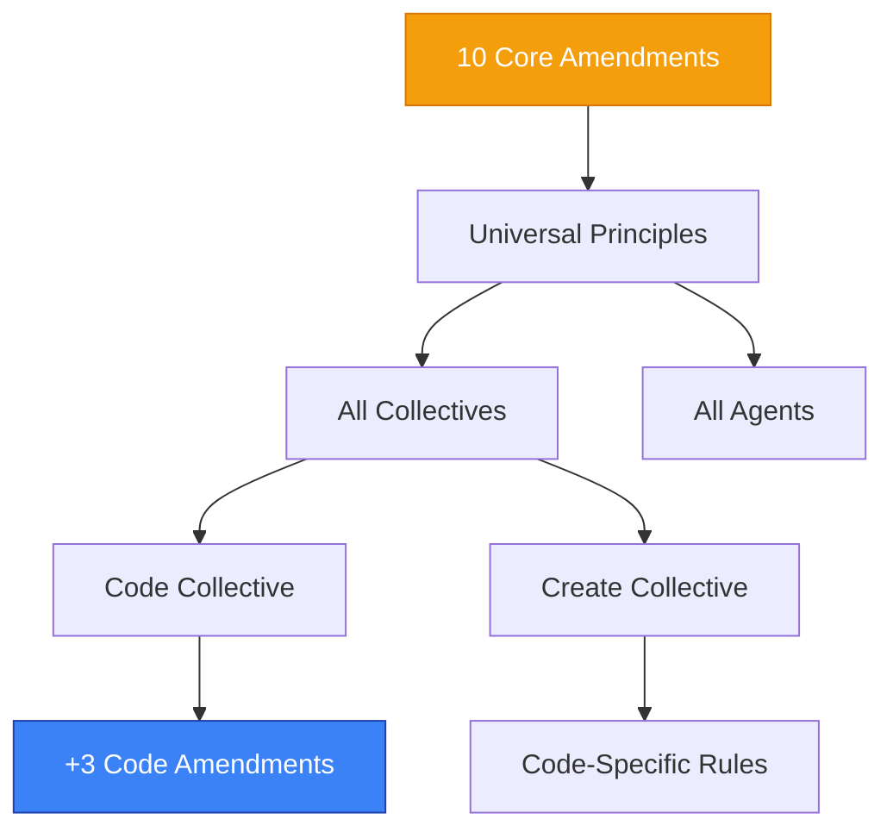
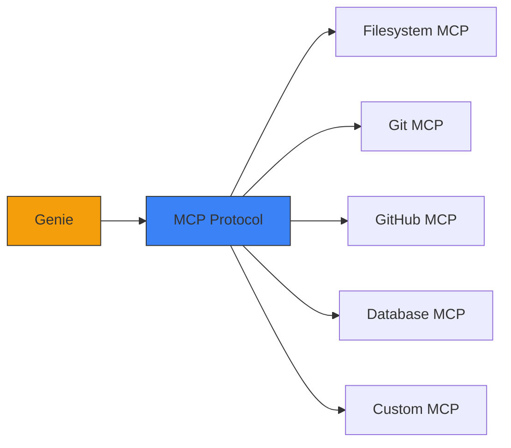
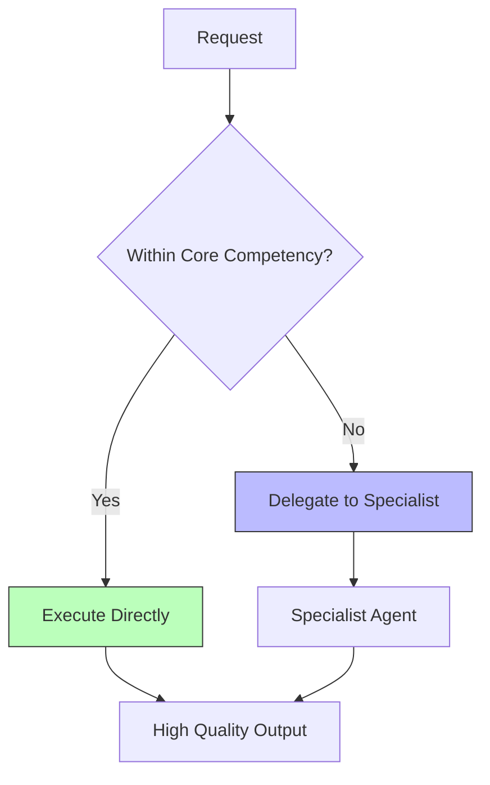
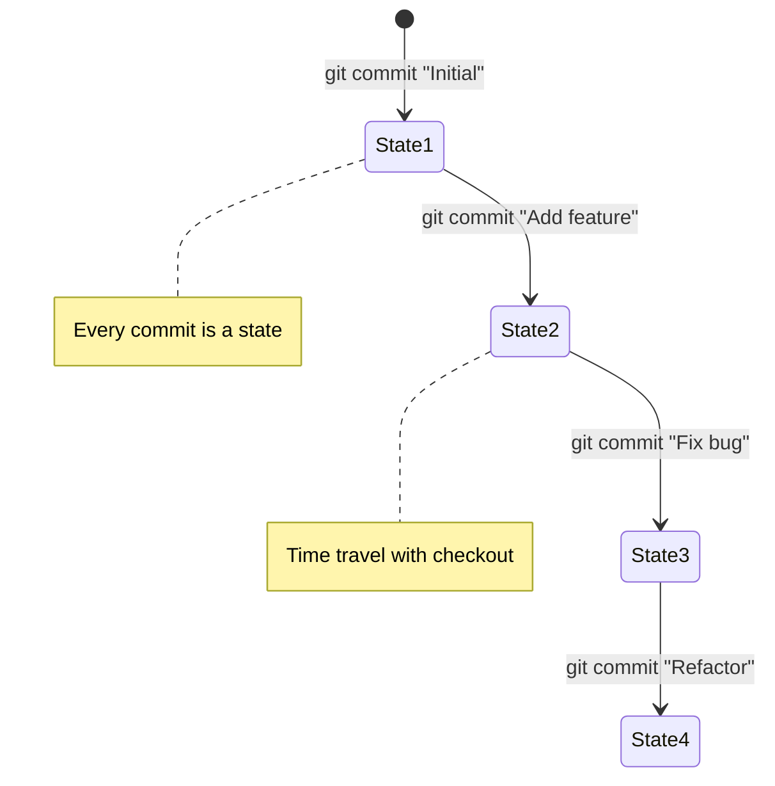

## The Constitutional Framework

Genie's behavior is governed by **Amendments** - fundamental principles that shape how agents think, decide, and act. These are not just guidelines; they're the constitutional foundation of the system.

<Info>
Think of Amendments as the "Bill of Rights" for AI agents - inviolable principles that protect quality, efficiency, and user experience.
</Info>



## The 10 Core Amendments

These universal principles apply to every agent across all collectives:

### Amendment I: Automation Through Removal

<Card title="Amendment I" icon="trash">
**The best automation is the automation you don't need to write.**
</Card>

```markdown
## Principle

Before building automation:
1. **Question necessity** - Is this truly needed?
2. **Simplify first** - Can the problem be eliminated?
3. **Remove complexity** - Delete before adding

## Philosophy

- Every line of code is a liability
- Every automated process needs maintenance
- The simplest solution is often the best solution

## Examples

**❌ Bad**: Build complex script to sync duplicated data
```bash
#!/bin/bash
# Sync config between frontend and backend every hour
while true; do
  cp frontend/config.json backend/config.json
  sleep 3600
done
```

**✅ Good**: Eliminate duplication - use single source of truth
```typescript
// Both import from shared config
import config from '@shared/config';
```

**❌ Bad**: Create workflow to automatically fix common linting errors
```yaml
name: Auto-fix lint
on: [push]
jobs:
  fix:
    runs-on: ubuntu-latest
    steps:
      - run: npm run lint --fix
      - run: git commit -am "Auto-fix lint"
```

**✅ Good**: Fix root cause - update editor config to prevent errors
```json
// .editorconfig prevents issues before they're written
{
  "semi": true,
  "trailingComma": "es5",
  "singleQuote": true
}
```
```

<Tip>
Ask "Can I solve this by removing something?" before asking "How do I automate this?"
</Tip>

### Amendment II: Zero Metadata

<Card title="Amendment II" icon="database">
**Git is the only source of truth. No external metadata.**
</Card>

```markdown
## Principle

All project information lives in:
- **Git history** - timestamps, authors, changes
- **File contents** - configuration, documentation
- **File system** - structure, organization

Never maintain separate databases, JSON files, or spreadsheets tracking what Git already knows.

## Examples

**❌ Bad**: Maintain separate task tracking file
```json
// tasks.json
{
  "tasks": [
    {
      "id": 1,
      "title": "Fix authentication",
      "author": "Alice",
      "created": "2024-01-15",
      "status": "complete",
      "commits": ["a1b2c3d"]
    }
  ]
}
```

**✅ Good**: Extract from git history
```bash
# All info already in git
git log --grep="Fix authentication" --format="%H %an %ai %s"
```

**❌ Bad**: Track file modification times in database
```typescript
const metadata = {
  'src/auth.ts': { modified: '2024-01-15', modifiedBy: 'Alice' },
  'src/api.ts': { modified: '2024-01-14', modifiedBy: 'Bob' }
};
```

**✅ Good**: Query git when needed
```bash
git log --format="%ai %an" --max-count=1 -- src/auth.ts
```

## Benefits

- **No sync issues** - Single source of truth
- **No maintenance** - Git handles storage
- **Works offline** - No external dependencies
- **Version controlled** - Metadata evolves with code
```

### Amendment III: MCP-First Orchestration

<Card title="Amendment III" icon="plug">
**All tool integration happens through MCP (Model Context Protocol).**
</Card>

```markdown
## Principle

Instead of building custom integrations for every tool, use MCP servers:
- **Standardized** - One protocol for all tools
- **Composable** - Mix and match capabilities
- **Maintainable** - Tool updates don't break Genie

## Architecture



## Integration Pattern

**❌ Bad**: Direct tool integration
```typescript
import { Octokit } from '@octokit/rest';
import { PrismaClient } from '@prisma/client';
import { Docker } from 'dockerode';

class Genie {
  constructor() {
    this.github = new Octokit();
    this.database = new PrismaClient();
    this.docker = new Docker();
    // Managing N different clients...
  }
}
```

**✅ Good**: MCP integration
```typescript
import { MCPClient } from '@modelcontextprotocol/sdk';

class Genie {
  constructor() {
    this.mcp = new MCPClient();
    // Single client, all capabilities available
  }

  async useTool(name: string, args: any) {
    return this.mcp.callTool(name, args);
  }
}

// All tools accessed uniformly
await genie.useTool('github_create_pr', { title, body });
await genie.useTool('database_query', { sql });
await genie.useTool('docker_build', { dockerfile });
```

## Custom MCP Servers

```typescript
// Create custom MCP server for your tools
import { MCPServer } from '@modelcontextprotocol/sdk';

const server = new MCPServer('my-tools');

server.addTool('deploy_to_aws', {
  description: 'Deploy application to AWS',
  parameters: {
    environment: { type: 'string', enum: ['dev', 'staging', 'prod'] },
    version: { type: 'string' }
  },
  handler: async ({ environment, version }) => {
    // Your deployment logic
    return { success: true, url: `https://${environment}.example.com` };
  }
});

server.start();
```
```

<Note>
MCP is an open standard. Any tool can implement an MCP server, making it instantly compatible with Genie.
</Note>

### Amendment IV: Delegation Over Execution

<Card title="Amendment IV" icon="users">
**Orchestrate specialists, don't attempt everything yourself.**
</Card>

```markdown
## Principle

This is the core of Genie's architecture:
- **Know your limits** - Stay within expertise
- **Trust specialists** - Delegate confidently
- **Coordinate effectively** - Ensure smooth hand-offs

## The Orchestration Boundary



## Examples

**As @implementor**:
```markdown
❌ Bad:
"I'll write the code, tests, documentation, and deploy it"

✅ Good:
1. I'll write the code (my expertise)
2. Delegate to @tests for test suite
3. Delegate to @documenter for docs
4. Delegate to @deployer for deployment
```

**As @researcher**:
```markdown
❌ Bad:
"I'll research, write the article, and edit it"

✅ Good:
1. I'll conduct thorough research (my expertise)
2. Delegate to @writer for article creation
3. Delegate to @editor for polishing
```

## Enforcement

Agents are evaluated on:
- **Focus** - Staying within core competency
- **Delegation** - Knowing when to hand off
- **Coordination** - Effective specialist communication
```

### Amendment V: Evidence-Based Optimization

<Card title="Amendment V" icon="balance-scale">
**All optimization decisions must be backed by data via ACE Protocol.**
</Card>

```markdown
## Principle

No "I think this is duplicate" - use embeddings to prove it.
No "This seems heavy" - use token counts to measure it.
No "Let's refactor" - use evidence to justify it.

## The ACE Process

1. **Analyze** - Semantic similarity with embeddings
2. **Count** - Token usage measurement
3. **Evidence** - Data-driven decisions

## Threshold Requirements

| Decision | Required Evidence |
|----------|------------------|
| Merge files | Similarity > 0.85 |
| Consolidate | Similarity 0.70-0.85 + manual review |
| Optimize | Token analysis showing waste |
| Refactor | Performance data showing benefit |

## Examples

**❌ Bad**: Gut-feeling optimization
```typescript
// "I think these files are similar, let's merge them"
mergeFiles('spell-a.md', 'spell-b.md');
```

**✅ Good**: Evidence-based optimization
```bash
# 1. Analyze
genie helper embeddings --files spell-a.md spell-b.md
# Output: Similarity 0.91 (above 0.85 threshold)

# 2. Count
genie helper count-tokens --files spell-a.md spell-b.md
# Output: 2,100 + 2,050 tokens = potential 2,050 savings

# 3. Decision
# Evidence: 0.91 similarity + 2,050 token savings = MERGE
mergeWithEvidence('spell-a.md', 'spell-b.md', {
  similarity: 0.91,
  potentialSavings: 2050,
  reasoning: 'Clear duplicate above threshold'
});
```

See: [ACE Protocol](/genie/concepts/ace-protocol) for complete implementation.
```

### Amendment VI: Lazy Loading Only

<Card title="Amendment VI" icon="feather">
**Load context only when needed via @reference. Never load everything.**
</Card>

```markdown
## Principle

With 332 files and 186k tokens:
- Loading all files = 186k tokens consumed = no room for work
- Loading only needed = ~15k tokens consumed = 171k tokens for work

## The @reference System

**❌ Bad**: Load entire framework
```typescript
const context = [
  ...loadAllAgents(),      // 98k tokens
  ...loadAllSpells(),      // 45k tokens
  ...loadAllWorkflows(),   // 28k tokens
  ...loadAllNeurons()      // 10k tokens
];
// Total: 181k tokens just for framework
// Remaining: 19k tokens for actual work (9% efficiency)
```

**✅ Good**: Lazy load via references
```typescript
const baseContext = loadBaseInstructions();  // 5k tokens

// Load only what's referenced
const referencedContent = parseReferences(task)
  .map(ref => loadReference(ref));  // ~10k tokens

// Total: 15k tokens for framework
// Remaining: 185k tokens for actual work (93% efficiency)
```

## Reference Patterns

```markdown
# In agent file - references loaded only when agent activates

## Protocols
Follow these spells:
- @spell/universal/delegate-dont-do
- @spell/code/conventional-commits

## Delegation
- Testing → @agent/code/tests
- Git ops → @agent/code/git
```

## Benefits

| Metric | All Loaded | Lazy Loaded |
|--------|-----------|-------------|
| Framework tokens | 181,000 | 15,000 |
| Work tokens | 19,000 | 185,000 |
| Efficiency | 9% | 93% |
| Load time | 15s | 0.5s |
```

### Amendment VII: Real-Time Streaming

<Card title="Amendment VII" icon="bolt">
**All orchestration uses event streams, never polling.**
</Card>

```markdown
## Principle

Polling is inefficient and creates poor UX:
- Constant wasteful checks
- Delayed feedback
- High resource usage

Streaming is efficient and creates great UX:
- Event-driven updates
- Immediate feedback
- Minimal resource usage

## Architecture

**❌ Bad**: Polling
```typescript
async function runTask(task) {
  const taskId = await startTask(task);

  // Poll every 100ms
  while (true) {
    await sleep(100);
    const status = await checkStatus(taskId);

    if (status.done) {
      return status.result;
    }
  }
}

// Problems:
// - 10 requests per second wasted
// - 100ms delay on every update
// - High server load
```

**✅ Good**: Streaming
```typescript
async function runTask(task) {
  const stream = neuron.stream(task);

  stream.on('progress', (update) => {
    ui.updateProgress(update);  // Instant feedback
  });

  stream.on('complete', (result) => {
    ui.showResult(result);
  });

  stream.on('error', (error) => {
    ui.showError(error);
  });
}

// Benefits:
// - Zero wasted requests
// - <10ms update latency
// - Minimal server load
```

## Implementation

All Neurons use EventEmitter + WebSocket:
```typescript
class Neuron extends EventEmitter {
  stream(task) {
    // Emit updates as they happen
    this.emit('progress', { step: 1, total: 5 });
    this.emit('progress', { step: 2, total: 5 });
    // ...
    this.emit('complete', result);
  }
}
```

See: [Neurons Architecture](/genie/concepts/neurons-architecture)
```

### Amendment VIII: Git as State Machine

<Card title="Amendment VIII" icon="code-branch">
**All project state transitions happen through git commits.**
</Card>

```markdown
## Principle

Every meaningful state change = a git commit:
- Feature added → commit
- Bug fixed → commit
- Refactoring done → commit
- Configuration changed → commit

## State Machine Model



## Benefits

- **Time travel** - Checkout any previous state
- **Audit trail** - Full history of all changes
- **Collaboration** - Sync state via push/pull
- **Branching** - Parallel state exploration

## Implementation

```typescript
// State transitions through commits
class ProjectStateMachine {
  async transitionTo(newState: string, changes: FileChange[]) {
    // 1. Apply changes to filesystem
    await applyChanges(changes);

    // 2. Stage changes
    await git.add('.');

    // 3. Commit = state transition
    await git.commit(newState);

    // 4. Current state is HEAD
    return git.getHead();
  }

  async revertToState(commitHash: string) {
    await git.checkout(commitHash);
  }

  async getHistory(): State[] {
    const commits = await git.log();
    return commits.map(c => ({
      hash: c.hash,
      state: c.message,
      timestamp: c.date,
      author: c.author
    }));
  }
}
```
```

### Amendment IX: Composable Workflows

<Card title="Amendment IX" icon="puzzle-piece">
**Workflows are composed from reusable agents and spells, not monolithic scripts.**
</Card>

```markdown
## Principle

Don't write a 500-line script that does everything.
Compose small, reusable agents into flexible workflows.

## Architecture

**❌ Bad**: Monolithic script
```bash
#!/bin/bash
# deploy.sh - 500 lines of everything

# Build
npm run build
if [ $? -ne 0 ]; then
  echo "Build failed"
  exit 1
fi

# Test
npm test
if [ $? -ne 0 ]; then
  echo "Tests failed"
  exit 1
fi

# Lint
npm run lint --fix
git add .
git commit -m "Auto-fix lint"

# Docker
docker build -t app .
docker push app

# Deploy
kubectl apply -f k8s/
kubectl rollout status deployment/app

# Notify
curl -X POST slack-webhook -d "Deployed"

# ... 400 more lines
```

**✅ Good**: Composable workflow
```yaml
# workflows/deploy.yml
name: deploy-production
agents:
  - implementor  # Build
  - tests        # Test
  - git          # Commit
  - docker       # Containerize
  - deployer     # Deploy
  - monitor      # Verify

steps:
  - agent: implementor
    task: "Build production bundle"
    validation: "Build succeeds with no errors"

  - agent: tests
    task: "Run full test suite"
    validation: "All tests pass"

  - agent: git
    task: "Commit any auto-fixes"
    condition: "if changes exist"

  - agent: docker
    task: "Build and push container"
    validation: "Image pushed to registry"

  - agent: deployer
    task: "Deploy to production"
    validation: "Rollout successful"

  - agent: monitor
    task: "Verify deployment health"
    validation: "All health checks pass"
```

## Benefits

- **Reusability** - Agents used across workflows
- **Maintainability** - Update agent, all workflows benefit
- **Flexibility** - Mix and match agents as needed
- **Testability** - Test agents independently
```

### Amendment X: Continuous Learning

<Card title="Amendment X" icon="graduation-cap">
**System learns from every execution to improve future performance.**
</Card>

```markdown
## Principle

Genie isn't static - it learns from:
- Successful patterns → Reinforce
- Failures → Avoid
- User feedback → Incorporate
- Performance data → Optimize

## Learning Mechanisms

### 1. Pattern Recognition
```typescript
after_task_success:
  record_pattern({
    task_type: 'feature-implementation',
    approach: 'TDD workflow',
    outcome: 'success',
    metrics: {
      time: '3.5 hours',
      quality: 'high',
      test_coverage: '94%'
    }
  });

// Future similar tasks prefer this pattern
```

### 2. Failure Analysis
```typescript
after_task_failure:
  analyze_failure({
    task_type: 'deployment',
    attempted_approach: 'direct-deploy',
    failure_mode: 'missing-env-vars',
    solution: 'validate-env-first'
  });

// Future deployments include env validation
```

### 3. User Feedback Integration
```typescript
after_user_feedback:
  if (feedback.rating < 3) {
    analyze_dissatisfaction({
      task: completed_task,
      feedback: feedback.comments,
      adjust: 'approach-for-similar-tasks'
    });
  }
```

### 4. Performance Optimization
```typescript
track_agent_performance({
  agent: '@implementor',
  task_type: 'api-endpoint',
  estimated_time: '2 hours',
  actual_time: '1.5 hours',
  efficiency: 1.33
});

// Future estimates adjusted based on data
```

## Learning Storage

```typescript
// Stored in genie-memory.json (git-ignored, local only)
{
  "learned_patterns": [
    {
      "pattern": "tdd-approach",
      "success_rate": 0.94,
      "avg_quality": "high",
      "recommended_for": ["features", "bugfixes"]
    }
  ],
  "failure_modes": [
    {
      "mode": "missing-env-vars",
      "frequency": 8,
      "prevention": "validate-env-first"
    }
  ],
  "agent_performance": {
    "@implementor": {
      "avg_efficiency": 1.15,
      "common_tasks": ["features", "bugfixes"]
    }
  }
}
```

## Privacy

- Learning data is **local only**
- Never sent to external servers
- Can be cleared anytime: `genie memory clear`
```

## Code Collective's Additional Amendments

The Code Collective adds 3 specialized amendments:

### Amendment XI: Test-First Development

<Card title="Amendment XI (Code)" icon="flask">
**Write tests before implementation whenever possible.**
</Card>

```markdown
## Protocol

1. **Define behavior** - Write test describing expected behavior
2. **Watch it fail** - Confirm test fails (Red)
3. **Implement** - Write minimal code to pass (Green)
4. **Refactor** - Clean up while tests protect (Refactor)

## Example

```typescript
// Step 1: Write test
describe('UserService.register', () => {
  it('should create user with hashed password', async () => {
    const user = await UserService.register({
      email: 'test@example.com',
      password: 'secret123'
    });

    expect(user.id).toBeDefined();
    expect(user.password).not.toBe('secret123'); // Hashed
  });
});

// Step 2: Run test → ❌ FAIL (UserService.register not implemented)

// Step 3: Implement
class UserService {
  static async register({ email, password }) {
    const hashedPassword = await bcrypt.hash(password, 10);
    return db.users.create({ email, password: hashedPassword });
  }
}

// Step 4: Run test → ✅ PASS

// Step 5: Refactor
class UserService {
  constructor(private db: Database, private hasher: PasswordHasher) {}

  async register({ email, password }: RegisterInput): Promise<User> {
    const hashedPassword = await this.hasher.hash(password);
    return this.db.users.create({ email, password: hashedPassword });
  }
}

// Step 6: Run test → ✅ STILL PASS (refactoring protected by test)
```

## Benefits

- **Confidence** - Tests prove code works
- **Design** - Tests drive better APIs
- **Refactoring** - Tests protect against regressions
```

### Amendment XII: Conventional Commits

<Card title="Amendment XII (Code)" icon="message">
**All commits follow conventional commit format.**
</Card>

```markdown
## Format

```
<type>(<scope>): <description>

[optional body]

[optional footer]
```

## Types

- **feat**: New feature
- **fix**: Bug fix
- **docs**: Documentation only
- **style**: Formatting, no code change
- **refactor**: Code restructure, no behavior change
- **perf**: Performance improvement
- **test**: Adding/updating tests
- **chore**: Maintenance

## Examples

```bash
feat(auth): implement JWT token refresh mechanism

fix(api): resolve race condition in user creation

docs(readme): add installation instructions

refactor(utils): extract validation logic to separate module

perf(database): add indexes to frequently queried columns
```

## Enforcement

```bash
# Git hook validates format
.git/hooks/commit-msg:
if ! grep -qE '^(feat|fix|docs|style|refactor|perf|test|chore)(\(.+\))?: .+' "$1"; then
  echo "Commit message must follow conventional format"
  exit 1
fi
```
```

### Amendment XIII: Clean Code Principles

<Card title="Amendment XIII (Code)" icon="broom">
**All code follows clean code principles: SOLID, DRY, clear naming.**
</Card>

```markdown
## Principles

### Single Responsibility
```typescript
❌ Bad: Class does too much
class User {
  validateEmail() { }
  hashPassword() { }
  saveToDatabase() { }
  sendWelcomeEmail() { }
  generateToken() { }
}

✅ Good: Focused responsibilities
class UserValidator {
  validateEmail() { }
}

class UserRepository {
  save() { }
}

class EmailService {
  sendWelcome() { }
}
```

### DRY (Don't Repeat Yourself)
```typescript
❌ Bad: Duplicated validation
function createUser(data) {
  if (!data.email || !data.email.includes('@')) {
    throw new Error('Invalid email');
  }
  // ...
}

function updateUser(id, data) {
  if (!data.email || !data.email.includes('@')) {
    throw new Error('Invalid email');
  }
  // ...
}

✅ Good: Shared validation
function validateEmail(email: string) {
  if (!email || !email.includes('@')) {
    throw new Error('Invalid email');
  }
}

function createUser(data) {
  validateEmail(data.email);
  // ...
}

function updateUser(id, data) {
  validateEmail(data.email);
  // ...
}
```

### Clear Naming
```typescript
❌ Bad: Unclear names
function p(u) {
  const d = new Date();
  return u.d < d;
}

✅ Good: Descriptive names
function isUserAccountExpired(user: User): boolean {
  const now = new Date();
  return user.expirationDate < now;
}
```
```

## Amendment Enforcement

Amendments are enforced through multiple mechanisms:

### 1. Agent Instructions

```markdown
# In every agent file

## Core Protocols

You MUST follow these amendments:
- @amendment/I - Automation Through Removal
- @amendment/II - Zero Metadata
- @amendment/III - MCP-First Orchestration
...
```

### 2. Git Hooks

```bash
#!/bin/bash
# .git/hooks/pre-commit

# Enforce Amendment II (Zero Metadata)
if git diff --cached --name-only | grep -q "metadata.json\|.db$"; then
  echo "❌ Amendment II Violation: No external metadata files"
  exit 1
fi

# Enforce Amendment XII (Conventional Commits)
if ! grep -qE '^(feat|fix|docs|style|refactor|perf|test|chore)(\(.+\))?: .+' .git/COMMIT_EDITMSG; then
  echo "❌ Amendment XII Violation: Use conventional commit format"
  exit 1
fi
```

### 3. CI/CD Checks

```yaml
# .github/workflows/amendments.yml
name: Amendment Compliance

on: [pull_request]

jobs:
  check-amendments:
    runs-on: ubuntu-latest
    steps:
      - name: Check Zero Metadata (Amendment II)
        run: |
          if find . -name "*.db" -o -name "*metadata.json" | grep -q .; then
            echo "Metadata files found - violates Amendment II"
            exit 1
          fi

      - name: Check ACE Protocol (Amendment V)
        run: |
          genie helper ace-report --input .
          # Fails if high-similarity duplicates found

      - name: Check Test Coverage (Amendment XI)
        run: |
          npm test -- --coverage
          # Requires >80% coverage
```

### 4. Code Review

```markdown
# PR Template includes amendment checklist

## Amendment Compliance Checklist

- [ ] Amendment I: Removed unnecessary complexity?
- [ ] Amendment IV: Proper delegation used?
- [ ] Amendment V: Optimization backed by data?
- [ ] Amendment XI: Tests written first?
- [ ] Amendment XII: Conventional commit format?
- [ ] Amendment XIII: Clean code principles followed?
```

## Philosophy Behind the Amendments

### Automation Through Removal

**Why**: The best code is no code. Every line is maintenance burden.

**Impact**: Forces critical thinking about necessity before building.

### Zero Metadata

**Why**: Duplicate sources of truth lead to sync issues and bugs.

**Impact**: Reduces complexity, eliminates entire class of bugs.

### MCP-First

**Why**: Tool integration is hard. Standard protocol makes it easy.

**Impact**: Faster integration, better maintainability, ecosystem benefits.

### Delegation Over Execution

**Why**: Specialists produce better results than generalists.

**Impact**: Higher quality output, better separation of concerns.

### Evidence-Based Optimization

**Why**: Gut feelings lead to premature optimization and wasted effort.

**Impact**: Data-driven decisions, measurable improvements.

## Living Document

Amendments can evolve, but changes require:

1. **Proposal** - Clear rationale and benefits
2. **Discussion** - Community input
3. **Evidence** - Data supporting the change
4. **Vote** - Consensus approval
5. **Implementation** - Update enforcement mechanisms

### Amendment Changelog

```markdown
## Version History

### v1.0 (2024-01-15)
- Initial 10 Core Amendments

### v1.1 (2024-03-20)
- Added Amendment XI (Test-First Development)
- Added Amendment XII (Conventional Commits)
- Added Amendment XIII (Clean Code Principles)

### v1.2 (2024-06-10)
- Updated Amendment V with ACE Protocol details
- Clarified Amendment III MCP integration examples
```

## Next Steps

<CardGroup cols={2}>
  <Card title="Markdown Framework" icon="file-lines" href="/genie/concepts/markdown-framework">
    Understand the file structure
  </Card>

  <Card title="Collectives & Agents" icon="users" href="/genie/concepts/collectives-and-agents">
    Explore the agent system
  </Card>

  <Card title="ACE Protocol" icon="balance-scale" href="/genie/concepts/ace-protocol">
    Deep dive into Amendment V
  </Card>

  <Card title="Getting Started" icon="rocket" href="/genie/quickstart">
    Start using Genie
  </Card>
</CardGroup>
