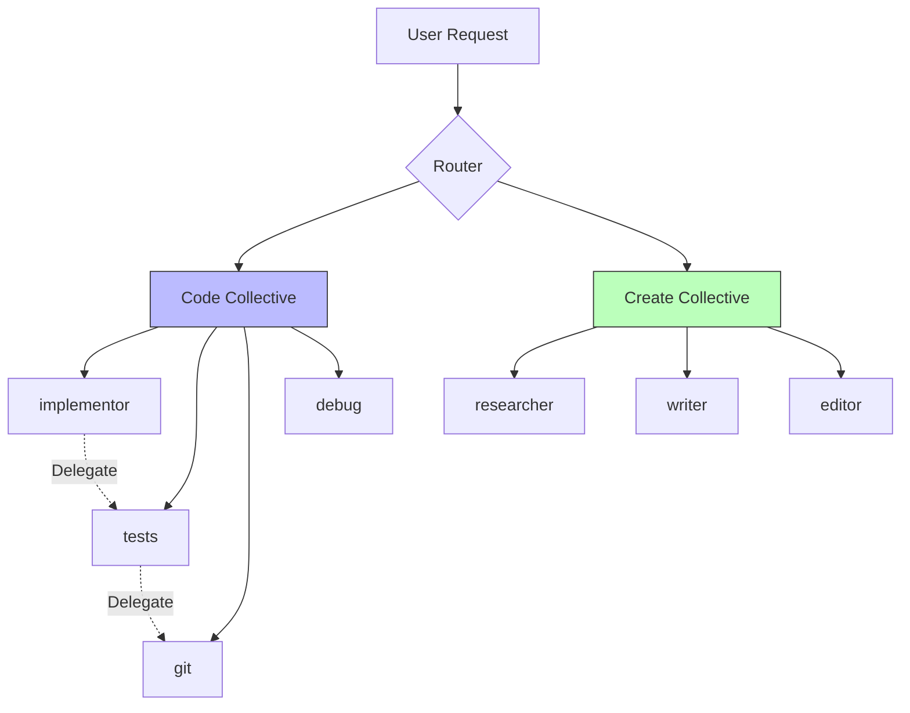
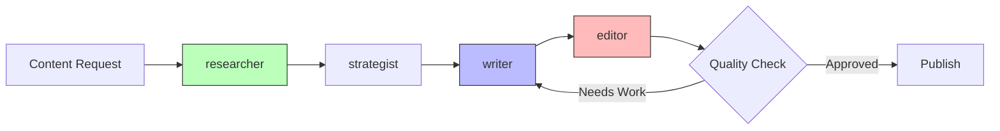
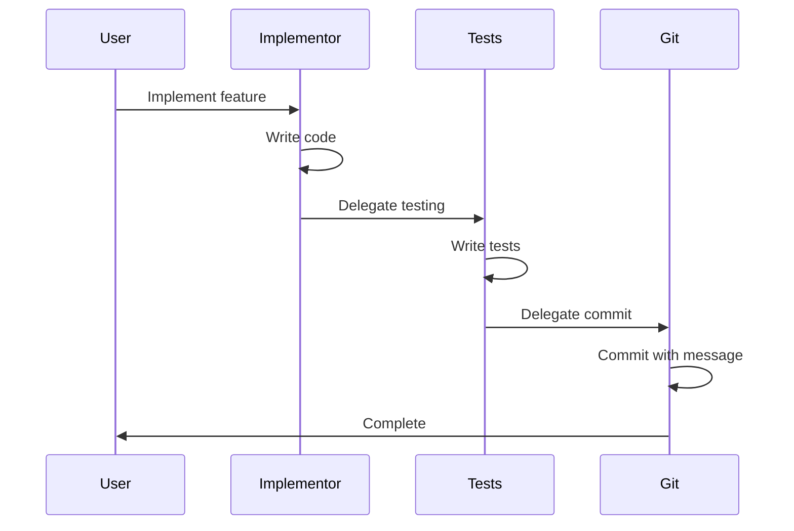
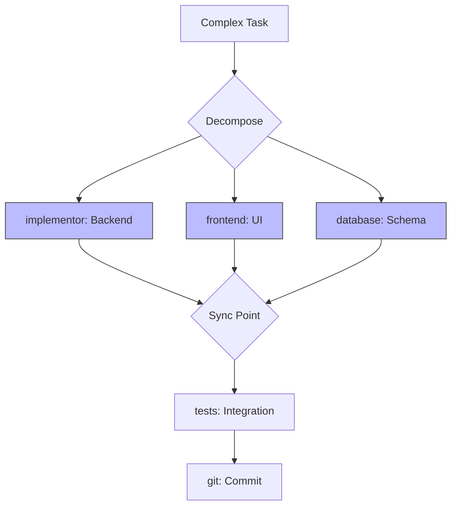

## What Are Collectives?

In Genie, a **Collective** is a group of specialized AI agents that work together toward a common purpose. Think of them as departments in a company, each with expert team members.



### The Two Core Collectives

Genie ships with two fundamental collectives:

<CardGroup cols={2}>
  <Card title="Code Collective" icon="code" color="#0ea5e9">
    **34 Agents** - Software development, testing, git operations, debugging, architecture
  </Card>

  <Card title="Create Collective" icon="palette" color="#10b981">
    **9 Agents** - Research, writing, editing, content creation, shape-shifting
  </Card>
</CardGroup>

## Code Collective (34 Agents)

The **Code Collective** handles all software development activities. It's organized into specialized roles:

### Core Development Team

| Agent | Role | Key Capabilities |
|-------|------|-----------------|
| **implementor** | Primary developer | TypeScript, React, Node.js, clean code |
| **tests** | Testing specialist | Unit, integration, E2E, TDD |
| **planner** | Architecture & planning | System design, task breakdown |
| **investigator** | Code analysis | Performance, security, quality review |

### Support Specialists

| Agent | Role | Key Capabilities |
|-------|------|-----------------|
| **git** | Version control | Commits, branches, conventional commits |
| **debug** | Troubleshooting | Error analysis, root cause investigation |
| **audit** | Security review | Vulnerability scanning, best practices |
| **optimizer** | Performance | Code optimization, profiling |

### Infrastructure Team

| Agent | Role | Key Capabilities |
|-------|------|-----------------|
| **docker** | Containerization | Dockerfile, docker-compose, best practices |
| **ci-cd** | Automation | GitHub Actions, pipelines, deployment |
| **deployer** | Production ops | Cloud deployment, monitoring |
| **database** | Data layer | SQL, NoSQL, migrations, queries |

<AccordionGroup>
  <Accordion title="Full Code Collective Roster (34 Agents)">
    **Core Development** (8 agents):
    - `implementor` - Primary feature developer
    - `tests` - Testing specialist
    - `planner` - Architecture and planning
    - `investigator` - Code analysis and review
    - `reviewer` - Code review and quality
    - `refactor` - Code improvement
    - `documenter` - Documentation writer
    - `architect` - System design

    **Specialized Development** (8 agents):
    - `frontend` - UI/UX implementation
    - `backend` - API and server logic
    - `database` - Data layer specialist
    - `api` - API design and implementation
    - `security` - Security specialist
    - `performance` - Performance optimization
    - `mobile` - Mobile development
    - `web` - Web technologies

    **DevOps & Infrastructure** (6 agents):
    - `git` - Version control
    - `docker` - Containerization
    - `ci-cd` - Automation pipelines
    - `deployer` - Production deployment
    - `monitor` - System monitoring
    - `backup` - Data backup and recovery

    **Quality & Analysis** (6 agents):
    - `debug` - Debugging specialist
    - `audit` - Security auditing
    - `optimizer` - Performance tuning
    - `validator` - Input validation
    - `tester` - Test execution
    - `qa` - Quality assurance

    **Support & Utilities** (6 agents):
    - `helper` - Utility functions
    - `migrator` - Database migrations
    - `seeder` - Data seeding
    - `generator` - Code generation
    - `scaffold` - Project scaffolding
    - `cleanup` - Code cleanup
  </Accordion>

  <Accordion title="Agent Selection Logic">
    ```typescript
    // Simplified routing logic
    function selectAgent(request: string, collective: Collective): Agent {
      // 1. Check explicit mentions
      if (request.includes('@implementor')) {
        return collective.agents.implementor;
      }

      // 2. Match trigger keywords
      for (const agent of collective.agents) {
        if (agent.triggers.some(t => request.includes(t))) {
          return agent;
        }
      }

      // 3. Analyze intent with embeddings
      const intent = analyzeIntent(request);
      const scored = collective.agents.map(agent => ({
        agent,
        score: similarity(intent, agent.capabilities)
      }));

      // 4. Return highest scoring agent
      return scored.sort((a, b) => b.score - a.score)[0].agent;
    }
    ```
  </Accordion>
</AccordionGroup>

## Create Collective (9 Agents)

The **Create Collective** handles research, writing, content creation, and creative tasks:

| Agent | Role | Key Capabilities |
|-------|------|-----------------|
| **researcher** | Information gathering | Web research, data analysis, summarization |
| **writer** | Content creation | Articles, docs, copy, storytelling |
| **editor** | Content refinement | Proofreading, style, clarity, tone |
| **shape-shifter** | Adaptive communication | Persona matching, voice adaptation |
| **analyst** | Data interpretation | Insights, patterns, recommendations |
| **strategist** | Planning & approach | Content strategy, audience targeting |
| **designer** | Visual concepts | Layout ideas, design principles |
| **storyteller** | Narrative craft | Compelling stories, engagement |
| **curator** | Information organization | Categorization, tagging, structure |

<Tip>
The **shape-shifter** agent is particularly powerful - it adapts its communication style to match your needs, from technical documentation to creative storytelling.
</Tip>

### Create Collective Workflows



## Agent File Structure

Every agent is defined in a markdown file with consistent structure:

```markdown
---
name: implementor
collective: code
role: "Core developer who writes clean, maintainable code"
capabilities:
  - typescript
  - react
  - node
  - testing
priority: high
triggers:
  - "implement"
  - "build"
  - "develop"
  - "create feature"
delegation_rules:
  tests: "After feature implementation"
  git: "After tests pass"
  debug: "If errors occur"
---

# Implementor Agent

## Core Responsibilities

The implementor is the primary developer in the Code Collective. Core duties:

- Write production-ready TypeScript/JavaScript code
- Implement features according to specifications
- Follow clean code principles and best practices
- Ensure type safety and proper error handling
- Write self-documenting code with clear naming

## When To Activate

Activate implementor when:
- User requests feature implementation
- Specifications are clear and approved by @planner
- Technical approach is defined
- Tests are defined by @tests

Do NOT activate when:
- Requirements are unclear → delegate to @planner
- Debugging is needed → delegate to @debug
- Architecture design needed → delegate to @architect

## Behavioral Protocols

Follow these spells:
- @spell/universal/investigate-before-commit
- @spell/code/conventional-commits
- @spell/universal/delegate-dont-do
- @spell/universal/ace-protocol

## Delegation Rules

Automatic hand-offs:
1. **After implementation** → @tests for test coverage
2. **After tests pass** → @git for version control
3. **If errors occur** → @debug for troubleshooting
4. **For optimization** → @optimizer for performance tuning

Never handle these yourself:
- Git operations → @git handles all commits
- Test writing → @tests handles test suites
- Deployment → @deployer handles production
- Security audits → @audit handles security

## Code Style Guidelines

```typescript
// Prefer functional, composable code
export const processUser = (user: User): ProcessedUser => {
  return pipe(
    validateUser,
    enrichWithDefaults,
    sanitizeInput
  )(user);
};

// Use descriptive names
const isUserEligibleForPremium = (user: User): boolean => {
  return user.accountAge > 365 && user.purchases.length > 10;
};

// Handle errors explicitly
try {
  const result = await riskyOperation();
  return success(result);
} catch (error) {
  logger.error('Operation failed', { error, context });
  return failure(error);
}
```

## Examples

### Feature Implementation Request

User: "Implement user authentication with JWT"

Response:
1. Load specifications from @planner
2. Implement auth service with TypeScript
3. Add proper type definitions
4. Include error handling
5. Delegate to @tests for test coverage
6. After tests pass, delegate to @git for commit

### Code Organization

```typescript
// Clear separation of concerns
export class AuthService {
  constructor(
    private readonly tokenService: TokenService,
    private readonly userRepo: UserRepository
  ) {}

  async authenticate(credentials: Credentials): Promise<AuthResult> {
    // Implementation
  }
}
```
```

## Delegation Rules & Orchestration Boundary

One of Genie's core principles: **Agents don't do everything, they orchestrate**

<Warning>
**The Golden Rule**: If a task is outside your primary expertise, delegate to a specialist.
</Warning>

### Delegation Matrix

| Current Agent | Task Type | Delegate To |
|--------------|-----------|-------------|
| implementor | Testing | @tests |
| implementor | Git operations | @git |
| implementor | Debugging | @debug |
| tests | Implementation | @implementor |
| tests | Git commits | @git |
| writer | Research | @researcher |
| writer | Editing | @editor |
| researcher | Writing | @writer |

### Delegation Syntax

In agent files:

```markdown
## Delegation Rules

Automatic hand-offs:
- **Testing** → @tests after implementation
- **Commits** → @git after validation
- **Optimization** → @optimizer if performance issues
- **Security** → @audit before production

Manual delegation examples:
- "This needs design review → @architect"
- "Research needed first → @researcher"
- "Copy needs editing → @editor"
```

In runtime:

```typescript
// Agent detects out-of-scope work
if (task.requiresTesting) {
  return delegate({
    to: '@tests',
    context: {
      implementation: completedWork,
      requirements: originalSpec
    },
    reason: 'Test coverage needed for new feature'
  });
}
```

<AccordionGroup>
  <Accordion title="Why Delegation Matters">
    **Without Delegation**:
    ```typescript
    // implementor tries to do everything
    - Write code
    - Write tests
    - Commit to git
    - Deploy to production
    - Monitor performance
    - Fix bugs
    // Result: Jack of all trades, master of none
    ```

    **With Delegation**:
    ```typescript
    // implementor focuses on core competency
    - Write excellent code
    - Delegate tests to @tests
    - Delegate git to @git
    - Delegate deployment to @deployer
    // Result: Specialized expertise, higher quality
    ```
  </Accordion>

  <Accordion title="Orchestration Boundary">
    Each agent has a **boundary** of direct execution vs orchestration:

    ```mermaid
    graph TB
        A[implementor] --> B{Task Type?}
        B -->|Core: Code| C[Execute Directly]
        B -->|Testing| D[Delegate to @tests]
        B -->|Git| E[Delegate to @git]
        B -->|Debug| F[Delegate to @debug]

        C --> G[High Quality Output]
        D --> G
        E --> G
        F --> G

        style C fill:#bfb,stroke:#333
        style D fill:#bbf,stroke:#333
        style E fill:#bbf,stroke:#333
        style F fill:#bbf,stroke:#333
    ```

    **Direct Execution**: Things you're explicitly designed for
    **Orchestration**: Everything else - coordinate specialists
  </Accordion>
</AccordionGroup>

## Advisory Teams

Beyond individual agents, Genie supports **Advisory Teams** - groups of agents that collaborate on complex decisions:

### Tech Council

```markdown
---
name: tech-council
type: advisory-team
members:
  - architect
  - implementor
  - tests
  - security
  - performance
purpose: "Technical decision making and architecture review"
---

# Tech Council

## When To Convene

Gather the Tech Council for:
- Major architecture decisions
- Technology selection
- Security-critical changes
- Performance optimization strategies
- Breaking changes to public APIs

## Decision Process

1. **architect** presents technical proposal
2. **implementor** evaluates implementation feasibility
3. **tests** assesses testability
4. **security** reviews security implications
5. **performance** analyzes performance impact
6. Consensus or majority vote

## Output

Structured decision document:
- Proposal summary
- Each member's assessment
- Final decision with rationale
- Implementation plan
- Success metrics
```

### Creating Custom Teams

```markdown
---
name: feature-review-board
type: advisory-team
members:
  - planner
  - implementor
  - tests
  - documenter
purpose: "Feature completeness review"
---

# Feature Review Board

Ensures features are fully complete before release:
- Planning complete: @planner confirms all requirements met
- Implementation quality: @implementor validates code quality
- Test coverage: @tests confirms comprehensive tests
- Documentation: @documenter ensures docs are complete
```

## Creating Custom Collectives

You can create your own collectives in `genie-personal`:

<Steps>
  <Step title="Create Collective Directory">
    ```bash
    mkdir -p genie-personal/collectives/myteam
    ```
  </Step>

  <Step title="Define Agents">
    ```bash
    # Create agent files
    touch genie-personal/collectives/myteam/backend.md
    touch genie-personal/collectives/myteam/frontend.md
    touch genie-personal/collectives/myteam/devops.md
    ```
  </Step>

  <Step title="Configure Collective">
    ```yaml
    # genie-personal/collectives/myteam/config.yaml
    name: myteam
    description: "Custom development team"
    agents:
      - backend
      - frontend
      - devops
    default_agent: backend
    routing_strategy: capability-based
    ```
  </Step>

  <Step title="Register Collective">
    ```yaml
    # genie-personal/config.yaml
    collectives:
      - code
      - create
      - myteam  # Your custom collective
    ```
  </Step>
</Steps>

### Example: Data Science Collective

```markdown
---
name: data-science
description: "Machine learning and data analysis collective"
agents:
  - data-engineer
  - ml-engineer
  - analyst
  - visualizer
---

# Data Science Collective

## Agents

### data-engineer
- Data pipeline development
- ETL processes
- Data quality assurance

### ml-engineer
- Model development
- Training and evaluation
- Model deployment

### analyst
- Exploratory data analysis
- Statistical analysis
- Insight generation

### visualizer
- Chart and graph creation
- Dashboard development
- Data storytelling
```

## Agent Collaboration Patterns

### Sequential Hand-off



### Parallel Execution



### Collaborative Review

```typescript
// Multi-agent review process
async function reviewFeature(feature: Feature) {
  const reviews = await Promise.all([
    invoke('@investigator', { task: 'code-quality', target: feature }),
    invoke('@security', { task: 'security-audit', target: feature }),
    invoke('@performance', { task: 'performance-check', target: feature }),
    invoke('@tests', { task: 'coverage-check', target: feature })
  ]);

  const consensus = analyzeReviews(reviews);
  return consensus.approved ? 'PASS' : 'NEEDS_WORK';
}
```

## Best Practices

<CardGroup cols={2}>
  <Card title="Single Responsibility" icon="bullseye">
    Each agent should have ONE clear purpose. Don't create generalist agents.
  </Card>

  <Card title="Clear Boundaries" icon="border-all">
    Define exactly what each agent does and doesn't do. Use delegation rules.
  </Card>

  <Card title="Consistent Structure" icon="sitemap">
    Follow the standard agent file structure for predictability.
  </Card>

  <Card title="Document Thoroughly" icon="book">
    Include examples, edge cases, and delegation rules in agent files.
  </Card>
</CardGroup>

### Common Anti-Patterns

<Warning>
**God Agent**: One agent that tries to do everything
```markdown
❌ name: developer
   responsibilities:
     - Write code
     - Write tests
     - Deploy
     - Monitor
     - Debug
     - Everything else
```

**Solution**: Create specialized agents and use delegation.
</Warning>

<Warning>
**Unclear Boundaries**: Agents with overlapping responsibilities
```markdown
❌ implementor: "Writes code and tests"
❌ tests: "Writes tests and some code"
```

**Solution**: Clear separation - implementor writes code, tests writes tests.
</Warning>

## Next Steps

<CardGroup cols={2}>
  <Card title="Spells System" icon="wand-magic-sparkles" href="/genie/concepts/spells-system">
    Learn how behavioral protocols shape agent actions
  </Card>

  <Card title="Neurons Architecture" icon="brain" href="/genie/concepts/neurons-architecture">
    Understand real-time streaming orchestrators
  </Card>

  <Card title="Markdown Framework" icon="file-lines" href="/genie/concepts/markdown-framework">
    Deep dive into the file structure
  </Card>

  <Card title="Amendments & Rules" icon="gavel" href="/genie/concepts/amendments-and-rules">
    Explore the 10 core rules governing behavior
  </Card>
</CardGroup>
