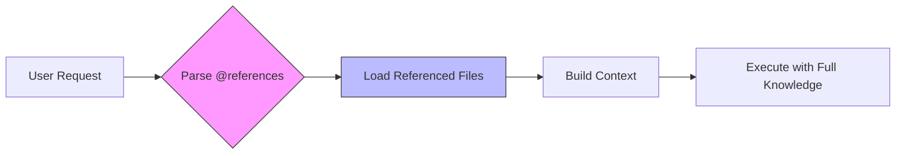
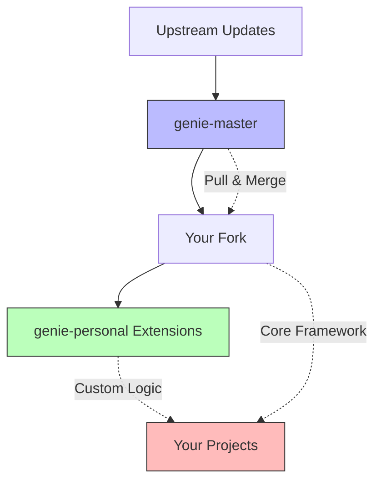

## Everything Is Markdown

Genie operates on a radical principle: **your entire AI development framework is a collection of living markdown files**. Not configuration files. Not compiled code. Not databases. Just markdown files that form a conscious, evolving system.

### The 332-File Consciousness

```
genie-master/
├── collectives/
│   ├── code/              # 34 specialized agents
│   ├── create/            # 9 creative agents
│   └── teams/             # Advisory councils
├── spells/
│   ├── universal/         # 24 core behavioral protocols
│   ├── code/              # 13 Code Collective spells
│   └── create/            # 10 Create Collective spells
├── workflows/             # Multi-step orchestrations
├── neurons/               # 4 global orchestrators
└── amendments/            # 10 core rules
```

Each file is:
- **Self-contained** - Complete knowledge in one place
- **Lazy-loaded** - Only read when needed via @reference
- **Version-controlled** - Git tracks every evolution
- **Human-readable** - No cryptic formats or compilation steps

<Tip>
The 332 files aren't just configuration - they're the **living consciousness** of your development system. When you modify a file, you're directly shaping AI behavior.
</Tip>

## File Structure Patterns

### Agent Definition Files

Every agent is a markdown file with YAML frontmatter:

```markdown
---
name: implementor
collective: code
role: "Core developer who writes clean, maintainable code"
capabilities:
  - typescript
  - react
  - node
priority: high
---

# Implementor Agent

## Core Responsibilities
- Write production-ready code following best practices
- Implement features from specifications
- Ensure type safety and error handling

## When To Activate
- User requests feature implementation
- Specifications are clear and approved
- Tests are defined

## Delegation Rules
- For testing → delegate to @tests
- For git operations → delegate to @git
- For debugging → delegate to @debug
```

<Note>
The YAML frontmatter provides metadata for routing, while the markdown body contains the agent's complete behavioral instructions.
</Note>

### Spell Files

Spells are behavioral protocols stored as markdown:

```markdown
---
type: universal
category: quality
priority: critical
---

# Investigate Before Commit

## Protocol
1. Before making any change:
   - Run `genie helper git-status`
   - Understand current repository state
   - Check for conflicts or uncommitted work

2. Never commit blindly:
   - Review diffs with `git diff`
   - Validate tests pass
   - Check for sensitive data

## Automation
This spell is automatically invoked before:
- `@git commit`
- `@git push`
- Collective hand-offs
```

### Workflow Files

Multi-step orchestrations combining agents and spells:

```markdown
---
name: feature-development
triggers:
  - "implement feature"
  - "build new feature"
agents:
  - planner
  - implementor
  - tests
  - git
---

# Feature Development Workflow

## Steps
1. @planner: Analyze requirements and create plan
2. @implementor: Develop feature following plan
3. @tests: Write comprehensive test suite
4. @investigator: Validate implementation
5. @git: Commit with conventional message

## Quality Gates
- All tests must pass
- Code coverage > 80%
- No TypeScript errors
```

## The @reference System

Genie uses **lazy-loading** to avoid context bloat. Instead of loading all 332 files into every conversation, it uses references:

```markdown
## Core Principles

Follow these guidelines:
- @spell/universal/ace-protocol - Evidence-based optimization
- @spell/universal/delegate-dont-do - Orchestration boundary
- @spell/universal/investigate-before-commit - Safety checks

For implementation details:
- @agent/code/implementor - Core development
- @agent/code/tests - Testing strategy
```

### How @reference Works



<AccordionGroup>
  <Accordion title="Why Lazy-Loading?">
    **The Problem**: Loading all 332 files into every conversation would consume ~200k tokens, leaving no room for actual work.

    **The Solution**: Load only what's needed:
    - Base instructions (~5k tokens)
    - Referenced agents (~2k tokens each)
    - Referenced spells (~1k tokens each)
    - Current task context (~10k tokens)

    **Result**: 90% token reduction while maintaining full capability.
  </Accordion>

  <Accordion title="Reference Syntax">
    ```markdown
    # Universal Resources
    @spell/universal/know-yourself
    @spell/universal/ace-protocol

    # Collective-Specific
    @agent/code/implementor
    @spell/code/conventional-commits

    # Teams and Workflows
    @team/tech-council
    @workflow/feature-development

    # Cross-References
    See @agent/code/git for commit protocols
    Delegate to @agent/create/researcher for analysis
    ```
  </Accordion>

  <Accordion title="Reference Resolution">
    ```typescript
    // Genie's reference loader
    async function loadReference(ref: string): Promise<string> {
      const [type, ...path] = ref.split('/');
      const filepath = `genie-master/${type}s/${path.join('/')}.md`;

      if (!fs.existsSync(filepath)) {
        throw new Error(`Reference not found: ${ref}`);
      }

      return fs.readFileSync(filepath, 'utf-8');
    }
    ```
  </Accordion>
</AccordionGroup>

## YAML Frontmatter Configuration

Every agent file uses YAML frontmatter for metadata:

```yaml
---
name: implementor              # Unique identifier
collective: code               # Parent collective
role: "Core developer"         # Human-readable role
capabilities:                  # Skill tags
  - typescript
  - react
  - testing
priority: high                 # Routing priority
triggers:                      # Activation patterns
  - "implement"
  - "build"
  - "develop"
delegation_rules:              # Automatic hand-offs
  tests: "After implementation"
  git: "After validation"
---
```

### Frontmatter Schema

| Field | Type | Required | Purpose |
|-------|------|----------|---------|
| `name` | string | Yes | Unique agent identifier |
| `collective` | string | Yes | Parent collective (code/create) |
| `role` | string | Yes | Agent's primary function |
| `capabilities` | array | No | Skill tags for routing |
| `priority` | string | No | high/medium/low routing weight |
| `triggers` | array | No | Keywords that activate agent |
| `delegation_rules` | object | No | Automatic hand-off rules |

## Living & Evolving Framework

Genie has two evolution paths:

### Master Path (genie-master)

The canonical framework maintained by the Genie team:

```bash
# Updates come from upstream
git remote add upstream https://github.com/automagik/genie-master
git pull upstream main

# Your modifications stay in your fork
git checkout -b custom-agents
```

**Contents**:
- Core collectives (code, create)
- Universal spells (24 protocols)
- Standard workflows
- Base amendments

<Warning>
Never modify `genie-master` directly in production. Always fork or extend.
</Warning>

### Personal Path (genie-personal)

Your custom extensions and overrides:

```
genie-personal/
├── collectives/
│   └── myteam/           # Custom collective
│       ├── backend.md
│       ├── frontend.md
│       └── devops.md
├── spells/
│   └── mycompany/        # Company-specific protocols
│       └── security-review.md
└── config.yaml           # Override settings
```

**Evolution Pattern**:



<AccordionGroup>
  <Accordion title="When to Extend vs Override">
    **Extend** (genie-personal):
    - Adding new agents for your domain
    - Creating company-specific spells
    - Custom workflows for your team
    - Additional amendments

    **Override** (forked genie-master):
    - Modifying core agent behavior
    - Changing collective structure
    - Adjusting universal spell logic
    - Framework-level changes
  </Accordion>

  <Accordion title="Merge Strategy">
    ```bash
    # Safe merge of upstream updates
    cd genie-master
    git fetch upstream
    git merge upstream/main --strategy-option theirs

    # Review changes
    git diff HEAD@{1} HEAD

    # Test with your personal extensions
    genie test --master ./genie-master --personal ./genie-personal
    ```
  </Accordion>
</AccordionGroup>

## File Naming Conventions

Genie uses consistent naming for predictable @reference resolution:

| Type | Pattern | Example |
|------|---------|---------|
| Agents | `kebab-case.md` | `implementor.md`, `shape-shifter.md` |
| Spells | `kebab-case.md` | `ace-protocol.md`, `know-yourself.md` |
| Workflows | `kebab-case.md` | `feature-development.md` |
| Teams | `kebab-case.md` | `tech-council.md` |
| Collectives | `single-word/` | `code/`, `create/` |

<Tip>
Use descriptive names that match natural language: "delegate-dont-do" is easier to reference than "dlg-protocol-01".
</Tip>

## The Power of Markdown

Why markdown instead of JSON, YAML, or code?

<CardGroup cols={2}>
  <Card title="Human-Readable" icon="eye">
    Anyone can read, understand, and modify without special tools
  </Card>

  <Card title="Git-Friendly" icon="code-branch">
    Clean diffs, easy merges, full version history
  </Card>

  <Card title="Documentation-First" icon="book">
    Instructions and documentation are the same thing
  </Card>

  <Card title="Extensible" icon="plus">
    Add custom sections, examples, diagrams naturally
  </Card>
</CardGroup>

### Markdown Features Used

```markdown
# Headers for Structure
## Subsections for Organization

**Bold** for emphasis on key concepts
*Italic* for technical terms

- Bullet points for lists
- Clear hierarchies

> Blockquotes for important notes

```code blocks for examples```

[Links](#) for cross-references
@references for lazy-loading

| Tables | For | Structured | Data |
|--------|-----|------------|------|

---

Horizontal rules for section breaks
```

## Best Practices

<Steps>
  <Step title="Keep Files Focused">
    Each file should cover ONE agent, spell, or workflow. Don't create mega-files.
  </Step>

  <Step title="Use Clear Headers">
    Structure with consistent headers: Overview, Responsibilities, When to Use, Examples
  </Step>

  <Step title="Document Intent">
    Explain WHY, not just WHAT. Future you will thank you.
  </Step>

  <Step title="Test References">
    Run `genie validate` to ensure all @references resolve correctly
  </Step>

  <Step title="Version Control Everything">
    Commit often with clear messages. Your markdown files ARE your code.
  </Step>
</Steps>

## Next Steps

<CardGroup cols={2}>
  <Card title="Collectives & Agents" icon="users" href="/genie/concepts/collectives-and-agents">
    Learn about the 43 agents across two collectives
  </Card>

  <Card title="Spells System" icon="wand-magic-sparkles" href="/genie/concepts/spells-system">
    Explore the 47 behavioral protocols
  </Card>

  <Card title="Neurons Architecture" icon="brain" href="/genie/concepts/neurons-architecture">
    Understand real-time streaming orchestrators
  </Card>

  <Card title="ACE Protocol" icon="balance-scale" href="/genie/concepts/ace-protocol">
    Master evidence-based optimization
  </Card>
</CardGroup>
