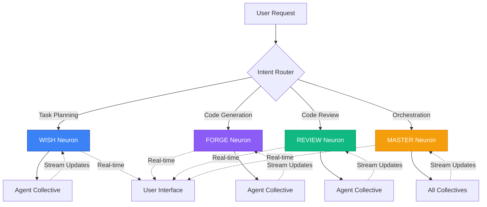

<Warning>
**Development Status:** The neuron architecture is implemented in code but NOT wired up in MCP capabilities (commented out in server.ts). This is a deep technical concept for understanding the codebase, not a feature you can use yet.
</Warning>

## The Revolutionary Difference

Traditional AI orchestration uses **polling**: repeatedly asking "are you done yet?" Genie's Neurons use **real-time streaming**: updates flow continuously as they happen.

<CardGroup cols={2}>
  <Card title="Traditional (Polling)" icon="clock" color="#ef4444">
    ```typescript
    // Check every 100ms if agent is done
    while (!isDone) {
      await sleep(100);
      const status = await checkStatus();
      if (status === 'complete') break;
    }
    ```
  </Card>

  <Card title="Neurons (Streaming)" icon="bolt" color="#10b981">
    ```typescript
    // Real-time updates as they happen
    neuron.stream((update) => {
      console.log('Progress:', update.progress);
      console.log('Output:', update.output);
    });
    ```
  </Card>
</CardGroup>

### Why This Matters

| Aspect | Traditional Polling | Neurons Streaming |
|--------|-------------------|-------------------|
| **Latency** | 50-500ms delay per update | <10ms real-time |
| **Efficiency** | Wasteful constant checking | Event-driven, zero waste |
| **User Experience** | Choppy, delayed feedback | Smooth, immediate feedback |
| **Resource Usage** | High CPU from polling loop | Minimal, event-driven |
| **Scalability** | Poor (N agents = N polls) | Excellent (event multiplexing) |

<Tip>
Think WebSocket vs HTTP polling - same paradigm shift, applied to AI orchestration.
</Tip>

## The 4 Global Orchestrators

Genie's Neurons are **global orchestrators** that coordinate all agent activity in specific domains:



### WISH Neuron

**Purpose**: Task planning and requirement gathering

<Accordion title="WISH Neuron Deep Dive">
```markdown
# WISH (What I Should Have)

## Capabilities

- **Requirement Elicitation**: Ask clarifying questions
- **Task Decomposition**: Break complex requests into steps
- **Priority Assessment**: Determine task order
- **Resource Planning**: Estimate time and agents needed
- **Feasibility Analysis**: Validate if request is achievable

## Activation Triggers

- User request starts with planning keywords
- Complex multi-step tasks
- Ambiguous requirements
- New feature requests
- Project initialization

## Example Flow

```typescript
// User: "Build a todo app with authentication"

WISH.stream(async (update) => {
  // Step 1: Clarify requirements
  update.ask([
    "What auth method? (JWT, OAuth, Sessions)",
    "Database preference? (PostgreSQL, MongoDB, SQLite)",
    "Frontend framework? (React, Vue, Svelte)"
  ]);

  // User responds: JWT, PostgreSQL, React

  // Step 2: Decompose task
  update.plan({
    tasks: [
      { id: 1, desc: "Setup project structure", agent: "@scaffold" },
      { id: 2, desc: "Database schema design", agent: "@database" },
      { id: 3, desc: "Auth API endpoints", agent: "@backend" },
      { id: 4, desc: "Todo CRUD operations", agent: "@backend" },
      { id: 5, desc: "React components", agent: "@frontend" },
      { id: 6, desc: "Integration tests", agent: "@tests" }
    ],
    dependencies: {
      2: [],        // No dependencies
      3: [2],       // Auth needs DB schema
      4: [2, 3],    // Todo needs DB and Auth
      5: [4],       // Frontend needs backend
      6: [3, 4, 5]  // Tests need everything
    }
  });

  // Step 3: Estimate effort
  update.estimate({
    totalTime: "4-6 hours",
    complexity: "medium",
    confidence: "high"
  });
});
```

## Streaming Protocol

```typescript
interface WISHUpdate {
  type: 'question' | 'plan' | 'estimate' | 'complete';
  progress: number;  // 0-100
  data: {
    questions?: Question[];
    plan?: TaskPlan;
    estimate?: Estimate;
  };
}

// Real-time updates
WISH.on('update', (update: WISHUpdate) => {
  renderUI(update);  // Immediately reflect in UI
});
```
```
</Accordion>

### FORGE Neuron

**Purpose**: Code generation and implementation

<Accordion title="FORGE Neuron Deep Dive">
```markdown
# FORGE (Feature Orchestrator for Rapid Generation Excellence)

## Capabilities

- **Code Generation**: Write production-ready code
- **Pattern Application**: Use framework best practices
- **Type Safety**: Ensure TypeScript correctness
- **Error Handling**: Implement robust error management
- **Integration**: Connect with existing codebase
- **Incremental Building**: Add to existing features

## Activation Triggers

- Implementation requests
- Feature development
- Code scaffolding
- Refactoring tasks
- Architecture realization

## Streaming Implementation

```typescript
// User: "Implement user registration endpoint"

FORGE.stream(async (update) => {
  // Step 1: Analyze context
  update.analyzing({
    existingFiles: ['src/auth/login.ts', 'src/db/users.ts'],
    patterns: ['Express middleware', 'Prisma ORM'],
    dependencies: ['bcrypt', 'joi']
  });

  // Step 2: Generate types
  update.generating({
    file: 'src/types/auth.ts',
    content: `
      export interface RegisterRequest {
        email: string;
        password: string;
        name: string;
      }

      export interface RegisterResponse {
        userId: string;
        token: string;
      }
    `
  });

  // Step 3: Generate validation
  update.generating({
    file: 'src/validation/auth.ts',
    content: `
      import Joi from 'joi';

      export const registerSchema = Joi.object({
        email: Joi.string().email().required(),
        password: Joi.string().min(8).required(),
        name: Joi.string().min(2).required()
      });
    `
  });

  // Step 4: Generate endpoint
  update.generating({
    file: 'src/routes/auth.ts',
    content: `
      import { Router } from 'express';
      import { registerSchema } from '../validation/auth';
      import { UserService } from '../services/user';

      export const authRouter = Router();

      authRouter.post('/register', async (req, res) => {
        try {
          // Validate input
          const { error, value } = registerSchema.validate(req.body);
          if (error) {
            return res.status(400).json({ error: error.message });
          }

          // Create user
          const result = await UserService.register(value);
          res.status(201).json(result);
        } catch (error) {
          console.error('Registration error:', error);
          res.status(500).json({ error: 'Registration failed' });
        }
      });
    `
  });

  // Step 5: Delegate to tests
  update.delegating({
    to: '@tests',
    task: 'Write integration tests for registration endpoint'
  });

  // Step 6: Complete
  update.complete({
    filesCreated: 3,
    linesOfCode: 87,
    nextSteps: ['Run tests', 'Review security']
  });
});
```

## Real-Time Code Streaming

```typescript
// Watch code generation in real-time
FORGE.on('token', (token: string) => {
  // Each token as it's generated
  editor.append(token);
});

FORGE.on('file-complete', (file: GeneratedFile) => {
  // File finished generating
  workspace.addFile(file);
});
```

## Integration with Collectives

```typescript
// FORGE orchestrates Code Collective
FORGE.coordinate([
  { agent: '@implementor', task: 'Write core logic' },
  { agent: '@tests', task: 'Write test suite' },
  { agent: '@git', task: 'Commit changes' }
], {
  mode: 'sequential',
  streaming: true
});
```
```
</Accordion>

### REVIEW Neuron

**Purpose**: Code review and quality assurance

<Accordion title="REVIEW Neuron Deep Dive">
```markdown
# REVIEW (Review Engine for Verification & Inspection Excellence)

## Capabilities

- **Code Quality Analysis**: Detect anti-patterns
- **Security Auditing**: Find vulnerabilities
- **Performance Review**: Identify bottlenecks
- **Test Coverage**: Verify comprehensive testing
- **Documentation Check**: Ensure clarity
- **Best Practices**: Enforce standards

## Activation Triggers

- Pull request creation
- Pre-commit hooks
- Manual review requests
- CI/CD pipeline integration
- Scheduled audits

## Multi-Dimensional Review

```typescript
// User: "Review this PR"

REVIEW.stream(async (update) => {
  // Step 1: Load PR context
  update.loading({
    files: 12,
    additions: 347,
    deletions: 89,
    commits: 5
  });

  // Step 2: Parallel analysis
  const analyses = await REVIEW.parallel([
    { agent: '@reviewer', focus: 'code-quality' },
    { agent: '@security', focus: 'vulnerabilities' },
    { agent: '@performance', focus: 'optimization' },
    { agent: '@tests', focus: 'coverage' }
  ]);

  // Stream each analysis as it completes
  for await (const analysis of analyses) {
    update.analysis({
      agent: analysis.agent,
      findings: analysis.findings,
      severity: analysis.severity,
      recommendations: analysis.recommendations
    });
  }

  // Step 3: Synthesize findings
  update.synthesizing({
    totalFindings: 23,
    blocking: 2,
    warnings: 8,
    suggestions: 13
  });

  // Step 4: Generate review
  update.complete({
    decision: 'REQUEST_CHANGES',
    summary: 'Security vulnerabilities must be addressed',
    blockingIssues: [
      {
        file: 'src/auth.ts',
        line: 42,
        severity: 'critical',
        issue: 'SQL injection vulnerability',
        fix: 'Use parameterized queries'
      },
      {
        file: 'src/api.ts',
        line: 89,
        severity: 'critical',
        issue: 'Missing authentication check',
        fix: 'Add auth middleware'
      }
    ]
  });
});
```

## Review Streaming Protocol

```typescript
interface ReviewUpdate {
  type: 'analyzing' | 'finding' | 'complete';
  progress: number;
  data: {
    file?: string;
    line?: number;
    severity?: 'info' | 'warning' | 'error' | 'critical';
    message?: string;
    fix?: string;
  };
}

// Real-time review feedback
REVIEW.on('update', (update: ReviewUpdate) => {
  if (update.type === 'finding') {
    highlightCode(update.data.file, update.data.line);
    showSuggestion(update.data.message, update.data.fix);
  }
});
```

## GitHub Integration

```typescript
// Automatically comment on PR
REVIEW.integrate('github', {
  onFinding: (finding) => {
    github.createReviewComment({
      path: finding.file,
      line: finding.line,
      body: finding.message
    });
  },
  onComplete: (summary) => {
    github.submitReview({
      event: summary.decision,  // APPROVE | REQUEST_CHANGES | COMMENT
      body: summary.summary
    });
  }
});
```
```
</Accordion>

### MASTER Neuron

**Purpose**: High-level orchestration and coordination

<Accordion title="MASTER Neuron Deep Dive">
```markdown
# MASTER (Multi-Agent System for Task Execution & Routing)

## Capabilities

- **Global Coordination**: Orchestrate all collectives
- **Workflow Execution**: Run multi-step workflows
- **Resource Management**: Optimize agent allocation
- **Conflict Resolution**: Handle competing priorities
- **State Management**: Track system-wide state
- **Learning & Adaptation**: Improve over time

## Activation Triggers

- Complex multi-collective tasks
- Workflow execution
- System-wide operations
- Conflict resolution needed
- Learning/optimization requests

## Orchestration Example

```typescript
// User: "Complete the e-commerce feature"

MASTER.stream(async (update) => {
  // Step 1: Decompose across neurons
  update.orchestrating({
    WISH: "Plan feature requirements",
    FORGE: "Implement backend and frontend",
    REVIEW: "Quality assurance"
  });

  // Step 2: Execute WISH planning
  const plan = await MASTER.execute(WISH, {
    task: "Plan e-commerce checkout flow"
  });

  update.planComplete(plan);

  // Step 3: Parallel implementation via FORGE
  const implementations = await MASTER.parallel([
    FORGE.implement(plan.tasks.backend),
    FORGE.implement(plan.tasks.frontend),
    FORGE.implement(plan.tasks.database)
  ]);

  update.implementationProgress(implementations);

  // Step 4: Review via REVIEW
  const review = await MASTER.execute(REVIEW, {
    targets: implementations
  });

  if (review.hasBlockingIssues) {
    // Step 5: Fix issues via FORGE
    const fixes = await MASTER.execute(FORGE, {
      task: "Fix review findings",
      context: review.blockingIssues
    });

    // Step 6: Re-review
    await MASTER.execute(REVIEW, {
      targets: fixes
    });
  }

  // Step 7: Complete
  update.complete({
    workflow: 'e-commerce-feature',
    duration: '2.5 hours',
    outcome: 'success',
    artifacts: {
      commits: 8,
      files: 23,
      tests: 47,
      coverage: '94%'
    }
  });
});
```

## State Management

```typescript
// MASTER maintains global state
interface SystemState {
  activeNeurons: Map<string, NeuronState>;
  agentPool: Map<string, AgentState>;
  taskQueue: Task[];
  memory: SharedMemory;
  metrics: SystemMetrics;
}

// Access state from anywhere
const state = MASTER.getState();
console.log('Active agents:', state.agentPool.size);
console.log('Pending tasks:', state.taskQueue.length);
```

## Learning & Optimization

```typescript
// MASTER learns from outcomes
MASTER.learn({
  task: 'feature-implementation',
  plan: originalPlan,
  execution: actualExecution,
  outcome: 'success',
  metrics: {
    estimatedTime: '4 hours',
    actualTime: '3.5 hours',
    quality: 'high',
    efficiency: 0.95
  }
});

// Future similar tasks use learned patterns
const optimizedPlan = MASTER.plan('similar-feature', {
  useLearnings: true
});
```
```
</Accordion>

## Comparison Table: Traditional vs Neurons

| Feature | Traditional Orchestration | Genie Neurons |
|---------|--------------------------|---------------|
| **Communication** | Request/Response (polling) | Event Stream (push) |
| **Latency** | 50-500ms per update | <10ms real-time |
| **Progress Tracking** | Periodic status checks | Continuous streaming |
| **Resource Usage** | High (constant polling) | Low (event-driven) |
| **Scalability** | O(n) agents = O(n) polls | O(n) agents = O(1) stream |
| **User Experience** | Choppy, delayed | Smooth, immediate |
| **State Management** | Distributed, inconsistent | Centralized, consistent |
| **Error Recovery** | Retry on timeout | Immediate failure notification |
| **Debugging** | Difficult (async polling) | Easy (event trace) |

## JsonPatch Streaming Protocol

Neurons use **JsonPatch** for efficient state updates:

```typescript
// Traditional: Send entire state on each update
{
  agents: [...all agents...],
  tasks: [...all tasks...],
  progress: 45
}
// Problem: Wasteful, especially for large states

// Neurons: Send only changes
[
  { op: "replace", path: "/progress", value: 45 },
  { op: "add", path: "/tasks/-", value: newTask },
  { op: "remove", path: "/tasks/3" }
]
// Benefit: 10-100x smaller payloads
```

### JsonPatch Operations

<AccordionGroup>
  <Accordion title="Add Operation">
    ```typescript
    // Add new task to queue
    {
      op: "add",
      path: "/tasks/-",  // - means append to array
      value: {
        id: "task-123",
        description: "Implement feature",
        status: "pending"
      }
    }
    ```
  </Accordion>

  <Accordion title="Replace Operation">
    ```typescript
    // Update task status
    {
      op: "replace",
      path: "/tasks/0/status",
      value: "in_progress"
    }

    // Update progress
    {
      op: "replace",
      path: "/progress",
      value: 67
    }
    ```
  </Accordion>

  <Accordion title="Remove Operation">
    ```typescript
    // Remove completed task
    {
      op: "remove",
      path: "/tasks/2"
    }

    // Clear error
    {
      op: "remove",
      path: "/error"
    }
    ```
  </Accordion>

  <Accordion title="Move Operation">
    ```typescript
    // Reorder task priority
    {
      op: "move",
      from: "/tasks/3",
      path: "/tasks/0"
    }
    ```
  </Accordion>
</AccordionGroup>

### Applying Patches

```typescript
import { applyPatch } from 'fast-json-patch';

// Initial state
let state = {
  progress: 0,
  tasks: [],
  agents: []
};

// Apply streamed patches
neuron.on('patch', (patches) => {
  state = applyPatch(state, patches).newDocument;
  updateUI(state);
});
```

## EventEmitter-Based Implementation

Neurons are built on Node.js EventEmitter pattern:

```typescript
import { EventEmitter } from 'events';

class Neuron extends EventEmitter {
  constructor(name: string) {
    super();
    this.name = name;
    this.state = {};
  }

  // Stream updates
  stream(handler: (update: Update) => void) {
    this.on('update', handler);
  }

  // Emit update
  private emit(type: string, data: any) {
    const patch = this.createPatch(type, data);
    super.emit('update', patch);
    super.emit('patch', patch);
  }

  // Create JsonPatch from update
  private createPatch(type: string, data: any): JsonPatch {
    const patches = [];

    if (type === 'progress') {
      patches.push({
        op: 'replace',
        path: '/progress',
        value: data.progress
      });
    }

    if (type === 'task-complete') {
      patches.push({
        op: 'replace',
        path: `/tasks/${data.taskId}/status`,
        value: 'complete'
      });
    }

    return patches;
  }
}

// Usage
const forge = new Neuron('FORGE');

forge.stream((update) => {
  console.log('Update received:', update);
});

forge.emit('progress', { progress: 50 });
```

### Event Types

Each neuron emits standard events:

```typescript
neuron.on('start', (context) => {
  // Task started
});

neuron.on('progress', (update) => {
  // Progress update (0-100)
});

neuron.on('agent-activated', (agent) => {
  // Agent began work
});

neuron.on('agent-completed', (agent, result) => {
  // Agent finished work
});

neuron.on('error', (error) => {
  // Error occurred
});

neuron.on('complete', (result) => {
  // Task completed
});

neuron.on('patch', (patches) => {
  // JsonPatch state update
});
```

## WebSocket Communication

Neurons communicate with UIs via WebSocket:

```typescript
// Server-side neuron
import { WebSocketServer } from 'ws';

const wss = new WebSocketServer({ port: 3000 });

wss.on('connection', (ws) => {
  // Stream neuron updates to client
  FORGE.on('patch', (patches) => {
    ws.send(JSON.stringify({
      type: 'patch',
      neuron: 'FORGE',
      patches: patches
    }));
  });
});

// Client-side UI
const ws = new WebSocket('ws://localhost:3000');

ws.onmessage = (event) => {
  const message = JSON.parse(event.data);

  if (message.type === 'patch') {
    applyPatch(state, message.patches);
    render(state);
  }
};
```

### Real-Time Dashboard

```typescript
// React component with real-time updates
function NeuronDashboard() {
  const [state, setState] = useState({});

  useEffect(() => {
    const ws = new WebSocket('ws://localhost:3000');

    ws.onmessage = (event) => {
      const { patches } = JSON.parse(event.data);
      setState(current => applyPatch(current, patches).newDocument);
    };

    return () => ws.close();
  }, []);

  return (
    <div>
      <ProgressBar value={state.progress} />
      <TaskList tasks={state.tasks} />
      <AgentPool agents={state.agents} />
    </div>
  );
}
```

## Use Cases for Neurons

### 1. Interactive Development

```typescript
// Real-time code generation
FORGE.stream((update) => {
  if (update.type === 'generating') {
    editor.showProgress(update.file, update.progress);
  }
  if (update.type === 'complete') {
    editor.reveal(update.file);
  }
});
```

### 2. CI/CD Pipelines

```typescript
// Monitor build and deployment
MASTER.execute('deploy-production', {
  onProgress: (step) => {
    slack.notify(`Deployment step ${step.name}: ${step.status}`);
  },
  onComplete: (result) => {
    if (result.success) {
      slack.notify('✅ Deployment successful');
    } else {
      slack.alert('❌ Deployment failed');
    }
  }
});
```

### 3. Code Review Automation

```typescript
// Real-time review feedback
REVIEW.reviewPR(prNumber, {
  streamFindings: true,
  onFinding: (finding) => {
    github.commentOnLine(finding);
    vscode.highlightIssue(finding);
  }
});
```

### 4. Multi-Agent Research

```typescript
// Coordinate research collective
WISH.plan('comprehensive-market-research', {
  agents: ['@researcher', '@analyst', '@synthesizer'],
  onAgentComplete: (agent, findings) => {
    dashboard.updateSection(agent.name, findings);
  },
  onSynthesis: (insights) => {
    report.generate(insights);
  }
});
```

## Best Practices

<CardGroup cols={2}>
  <Card title="Use Appropriate Neuron" icon="bullseye">
    Choose the right neuron for the task: WISH for planning, FORGE for implementation, REVIEW for quality, MASTER for coordination.
  </Card>

  <Card title="Handle Events Properly" icon="check">
    Always attach error handlers to prevent unhandled exceptions.
  </Card>

  <Card title="Batch Updates" icon="layer-group">
    Group related patches into single emissions for efficiency.
  </Card>

  <Card title="Clean Up Listeners" icon="broom">
    Remove event listeners when done to prevent memory leaks.
  </Card>
</CardGroup>

### Anti-Patterns

<Warning>
**Blocking Operations**: Never block the event loop
```typescript
❌ // Bad - blocks streaming
while (processing) {
  // Synchronous work
}

✅ // Good - yields control
async function process() {
  for (const item of items) {
    await processItem(item);
    emit('progress', progress);
  }
}
```
</Warning>

<Warning>
**Excessive Emissions**: Don't spam events
```typescript
❌ // Bad - emits on every token
for (const token of tokens) {
  emit('token', token);
}

✅ // Good - batches updates
const batch = [];
for (const token of tokens) {
  batch.push(token);
  if (batch.length >= 10) {
    emit('tokens', batch);
    batch.length = 0;
  }
}
```
</Warning>

## Next Steps

<CardGroup cols={2}>
  <Card title="ACE Protocol" icon="balance-scale" href="/genie/concepts/ace-protocol">
    Learn evidence-based optimization
  </Card>

  <Card title="Amendments & Rules" icon="gavel" href="/genie/concepts/amendments-and-rules">
    Explore the 10 core rules
  </Card>

  <Card title="Spells System" icon="wand-magic-sparkles" href="/genie/concepts/spells-system">
    Back to behavioral protocols
  </Card>

  <Card title="API Reference" icon="code" href="/genie/api/neurons">
    Neuron API documentation
  </Card>
</CardGroup>
