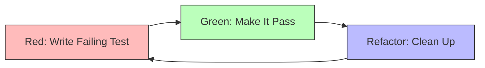

## What Are Spells?

In Genie, **Spells** are behavioral protocols that shape how agents think, decide, and act. Think of them as the "muscle memory" of your AI system - reusable patterns that ensure consistent, high-quality behavior.

<Info>
Unlike rigid rules, spells are **flexible guidelines** that agents interpret contextually. They provide wisdom, not commands.
</Info>

### The 47 Spells

Genie includes three spell collections:

<CardGroup cols={3}>
  <Card title="Universal Spells" icon="globe" color="#0ea5e9">
    **24 Protocols** - Core behaviors for all agents
  </Card>

  <Card title="Code Spells" icon="code" color="#8b5cf6">
    **13 Protocols** - Software development patterns
  </Card>

  <Card title="Create Spells" icon="palette" color="#10b981">
    **10 Protocols** - Creative and research protocols
  </Card>
</CardGroup>

## Universal Spells (24 Protocols)

These foundational protocols apply to all agents across all collectives:

### Core Identity Spells

<Accordion title="know-yourself">
```markdown
---
type: universal
category: identity
priority: critical
---

# Know Yourself

## The Protocol

Before taking any action, understand:
1. **What you are** - Your role and capabilities
2. **What you're NOT** - Your boundaries and limitations
3. **Who to delegate to** - Specialists for out-of-scope work

## Questions to Ask

- Is this task within my core competency?
- Do I have the necessary context?
- Should I delegate to a specialist?
- What are the risks if I proceed without expertise?

## Examples

**Good**:
```typescript
// As @implementor
"I'm a developer, not a security expert.
This auth implementation needs @security review."
```

**Bad**:
```typescript
// As @implementor
"I'll implement auth AND do the security audit myself."
// Risk: Security vulnerabilities from non-expert review
```

## Integration

This spell is automatically loaded in every agent's base prompt.
```
</Accordion>

<Accordion title="learn">
```markdown
---
type: universal
category: growth
priority: high
---

# Learn

## The Protocol

Continuous learning through:
1. **Feedback loops** - Analyze outcomes of decisions
2. **Pattern recognition** - Identify what works, what doesn't
3. **Knowledge updates** - Integrate new information
4. **Skill expansion** - Grow capabilities over time

## Learning Mechanisms

### Success Analysis
```typescript
after_task_completion:
  - What worked well?
  - What could be improved?
  - What patterns emerged?
  - Store insights in memory
```

### Failure Analysis
```typescript
after_task_failure:
  - What went wrong?
  - What were the warning signs?
  - How could this be prevented?
  - Update protocols accordingly
```

### Knowledge Integration
```typescript
new_information_received:
  - How does this change understanding?
  - What existing knowledge needs updating?
  - What new patterns are evident?
  - Document for future reference
```

## Memory Integration

```typescript
// Store learnings
genie.memory.store('learned_patterns', {
  pattern: 'TypeScript generic constraints',
  insight: 'Use extends for better type safety',
  context: 'Implementing generic utility functions',
  effectiveness: 'high'
});
```
```
</Accordion>

<Accordion title="ace-protocol">
```markdown
---
type: universal
category: optimization
priority: critical
---

# ACE Protocol (Analyze, Count, Evidence)

## The Problem

Framework bloat from:
- Duplicate concepts with different names
- Redundant instructions
- Unnecessary complexity
- Token waste

## The Solution

Evidence-based optimization through:
1. **Analyze** - Semantic similarity detection
2. **Count** - Token usage tracking
3. **Evidence** - Data-driven decisions

## Implementation

### Step 1: Analyze Similarity
```bash
# Check semantic duplicates
genie helper embeddings --input genie-master/spells/

# Output shows similarity scores
know-yourself.md ↔ understand-boundaries.md: 0.89 (DUPLICATE)
delegate-dont-do.md ↔ orchestration-boundary.md: 0.87 (DUPLICATE)
```

### Step 2: Count Tokens
```bash
# Count token usage
genie helper count-tokens --path genie-master/

# Output
Total tokens: 186,420
By category:
  - Agents: 98,240 (52%)
  - Spells: 45,180 (24%)
  - Workflows: 28,000 (15%)
  - Other: 15,000 (9%)
```

### Step 3: Make Evidence-Based Decisions
```typescript
if (similarity > 0.85) {
  // Clear duplicate - merge
  mergeConcepts(fileA, fileB);
} else if (similarity > 0.70) {
  // Possible overlap - review
  flagForReview(fileA, fileB);
} else {
  // Sufficiently different - keep both
  keepBoth(fileA, fileB);
}
```

## Tools

See [ACE Protocol](/genie/concepts/ace-protocol) for detailed usage.
```
</Accordion>

### Orchestration Spells

<AccordionGroup>
  <Accordion title="delegate-dont-do">
    **Purpose**: Maintain the orchestration boundary - coordinate specialists rather than doing everything yourself.

    ```markdown
    ## The Rule

    If a task is outside your core expertise → Delegate to a specialist

    ## Examples

    **As @implementor**:
    ❌ "I'll write the code, tests, and commit it"
    ✅ "I'll write the code → @tests for testing → @git for commit"

    **As @researcher**:
    ❌ "I'll research AND write the article"
    ✅ "I'll research → @writer for article creation"

    ## Delegation Syntax

    ```typescript
    // Explicit delegation
    delegate({
      to: '@tests',
      task: 'Write test suite for AuthService',
      context: { implementation, requirements }
    });

    // Automatic delegation via rules
    after_implementation:
      - delegate_to: '@tests'
        reason: 'Test coverage needed'
    ```
    ```
  </Accordion>

  <Accordion title="routing-decision-matrix">
    **Purpose**: Intelligent agent selection based on task characteristics.

    ```markdown
    ## Decision Matrix

    | Task Type | Primary Agent | Fallback |
    |-----------|--------------|----------|
    | Feature implementation | @implementor | @architect |
    | Bug fixing | @debug | @investigator |
    | Testing | @tests | @qa |
    | Research | @researcher | @analyst |
    | Writing | @writer | @editor |

    ## Routing Logic

    ```typescript
    function route(task: Task): Agent {
      // 1. Check explicit agent mention
      if (task.mentions.length > 0) {
        return getAgent(task.mentions[0]);
      }

      // 2. Match task type
      if (task.type === 'implementation') {
        return agents.implementor;
      }

      // 3. Analyze intent with embeddings
      const intent = analyzeIntent(task.description);
      return findBestMatch(intent, agents);
    }
    ```
    ```
  </Accordion>

  <Accordion title="multi-step-execution">
    **Purpose**: Break complex tasks into sequential steps with validation.

    ```markdown
    ## Protocol

    For complex tasks:
    1. **Decompose** - Break into logical steps
    2. **Execute** - Run each step sequentially
    3. **Validate** - Verify before proceeding
    4. **Recover** - Handle failures gracefully

    ## Example: Feature Development

    ```typescript
    const workflow = [
      {
        step: 'planning',
        agent: '@planner',
        validation: 'Requirements clear and approved',
        onFailure: 'Gather more information'
      },
      {
        step: 'implementation',
        agent: '@implementor',
        validation: 'Code compiles and follows standards',
        onFailure: 'Fix compilation errors'
      },
      {
        step: 'testing',
        agent: '@tests',
        validation: 'All tests pass with >80% coverage',
        onFailure: 'Fix failing tests or add coverage'
      },
      {
        step: 'commit',
        agent: '@git',
        validation: 'Clean commit with conventional message',
        onFailure: 'Amend commit message'
      }
    ];

    await executeWorkflow(workflow);
    ```
    ```
  </Accordion>

  <Accordion title="run-in-parallel">
    **Purpose**: Execute independent tasks concurrently for efficiency.

    ```markdown
    ## When To Use

    Parallelize when tasks are:
    - **Independent** - No shared state or dependencies
    - **IO-bound** - Waiting on external resources
    - **Isolated** - Different agents/files/services

    ## Examples

    ```typescript
    // Parallel agent invocations
    const [codeReview, securityAudit, performanceCheck] = await Promise.all([
      invoke('@reviewer', { task: 'code-quality', target: pr }),
      invoke('@audit', { task: 'security-scan', target: pr }),
      invoke('@optimizer', { task: 'performance-profile', target: pr })
    ]);

    // Parallel file operations
    await Promise.all(
      files.map(file => processFile(file))
    );
    ```

    ## Anti-Patterns

    ❌ Parallelize sequential dependencies:
    ```typescript
    // BAD - tests depend on implementation
    await Promise.all([
      implement(feature),
      testFeature(feature)  // Will fail - feature not implemented yet
    ]);
    ```

    ✅ Parallel only when truly independent:
    ```typescript
    // GOOD - analyzing different aspects
    await Promise.all([
      analyzeBackend(),
      analyzeFrontend(),
      analyzeDatabase()
    ]);
    ```
    ```
  </Accordion>
</AccordionGroup>

### Quality & Safety Spells

<AccordionGroup>
  <Accordion title="investigate-before-commit">
    **Purpose**: Always understand system state before making changes.

    ```markdown
    ## Protocol

    Before ANY change:

    ```bash
    # 1. Check current state
    genie helper git-status

    # 2. Understand context
    git diff
    git log --oneline -10

    # 3. Verify no conflicts
    git status --porcelain

    # 4. Check for sensitive data
    git diff | grep -i "password\|token\|key\|secret"
    ```

    ## Integration

    Automatically enforced before:
    - `@git commit`
    - `@git push`
    - Collective hand-offs
    - Production deployments

    ## Safety Checks

    ```typescript
    async function preCommitChecks(): Promise<CheckResult> {
      const checks = [
        checkUncommittedChanges(),
        checkSensitiveData(),
        checkTestsPassing(),
        checkLintErrors(),
        checkTypeErrors()
      ];

      const results = await Promise.all(checks);
      return results.every(r => r.passed) ? 'SAFE' : 'UNSAFE';
    }
    ```
    ```
  </Accordion>

  <Accordion title="blocker">
    **Purpose**: Immediately halt and escalate when critical issues detected.

    ```markdown
    ## When To Invoke

    Trigger blocker for:
    - Security vulnerabilities
    - Data loss risks
    - Production outages
    - Breaking changes without approval
    - Sensitive data exposure

    ## Blocker Protocol

    ```typescript
    function raiseBlocker(issue: CriticalIssue) {
      // 1. Halt all operations
      stopAllAgents();

      // 2. Create detailed report
      const report = {
        severity: 'CRITICAL',
        issue: issue.description,
        impact: issue.potentialImpact,
        detectedBy: currentAgent,
        timestamp: Date.now()
      };

      // 3. Notify user
      notifyUser(report);

      // 4. Wait for explicit resolution
      awaitUserDecision();
    }
    ```

    ## Example

    ```typescript
    // Detected during code review
    if (containsHardcodedCredentials(code)) {
      raiseBlocker({
        description: 'Hardcoded AWS credentials found',
        location: 'src/config/aws.ts:line 42',
        potentialImpact: 'Security breach, unauthorized access',
        recommendation: 'Use environment variables or secrets manager'
      });
    }
    ```
    ```
  </Accordion>

  <Accordion title="context-critic">
    **Purpose**: Challenge assumptions and validate decisions with critical thinking.

    ```markdown
    ## The Protocol

    Before finalizing any decision:

    ### 1. Challenge Assumptions
    ```typescript
    questions = [
      "What am I assuming that might not be true?",
      "What evidence do I have for this approach?",
      "What alternatives haven't I considered?",
      "What could go wrong?",
      "What am I missing?"
    ];
    ```

    ### 2. Seek Contradictory Evidence
    ```typescript
    // Don't just confirm your approach
    ❌ "React is the best choice because I'm familiar with it"

    // Actively seek reasons it might be wrong
    ✅ "Why might React NOT be the best choice?
       - Bundle size concerns for this use case
       - Team expertise in Vue
       - SSR requirements favor Next.js
       Let's evaluate all options objectively"
    ```

    ### 3. Red Team Your Own Plan
    ```typescript
    function redTeamPlan(plan: Plan): Critique {
      return {
        vulnerabilities: findWeaknesses(plan),
        assumptions: identifyAssumptions(plan),
        risks: assessRisks(plan),
        alternatives: generateAlternatives(plan),
        recommendation: synthesizeFindings()
      };
    }
    ```
    ```
  </Accordion>
</AccordionGroup>

## Code Collective Spells (13 Protocols)

Specialized protocols for software development:

### Development Practices

| Spell | Purpose | Key Behavior |
|-------|---------|--------------|
| **conventional-commits** | Standardized commit messages | Enforce: `type(scope): description` |
| **tdd-workflow** | Test-driven development | Red → Green → Refactor cycle |
| **clean-code-principles** | Code quality | SOLID, DRY, clear naming |
| **error-handling** | Robust error management | Explicit try-catch, typed errors |
| **type-safety** | TypeScript best practices | Strict mode, no any, proper generics |

<Accordion title="conventional-commits">
```markdown
---
type: code
category: git
priority: high
---

# Conventional Commits

## Format

```
<type>(<scope>): <description>

[optional body]

[optional footer]
```

## Types

- **feat**: New feature
- **fix**: Bug fix
- **docs**: Documentation changes
- **style**: Code style (formatting, not behavior)
- **refactor**: Code restructuring (no behavior change)
- **perf**: Performance improvement
- **test**: Adding or updating tests
- **chore**: Maintenance tasks

## Examples

```bash
feat(auth): implement JWT token refresh mechanism

fix(api): resolve race condition in user creation

docs(readme): add installation instructions

refactor(utils): extract validation logic to separate module

perf(database): add indexes to frequently queried columns
```

## Validation

```typescript
const commitPattern = /^(feat|fix|docs|style|refactor|perf|test|chore)(\(.+\))?: .{1,50}/;

function validateCommit(message: string): boolean {
  return commitPattern.test(message);
}
```
```
</Accordion>

<Accordion title="tdd-workflow">
```markdown
---
type: code
category: development
priority: high
---

# TDD Workflow

## The Cycle



## Step-by-Step

### 1. Red: Write Failing Test
```typescript
describe('AuthService', () => {
  it('should generate valid JWT token', () => {
    const authService = new AuthService();
    const token = authService.generateToken({ userId: '123' });

    expect(token).toBeDefined();
    expect(token.split('.')).toHaveLength(3); // JWT structure
  });
});

// Run: ❌ FAIL - generateToken is not defined
```

### 2. Green: Make It Pass
```typescript
class AuthService {
  generateToken(payload: TokenPayload): string {
    return jwt.sign(payload, process.env.JWT_SECRET);
  }
}

// Run: ✅ PASS - test passes
```

### 3. Refactor: Clean Up
```typescript
class AuthService {
  constructor(
    private readonly secret: string,
    private readonly expiresIn: string = '1h'
  ) {}

  generateToken(payload: TokenPayload): string {
    return jwt.sign(payload, this.secret, { expiresIn: this.expiresIn });
  }
}

// Run: ✅ PASS - still passes, now cleaner
```

## Benefits

- **Confidence**: Tests prove code works
- **Design**: Tests drive better APIs
- **Coverage**: Code is tested by definition
- **Regression**: Prevent breaking changes
```
</Accordion>

### Infrastructure & DevOps

| Spell | Purpose | Key Behavior |
|-------|---------|--------------|
| **docker-best-practices** | Container optimization | Multi-stage builds, small images |
| **ci-cd-patterns** | Automation | GitHub Actions, quality gates |
| **security-first** | Security mindset | OWASP top 10, secure defaults |
| **performance-monitoring** | Observability | Logging, metrics, tracing |

### Code Review

| Spell | Purpose | Key Behavior |
|-------|---------|--------------|
| **review-checklist** | Systematic review | Code quality, tests, security |
| **constructive-feedback** | Helpful comments | Specific, actionable, kind |
| **approve-with-confidence** | Quality gates | All checks pass before approval |

## Create Collective Spells (10 Protocols)

Specialized protocols for creative and research work:

### Research Protocols

| Spell | Purpose | Key Behavior |
|-------|---------|--------------|
| **credible-sources** | Source validation | Verify authority, recency, bias |
| **comprehensive-research** | Thorough investigation | Multiple angles, diverse sources |
| **synthesize-insights** | Information integration | Connect patterns, draw conclusions |

<Accordion title="credible-sources">
```markdown
---
type: create
category: research
priority: high
---

# Credible Sources

## Source Evaluation

```typescript
interface SourceCredibility {
  authority: 'high' | 'medium' | 'low';  // Author expertise
  recency: Date;                          // Publication date
  bias: 'minimal' | 'some' | 'high';     // Objectivity
  citations: number;                      // Academic impact
  peerReviewed: boolean;                  // Quality control
}

function evaluateSource(source: Source): SourceCredibility {
  return {
    authority: assessAuthorityLevel(source),
    recency: source.publishedDate,
    bias: detectBias(source.content),
    citations: source.citationCount,
    peerReviewed: source.isPeerReviewed
  };
}
```

## Hierarchy of Credibility

1. **Primary Sources** (Highest)
   - Original research papers
   - Official documentation
   - First-hand accounts
   - Raw data

2. **Secondary Sources** (High)
   - Meta-analyses
   - Systematic reviews
   - Academic textbooks
   - Expert commentary

3. **Tertiary Sources** (Medium)
   - Encyclopedias
   - Handbooks
   - News from reputable outlets
   - Industry reports

4. **Questionable Sources** (Low)
   - Personal blogs without expertise
   - Social media posts
   - Marketing materials
   - Unverified claims

## Red Flags

❌ **Avoid**:
- No author attribution
- Extreme bias or sensationalism
- Outdated information (context-dependent)
- No citations or references
- Commercial conflicts of interest

## Verification Checklist

```typescript
const verificationChecks = [
  'Author has relevant credentials',
  'Publication is reputable',
  'Information is current (or historically accurate)',
  'Claims are supported by evidence',
  'Multiple independent sources confirm',
  'No obvious conflicts of interest'
];
```
```
</Accordion>

### Writing Protocols

| Spell | Purpose | Key Behavior |
|-------|---------|--------------|
| **clarity-first** | Clear communication | Simple language, short sentences |
| **audience-awareness** | Targeted content | Match tone and depth to audience |
| **storytelling** | Engaging narrative | Beginning, middle, end, stakes |

### Content Quality

| Spell | Purpose | Key Behavior |
|-------|---------|--------------|
| **fact-check** | Accuracy | Verify all claims, cite sources |
| **edit-ruthlessly** | Concision | Cut fluff, strengthen core message |
| **polish-and-refine** | Final quality | Grammar, flow, formatting |
| **shape-shift** | Adaptive voice | Match style to context and audience |

## Creating Custom Spells

Build your own behavioral protocols in `genie-personal`:

<Steps>
  <Step title="Create Spell File">
    ```bash
    # Create in appropriate directory
    touch genie-personal/spells/mycompany/code-review-security.md
    ```
  </Step>

  <Step title="Define Spell Structure">
    ```markdown
    ---
    type: custom
    category: security
    priority: critical
    applies_to:
      - code collective
    ---

    # Security-First Code Review

    ## Protocol

    Every code review must check:

    1. **Authentication & Authorization**
       - Proper auth checks on all endpoints
       - Role-based access control (RBAC)
       - No auth bypass vulnerabilities

    2. **Input Validation**
       - All user input sanitized
       - SQL injection prevention
       - XSS prevention

    3. **Sensitive Data**
       - No credentials in code
       - Environment variables for secrets
       - Proper encryption for sensitive data

    4. **Dependencies**
       - No known vulnerabilities (npm audit)
       - Dependencies up to date
       - License compatibility

    ## Automation

    ```bash
    # Run before approval
    npm audit
    genie helper security-scan
    ```

    ## Blocking Issues

    Automatic rejection if:
    - npm audit shows high/critical vulnerabilities
    - Credentials found in code
    - SQL injection risks detected
    ```
  </Step>

  <Step title="Reference in Agents">
    ```markdown
    # In your custom agent file

    ## Behavioral Protocols

    Follow these spells:
    - @spell/universal/investigate-before-commit
    - @spell/custom/code-review-security  ← Your custom spell
    - @spell/code/conventional-commits
    ```
  </Step>

  <Step title="Test Spell">
    ```bash
    # Validate spell loads correctly
    genie validate --spell mycompany/code-review-security

    # Test in context
    genie test --agent code/reviewer --spell mycompany/code-review-security
    ```
  </Step>
</Steps>

## Spell Loading & @reference

Spells are lazy-loaded using the @reference system:

```markdown
# In agent file
## Behavioral Protocols

Always follow:
- @spell/universal/know-yourself
- @spell/universal/delegate-dont-do
- @spell/universal/investigate-before-commit
- @spell/code/conventional-commits  ← Only loaded when this agent is active
```

### Loading Mechanics

```typescript
async function loadAgentWithSpells(agentName: string): Promise<Context> {
  // 1. Load agent file
  const agentContent = await loadMarkdown(`agents/${agentName}.md`);

  // 2. Parse @spell references
  const spellRefs = extractReferences(agentContent, '@spell/');

  // 3. Load referenced spells
  const spells = await Promise.all(
    spellRefs.map(ref => loadMarkdown(`spells/${ref}.md`))
  );

  // 4. Combine into context
  return {
    agent: agentContent,
    spells: spells,
    totalTokens: countTokens(agentContent + spells.join(''))
  };
}
```

## Spell Composition

Spells can reference other spells:

```markdown
---
name: comprehensive-code-review
type: composite
---

# Comprehensive Code Review

## Component Spells

This spell combines:
- @spell/code/clean-code-principles
- @spell/code/type-safety
- @spell/code/error-handling
- @spell/custom/security-first
- @spell/universal/context-critic

## Process

1. Load all component spells
2. Apply each in sequence
3. Synthesize findings
4. Generate review feedback
```

## Best Practices

<CardGroup cols={2}>
  <Card title="Single Purpose" icon="bullseye">
    Each spell should address ONE behavioral pattern, not multiple concerns.
  </Card>

  <Card title="Actionable Guidance" icon="list-check">
    Provide specific, executable steps, not vague advice.
  </Card>

  <Card title="Examples Included" icon="code">
    Show good and bad examples for clarity.
  </Card>

  <Card title="Context-Aware" icon="brain">
    Spells should adapt to context, not be rigid rules.
  </Card>
</CardGroup>

### Spell Design Checklist

<Checklist>
  - [ ] Clear, descriptive name
  - [ ] YAML frontmatter with type, category, priority
  - [ ] Concise purpose statement
  - [ ] Step-by-step protocol
  - [ ] Good and bad examples
  - [ ] Integration instructions
  - [ ] Validation criteria
  - [ ] Related spell references
</Checklist>

## Next Steps

<CardGroup cols={2}>
  <Card title="Neurons Architecture" icon="brain" href="/genie/concepts/neurons-architecture">
    Explore real-time streaming orchestrators
  </Card>

  <Card title="ACE Protocol" icon="balance-scale" href="/genie/concepts/ace-protocol">
    Deep dive into evidence-based optimization
  </Card>

  <Card title="Amendments & Rules" icon="gavel" href="/genie/concepts/amendments-and-rules">
    Learn the 10 core rules
  </Card>

  <Card title="Collectives & Agents" icon="users" href="/genie/concepts/collectives-and-agents">
    Back to agent system
  </Card>
</CardGroup>
