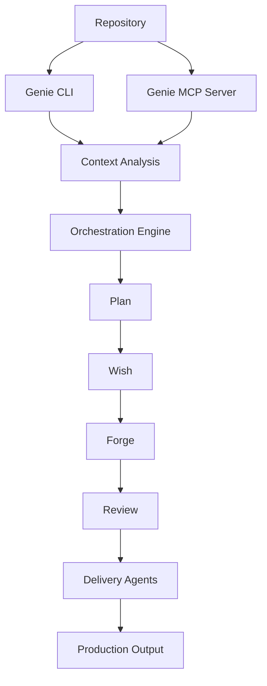

  <h1 style={{ fontSize: '2.5rem', fontWeight: '300', marginBottom: '1rem' }}>
    The Glue Between
  </h1>
  <h1 style={{ fontSize: '2.5rem', fontWeight: '300', marginTop: '0' }}>
    AI Agents and Repositories
  </h1>

## What is Genie?

Genie is your **universal AI companion** that ships ready-to-run AI workspaces in minutes, keeps templates in sync, and exposes a battle-tested CLI + MCP server for any agent to work with full repository context.

## The Problem

Setting up AI agents to work with your code is tedious:
- **Manual Setup**: Hours configuring each new project
- **Context Loss**: Agents don't understand your repository structure
- **Template Drift**: Starter templates get out of sync
- **No Standards**: Every project configured differently
- **Integration Friction**: Hard to connect agents to your workflow

## The Solution

Genie provides **instant AI-ready workspaces** with deep repository understanding:

<CardGroup cols={2}>
  <Card title="Ready-to-Run Workspaces" icon="rocket">
    Ship AI workspace in minutes. Everything configured, indexed, and ready for agents.
  </Card>
  <Card title="Template Sync" icon="arrows-rotate">
    Keep your project templates up-to-date automatically. No more drift.
  </Card>
  <Card title="Battle-Tested CLI" icon="terminal">
    Production-proven command-line interface for AI agent interactions.
  </Card>
  <Card title="MCP Server Built-In" icon="server">
    Any MCP-compatible agent can access your repository through Genie instantly.
  </Card>
</CardGroup>

## Key Features

### 🎯 Structured Autonomous Framework
Implements the **plan → wish → forge → review** workflow:
- **Planning**: AI agents analyze and plan changes
- **Wishing**: Define what you want to build
- **Forging**: Execute development with AI
- **Reviewing**: Validate and refine results

### 🧩 Orchestration Primitives
Building blocks for AI-powered development:
- **Context Management**: Maintain state across sessions
- **Task Decomposition**: Break down complex goals
- **Workflow Coordination**: Manage multi-step processes
- **Result Validation**: Ensure quality outputs

### 🔮 Meta-Learning Capabilities
- **Repository Understanding**: Deep analysis of codebase structure
- **Pattern Recognition**: Learn from successful workflows
- **Context Preservation**: Remember past interactions
- **Adaptive Behavior**: Improve over time

### 🤖 Specialized Delivery Agents
- **Coder Agent**: Writes production-quality code
- **Reviewer Agent**: Validates and improves code
- **Documenter Agent**: Maintains documentation
- **Tester Agent**: Creates comprehensive tests

## Who is Genie For?

<AccordionGroup>
  <Accordion title="Individual Developers">
    Set up AI assistance for your projects in minutes, not hours.
  </Accordion>
  <Accordion title="Team Leads">
    Standardize AI tooling across your team with template management.
  </Accordion>
  <Accordion title="AI Developers">
    Build on top of proven orchestration primitives and workflows.
  </Accordion>
  <Accordion title="Open Source Maintainers">
    Let AI agents help with issues, PRs, and documentation automatically.
  </Accordion>
</AccordionGroup>

## Why "Genie"?

A **genie** grants wishes and makes magic happen - and that's exactly what this tool does. It takes your development wishes and **makes them reality** through AI orchestration and automation.

## Architecture

## Workflow: Plan → Wish → Forge → Review

<Steps>
  <Step title="Plan">
    AI agents analyze the repository, understand structure, and create execution plans.
  </Step>
  <Step title="Wish">
    Define what you want to build - features, fixes, or improvements.
  </Step>
  <Step title="Forge">
    AI agents execute the plan, writing code, tests, and documentation.
  </Step>
  <Step title="Review">
    Validate results, ensure quality, and refine as needed.
  </Step>
</Steps>

## Use Cases

<CardGroup cols={2}>
  <Card title="Project Bootstrapping" icon="rocket">
    Start new projects with AI-configured templates instantly.
  </Card>
  <Card title="Code Generation" icon="code">
    Generate features with full repository context and conventions.
  </Card>
  <Card title="Documentation" icon="book">
    Keep docs in sync with code automatically.
  </Card>
  <Card title="Refactoring" icon="arrows-spin">
    Large-scale refactoring with AI understanding your architecture.
  </Card>
</CardGroup>

## Philosophy

Genie embodies our core philosophy:

<Card title="AI that elevates human potential, not replaces it" icon="users">
  - **You wish** - Genie orchestrates
  - **You review** - Genie executes
  - **You decide** - Genie suggests
  - **You own** - Genie assists
</Card>

---

## Next Steps

<CardGroup cols={2}>
  <Card title="Installation" icon="download" href="/genie/installation">
    Get Genie installed and configured
  </Card>
  <Card title="Quick Start" icon="rocket" href="/genie/quickstart">
    Create your first AI-powered workspace
  </Card>
  <Card title="GitHub Repository" icon="github" href="https://github.com/namastexlabs/automagik-genie">
    View source code and contribute
  </Card>
  <Card title="NPM Package" icon="npm" href="https://www.npmjs.com/package/automagik-genie">
    Install via NPM
  </Card>
</CardGroup>
