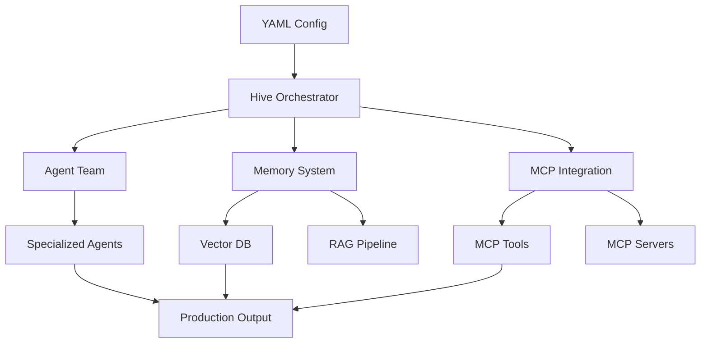

  <h1 style={{ fontSize: '2.5rem', fontWeight: '300', marginBottom: '1rem' }}>
    Production-Ready AI Teams
  </h1>
  <h1 style={{ fontSize: '2.5rem', fontWeight: '300', marginTop: '0' }}>
    in 5 Minutes
  </h1>

## What is Hive?

Hive is an **enterprise-grade multi-agent orchestration system** that makes deploying AI agent teams as simple as writing a YAML file. With MCP integration, persistent memory, RAG capabilities, and hot-reload built-in, Hive transforms complex AI infrastructure into a simple configuration file.

## The Problem

Deploying AI agents to production is unnecessarily complex:
- **Weeks of Setup**: Complex infrastructure requirements
- **Integration Hell**: Every service requires custom code
- **No Memory**: Agents forget context between sessions
- **Manual Restarts**: Code changes require full redeployments
- **Knowledge Gaps**: No easy way to give agents domain knowledge

## The Solution

Hive provides **production-ready AI orchestration** out of the box:

<CardGroup cols={2}>
  <Card title="YAML-Based Configuration" icon="file-code">
    Define your entire AI team in a simple YAML file. No code required for basic setups.
  </Card>
  <Card title="Hot-Reload" icon="rotate">
    Update agent configurations and see changes instantly. No restarts, no downtime.
  </Card>
  <Card title="Persistent Memory" icon="brain">
    Agents remember context across conversations and sessions. Long-term learning built-in.
  </Card>
  <Card title="RAG Built-In" icon="database">
    Give agents access to your documentation, codebase, or any knowledge source automatically.
  </Card>
</CardGroup>

## Key Features

### 🐝 Multi-Agent Orchestration
Coordinate teams of specialized AI agents:
- **Agent Swarms**: Multiple agents working together on complex tasks
- **Specialized Roles**: Each agent optimized for specific responsibilities
- **Team Coordination**: Agents communicate and share context
- **Workflow Automation**: Define multi-step processes with ease

### 🔌 MCP Integration
Native Model Context Protocol support:
- **Universal Tools**: Access to MCP tool ecosystem
- **Agent Interoperability**: Works with any MCP-compatible AI
- **Extensible**: Add new capabilities via MCP servers
- **Standards-Based**: Built on open protocols

### 🧠 Knowledge Management
Smart memory and knowledge retrieval:
- **Vector Storage**: Semantic search across knowledge bases
- **RAG Pipelines**: Retrieval-Augmented Generation out of the box
- **Persistent Memory**: Long-term context retention
- **Knowledge Graphs**: Structured information relationships

### ⚡ Developer Experience
- **One-Click Install**: Complete stack included
- **Hot Reload**: See changes instantly
- **YAML Configuration**: Simple, declarative setup
- **Production-Ready**: Scales from development to enterprise

## Who is Hive For?

<AccordionGroup>
  <Accordion title="Startups">
    Deploy AI capabilities in hours, not weeks. Focus on your product, not infrastructure.
  </Accordion>
  <Accordion title="Enterprise Teams">
    Scale AI orchestration across departments with centralized management and monitoring.
  </Accordion>
  <Accordion title="AI Developers">
    Experiment with multi-agent systems without building orchestration from scratch.
  </Accordion>
  <Accordion title="DevOps Teams">
    Deploy and manage AI infrastructure with familiar configuration-as-code patterns.
  </Accordion>
</AccordionGroup>

## Why "Hive"?

A hive is a **complex, coordinated system** where individual agents (bees) work together toward common goals. Each member has specialized roles, they communicate efficiently, and the collective achieves far more than individuals could alone.

## Architecture

## Philosophy

Hive embodies our core philosophy:

<Card title="AI that elevates human potential, not replaces it" icon="users">
  - **You orchestrate** - Agents execute
  - **You configure** - Hive manages
  - **You understand** - Agents explain
  - **You own** - Self-hostable infrastructure
</Card>

---

## Next Steps

<CardGroup cols={2}>
  <Card title="Installation" icon="download" href="/hive/installation">
    Get Hive installed and configured
  </Card>
  <Card title="Quick Start" icon="rocket" href="/hive/quickstart">
    Deploy your first agent team
  </Card>
  <Card title="GitHub Repository" icon="github" href="https://github.com/namastexlabs/automagik-hive">
    View source code and contribute
  </Card>
  <Card title="PyPI Package" icon="python" href="https://pypi.org/project/automagik-hive">
    Install via PyPI
  </Card>
</CardGroup>
