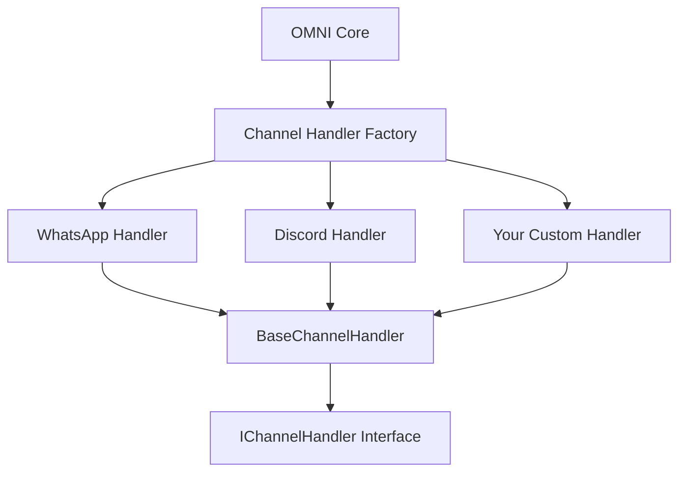

## Overview

OMNI's pluggable architecture allows you to create custom channel handlers for any messaging platform. Whether you need to integrate with a proprietary chat system, legacy platform, or emerging messaging service, you can extend OMNI with your own channel implementation.

<Info>
**Extend, Don't Fork** - Build custom channels as plugins that work seamlessly with OMNI's core infrastructure.
</Info>

---

## Why Build Custom Channels?

### Common Use Cases

<CardGroup cols={2}>
  <Card title="SMS Gateways" icon="mobile">
    **Platforms**:
    - Twilio
    - MessageBird
    - Vonage (Nexmo)
    - Plivo
    - AWS SNS

    **Use Cases**:
    - OTP verification
    - Notifications
    - Alerts
    - Global reach
  </Card>

  <Card title="Enterprise Systems" icon="building">
    **Platforms**:
    - Proprietary chat
    - Legacy messaging
    - Internal tools
    - Custom protocols

    **Use Cases**:
    - Internal communications
    - Legacy system integration
    - Custom requirements
  </Card>

  <Card title="Emerging Platforms" icon="rocket">
    **Platforms**:
    - New social networks
    - Regional platforms
    - Niche communities
    - Beta services

    **Use Cases**:
    - Early adoption
    - Market expansion
    - Competitive advantage
  </Card>

  <Card title="Custom Protocols" icon="network-wired">
    **Systems**:
    - WebSocket servers
    - MQTT brokers
    - Custom APIs
    - Proprietary formats

    **Use Cases**:
    - IoT devices
    - Real-time systems
    - Specialized hardware
  </Card>
</CardGroup>

---

## Architecture Overview

### Channel Handler Pattern



**Key Components**:
1. **IChannelHandler Interface**: Contract all handlers must implement
2. **BaseChannelHandler**: Abstract base with common functionality
3. **Channel Handler Factory**: Creates appropriate handler based on type
4. **Your Custom Handler**: Your implementation extending the base

---

## Getting Started

### Prerequisites

<Tabs>
  <Tab title="Development Environment">
    **Required**:
    - Python 3.12+
    - OMNI development setup
    - Target platform API credentials
    - Basic understanding of async Python

    **Recommended**:
    - Type hints knowledge
    - Testing framework experience
    - API documentation for target platform
  </Tab>

  <Tab title="Skills Needed">
    **Essential**:
    - Python async/await
    - HTTP/REST APIs
    - JSON handling
    - Error handling

    **Helpful**:
    - WebSockets
    - Database operations
    - Testing practices
    - Documentation writing
  </Tab>
</Tabs>

---

## Step 1: Understanding the Interface

### IChannelHandler Interface

Every channel handler must implement these methods:

```python
from abc import ABC, abstractmethod
from typing import Dict, Any, Optional

class IChannelHandler(ABC):
    """Interface that all channel handlers must implement."""

    @abstractmethod
    async def send_message(
        self,
        recipient: str,
        message: str,
        **kwargs
    ) -> Dict[str, Any]:
        """
        Send a text message to recipient.

        Args:
            recipient: Platform-specific recipient identifier
            message: Message text to send
            **kwargs: Additional platform-specific parameters

        Returns:
            Dict containing:
                - message_id: Unique identifier for sent message
                - status: "sent" | "failed"
                - timestamp: Send time
                - error: Error details if failed

        Raises:
            ChannelException: If send fails
        """
        pass

    @abstractmethod
    async def send_media(
        self,
        recipient: str,
        media_url: str,
        media_type: str,
        caption: Optional[str] = None,
        **kwargs
    ) -> Dict[str, Any]:
        """
        Send media (image, video, document) to recipient.

        Args:
            recipient: Platform-specific recipient identifier
            media_url: URL to media file
            media_type: "image" | "video" | "audio" | "document"
            caption: Optional caption text
            **kwargs: Additional parameters

        Returns:
            Dict containing message details

        Raises:
            ChannelException: If send fails
        """
        pass

    @abstractmethod
    async def get_status(self) -> Dict[str, Any]:
        """
        Get channel connection status.

        Returns:
            Dict containing:
                - connected: bool
                - status: "connected" | "disconnected" | "error"
                - details: Additional status information
        """
        pass

    @abstractmethod
    async def handle_webhook(self, payload: Dict[str, Any]) -> None:
        """
        Process incoming webhook from platform.

        Args:
            payload: Raw webhook payload from platform

        Returns:
            None - Handler should route message to OMNI core

        Raises:
            WebhookException: If webhook processing fails
        """
        pass

    @abstractmethod
    async def initialize(self) -> None:
        """
        Initialize channel connection.

        Called once when instance is created.
        Setup connections, authenticate, register webhooks.
        """
        pass

    @abstractmethod
    async def shutdown(self) -> None:
        """
        Cleanup and close connections.

        Called when instance is deleted or server stops.
        Close connections, deregister webhooks, cleanup resources.
        """
        pass
```

---

## Step 2: Creating Your Handler

### Basic Template

Create a new file: `automagik_omni/channels/your_channel_handler.py`

```python
from typing import Dict, Any, Optional
import httpx
import logging
from .base import BaseChannelHandler
from ..exceptions import ChannelException

logger = logging.getLogger(__name__)


class YourChannelHandler(BaseChannelHandler):
    """
    Custom channel handler for YourPlatform.

    Integrates with YourPlatform API to send/receive messages.
    """

    def __init__(
        self,
        instance_name: str,
        api_url: str,
        api_key: str,
        agent_url: str,
        agent_api_key: Optional[str] = None,
        **config
    ):
        """
        Initialize YourPlatform handler.

        Args:
            instance_name: Unique instance identifier
            api_url: YourPlatform API base URL
            api_key: Authentication key for YourPlatform
            agent_url: AI agent endpoint URL
            agent_api_key: Optional API key for agent
            **config: Additional configuration
        """
        super().__init__(
            instance_name=instance_name,
            agent_url=agent_url,
            agent_api_key=agent_api_key
        )

        self.api_url = api_url
        self.api_key = api_key
        self.config = config
        self.client = httpx.AsyncClient(
            base_url=api_url,
            headers={"Authorization": f"Bearer {api_key}"}
        )

    async def initialize(self) -> None:
        """Initialize connection to YourPlatform."""
        try:
            # Test API connection
            response = await self.client.get("/health")
            response.raise_for_status()

            logger.info(f"Initialized {self.instance_name} successfully")

        except Exception as e:
            logger.error(f"Failed to initialize {self.instance_name}: {e}")
            raise ChannelException(f"Initialization failed: {e}")

    async def send_message(
        self,
        recipient: str,
        message: str,
        **kwargs
    ) -> Dict[str, Any]:
        """Send text message via YourPlatform API."""
        try:
            # Call platform API
            response = await self.client.post(
                "/messages",
                json={
                    "to": recipient,
                    "text": message,
                    **kwargs
                }
            )
            response.raise_for_status()
            data = response.json()

            return {
                "message_id": data["id"],
                "status": "sent",
                "timestamp": data["timestamp"],
                "platform": "your_platform"
            }

        except httpx.HTTPError as e:
            logger.error(f"Send failed: {e}")
            raise ChannelException(f"Failed to send message: {e}")

    async def send_media(
        self,
        recipient: str,
        media_url: str,
        media_type: str,
        caption: Optional[str] = None,
        **kwargs
    ) -> Dict[str, Any]:
        """Send media via YourPlatform API."""
        try:
            payload = {
                "to": recipient,
                "media": {
                    "url": media_url,
                    "type": media_type
                }
            }

            if caption:
                payload["caption"] = caption

            response = await self.client.post("/media", json=payload)
            response.raise_for_status()
            data = response.json()

            return {
                "message_id": data["id"],
                "status": "sent",
                "timestamp": data["timestamp"]
            }

        except httpx.HTTPError as e:
            logger.error(f"Media send failed: {e}")
            raise ChannelException(f"Failed to send media: {e}")

    async def get_status(self) -> Dict[str, Any]:
        """Get connection status."""
        try:
            response = await self.client.get("/status")
            response.raise_for_status()
            data = response.json()

            return {
                "connected": data.get("connected", False),
                "status": data.get("status", "unknown"),
                "details": data
            }

        except httpx.HTTPError as e:
            return {
                "connected": False,
                "status": "error",
                "error": str(e)
            }

    async def handle_webhook(self, payload: Dict[str, Any]) -> None:
        """Process incoming webhook from YourPlatform."""
        try:
            # Extract message details from webhook
            message_type = payload.get("type")

            if message_type == "message":
                # Extract message data
                sender = payload["from"]
                text = payload["message"]["text"]
                message_id = payload["message"]["id"]

                # Create trace
                trace_id = await self.create_trace(
                    from_user=sender,
                    message_content=text,
                    message_type="text"
                )

                # Route to AI agent
                agent_response = await self.call_agent(
                    message=text,
                    user_id=sender,
                    context={
                        "platform": "your_platform",
                        "message_id": message_id
                    }
                )

                # Send response back
                await self.send_message(
                    recipient=sender,
                    message=agent_response
                )

                # Update trace
                await self.update_trace(
                    trace_id=trace_id,
                    agent_response=agent_response,
                    status="completed"
                )

            else:
                logger.warning(f"Unknown webhook type: {message_type}")

        except Exception as e:
            logger.error(f"Webhook handling failed: {e}")
            raise

    async def shutdown(self) -> None:
        """Cleanup resources."""
        await self.client.aclose()
        logger.info(f"Shut down {self.instance_name}")
```

---

## Step 3: Register Your Handler

### Update Channel Factory

Edit `automagik_omni/channels/factory.py`:

```python
from .whatsapp_handler import WhatsAppHandler
from .discord_handler import DiscordHandler
from .your_channel_handler import YourChannelHandler  # Add import

class ChannelHandlerFactory:
    """Factory to create appropriate channel handler."""

    @staticmethod
    def create_handler(channel_type: str, **config):
        """Create channel handler instance."""
        handlers = {
            "whatsapp": WhatsAppHandler,
            "discord": DiscordHandler,
            "your_platform": YourChannelHandler,  # Register
        }

        handler_class = handlers.get(channel_type)
        if not handler_class:
            raise ValueError(f"Unknown channel type: {channel_type}")

        return handler_class(**config)
```

### Update Database Schema (if needed)

If your channel needs custom fields:

```python
# In migration file
from alembic import op
import sqlalchemy as sa

def upgrade():
    # Add custom fields to instances table
    op.add_column(
        'instances',
        sa.Column('your_platform_api_key', sa.String(), nullable=True)
    )
    op.add_column(
        'instances',
        sa.Column('your_platform_webhook_url', sa.String(), nullable=True)
    )

def downgrade():
    op.drop_column('instances', 'your_platform_api_key')
    op.drop_column('instances', 'your_platform_webhook_url')
```

---

## Step 4: Testing Your Handler

### Unit Tests

Create `tests/channels/test_your_channel.py`:

```python
import pytest
from unittest.mock import AsyncMock, patch
from automagik_omni.channels.your_channel_handler import YourChannelHandler

@pytest.fixture
def handler():
    """Create handler instance for testing."""
    return YourChannelHandler(
        instance_name="test-instance",
        api_url="https://api.yourplatform.com",
        api_key="test-key",
        agent_url="https://agent.test.com"
    )

@pytest.mark.asyncio
async def test_send_message(handler):
    """Test sending text message."""
    with patch.object(handler.client, 'post') as mock_post:
        mock_post.return_value.json.return_value = {
            "id": "msg-123",
            "timestamp": "2025-01-04T12:00:00Z"
        }

        result = await handler.send_message(
            recipient="user-123",
            message="Test message"
        )

        assert result["message_id"] == "msg-123"
        assert result["status"] == "sent"
        mock_post.assert_called_once()

@pytest.mark.asyncio
async def test_handle_webhook(handler):
    """Test webhook processing."""
    webhook_payload = {
        "type": "message",
        "from": "user-123",
        "message": {
            "id": "msg-456",
            "text": "Hello bot!"
        }
    }

    with patch.object(handler, 'call_agent') as mock_agent:
        mock_agent.return_value = "Hi there!"

        await handler.handle_webhook(webhook_payload)

        mock_agent.assert_called_once()
        # Verify agent was called with correct params

@pytest.mark.asyncio
async def test_get_status(handler):
    """Test status check."""
    with patch.object(handler.client, 'get') as mock_get:
        mock_get.return_value.json.return_value = {
            "connected": True,
            "status": "online"
        }

        status = await handler.get_status()

        assert status["connected"] is True
        assert status["status"] == "online"
```

### Integration Tests

```python
@pytest.mark.integration
@pytest.mark.asyncio
async def test_full_message_flow():
    """Test complete send/receive flow."""
    # Create instance
    instance = await create_instance(
        name="test-integration",
        channel_type="your_platform",
        api_url=TEST_API_URL,
        api_key=TEST_API_KEY
    )

    # Send message
    result = await instance.handler.send_message(
        recipient=TEST_RECIPIENT,
        message="Integration test"
    )

    assert result["status"] == "sent"

    # Simulate webhook
    webhook_payload = create_test_webhook()
    await instance.handler.handle_webhook(webhook_payload)

    # Verify trace created
    traces = await get_traces(instance_name="test-integration")
    assert len(traces) > 0
```

---

## Step 5: Advanced Features

### Rate Limiting

```python
from asyncio import Semaphore
from datetime import datetime, timedelta

class RateLimitedHandler(YourChannelHandler):
    """Handler with built-in rate limiting."""

    def __init__(self, *args, **kwargs):
        super().__init__(*args, **kwargs)
        self.rate_limit = Semaphore(10)  # 10 concurrent requests
        self.request_times = []
        self.max_per_minute = 100

    async def send_message(self, *args, **kwargs):
        """Send with rate limiting."""
        # Check per-minute limit
        await self._check_rate_limit()

        async with self.rate_limit:
            return await super().send_message(*args, **kwargs)

    async def _check_rate_limit(self):
        """Ensure we don't exceed rate limits."""
        now = datetime.now()
        one_minute_ago = now - timedelta(minutes=1)

        # Remove old timestamps
        self.request_times = [
            t for t in self.request_times
            if t > one_minute_ago
        ]

        # Check if at limit
        if len(self.request_times) >= self.max_per_minute:
            # Wait until we can send
            sleep_time = (self.request_times[0] - one_minute_ago).total_seconds()
            await asyncio.sleep(sleep_time)

        self.request_times.append(now)
```

### Retry Logic

```python
from tenacity import retry, stop_after_attempt, wait_exponential

class ResilientHandler(YourChannelHandler):
    """Handler with automatic retries."""

    @retry(
        stop=stop_after_attempt(3),
        wait=wait_exponential(multiplier=1, min=4, max=10)
    )
    async def send_message(self, *args, **kwargs):
        """Send with automatic retry on failure."""
        return await super().send_message(*args, **kwargs)
```

### Caching

```python
from functools import lru_cache
from datetime import datetime, timedelta

class CachedHandler(YourChannelHandler):
    """Handler with response caching."""

    def __init__(self, *args, **kwargs):
        super().__init__(*args, **kwargs)
        self.cache = {}
        self.cache_ttl = timedelta(minutes=5)

    async def get_user_profile(self, user_id: str) -> Dict:
        """Get user profile with caching."""
        cache_key = f"profile:{user_id}"

        # Check cache
        if cache_key in self.cache:
            cached_data, cached_time = self.cache[cache_key]
            if datetime.now() - cached_time < self.cache_ttl:
                return cached_data

        # Fetch from API
        profile = await self._fetch_user_profile(user_id)

        # Cache it
        self.cache[cache_key] = (profile, datetime.now())

        return profile
```

### Webhooks with Signature Verification

```python
import hmac
import hashlib

class SecureHandler(YourChannelHandler):
    """Handler with webhook signature verification."""

    def __init__(self, *args, webhook_secret: str, **kwargs):
        super().__init__(*args, **kwargs)
        self.webhook_secret = webhook_secret

    def verify_webhook_signature(
        self,
        payload: bytes,
        signature: str
    ) -> bool:
        """Verify webhook came from platform."""
        expected = hmac.new(
            self.webhook_secret.encode(),
            payload,
            hashlib.sha256
        ).hexdigest()

        return hmac.compare_digest(expected, signature)

    async def handle_webhook(
        self,
        payload: Dict[str, Any],
        signature: str
    ) -> None:
        """Handle webhook with verification."""
        # Verify signature
        if not self.verify_webhook_signature(
            json.dumps(payload).encode(),
            signature
        ):
            raise WebhookException("Invalid signature")

        # Process webhook
        await super().handle_webhook(payload)
```

---

## Step 6: Documentation

### Document Your Channel

Create `docs/channels/your-platform-setup.mdx`:

```markdown
---
title: "YourPlatform Setup"
description: "Integration guide for YourPlatform"
icon: "your-icon"
---

## Overview

Brief description of YourPlatform integration.

## Prerequisites

- YourPlatform account
- API credentials
- etc.

## Setup Steps

### Step 1: Create API Key
...

### Step 2: Configure OMNI
...

## Usage Examples

### Send Message
```bash
curl -X POST .../send-text ...
```

## Troubleshooting
...
```

### API Reference

Document configuration parameters:

```markdown
## Configuration Parameters

| Parameter | Required | Description | Example |
|-----------|----------|-------------|---------|
| `api_url` | Yes | YourPlatform API URL | `https://api.example.com` |
| `api_key` | Yes | Authentication key | `your-api-key` |
| `webhook_secret` | No | Webhook verification | `secret-key` |
```

---

## Step 7: Contributing Back

### Share Your Channel

<Steps>
  <Step title="Prepare Code">
    - Clean up implementation
    - Add comprehensive tests
    - Write documentation
    - Follow code style
  </Step>

  <Step title="Create Pull Request">
    ```bash
    # Fork repository
    git clone https://github.com/YOUR_USERNAME/automagik-omni.git
    cd automagik-omni

    # Create branch
    git checkout -b feature/your-platform-handler

    # Add your code
    git add automagik_omni/channels/your_channel_handler.py
    git add tests/channels/test_your_channel.py
    git add docs/channels/your-platform-setup.mdx

    # Commit
    git commit -m "feat: add YourPlatform channel handler"

    # Push
    git push origin feature/your-platform-handler
    ```

    Open PR on GitHub with description
  </Step>

  <Step title="Review Process">
    - Code review by maintainers
    - Address feedback
    - Update documentation
    - Merge when approved
  </Step>
</Steps>

### Contribution Guidelines

**Code Quality**:
- ✅ Type hints on all functions
- ✅ Docstrings with examples
- ✅ Error handling
- ✅ Logging

**Testing**:
- ✅ Unit tests (>80% coverage)
- ✅ Integration tests
- ✅ Mock external APIs
- ✅ Edge case handling

**Documentation**:
- ✅ Setup guide
- ✅ API reference
- ✅ Usage examples
- ✅ Troubleshooting

---

## Real-World Examples

### SMS with Twilio

```python
from twilio.rest import Client as TwilioClient
from .base import BaseChannelHandler

class TwilioSMSHandler(BaseChannelHandler):
    """SMS channel via Twilio."""

    def __init__(
        self,
        instance_name: str,
        account_sid: str,
        auth_token: str,
        from_number: str,
        **kwargs
    ):
        super().__init__(instance_name=instance_name, **kwargs)
        self.client = TwilioClient(account_sid, auth_token)
        self.from_number = from_number

    async def send_message(self, recipient: str, message: str, **kwargs):
        """Send SMS via Twilio."""
        msg = self.client.messages.create(
            body=message,
            from_=self.from_number,
            to=recipient
        )

        return {
            "message_id": msg.sid,
            "status": "sent",
            "timestamp": msg.date_created.isoformat()
        }

    async def handle_webhook(self, payload: Dict[str, Any]):
        """Handle incoming SMS webhook."""
        from_number = payload["From"]
        message_body = payload["Body"]

        # Route to agent
        response = await self.call_agent(
            message=message_body,
            user_id=from_number
        )

        # Send response
        await self.send_message(from_number, response)
```

### WebSocket Real-Time Chat

```python
import websockets
from .base import BaseChannelHandler

class WebSocketHandler(BaseChannelHandler):
    """Real-time chat via WebSocket."""

    def __init__(self, instance_name: str, ws_url: str, **kwargs):
        super().__init__(instance_name=instance_name, **kwargs)
        self.ws_url = ws_url
        self.ws = None

    async def initialize(self):
        """Connect to WebSocket."""
        self.ws = await websockets.connect(self.ws_url)
        # Start listening task
        asyncio.create_task(self._listen())

    async def _listen(self):
        """Listen for incoming messages."""
        async for message in self.ws:
            data = json.loads(message)
            await self.handle_webhook(data)

    async def send_message(self, recipient: str, message: str, **kwargs):
        """Send via WebSocket."""
        payload = {
            "type": "message",
            "to": recipient,
            "text": message
        }
        await self.ws.send(json.dumps(payload))

        return {
            "message_id": str(uuid.uuid4()),
            "status": "sent",
            "timestamp": datetime.now().isoformat()
        }
```

---

## Best Practices

### Error Handling

<Tabs>
  <Tab title="Graceful Degradation">
    ```python
    async def send_message(self, *args, **kwargs):
        try:
            return await self._send_message_impl(*args, **kwargs)
        except NetworkError:
            # Retry with exponential backoff
            return await self._retry_send(*args, **kwargs)
        except RateLimitError:
            # Queue for later
            await self._queue_message(*args, **kwargs)
            return {"status": "queued"}
        except Exception as e:
            # Log and fail gracefully
            logger.error(f"Send failed: {e}")
            return {"status": "failed", "error": str(e)}
    ```
  </Tab>

  <Tab title="Comprehensive Logging">
    ```python
    async def send_message(self, recipient, message, **kwargs):
        logger.info(
            f"Sending message",
            extra={
                "instance": self.instance_name,
                "recipient": recipient,
                "length": len(message)
            }
        )

        try:
            result = await self._send(recipient, message)
            logger.info(f"Send successful: {result['message_id']}")
            return result

        except Exception as e:
            logger.error(
                f"Send failed: {e}",
                extra={"recipient": recipient},
                exc_info=True
            )
            raise
    ```
  </Tab>

  <Tab title="Validation">
    ```python
    def validate_recipient(self, recipient: str) -> bool:
        """Validate recipient format."""
        # Phone number validation
        if self.channel_type == "sms":
            return bool(re.match(r'^\+[1-9]\d{1,14}$', recipient))

        # Email validation
        if self.channel_type == "email":
            return bool(re.match(r'^[\w\.-]+@[\w\.-]+\.\w+$', recipient))

        return True

    async def send_message(self, recipient, message, **kwargs):
        if not self.validate_recipient(recipient):
            raise ValueError(f"Invalid recipient: {recipient}")

        # Continue with send
        ...
    ```
  </Tab>
</Tabs>

### Performance Optimization

```python
class OptimizedHandler(BaseChannelHandler):
    """Performance-optimized handler."""

    def __init__(self, *args, **kwargs):
        super().__init__(*args, **kwargs)
        self.connection_pool = httpx.AsyncClient(
            limits=httpx.Limits(
                max_connections=100,
                max_keepalive_connections=20
            )
        )
        self.batch_queue = []
        self.batch_size = 50

    async def send_message(self, *args, **kwargs):
        """Send with connection pooling."""
        async with self.connection_pool as client:
            response = await client.post("/messages", ...)
            return response.json()

    async def batch_send(self, messages: List[Dict]):
        """Send multiple messages efficiently."""
        tasks = [
            self.send_message(**msg)
            for msg in messages
        ]
        return await asyncio.gather(*tasks, return_exceptions=True)
```

---

## Troubleshooting

<AccordionGroup>
  <Accordion title="Handler Not Registered">
    **Error**: "Unknown channel type: your_platform"

    **Solution**:
    - Verify you added handler to `factory.py`
    - Check spelling of channel type
    - Restart OMNI server after registration
  </Accordion>

  <Accordion title="Import Errors">
    **Error**: "ModuleNotFoundError: No module named 'your_handler'"

    **Solution**:
    ```python
    # Add to automagik_omni/channels/__init__.py
    from .your_channel_handler import YourChannelHandler

    __all__ = [
        'WhatsAppHandler',
        'DiscordHandler',
        'YourChannelHandler',  # Add this
    ]
    ```
  </Accordion>

  <Accordion title="Webhook Not Receiving">
    **Issues**:
    - Webhook URL not accessible
    - Signature verification failing
    - Wrong HTTP method

    **Debug Steps**:
    ```python
    # Add debug logging
    @app.post("/webhook/your-platform")
    async def webhook(request: Request):
        logger.debug(f"Webhook received: {await request.body()}")
        logger.debug(f"Headers: {request.headers}")
        # ... process webhook
    ```

    - Check webhook URL is public (use ngrok for local testing)
    - Verify signature calculation matches platform docs
    - Confirm HTTP method (POST vs GET)
  </Accordion>

  <Accordion title="Async Issues">
    **Error**: "RuntimeError: This event loop is already running"

    **Solution**:
    - Don't mix sync and async code
    - Use `await` for all async functions
    - Don't call `asyncio.run()` inside async functions

    ```python
    # Wrong
    def sync_function():
        result = asyncio.run(async_function())

    # Right
    async def async_function_wrapper():
        result = await async_function()
    ```
  </Accordion>
</AccordionGroup>

---

## Resources

### References

<CardGroup cols={2}>
  <Card title="OMNI Source Code" icon="github" href="https://github.com/namastexlabs/automagik-omni">
    Study existing handlers (WhatsApp, Discord)
  </Card>

  <Card title="API Documentation" icon="book" href="/omni/api/overview">
    Complete OMNI API reference
  </Card>

  <Card title="Community Examples" icon="users" href="https://github.com/namastexlabs/automagik-omni/discussions">
    Community-built channel handlers
  </Card>

  <Card title="Discord Support" icon="discord" href="https://discord.gg/xcW8c7fF3R">
    Get help from the community
  </Card>
</CardGroup>

### Further Reading

- **Python Async**: [realpython.com/async-io-python](https://realpython.com/async-io-python/)
- **FastAPI**: [fastapi.tiangolo.com](https://fastapi.tiangolo.com/)
- **Webhooks**: [webhooks.fyi](https://webhooks.fyi/)
- **Testing Async**: [pytest-asyncio docs](https://pytest-asyncio.readthedocs.io/)

---

## Next Steps

<CardGroup cols={2}>
  <Card title="WhatsApp Handler" icon="code" href="https://github.com/namastexlabs/automagik-omni/blob/main/automagik_omni/channels/whatsapp_handler.py">
    Study production WhatsApp implementation
  </Card>

  <Card title="Discord Handler" icon="code" href="https://github.com/namastexlabs/automagik-omni/blob/main/automagik_omni/channels/discord_handler.py">
    Learn from Discord IPC architecture
  </Card>

  <Card title="Contribute" icon="git-alt" href="https://github.com/namastexlabs/automagik-omni/blob/main/CONTRIBUTING.md">
    Share your handler with the community
  </Card>

  <Card title="Get Help" icon="life-ring" href="https://discord.gg/xcW8c7fF3R">
    Ask questions in Discord #development
  </Card>
</CardGroup>

---

<Info>
**Need Help Building Your Channel?**

- **Discord**: [#custom-channels](https://discord.gg/xcW8c7fF3R)
- **Email**: dev-support@automagik.com
- **Office Hours**: Fridays 2-4 PM UTC

We're here to help you succeed!
</Info>
