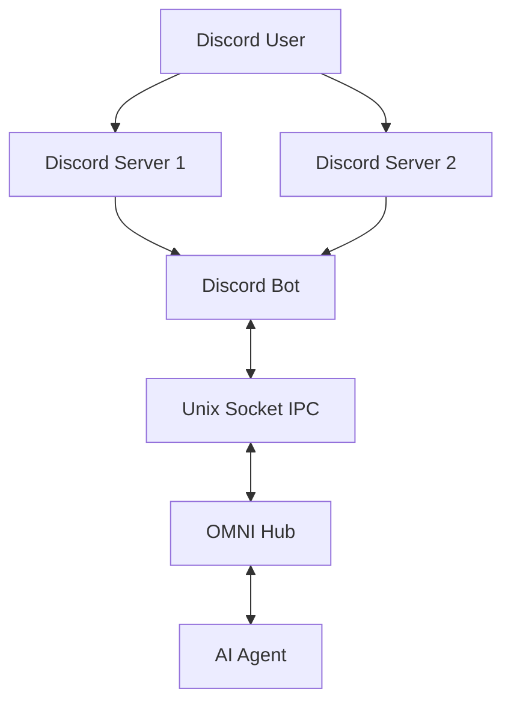
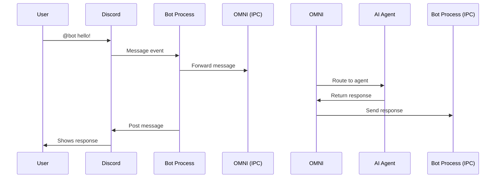

## Overview

Discord is the leading platform for community communication, especially popular among gaming, tech, and developer communities. OMNI integrates Discord through a **Bot + IPC (Inter-Process Communication)** architecture that allows your AI agent to interact seamlessly across multiple Discord servers.

<Info>
**Multi-Server Support**: One Discord bot can operate across unlimited servers simultaneously.
</Info>

---

## Architecture Overview



**How it works**:
1. Discord bot runs as separate process
2. Listens to messages across all servers
3. Communicates with OMNI via Unix sockets (IPC)
4. OMNI routes messages to your AI agent
5. Responses flow back through the same path

**Benefits**:
- Single bot instance handles multiple servers
- Lightweight IPC communication
- Process isolation for stability
- No polling or webhooks needed

---

## Prerequisites

<Tabs>
  <Tab title="Discord Account">
    **Required**:
    - Discord account (free)
    - Server admin permissions (to add bot)

    **Recommended**:
    - Discord Developer Account
    - Understanding of Discord permissions
  </Tab>

  <Tab title="System Requirements">
    **Software**:
    - Python 3.12+ (included with OMNI)
    - discord.py library (auto-installed)

    **No additional dependencies**:
    - No Node.js required (unlike WhatsApp)
    - No Docker needed
    - No external services
  </Tab>
</Tabs>

---

## Step 1: Create Discord Application

<Steps>
  <Step title="Open Discord Developer Portal">
    Navigate to: [discord.com/developers/applications](https://discord.com/developers/applications)

    Click **New Application**
  </Step>

  <Step title="Name Your Application">
    - Enter a name (e.g., "My AI Assistant")
    - Accept Discord's Terms of Service
    - Click **Create**

    <Info>
    This name is for the application. You can set a different display name for the bot later.
    </Info>
  </Step>

  <Step title="Configure Basic Information">
    In the **General Information** tab:

    - **App Icon**: Upload a profile picture for your bot
    - **Description**: Describe what your bot does
    - **Tags**: Add relevant tags

    Click **Save Changes**
  </Step>
</Steps>

---

## Step 2: Create Bot User

<Steps>
  <Step title="Navigate to Bot Tab">
    In your application, click **Bot** in the left sidebar
  </Step>

  <Step title="Add Bot">
    - Click **Add Bot**
    - Confirm by clicking **Yes, do it!**

    Your bot is now created!
  </Step>

  <Step title="Configure Bot Settings">
    **Username**: Click to edit bot's display name

    **Icon**: Upload bot avatar (shows in Discord servers)

    **Public Bot**:
    - ✅ ON: Anyone can invite your bot
    - ❌ OFF: Only you can invite (recommended for testing)

    **Requires OAuth2 Code Grant**:
    - Usually keep OFF

    **Presence Intent**: Toggle ON (allows bot to see online status)

    **Server Members Intent**: Toggle ON (allows bot to see member list)

    **Message Content Intent**: Toggle ON (**REQUIRED** for reading messages)

    <Warning>
    **Message Content Intent** must be enabled! Without it, your bot can't read message content.
    </Warning>
  </Step>

  <Step title="Get Bot Token">
    Under **TOKEN** section:

    - Click **Reset Token** (first time) or **Copy** (subsequent)
    - Confirm if prompted
    - **COPY THE TOKEN** - you'll need it for OMNI configuration

    <Warning>
    **NEVER share your bot token!** Treat it like a password. If exposed, reset it immediately.
    </Warning>
  </Step>
</Steps>

---

## Step 3: Configure Bot Permissions

<Steps>
  <Step title="Navigate to OAuth2 → URL Generator">
    In left sidebar: **OAuth2** → **URL Generator**
  </Step>

  <Step title="Select Scopes">
    Check the following scopes:
    - ✅ **bot** (required)
    - ✅ **applications.commands** (for slash commands - optional)
  </Step>

  <Step title="Select Bot Permissions">
    **Text Permissions** (required):
    - ✅ Send Messages
    - ✅ Send Messages in Threads
    - ✅ Embed Links
    - ✅ Attach Files
    - ✅ Read Message History
    - ✅ Add Reactions
    - ✅ Use External Emojis

    **Additional Permissions** (recommended):
    - ✅ Manage Messages (for deleting messages)
    - ✅ Manage Threads (for thread management)

    **Voice Permissions** (optional, for future voice features):
    - ✅ Connect
    - ✅ Speak

    <Info>
    These permissions determine what your bot can do. You can always update them later.
    </Info>
  </Step>

  <Step title="Copy Invite URL">
    At the bottom, you'll see a **Generated URL**. Copy it - you'll use this to add your bot to servers.
  </Step>
</Steps>

---

## Step 4: Invite Bot to Server

<Steps>
  <Step title="Choose Server">
    You need **Manage Server** permission to add bots.

    If you don't have a server:
    - Open Discord
    - Click **+** (Add a Server)
    - Create a new server for testing
  </Step>

  <Step title="Use Invite URL">
    - Paste the Generated URL from Step 3 into your browser
    - Select the server to add bot to
    - Verify permissions
    - Click **Authorize**
    - Complete CAPTCHA if prompted
  </Step>

  <Step title="Verify Bot Joined">
    Open Discord and check your server:
    - Bot should appear in member list (right sidebar)
    - Status will be **Offline** until you start the bot
  </Step>
</Steps>

---

## Step 5: Configure OMNI for Discord

### Update Environment Variables

Edit your `.env` file:

```bash
nano .env
```

Add Discord configuration:

```env
# Discord Bot Configuration
DISCORD_TOKEN=YOUR_BOT_TOKEN_HERE
DISCORD_IPC_SOCKET=/tmp/discord_ipc.sock

# OMNI API (if not already set)
AUTOMAGIK_OMNI_API_KEY=your-omni-api-key
AUTOMAGIK_OMNI_API_PORT=8882

# Your AI Agent
AGENT_API_URL=http://localhost:8886
AGENT_API_KEY=your-agent-api-key
```

<AccordionGroup>
  <Accordion title="Configuration Parameters Explained">
    | Parameter | Description | Example |
    |-----------|-------------|---------|
    | `DISCORD_TOKEN` | Bot token from Discord Developer Portal | `MTIzNDU2Nzg5MDEyMzQ1Njc4OTAuGXrPxA...` |
    | `DISCORD_IPC_SOCKET` | Unix socket path for IPC communication | `/tmp/discord_ipc.sock` |
    | `AGENT_API_URL` | Your AI agent endpoint | `http://localhost:8886` |
    | `AGENT_API_KEY` | API key for your agent (optional) | `your-secret-key` |
  </Accordion>

  <Accordion title="Security Best Practices">
    **Protect Your Token**:
    ```bash
    # Never commit .env to git
    echo ".env" >> .gitignore

    # Set restrictive permissions
    chmod 600 .env
    ```

    **Rotate Compromised Tokens**:
    - Go to Discord Developer Portal → Bot → Reset Token
    - Update `.env` with new token
    - Restart OMNI services
  </Accordion>
</AccordionGroup>

---

## Step 6: Start Discord Bot

### Option 1: Manual Start (Development)

<Tabs>
  <Tab title="Install Discord Dependencies">
    ```bash
    # Install discord.py if not already installed
    make install-discord

    # Or manually
    pip install discord.py
    ```
  </Tab>

  <Tab title="Start Bot">
    ```bash
    # Start Discord bot
    python -m automagik_omni.discord_bot

    # Or use make command
    make discord-start
    ```

    **Expected Output**:
    ```
    [INFO] Discord bot starting...
    [INFO] Logged in as: YourBotName#1234
    [INFO] Connected to 1 server(s)
    [INFO] IPC socket created at /tmp/discord_ipc.sock
    [INFO] Discord bot ready!
    ```
  </Tab>

  <Tab title="Start OMNI">
    In a separate terminal:
    ```bash
    # Start OMNI API
    make dev
    ```

    Now both services are running and communicating via IPC!
  </Tab>
</Tabs>

### Option 2: PM2 (Production)

```bash
# PM2 will start both OMNI and Discord bot automatically
pm2 start ecosystem.config.js

# Check status
pm2 status

# View Discord bot logs
pm2 logs discord-bot
```

### Option 3: Docker

```bash
# Docker Compose starts all services including Discord bot
docker-compose up -d

# View logs
docker-compose logs -f discord-bot
```

---

## Step 7: Create Discord Instance in OMNI

With both services running, create a Discord instance:

```bash
curl -X POST http://localhost:8882/api/v1/instances \
  -H "x-api-key: your-omni-api-key" \
  -H "Content-Type: application/json" \
  -d '{
    "name": "my-discord-bot",
    "channel_type": "discord",
    "discord_token": "YOUR_BOT_TOKEN",
    "agent_api_url": "http://localhost:8886",
    "agent_api_key": "your-agent-api-key",
    "default_agent": "template-agent"
  }'
```

**Response**:
```json
{
  "id": "cm3xyz789...",
  "name": "my-discord-bot",
  "channel_type": "discord",
  "status": "active",
  "created_at": "2025-01-04T12:00:00Z",
  "discord_servers": ["123456789012345678"]
}
```

### Verify Connection

```bash
curl http://localhost:8882/api/v1/instances/my-discord-bot/status \
  -H "x-api-key: your-omni-api-key"
```

**Connected Status**:
```json
{
  "status": "connected",
  "instance": "my-discord-bot",
  "connected": true,
  "servers": 1,
  "latency_ms": 45
}
```

---

## Interacting with Your Bot

### Sending Messages

**Send to Channel**:
```bash
curl -X POST http://localhost:8882/api/v1/instances/my-discord-bot/send-text \
  -H "x-api-key: your-omni-api-key" \
  -H "Content-Type: application/json" \
  -d '{
    "channel_id": "123456789012345678",
    "message": "Hello from OMNI!"
  }'
```

**Send with Embed**:
```bash
curl -X POST http://localhost:8882/api/v1/instances/my-discord-bot/send-embed \
  -H "x-api-key: your-omni-api-key" \
  -H "Content-Type: application/json" \
  -d '{
    "channel_id": "123456789012345678",
    "embed": {
      "title": "System Alert",
      "description": "Your build completed successfully!",
      "color": 5763719,
      "fields": [
        {"name": "Status", "value": "Success", "inline": true},
        {"name": "Duration", "value": "2m 34s", "inline": true}
      ]
    }
  }'
```

**Send File**:
```bash
curl -X POST http://localhost:8882/api/v1/instances/my-discord-bot/send-media \
  -H "x-api-key: your-omni-api-key" \
  -H "Content-Type: application/json" \
  -d '{
    "channel_id": "123456789012345678",
    "media_url": "https://example.com/report.pdf",
    "media_type": "document",
    "caption": "Monthly report attached"
  }'
```

### Receiving Messages

Discord messages are automatically routed to your AI agent when users:

1. **Mention the bot**: `@YourBot hello!`
2. **DM the bot**: Direct messages always reach the bot
3. **Reply to bot message**: Thread-aware conversations

**Message Flow**:


### Getting Channel IDs

<Tabs>
  <Tab title="Enable Developer Mode">
    In Discord:
    1. User Settings (gear icon)
    2. Advanced
    3. Toggle **Developer Mode** ON
  </Tab>

  <Tab title="Copy Channel ID">
    - Right-click any channel
    - Click **Copy ID**
    - Paste into API calls
  </Tab>

  <Tab title="Via API">
    ```bash
    # List all channels bot can see
    curl http://localhost:8882/api/v1/instances/my-discord-bot/channels \
      -H "x-api-key: your-omni-api-key"
    ```

    **Response**:
    ```json
    {
      "channels": [
        {
          "id": "123456789012345678",
          "name": "general",
          "type": "text",
          "server_name": "My Server"
        }
      ]
    }
    ```
  </Tab>
</Tabs>

---

## Discord-Specific Features

### Embeds

Rich embedded messages with images, fields, and formatting:

```bash
curl -X POST http://localhost:8882/api/v1/instances/my-discord-bot/send-embed \
  -H "x-api-key: your-omni-api-key" \
  -H "Content-Type: application/json" \
  -d '{
    "channel_id": "123456789012345678",
    "embed": {
      "title": "Deploy Notification",
      "description": "Production deployment completed",
      "color": 3447003,
      "author": {
        "name": "CI/CD Bot",
        "icon_url": "https://example.com/icon.png"
      },
      "fields": [
        {"name": "Environment", "value": "Production", "inline": true},
        {"name": "Version", "value": "v2.1.0", "inline": true},
        {"name": "Status", "value": "✅ Success", "inline": true}
      ],
      "thumbnail": {
        "url": "https://example.com/thumb.png"
      },
      "footer": {
        "text": "Deployed by DevOps Team"
      },
      "timestamp": "2025-01-04T12:00:00Z"
    }
  }'
```

<Info>
**Color Codes**: Use decimal color values. Convert hex: `0x52B788` → `5420936`
</Info>

### Reactions

Add emoji reactions to messages:

```bash
curl -X POST http://localhost:8882/api/v1/instances/my-discord-bot/add-reaction \
  -H "x-api-key: your-omni-api-key" \
  -H "Content-Type: application/json" \
  -d '{
    "channel_id": "123456789012345678",
    "message_id": "987654321098765432",
    "emoji": "👍"
  }'
```

**Custom Emoji**:
```bash
# Format: "name:id"
"emoji": "custom_emoji:123456789012345678"
```

### Threads

Create and manage threads:

```bash
# Create thread from message
curl -X POST http://localhost:8882/api/v1/instances/my-discord-bot/create-thread \
  -H "x-api-key: your-omni-api-key" \
  -H "Content-Type: application/json" \
  -d '{
    "channel_id": "123456789012345678",
    "message_id": "987654321098765432",
    "thread_name": "Discussion about this topic"
  }'
```

### Voice Channel Support (Infrastructure)

<Warning>
**Voice features are infrastructure-ready but not fully implemented yet.**
</Warning>

Current capabilities:
- ✅ Connect to voice channels
- ✅ Basic audio streaming setup
- 🔄 Voice recognition (planned)
- 🔄 Text-to-speech (planned)

---

## Multi-Server Management

### How Multi-Server Works

One Discord bot can operate across multiple servers simultaneously:

```bash
# Same bot, different servers
Server A: Community support
Server B: Premium customers
Server C: Internal team
```

**All handled by single bot instance!**

### Server-Specific Configuration

Configure different behaviors per server:

```json
{
  "instance_name": "my-discord-bot",
  "server_configs": {
    "123456789012345678": {
      "agent": "support-agent",
      "prefix": "!",
      "allowed_channels": ["general", "support"]
    },
    "876543210987654321": {
      "agent": "premium-agent",
      "prefix": "$",
      "allowed_channels": ["premium-support"]
    }
  }
}
```

### Listing Bot Servers

```bash
curl http://localhost:8882/api/v1/instances/my-discord-bot/servers \
  -H "x-api-key: your-omni-api-key"
```

**Response**:
```json
{
  "servers": [
    {
      "id": "123456789012345678",
      "name": "Community Server",
      "member_count": 1543,
      "channels": 12
    },
    {
      "id": "876543210987654321",
      "name": "Premium Support",
      "member_count": 89,
      "channels": 5
    }
  ]
}
```

---

## Advanced Features

### Slash Commands (Coming Soon)

Discord slash commands integration planned:

```
/help - Show bot commands
/status - Check bot status
/config - Configure bot settings
```

### Role-Based Access Control

Restrict bot responses based on user roles:

```python
# In your agent, check Discord role
if "Admin" in user_roles:
    # Admin-only features
    pass
```

### Event Listeners

Bot can react to various Discord events:
- User joined server
- Role assigned
- Channel created
- Message edited/deleted
- Reactions added

---

## Troubleshooting

<AccordionGroup>
  <Accordion title="Bot Shows Offline">
    **Symptoms**: Bot appears offline in Discord server

    **Solutions**:
    1. Check if bot process is running:
       ```bash
       pm2 status discord-bot
       # or
       ps aux | grep discord_bot
       ```

    2. Verify token is correct:
       ```bash
       grep DISCORD_TOKEN .env
       ```

    3. Check bot logs for errors:
       ```bash
       pm2 logs discord-bot
       ```

    4. Restart bot:
       ```bash
       pm2 restart discord-bot
       ```
  </Accordion>

  <Accordion title="Bot Can't Read Messages">
    **Symptoms**: Bot doesn't respond to messages

    **Solutions**:
    1. Verify **Message Content Intent** is enabled:
       - Discord Developer Portal → Bot → Privileged Gateway Intents
       - Toggle ON: **Message Content Intent**

    2. Re-invite bot with updated permissions:
       - Generate new invite URL (Step 3)
       - Kick old bot from server
       - Re-invite with new URL

    3. Check bot has channel permissions:
       - Right-click channel → Edit Channel
       - Permissions → Select your bot
       - Enable "Read Messages" and "Send Messages"
  </Accordion>

  <Accordion title="IPC Socket Connection Failed">
    **Symptoms**: "Failed to connect to IPC socket" error

    **Solutions**:
    1. Verify socket path matches in both services:
       ```bash
       grep DISCORD_IPC_SOCKET .env
       ```

    2. Check socket file exists:
       ```bash
       ls -la /tmp/discord_ipc.sock
       ```

    3. Ensure bot started before OMNI:
       ```bash
       # Start order matters!
       pm2 restart discord-bot
       sleep 2
       pm2 restart omni-api
       ```

    4. Check socket permissions:
       ```bash
       sudo chmod 666 /tmp/discord_ipc.sock
       ```
  </Accordion>

  <Accordion title="Rate Limit Errors">
    **Symptoms**: "429 Too Many Requests" errors

    **Solutions**:
    Discord has strict rate limits:
    - 5 requests per second per channel
    - 50 requests per second globally

    **Implement throttling**:
    ```bash
    # Add delay between requests
    curl .../send-text -d '{"channel_id": "...", "message": "1"}'
    sleep 0.2
    curl .../send-text -d '{"channel_id": "...", "message": "2"}'
    ```

    OMNI handles rate limiting automatically with retry logic.
  </Accordion>

  <Accordion title="Bot Missing Permissions">
    **Symptoms**: "Missing Permissions" error in logs

    **Solutions**:
    1. Check required permissions in server:
       - Server Settings → Roles
       - Find your bot's role
       - Verify permissions match Step 3

    2. Re-invite bot with updated permissions:
       - Generate new invite URL with all permissions
       - Bot will inherit new permissions

    3. Check channel-specific overrides:
       - Some channels may override bot permissions
       - Channel Settings → Permissions → Bot Role
  </Accordion>

  <Accordion title="Embeds Not Showing">
    **Symptoms**: Embed messages appear as plain text

    **Solutions**:
    1. Verify "Embed Links" permission:
       ```bash
       # Check bot permissions
       curl .../instances/my-bot/permissions
       ```

    2. Check embed JSON format:
       - Must be valid JSON
       - Color must be integer (not hex string)
       - URLs must be valid and accessible

    3. Discord may block certain embed URLs:
       - Use HTTPS only
       - Ensure images are publicly accessible
  </Accordion>
</AccordionGroup>

---

## Production Best Practices

### Process Management

<Tabs>
  <Tab title="PM2 Configuration">
    **ecosystem.config.js**:
    ```javascript
    module.exports = {
      apps: [
        {
          name: 'discord-bot',
          script: 'python',
          args: '-m automagik_omni.discord_bot',
          interpreter: 'none',
          autorestart: true,
          max_restarts: 10,
          min_uptime: '10s',
          env: {
            DISCORD_TOKEN: process.env.DISCORD_TOKEN,
            DISCORD_IPC_SOCKET: '/tmp/discord_ipc.sock'
          }
        }
      ]
    };
    ```
  </Tab>

  <Tab title="Monitoring">
    ```bash
    # Real-time monitoring
    pm2 monit

    # Setup alerts
    pm2 install pm2-slack
    pm2 set pm2-slack:slack_url https://hooks.slack.com/...

    # Log rotation
    pm2 install pm2-logrotate
    pm2 set pm2-logrotate:max_size 10M
    ```
  </Tab>

  <Tab title="Health Checks">
    Add to cron for monitoring:
    ```bash
    */5 * * * * curl -f http://localhost:8882/api/v1/instances/my-discord-bot/status || pm2 restart discord-bot
    ```
  </Tab>
</Tabs>

### Security

<Steps>
  <Step title="Protect Bot Token">
    ```bash
    # Never commit tokens
    echo "DISCORD_TOKEN=*" >> .gitignore

    # Use environment variables
    export DISCORD_TOKEN="..."

    # Or use secrets management (production)
    # AWS Secrets Manager, HashiCorp Vault, etc.
    ```
  </Step>

  <Step title="Limit Bot Permissions">
    Only grant permissions your bot actually needs:
    - Don't use Administrator permission
    - Disable unused features
    - Audit permissions regularly
  </Step>

  <Step title="Implement Access Control">
    Restrict who can use bot commands:
    ```python
    # In your agent
    def check_permissions(user_id, required_role):
        # Implement role checking
        pass
    ```
  </Step>
</Tabs>

### Scaling

**Single Bot Limits**:
- ~2500 servers per bot
- 50 requests/second globally
- 5 requests/second per channel

**Scaling Beyond**:
```bash
# Create multiple bot applications
# Each with separate token
# Distribute servers across bots

Bot 1: Servers 1-1000
Bot 2: Servers 1001-2000
Bot 3: Servers 2001-3000
```

---

## Next Steps

<CardGroup cols={2}>
  <Card title="WhatsApp Setup" icon="whatsapp" href="/omni/channels/whatsapp-setup">
    Add WhatsApp to your multi-channel bot
  </Card>

  <Card title="Custom Commands" icon="terminal" href="/omni/api/messaging">
    Build custom Discord commands
  </Card>

  <Card title="Embeds Guide" icon="window-maximize" href="/omni/api/messaging#discord-embeds">
    Master Discord embed formatting
  </Card>

  <Card title="Multi-Server Strategy" icon="server" href="/omni/channels/overview#multi-channel-strategies">
    Manage multiple Discord servers
  </Card>
</CardGroup>
