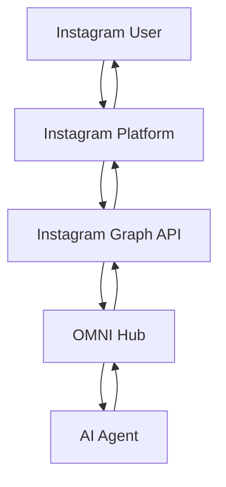

<Warning>
**Roadmap Q1 2026** - Instagram Direct integration is planned for Q1 2026 and is currently in the research and planning phase.
</Warning>

## Overview

Instagram is the world's leading visual social platform with over 2 billion monthly active users. OMNI's upcoming Instagram integration will enable AI agents to engage through Direct Messages, respond to Stories, and interact with your audience at scale.

<Info>
**Visual-First Communication** - Instagram integration focuses on rich media interactions, story engagement, and authentic visual communication.
</Info>

---

## Why Instagram?

### Platform Reach

- **2+ billion monthly active users**
- **500+ million daily Stories**
- **95 million photos/videos shared daily**
- Highest engagement rate of all social platforms
- Young, mobile-first audience

### Business Opportunities

<CardGroup cols={2}>
  <Card title="Customer Engagement" icon="comments">
    Direct 1-on-1 conversations with customers, automated responses to common questions, personalized recommendations.
  </Card>

  <Card title="Lead Generation" icon="chart-line">
    Capture leads from Stories, profile visits, automated qualifying questions, CRM integration.
  </Card>

  <Card title="E-commerce" icon="shopping-cart">
    Product inquiries, order support, shipping updates, abandoned cart recovery.
  </Card>

  <Card title="Community Building" icon="users">
    Engage followers, respond to mentions, community management, influencer collaboration.
  </Card>
</CardGroup>

---

## Planned Features

### Instagram Direct Messages

<Accordion title="Text Messaging">
  **Capabilities**:
  - Send and receive text messages
  - Rich text formatting
  - Emoji and reactions
  - Message threading
  - Automated responses
  - Quick replies

  **Use Cases**:
  - Customer support
  - Product inquiries
  - Order status
  - Appointment booking
</Accordion>

<Accordion title="Media Sharing">
  **Rich Media Support**:
  - Photos and images
  - Videos (up to 60 seconds)
  - Voice messages
  - GIFs and stickers
  - Product catalog items
  - Story shares

  **Content Types**:
  - Product showcases
  - Tutorial videos
  - Before/after images
  - User-generated content
</Accordion>

<Accordion title="Interactive Elements">
  **Planned Interactions**:
  - Quick reply buttons
  - Product carousels
  - Call-to-action buttons
  - Lead generation forms
  - Appointment scheduling
  - Payment integration

  **Templates**:
  - Welcome messages
  - Auto-replies
  - FAQ responses
  - Shipping notifications
</Accordion>

### Instagram Stories Integration

<Accordion title="Story Mentions & Replies">
  **Engagement Features**:
  - Respond to Story mentions
  - Auto-reply to Story reactions
  - Story polls and questions
  - Swipe-up link responses
  - Story highlights

  **Automation**:
  - Thank followers for shares
  - Respond to poll results
  - Answer Story questions
  - Collect feedback
</Accordion>

<Accordion title="Story Publishing">
  **Content Creation**:
  - Scheduled Stories
  - Template-based Stories
  - Automated posting
  - Story highlights management
  - Analytics tracking

  **Use Cases**:
  - Product launches
  - Daily updates
  - Behind-the-scenes
  - User testimonials
</Accordion>

### Business Features

<Accordion title="Instagram Business API">
  **Professional Tools**:
  - Business account required
  - Instagram Shopping integration
  - Product tagging
  - Analytics and insights
  - Message tags for compliance

  **Capabilities**:
  - 24-hour messaging window
  - Human agent handoff
  - Message templates
  - Sponsored messages
</Accordion>

<Accordion title="Commerce Integration">
  **Shopping Features**:
  - Product catalog sync
  - In-chat product browsing
  - Order placement
  - Payment processing
  - Order tracking
  - Return/exchange support

  **Platforms**:
  - Shopify integration
  - WooCommerce support
  - Custom e-commerce APIs
</Accordion>

---

## Architecture Preview

### Instagram Graph API Integration



**Flow**:
1. User sends DM or interacts with Story
2. Instagram delivers via Graph API webhook
3. OMNI receives and routes to AI agent
4. Agent processes and generates response
5. OMNI sends back through Graph API
6. Instagram delivers to user

### Authentication Flow

<Tabs>
  <Tab title="OAuth Setup">
    **Planned Process**:
    1. Create Facebook App
    2. Add Instagram Graph API product
    3. Configure OAuth redirect
    4. User authorizes access
    5. Receive long-lived access token
    6. Store token securely in OMNI
  </Tab>

  <Tab title="Business Account Link">
    **Requirements**:
    - Instagram Business or Creator account
    - Connected to Facebook Page
    - App approved by Meta
    - Business verification (for some features)
  </Tab>
</Tabs>

---

## Planned Setup Process

<Info>
This is a preview of the expected setup flow. Details may change before release.
</Info>

### Step 1: Facebook App Configuration

<Steps>
  <Step title="Create Facebook App">
    Navigate to: [developers.facebook.com](https://developers.facebook.com)

    - Click **Create App**
    - Choose **Business** type
    - Enter app details
    - Click **Create App**
  </Step>

  <Step title="Add Instagram Product">
    In your app dashboard:
    - Click **Add Product**
    - Select **Instagram**
    - Click **Set Up**
  </Step>

  <Step title="Configure Webhooks">
    In Instagram → Webhooks:
    - Enter callback URL
    - Add verify token
    - Subscribe to fields:
      - messages
      - messaging_postbacks
      - message_reactions
      - story_mentions
  </Step>
</Steps>

### Step 2: Instagram Business Setup

<Steps>
  <Step title="Convert to Business Account">
    In Instagram app:
    - Settings → Account
    - Switch to Professional Account
    - Choose **Business**
  </Step>

  <Step title="Connect to Facebook Page">
    - Settings → Account
    - Linked accounts → Facebook
    - Connect to your Facebook Page
  </Step>

  <Step title="Get Account Access">
    In Facebook App:
    - Instagram → Basic Display
    - Add Instagram account
    - Authorize access
  </Step>
</Steps>

### Step 3: OMNI Configuration

**Environment Variables** (planned):
```env
# Instagram Configuration
INSTAGRAM_APP_ID=your-facebook-app-id
INSTAGRAM_APP_SECRET=your-app-secret
INSTAGRAM_ACCESS_TOKEN=long-lived-access-token
INSTAGRAM_BUSINESS_ACCOUNT_ID=instagram-business-id
INSTAGRAM_WEBHOOK_VERIFY_TOKEN=secure-verify-token

# OMNI API
AUTOMAGIK_OMNI_API_KEY=your-omni-key
AUTOMAGIK_OMNI_API_PORT=8882

# AI Agent
AGENT_API_URL=http://localhost:8886
AGENT_API_KEY=your-agent-key
```

### Step 4: Create Instance

**Expected API Call**:
```bash
curl -X POST http://localhost:8882/api/v1/instances \
  -H "x-api-key: your-omni-api-key" \
  -H "Content-Type: application/json" \
  -d '{
    "name": "my-instagram-bot",
    "channel_type": "instagram",
    "instagram_app_id": "123456789",
    "instagram_access_token": "long-lived-token",
    "instagram_business_account_id": "987654321",
    "agent_api_url": "http://localhost:8886",
    "agent_api_key": "your-agent-key"
  }'
```

---

## Planned API Examples

### Direct Messaging

<Tabs>
  <Tab title="Send Text">
    ```bash
    # Send DM
    curl -X POST http://localhost:8882/api/v1/instances/my-instagram-bot/send-text \
      -H "x-api-key: your-key" \
      -H "Content-Type: application/json" \
      -d '{
        "recipient_id": "instagram-user-id",
        "message": "Thanks for reaching out! How can we help?"
      }'
    ```
  </Tab>

  <Tab title="Send Image">
    ```bash
    # Send image in DM
    curl -X POST http://localhost:8882/api/v1/instances/my-instagram-bot/send-media \
      -H "x-api-key: your-key" \
      -H "Content-Type: application/json" \
      -d '{
        "recipient_id": "instagram-user-id",
        "media_type": "image",
        "media_url": "https://example.com/product.jpg",
        "caption": "Here is the product you asked about!"
      }'
    ```
  </Tab>

  <Tab title="Quick Replies">
    ```bash
    # Send with quick reply buttons
    curl -X POST http://localhost:8882/api/v1/instances/my-instagram-bot/send-quick-replies \
      -H "x-api-key: your-key" \
      -H "Content-Type: application/json" \
      -d '{
        "recipient_id": "instagram-user-id",
        "message": "What can I help you with?",
        "quick_replies": [
          {"title": "Product Info", "payload": "PRODUCT_INFO"},
          {"title": "Order Status", "payload": "ORDER_STATUS"},
          {"title": "Talk to Human", "payload": "HUMAN_AGENT"}
        ]
      }'
    ```
  </Tab>

  <Tab title="Product Carousel">
    ```bash
    # Send product carousel
    curl -X POST http://localhost:8882/api/v1/instances/my-instagram-bot/send-carousel \
      -H "x-api-key: your-key" \
      -H "Content-Type: application/json" \
      -d '{
        "recipient_id": "instagram-user-id",
        "products": [
          {
            "id": "prod-123",
            "image": "https://example.com/product1.jpg",
            "title": "Product 1",
            "price": "$49.99"
          },
          {
            "id": "prod-456",
            "image": "https://example.com/product2.jpg",
            "title": "Product 2",
            "price": "$39.99"
          }
        ]
      }'
    ```
  </Tab>
</Tabs>

### Story Interactions

<Tabs>
  <Tab title="Reply to Mention">
    ```bash
    # Auto-reply when mentioned in Story
    curl -X POST http://localhost:8882/api/v1/instances/my-instagram-bot/story-reply \
      -H "x-api-key: your-key" \
      -H "Content-Type: application/json" \
      -d '{
        "story_id": "story-123",
        "user_id": "instagram-user-id",
        "message": "Thanks for the mention! 🙏"
      }'
    ```
  </Tab>

  <Tab title="Post Story">
    ```bash
    # Publish to Story (planned)
    curl -X POST http://localhost:8882/api/v1/instances/my-instagram-bot/publish-story \
      -H "x-api-key: your-key" \
      -H "Content-Type: application/json" \
      -d '{
        "media_url": "https://example.com/story-image.jpg",
        "media_type": "image",
        "stickers": [
          {
            "type": "poll",
            "question": "Which product do you prefer?",
            "options": ["Product A", "Product B"]
          }
        ]
      }'
    ```
  </Tab>
</Tabs>

---

## Use Cases

### E-commerce

<CardGroup cols={2}>
  <Card title="Product Discovery" icon="search">
    **Flow**:
    - User asks about products
    - Bot shows catalog
    - Interactive product cards
    - One-click purchase

    **Features**:
    - Natural language search
    - Personalized recommendations
    - Size/color variants
    - Inventory check
  </Card>

  <Card title="Order Support" icon="box">
    **Automation**:
    - Order tracking
    - Shipping updates
    - Return/exchange requests
    - Delivery confirmation

    **Integration**:
    - E-commerce platform
    - Shipping providers
    - Payment systems
    - CRM systems
  </Card>

  <Card title="Abandoned Cart" icon="cart-shopping">
    **Recovery Flow**:
    - Detect abandoned carts
    - Send reminder via DM
    - Offer incentives
    - One-click checkout

    **Results**:
    - 15-30% recovery rate
    - Increased AOV
    - Better customer retention
  </Card>

  <Card title="Customer Reviews" icon="star">
    **Collection**:
    - Request reviews post-purchase
    - Photo/video testimonials
    - UGC collection
    - Share to Stories

    **Usage**:
    - Social proof
    - Product pages
    - Marketing campaigns
  </Card>
</CardGroup>

### Social Media Marketing

<Accordion title="Influencer Collaboration">
  **Outreach Automation**:
  - Find relevant influencers
  - Send collaboration proposals
  - Negotiate terms
  - Track campaign performance
  - Manage relationships

  **Benefits**:
  - Scaled outreach
  - Consistent messaging
  - Performance tracking
  - ROI measurement
</Accordion>

<Accordion title="Content Engagement">
  **Auto-Engagement**:
  - Respond to comments
  - Thank for Story mentions
  - Reply to DMs
  - Engage with UGC
  - Community moderation

  **Smart Filtering**:
  - Sentiment analysis
  - Spam detection
  - Priority routing
  - Escalation rules
</Accordion>

<Accordion title="Lead Generation">
  **Capture Flow**:
  - Story swipe-ups
  - Bio link clicks
  - DM opt-ins
  - Contest entries
  - Quiz interactions

  **Qualification**:
  - Automated questions
  - Interest classification
  - CRM integration
  - Sales handoff
</Accordion>

### Customer Service

<Tabs>
  <Tab title="24/7 Support">
    **Always Available**:
    - Instant responses
    - FAQ automation
    - Multi-language support
    - Escalation to humans

    **Metrics**:
    - 80% automation rate
    - <30s response time
    - 90%+ satisfaction
  </Tab>

  <Tab title="Appointment Booking">
    **Scheduling**:
    - Check availability
    - Book appointments
    - Send reminders
    - Reschedule/cancel
    - Calendar sync

    **Industries**:
    - Beauty salons
    - Medical practices
    - Consulting
    - Restaurants
  </Tab>

  <Tab title="FAQ Automation">
    **Knowledge Base**:
    - Common questions
    - Product information
    - Shipping policies
    - Return process
    - Store locations

    **AI Capabilities**:
    - Natural language understanding
    - Context awareness
    - Learning from interactions
  </Tab>
</Tabs>

---

## Requirements & Limitations

### Instagram Business API Requirements

<AccordionGroup>
  <Accordion title="Account Requirements">
    **Must Have**:
    - Instagram Business or Creator account
    - Connected to Facebook Page
    - Completed Business verification (for some features)
    - Compliance with Instagram policies

    **Not Supported**:
    - Personal Instagram accounts
    - Unverified business accounts
    - Accounts with policy violations
  </Accordion>

  <Accordion title="Messaging Window">
    **24-Hour Rule**:
    - Free messaging within 24 hours of user initiation
    - After 24 hours: requires message tags
    - Message tags limited to specific categories

    **Message Tags** (planned):
    - CONFIRMED_EVENT_UPDATE
    - POST_PURCHASE_UPDATE
    - ACCOUNT_UPDATE
    - HUMAN_AGENT (24h extension)
  </Accordion>

  <Accordion title="Rate Limits">
    **Expected Limits**:
    - 200 messages/hour per user
    - 10,000 messages/day per account
    - API call limits by app tier
    - Media size limits (8MB images, 25MB videos)

    **Best Practices**:
    - Implement throttling
    - Use message queuing
    - Respect user preferences
    - Monitor usage
  </Accordion>
</AccordionGroup>

### Content Guidelines

<Warning>
**Instagram Content Policies** must be strictly followed:

- No spam or misleading content
- No prohibited products/services
- Respect user privacy
- Authentic engagement only
- No automation for likes/follows
- Compliance with local laws
</Warning>

---

## Roadmap & Timeline

### Q1 2026 - Initial Release

**January 2026**: Planning & Research
- API exploration
- Feature specification
- Architecture design
- Community feedback

**February 2026**: Core Development
- Instagram Graph API integration
- Direct messaging support
- Basic automation
- Testing framework

**March 2026**: Beta Release
- Story interaction support
- Media handling
- Quick replies
- Beta testing program

### Q2 2026 - Advanced Features

**April-June 2026**:
- E-commerce integration
- Product catalogs
- Payment processing
- Advanced analytics
- Enterprise features

---

## Alternative Solutions (Current)

While Instagram integration is in development:

### Option 1: Instagram Graph API Direct

```bash
# Send message directly via Graph API
curl -X POST "https://graph.instagram.com/v18.0/me/messages" \
  -H "Authorization: Bearer YOUR_ACCESS_TOKEN" \
  -d '{
    "recipient": {"id": "USER_ID"},
    "message": {"text": "Hello!"}
  }'
```

### Option 2: Third-Party Platforms

<Tabs>
  <Tab title="ManyChat">
    Instagram DM automation platform with:
    - Visual flow builder
    - Quick replies
    - Broadcasting
    - Limited AI integration
  </Tab>

  <Tab title="Sprout Social">
    Social media management with:
    - DM management
    - Unified inbox
    - Team collaboration
    - Analytics
  </Tab>

  <Tab title="Instagram API">
    Direct API integration:
    - Full control
    - Custom implementation
    - More development effort
    - No OMNI benefits
  </Tab>
</Tabs>

<Warning>
Third-party solutions lack OMNI's unified multi-channel architecture, message tracing, and seamless agent integration.
</Warning>

---

## Stay Informed

### Get Updates

<CardGroup cols={2}>
  <Card title="Join Beta Program" icon="flask" href="https://forms.automagik.com/instagram-beta">
    Early access to Instagram integration
  </Card>

  <Card title="Community Discussion" icon="discord" href="https://discord.gg/xcW8c7fF3R">
    Share ideas and provide feedback
  </Card>

  <Card title="Development Blog" icon="blog" href="https://blog.automagik.com">
    Technical updates and tutorials
  </Card>

  <Card title="GitHub Roadmap" icon="github" href="https://github.com/orgs/namastexlabs/projects/9">
    Track progress and milestones
  </Card>
</CardGroup>

---

## FAQ

<AccordionGroup>
  <Accordion title="When will Instagram integration be ready?">
    **Target: Q1 2026** (January-March 2026)

    - **January**: Research and planning
    - **February**: Core development
    - **March**: Beta release

    Public release expected by end of Q1 2026.
  </Accordion>

  <Accordion title="Do I need a Business account?">
    **Yes, Instagram Business or Creator account required.**

    Personal accounts are not supported by Instagram's messaging APIs.

    **How to convert**:
    - Instagram Settings → Account
    - Switch to Professional Account
    - Choose Business or Creator
  </Accordion>

  <Accordion title="Will it work with Instagram Shopping?">
    **Yes!** Full Instagram Shopping integration planned:
    - Product catalog sync
    - In-chat product browsing
    - Shopping tags
    - Checkout support

    Requires Instagram Shopping setup and approval.
  </Accordion>

  <Accordion title="Can I automate Story posts?">
    **Yes, planned for initial release:**
    - Scheduled Stories
    - Template-based posting
    - Poll and question stickers
    - Link stickers (for verified accounts)

    Manual review recommended for brand consistency.
  </Accordion>

  <Accordion title="What about Instagram Comments?">
    **Comment automation planned for Q2 2026:**
    - Auto-reply to comments
    - Sentiment analysis
    - Spam filtering
    - Engagement metrics

    Must comply with Instagram's automation policies.
  </Accordion>

  <Accordion title="How much will it cost?">
    **OMNI integration is free and open source!**

    Costs you might incur:
    - Meta Business verification (varies)
    - Instagram ads (optional)
    - Third-party services (e.g., e-commerce platform)
    - Your hosting infrastructure
    - AI agent API calls
  </Accordion>

  <Accordion title="Can I contribute to development?">
    **Yes!** We welcome contributions:
    - Beta testing (sign up above)
    - Feature suggestions (GitHub issues)
    - Code contributions (pull requests)
    - Documentation improvements
    - Community support

    Email: instagram-dev@automagik.com
  </Accordion>
</AccordionGroup>

---

## Research & Planning

### Community Input Needed

Help shape Instagram integration by sharing:

<Steps>
  <Step title="Your Use Case">
    How do you plan to use Instagram integration?
    - E-commerce
    - Customer support
    - Marketing
    - Community engagement
    - Other
  </Step>

  <Step title="Must-Have Features">
    What features are critical for your needs?
    - DM automation
    - Story interactions
    - Product catalogs
    - Analytics
    - Other
  </Step>

  <Step title="Integration Requirements">
    What systems need to connect?
    - E-commerce platforms
    - CRM systems
    - Marketing automation
    - Analytics tools
    - Other
  </Step>
</Steps>

**Submit Feedback**: [forms.automagik.com/instagram-feedback](https://forms.automagik.com/instagram-feedback)

---

## Next Steps

<CardGroup cols={2}>
  <Card title="WhatsApp Setup" icon="whatsapp" href="/omni/channels/whatsapp-setup">
    Available now - Similar DM experience
  </Card>

  <Card title="Discord Setup" icon="discord" href="/omni/channels/discord-setup">
    Available now - Community engagement
  </Card>

  <Card title="Slack Setup" icon="slack" href="/omni/channels/slack-setup">
    Coming Q4 2025 - Team collaboration
  </Card>

  <Card title="Custom Channels" icon="code" href="/omni/channels/custom-channels">
    Build your own integration today
  </Card>
</CardGroup>

---

<Info>
**Follow Instagram Integration Progress**

Subscribe for updates: [automagik.com/instagram-notify](https://automagik.com/instagram-notify)

Join discussion: [discord.gg/xcW8c7fF3R](https://discord.gg/xcW8c7fF3R) #instagram-integration
</Info>
