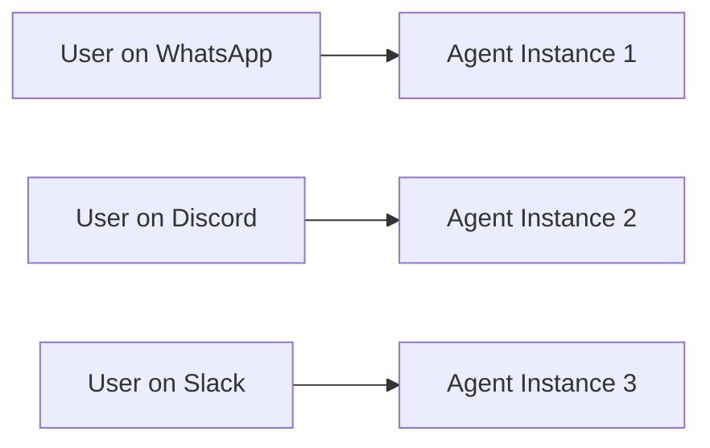
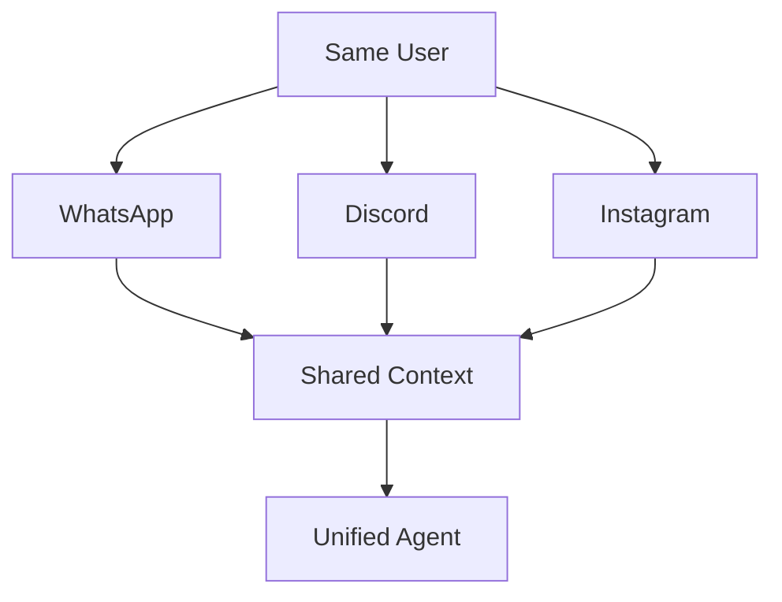

## Overview

Automagik OMNI acts as a universal messaging hub, connecting your AI agents to multiple communication platforms through a single, unified API. Each channel has unique capabilities, setup requirements, and use cases.

<Info>
**One Integration, All Channels** - Write your integration code once and it works across WhatsApp, Discord, Slack, and more.
</Info>

---

## Supported Channels

### Production Ready

<CardGroup cols={2}>
  <Card title="WhatsApp" icon="whatsapp" href="/omni/channels/whatsapp-setup">
    **Status**: ✅ Production Ready

    Connect via Evolution API with QR code login. Supports text, media, audio, stickers, reactions, and presence.

    **Best for**: Customer support, personal assistants, business communications
  </Card>

  <Card title="Discord" icon="discord" href="/omni/channels/discord-setup">
    **Status**: ✅ Production Ready

    Multi-server bot with IPC architecture. Supports text, attachments, and voice infrastructure.

    **Best for**: Community management, gaming, developer tools
  </Card>
</CardGroup>

### Coming Soon

<CardGroup cols={2}>
  <Card title="Slack" icon="slack" href="/omni/channels/slack-setup">
    **Status**: 🔄 Q4 2025

    Full workspace integration with threads, reactions, and file sharing.

    **Best for**: Team collaboration, enterprise workflows
  </Card>

  <Card title="Instagram Direct" icon="instagram" href="/omni/channels/instagram-setup">
    **Status**: 📅 Q1 2026

    Direct messages, stories engagement, and business interactions.

    **Best for**: Social media marketing, influencer engagement
  </Card>
</CardGroup>

### Roadmap

<Accordion title="Telegram (Q1 2026)">
  **Planned Features**:
  - Bot API integration
  - Group and channel management
  - Inline queries
  - Custom keyboards
  - File sharing up to 2GB

  **Use Cases**: International audiences, privacy-focused users, large file transfers
</Accordion>

<Accordion title="Microsoft Teams (Q1 2026)">
  **Planned Features**:
  - Enterprise authentication
  - Channel and chat support
  - Adaptive cards
  - Meeting integration
  - SharePoint integration

  **Use Cases**: Enterprise collaboration, corporate workflows
</Accordion>

<Accordion title="LinkedIn Messages (2026-2027)">
  **Planned Features**:
  - Professional network messaging
  - Connection management
  - InMail support

  **Use Cases**: Professional networking, B2B outreach, recruitment
</Accordion>

<Accordion title="WeChat (2026-2027)">
  **Planned Features**:
  - China market access
  - Mini-programs integration
  - Payment capabilities

  **Use Cases**: China market expansion, international business
</Accordion>

<Accordion title="Other Platforms (2026-2027)">
  - **TikTok DMs**: Short-form social engagement
  - **SMS Gateway**: Universal text messaging
  - **Meta Messenger**: Facebook messaging integration
</Accordion>

---

## Channel Comparison

### Feature Matrix

| Channel | Status | Text | Media | Voice | Reactions | Groups | Business API |
|---------|--------|------|-------|-------|-----------|--------|--------------|
| **WhatsApp** | ✅ Production | ✅ | ✅ | ✅ | ✅ | ✅ | 🔄 Q4 2025 |
| **Discord** | ✅ Production | ✅ | ✅ | 🏗️ Infrastructure | ✅ | ✅ | N/A |
| **Slack** | 🔄 Q4 2025 | 📅 | 📅 | 📅 | 📅 | 📅 | 📅 |
| **Instagram** | 📅 Q1 2026 | 📅 | 📅 | 📅 | 📅 | ❌ | 📅 |
| **Telegram** | 📅 Q1 2026 | 📅 | 📅 | 📅 | 📅 | 📅 | 📅 |
| **Teams** | 📅 Q1 2026 | 📅 | 📅 | 📅 | 📅 | 📅 | 📅 |

**Legend**: ✅ Available | 🔄 In Progress | 📅 Planned | 🏗️ Partial | ❌ Not Supported

### Setup Complexity

<Tabs>
  <Tab title="WhatsApp">
    **Complexity**: ⭐⭐⭐ Moderate

    **Requirements**:
    - Evolution API server (included with OMNI)
    - QR code scanning
    - Phone number

    **Setup Time**: 10-15 minutes

    **Dependencies**: Node.js 20+, PM2 (optional)
  </Tab>

  <Tab title="Discord">
    **Complexity**: ⭐⭐ Easy

    **Requirements**:
    - Discord Developer Account
    - Bot token
    - Server admin permissions

    **Setup Time**: 5-10 minutes

    **Dependencies**: Python 3.12+ (included)
  </Tab>

  <Tab title="Slack">
    **Complexity**: ⭐⭐ Easy (Planned)

    **Requirements**:
    - Slack workspace admin
    - App creation
    - OAuth configuration

    **Setup Time**: 10-15 minutes (estimated)

    **Dependencies**: Python 3.12+ (included)
  </Tab>

  <Tab title="Instagram">
    **Complexity**: ⭐⭐⭐⭐ Advanced (Planned)

    **Requirements**:
    - Business or Creator account
    - Facebook Developer App
    - OAuth flow

    **Setup Time**: 20-30 minutes (estimated)

    **Dependencies**: Python 3.12+, Meta Business SDK
  </Tab>
</Tabs>

---

## Choosing the Right Channels

### By Use Case

<AccordionGroup>
  <Accordion title="Customer Support">
    **Recommended**: WhatsApp + Slack

    - **WhatsApp**: Direct customer communication
    - **Slack**: Internal team coordination

    **Why**: High customer reach (WhatsApp) + efficient team collaboration (Slack)
  </Accordion>

  <Accordion title="Community Management">
    **Recommended**: Discord + Telegram

    - **Discord**: Gaming and tech communities
    - **Telegram**: International and privacy-focused audiences

    **Why**: Feature-rich community tools, active engagement features
  </Accordion>

  <Accordion title="Enterprise Workflows">
    **Recommended**: Slack + Microsoft Teams

    - **Slack**: Agile teams and startups
    - **Teams**: Large enterprises with Microsoft ecosystem

    **Why**: Deep integration with productivity tools, compliance features
  </Accordion>

  <Accordion title="Marketing & Outreach">
    **Recommended**: Instagram + WhatsApp

    - **Instagram**: Visual brand engagement
    - **WhatsApp**: Direct marketing and support

    **Why**: High engagement rates, visual content support
  </Accordion>

  <Accordion title="International Business">
    **Recommended**: WhatsApp + WeChat + Telegram

    - **WhatsApp**: Americas, Europe, India
    - **WeChat**: China market
    - **Telegram**: Europe, Middle East, Asia

    **Why**: Geographic coverage, cultural preferences
  </Accordion>
</AccordionGroup>

### By Scale

<Tabs>
  <Tab title="Small Projects (< 1K users)">
    **Start with**: WhatsApp or Discord

    - Low setup complexity
    - No infrastructure requirements
    - Free tier available
    - Quick to deploy

    ```bash
    # Single channel setup
    curl -X POST http://localhost:8882/api/v1/instances \
      -H "x-api-key: your-key" \
      -d '{
        "name": "my-bot",
        "channel_type": "whatsapp"
      }'
    ```
  </Tab>

  <Tab title="Medium Projects (1K-100K users)">
    **Recommended**: WhatsApp + Discord + Slack

    - Multi-channel presence
    - Redundancy and failover
    - Channel-specific features
    - Professional appearance

    ```bash
    # Multi-channel setup
    for channel in whatsapp discord slack; do
      curl -X POST http://localhost:8882/api/v1/instances \
        -H "x-api-key: your-key" \
        -d "{\"name\": \"bot-${channel}\", \"channel_type\": \"${channel}\"}"
    done
    ```
  </Tab>

  <Tab title="Large Scale (> 100K users)">
    **Recommended**: All major channels

    - Global coverage
    - Geographic redundancy
    - Multiple failover options
    - WhatsApp Business API
    - Enterprise features

    Requires:
    - Load balancing
    - Database optimization (PostgreSQL)
    - Monitoring and alerting
    - Multiple Evolution API instances
  </Tab>
</Tabs>

---

## Multi-Channel Strategies

### Synchronized Presence

Run the same AI agent across multiple channels:

```json
{
  "agent_url": "https://your-agent.com/chat",
  "agent_api_key": "shared-key",
  "instances": [
    {"channel": "whatsapp", "name": "support-wa"},
    {"channel": "discord", "name": "support-discord"},
    {"channel": "slack", "name": "support-slack"}
  ]
}
```

**Benefits**:
- Consistent user experience
- Single codebase
- Unified analytics

**Current Limitation**: Channels don't share user context (yet)

### Channel-Specific Agents

Deploy different agents per channel:

```json
{
  "whatsapp": {
    "agent_url": "https://your-agent.com/support",
    "purpose": "Customer support"
  },
  "discord": {
    "agent_url": "https://your-agent.com/community",
    "purpose": "Community management"
  },
  "slack": {
    "agent_url": "https://your-agent.com/internal",
    "purpose": "Internal tools"
  }
}
```

**Benefits**:
- Optimized for channel features
- Different personalities/tones
- Channel-specific capabilities

### Geographic Distribution

Route users to region-specific channels:

```
Americas → WhatsApp + Slack
Europe → WhatsApp + Telegram + Discord
Asia → WhatsApp + WeChat + LINE
```

---

## Roadmap to Omnipresence

### Phase 1: Multi-Presence (Current)

✅ Multiple channels supported
✅ Independent operation per channel
❌ No shared context between channels



### Phase 2: Unified Identity (Q1-Q2 2026)

Link same user across multiple platforms:

```json
{
  "user_id": "unified-user-123",
  "identities": {
    "whatsapp": "+1234567890",
    "discord": "user#1234",
    "slack": "U123ABC"
  }
}
```

### Phase 3: True Omnipresence (Q2 2026+)

Shared context across all channels:

> "Hey assistant, I saw a cool product on Instagram—can you help me order it here on WhatsApp?"

The agent:
- Recognizes you across platforms
- Remembers Instagram conversation
- Continues seamlessly on WhatsApp



---

## Performance & Reliability

### Message Delivery

| Channel | Avg Latency | Success Rate | Retry Logic |
|---------|-------------|--------------|-------------|
| WhatsApp | 200-500ms | 99.5% | Auto-retry 3x |
| Discord | 100-300ms | 99.9% | Auto-retry 3x |
| Slack | 150-400ms | 99.7% (est.) | Auto-retry 3x |

### Scaling Limits

<Tabs>
  <Tab title="WhatsApp">
    **Current Limits** (via Evolution API):
    - 100 instances per server
    - 1000 messages/day per instance (personal)
    - Unlimited with Business API (Q4 2025)

    **Scaling Strategy**:
    - Multiple Evolution API servers
    - Load balancing
    - Fallback to alternative engines
  </Tab>

  <Tab title="Discord">
    **Current Limits**:
    - Unlimited instances
    - 50 requests/second per bot
    - 10,000 API calls/10 minutes

    **Scaling Strategy**:
    - Multiple bot tokens
    - Request queuing
    - Rate limit handling
  </Tab>

  <Tab title="Slack">
    **Expected Limits**:
    - 1 request/second per workspace
    - Burst up to 100 requests/minute
    - Tier-based rate limits

    **Scaling Strategy**:
    - Multiple workspaces
    - Request throttling
    - Priority queuing
  </Tab>
</Tabs>

---

## Custom Channels

Need a platform not listed here?

<Card title="Build Your Own Channel Handler" icon="code" href="/omni/channels/custom-channels">
  Learn how to create custom channel integrations using OMNI's pluggable architecture.

  **Examples**:
  - SMS gateways (Twilio, MessageBird)
  - Proprietary chat systems
  - Legacy messaging platforms
  - Custom protocols
</Card>

---

## Next Steps

<CardGroup cols={2}>
  <Card title="WhatsApp Setup" icon="whatsapp" href="/omni/channels/whatsapp-setup">
    Connect your first WhatsApp bot
  </Card>

  <Card title="Discord Setup" icon="discord" href="/omni/channels/discord-setup">
    Create a Discord community bot
  </Card>

  <Card title="Multi-Channel Strategy" icon="diagram-project" href="/omni/quickstart">
    Deploy across multiple channels
  </Card>

  <Card title="API Reference" icon="code" href="/omni/api/instances">
    Explore the full API
  </Card>
</CardGroup>

---

## FAQ

<AccordionGroup>
  <Accordion title="Can I use the same agent across all channels?">
    **Yes!** That's the whole point of OMNI. Configure your agent URL once and use it for all channels.

    ```bash
    # Same agent for all channels
    agent_url="https://your-agent.com/chat"
    ```
  </Accordion>

  <Accordion title="Do channels share user context?">
    **Not yet.** Currently, each channel operates independently.

    **Planned for Q1-Q2 2026**: Unified user management and shared context across all channels.
  </Accordion>

  <Accordion title="Which channel should I start with?">
    **For most use cases**: Start with WhatsApp
    - Largest user base globally
    - Easy setup with Evolution API
    - Rich feature set

    **For tech communities**: Start with Discord
    - Developer-friendly
    - Rich API
    - Great community features
  </Accordion>

  <Accordion title="Can I run multiple instances per channel?">
    **Yes!** Run as many instances as you need:

    ```bash
    # Multiple WhatsApp instances
    curl -X POST .../instances -d '{"name": "support-bot"}'
    curl -X POST .../instances -d '{"name": "sales-bot"}'
    curl -X POST .../instances -d '{"name": "marketing-bot"}'
    ```
  </Accordion>

  <Accordion title="What's the cost per channel?">
    **OMNI is free and open source!**

    Channel-specific costs:
    - **WhatsApp**: Free (personal), Business API costs apply
    - **Discord**: Free
    - **Slack**: Free tier available, paid plans for features
    - **Instagram**: Free with Business account

    Only pay for:
    - Your hosting infrastructure
    - Your AI agent API calls
    - Channel-specific Business APIs (optional)
  </Accordion>

  <Accordion title="How do I handle channel failures?">
    OMNI includes automatic retry logic and comprehensive error handling.

    **Best practices**:
    - Monitor with `/api/v1/traces`
    - Set up multiple channels for redundancy
    - Use health checks
    - Configure alerts

    ```bash
    # Check instance health
    curl http://localhost:8882/api/v1/instances/my-bot/status
    ```
  </Accordion>
</AccordionGroup>
