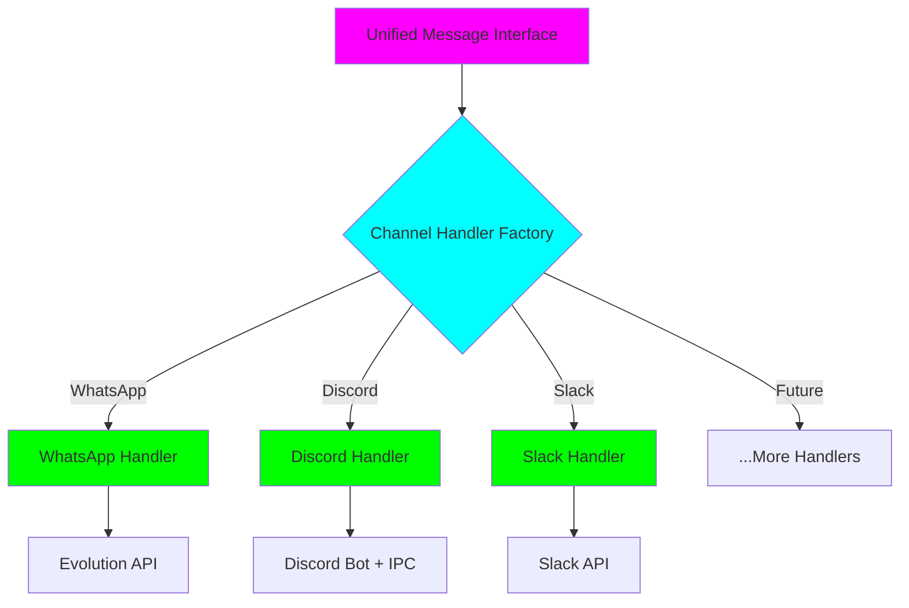
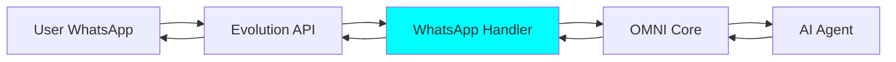
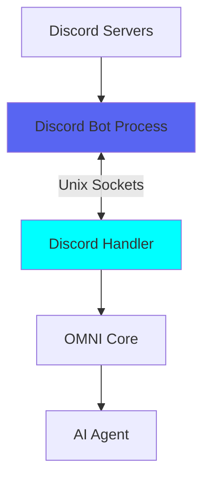

<div style={{ textAlign: 'center', marginBottom: '2rem' }}>
  <h1 style={{ fontSize: '2.5rem', fontWeight: '300', marginBottom: '1rem' }}>
    <span style={{ fontWeight: '900', background: 'linear-gradient(to right, #FF00FF, #00FFFF)', WebkitBackgroundClip: 'text', WebkitTextFillColor: 'transparent' }}>Channel Handlers</span>
  </h1>
  <p style={{ fontSize: '1.2rem', color: '#888' }}>
    One Interface, Every Platform
  </p>
</div>

## What are Channel Handlers?

**Channel handlers** are OMNI's pluggable architecture for integrating with different messaging platforms. Each handler encapsulates platform-specific logic whilst exposing a unified interface, enabling OMNI to support WhatsApp, Discord, Slack, and future platforms without changing core code.



---

## The Factory Pattern

OMNI uses the **factory pattern** to create the appropriate handler for each instance:

```python
# Simplified channel handler factory
class ChannelHandlerFactory:
    @staticmethod
    def create(instance: Instance) -> ChannelHandler:
        """Create appropriate handler based on instance type"""
        handlers = {
            "whatsapp": WhatsAppHandler,
            "discord": DiscordHandler,
            "slack": SlackHandler,  # Coming Q4 2025
        }

        handler_class = handlers.get(instance.channel_type)
        if not handler_class:
            raise ValueError(f"Unsupported channel: {instance.channel_type}")

        return handler_class(instance)
```

<Info>
**Extensibility**: Adding a new platform means implementing one new handler class - no changes to OMNI core logic.
</Info>

---

## Unified Handler Interface

All handlers implement a common interface:

```python
class ChannelHandler(ABC):
    """Abstract base class for all channel handlers"""

    @abstractmethod
    async def send_text(self, phone: str, message: str, **kwargs) -> dict:
        """Send text message"""
        pass

    @abstractmethod
    async def send_media(self, phone: str, media_url: str, media_type: str, **kwargs) -> dict:
        """Send media (image, video, document)"""
        pass

    @abstractmethod
    async def get_qr_code(self) -> str:
        """Get connection QR code (if applicable)"""
        pass

    @abstractmethod
    async def get_status(self) -> dict:
        """Get connection status"""
        pass

    @abstractmethod
    async def restart_connection(self) -> dict:
        """Restart platform connection"""
        pass

    @abstractmethod
    def normalize_webhook_payload(self, payload: dict) -> NormalizedMessage:
        """Transform platform webhook into standard format"""
        pass
```

<Tip>
**Consistent API**: Regardless of platform, OMNI's API looks identical - `send_text()`, `send_media()`, etc.
</Tip>

---

## WhatsApp Handler

### Architecture

WhatsApp integration uses **Evolution API** - a robust open-source WhatsApp Business API solution:



### Implementation Highlights

<Tabs>
  <Tab title="Send Text">
    ```python
    class WhatsAppHandler(ChannelHandler):
        async def send_text(
            self,
            phone: str,
            message: str,
            quoted_message_id: str | None = None,
            delay: int | None = None
        ) -> dict:
            """Send WhatsApp text message via Evolution API"""
            payload = {
                "number": self._normalize_phone(phone),
                "text": message,
            }

            if quoted_message_id:
                payload["quoted"] = {
                    "key": {"id": quoted_message_id}
                }

            if delay:
                payload["delay"] = delay

            response = await self._evolution_request(
                method="POST",
                endpoint=f"/message/sendText/{self.instance.name}",
                json=payload
            )

            return response
    ```
  </Tab>

  <Tab title="Send Media">
    ```python
    async def send_media(
        self,
        phone: str,
        media_url: str,
        media_type: str = "image",
        caption: str | None = None
    ) -> dict:
        """Send WhatsApp media via Evolution API"""
        payload = {
            "number": self._normalize_phone(phone),
            "mediatype": media_type,  # image, video, document
            "media": media_url,
        }

        if caption:
            payload["caption"] = caption

        response = await self._evolution_request(
            method="POST",
            endpoint=f"/message/sendMedia/{self.instance.name}",
            json=payload
        )

        return response
    ```
  </Tab>

  <Tab title="QR Code">
    ```python
    async def get_qr_code(self) -> str:
        """Get WhatsApp QR code for authentication"""
        response = await self._evolution_request(
            method="GET",
            endpoint=f"/instance/connect/{self.instance.name}"
        )

        # Evolution API returns base64 QR code
        return response.get("qrcode", {}).get("base64")
    ```
  </Tab>

  <Tab title="Webhook Normalization">
    ```python
    def normalize_webhook_payload(self, payload: dict) -> NormalizedMessage:
        """Transform Evolution API webhook to standard format"""
        data = payload.get("data", {})
        message = data.get("message", {})

        # Extract common fields
        return NormalizedMessage(
            platform="whatsapp",
            user_id=message.get("key", {}).get("remoteJid"),
            message_id=message.get("key", {}).get("id"),
            text=self._extract_text(message),
            media_url=self._extract_media(message),
            timestamp=message.get("messageTimestamp"),
            raw_payload=payload  # Store original for debugging
        )
    ```
  </Tab>
</Tabs>

### WhatsApp-Specific Features

<AccordionGroup>
  <Accordion title="Reactions">
    ```python
    async def send_reaction(
        self, phone: str, message_id: str, emoji: str
    ) -> dict:
        """Send emoji reaction to a message"""
        payload = {
            "number": self._normalize_phone(phone),
            "key": {"id": message_id},
            "reaction": emoji
        }
        return await self._evolution_request(
            "POST", f"/message/sendReaction/{self.instance.name}", json=payload
        )
    ```
  </Accordion>

  <Accordion title="Presence (Typing/Recording)">
    ```python
    async def send_presence(
        self, phone: str, presence: str = "composing"
    ) -> dict:
        """Send typing or recording indicator"""
        # presence: composing, recording, paused
        payload = {
            "number": self._normalize_phone(phone),
            "state": presence
        }
        return await self._evolution_request(
            "POST", f"/chat/sendPresence/{self.instance.name}", json=payload
        )
    ```
  </Accordion>

  <Accordion title="Audio Messages">
    ```python
    async def send_audio(self, phone: str, audio_url: str) -> dict:
        """Send voice note (PTT - push-to-talk)"""
        payload = {
            "number": self._normalize_phone(phone),
            "audio": audio_url,
            "ptt": True  # Mark as voice note
        }
        return await self._evolution_request(
            "POST", f"/message/sendWhatsAppAudio/{self.instance.name}", json=payload
        )
    ```
  </Accordion>

  <Accordion title="Stickers">
    ```python
    async def send_sticker(self, phone: str, sticker_url: str) -> dict:
        """Send WhatsApp sticker"""
        payload = {
            "number": self._normalize_phone(phone),
            "sticker": sticker_url
        }
        return await self._evolution_request(
            "POST", f"/message/sendSticker/{self.instance.name}", json=payload
        )
    ```
  </Accordion>
</AccordionGroup>

---

## Discord Handler

### Architecture

Discord integration uses a hybrid **Bot + IPC** approach:



<Info>
**Why IPC?**: Discord bots require a persistent WebSocket connection. The bot runs as a separate process, communicating with OMNI via Unix sockets for efficiency.
</Info>

### Implementation Highlights

<Tabs>
  <Tab title="Send Text">
    ```python
    class DiscordHandler(ChannelHandler):
        async def send_text(
            self,
            channel_id: str,
            message: str,
            reply_to: str | None = None
        ) -> dict:
            """Send Discord message via IPC"""
            command = {
                "action": "send_message",
                "channel_id": channel_id,
                "content": message,
            }

            if reply_to:
                command["reference_message_id"] = reply_to

            response = await self._send_ipc_command(command)
            return response
    ```
  </Tab>

  <Tab title="Send Media">
    ```python
    async def send_media(
        self,
        channel_id: str,
        media_url: str,
        caption: str | None = None
    ) -> dict:
        """Send Discord attachment"""
        command = {
            "action": "send_attachment",
            "channel_id": channel_id,
            "file_url": media_url,
            "content": caption or ""
        }

        response = await self._send_ipc_command(command)
        return response
    ```
  </Tab>

  <Tab title="IPC Communication">
    ```python
    async def _send_ipc_command(self, command: dict) -> dict:
        """Send command to Discord bot via Unix socket"""
        socket_path = f"/tmp/discord-bot-{self.instance.name}.sock"

        try:
            # Connect to Unix socket
            reader, writer = await asyncio.open_unix_connection(socket_path)

            # Send command
            writer.write(json.dumps(command).encode() + b"\n")
            await writer.drain()

            # Read response
            response = await reader.readline()
            result = json.loads(response.decode())

            writer.close()
            await writer.wait_closed()

            return result

        except Exception as e:
            raise ConnectionError(f"IPC failed: {e}")
    ```
  </Tab>

  <Tab title="Webhook Normalization">
    ```python
    def normalize_webhook_payload(self, payload: dict) -> NormalizedMessage:
        """Transform Discord webhook to standard format"""
        return NormalizedMessage(
            platform="discord",
            user_id=payload.get("author", {}).get("id"),
            message_id=payload.get("id"),
            text=payload.get("content"),
            channel_id=payload.get("channel_id"),
            guild_id=payload.get("guild_id"),  # Discord-specific
            attachments=payload.get("attachments", []),
            timestamp=payload.get("timestamp"),
            raw_payload=payload
        )
    ```
  </Tab>
</Tabs>

### Discord-Specific Features

<AccordionGroup>
  <Accordion title="Multi-Server Support">
    ```python
    async def list_servers(self) -> list[dict]:
        """List all Discord servers (guilds) bot is in"""
        command = {"action": "list_guilds"}
        response = await self._send_ipc_command(command)
        return response.get("guilds", [])
    ```
  </Accordion>

  <Accordion title="Thread Support">
    ```python
    async def create_thread(
        self, channel_id: str, name: str, message_id: str | None = None
    ) -> dict:
        """Create Discord thread"""
        command = {
            "action": "create_thread",
            "channel_id": channel_id,
            "name": name
        }
        if message_id:
            command["message_id"] = message_id  # Thread from message

        return await self._send_ipc_command(command)
    ```
  </Accordion>

  <Accordion title="Embeds">
    ```python
    async def send_embed(
        self, channel_id: str, embed: dict
    ) -> dict:
        """Send rich Discord embed"""
        command = {
            "action": "send_embed",
            "channel_id": channel_id,
            "embed": {
                "title": embed.get("title"),
                "description": embed.get("description"),
                "color": embed.get("color", 0x00FFFF),
                "fields": embed.get("fields", [])
            }
        }
        return await self._send_ipc_command(command)
    ```
  </Accordion>
</AccordionGroup>

---

## Message Normalization

A critical handler responsibility is **normalizing** platform-specific webhooks into a unified format:

### Standard Message Format

```python
@dataclass
class NormalizedMessage:
    """Unified message format across all platforms"""
    platform: str              # "whatsapp", "discord", "slack"
    user_id: str              # Platform-specific user ID
    message_id: str           # Unique message ID
    text: str | None          # Text content
    media_url: str | None     # Media attachment URL
    media_type: str | None    # image, video, audio, document
    timestamp: int            # Unix timestamp
    channel_id: str | None    # Discord/Slack channel
    thread_id: str | None     # Thread/conversation ID
    reply_to: str | None      # ID of message being replied to
    raw_payload: dict         # Original webhook data
```

### Normalization Examples

<Tabs>
  <Tab title="WhatsApp → Normalized">
    ```python
    # WhatsApp Evolution API webhook
    whatsapp_payload = {
        "event": "messages.upsert",
        "data": {
            "message": {
                "key": {
                    "remoteJid": "5511999999999@s.whatsapp.net",
                    "id": "3EB0ABC123"
                },
                "message": {
                    "conversation": "Hello from WhatsApp!"
                },
                "messageTimestamp": 1698765432
            }
        }
    }

    # Normalized to standard format
    normalized = NormalizedMessage(
        platform="whatsapp",
        user_id="5511999999999@s.whatsapp.net",
        message_id="3EB0ABC123",
        text="Hello from WhatsApp!",
        timestamp=1698765432,
        raw_payload=whatsapp_payload
    )
    ```
  </Tab>

  <Tab title="Discord → Normalized">
    ```python
    # Discord webhook
    discord_payload = {
        "id": "1234567890123456789",
        "channel_id": "9876543210987654321",
        "author": {
            "id": "1111111111111111111",
            "username": "johndoe"
        },
        "content": "Hello from Discord!",
        "timestamp": "2025-11-04T12:00:00.000Z"
    }

    # Normalized to standard format
    normalized = NormalizedMessage(
        platform="discord",
        user_id="1111111111111111111",
        message_id="1234567890123456789",
        text="Hello from Discord!",
        channel_id="9876543210987654321",
        timestamp=1730721600,
        raw_payload=discord_payload
    )
    ```
  </Tab>
</Tabs>

<Tip>
**Debugging**: The `raw_payload` field preserves original platform data for debugging and platform-specific features.
</Tip>

---

## Adding New Channels

Adding support for a new platform requires implementing the `ChannelHandler` interface:

<Steps>
  <Step title="Create Handler Class">
    ```python
    # handlers/slack_handler.py
    from omni.handlers.base import ChannelHandler

    class SlackHandler(ChannelHandler):
        """Slack messaging platform handler"""

        def __init__(self, instance: Instance):
            self.instance = instance
            self.slack_token = instance.slack_token
            self.slack_client = SlackClient(token=self.slack_token)
    ```
  </Step>

  <Step title="Implement Required Methods">
    ```python
    async def send_text(self, channel: str, message: str, **kwargs) -> dict:
        """Send Slack message"""
        response = await self.slack_client.chat_postMessage(
            channel=channel,
            text=message,
            thread_ts=kwargs.get("thread_ts")  # Slack threading
        )
        return response

    async def send_media(self, channel: str, media_url: str, **kwargs) -> dict:
        """Send Slack file attachment"""
        response = await self.slack_client.files_upload(
            channels=channel,
            file=media_url,
            initial_comment=kwargs.get("caption")
        )
        return response
    ```
  </Step>

  <Step title="Implement Webhook Normalization">
    ```python
    def normalize_webhook_payload(self, payload: dict) -> NormalizedMessage:
        """Transform Slack event to standard format"""
        event = payload.get("event", {})

        return NormalizedMessage(
            platform="slack",
            user_id=event.get("user"),
            message_id=event.get("ts"),
            text=event.get("text"),
            channel_id=event.get("channel"),
            thread_id=event.get("thread_ts"),
            timestamp=float(event.get("ts", 0)),
            raw_payload=payload
        )
    ```
  </Step>

  <Step title="Register in Factory">
    ```python
    # handlers/factory.py
    class ChannelHandlerFactory:
        @staticmethod
        def create(instance: Instance) -> ChannelHandler:
            handlers = {
                "whatsapp": WhatsAppHandler,
                "discord": DiscordHandler,
                "slack": SlackHandler,  # ✅ New handler registered
            }
            # ... rest of factory logic
    ```
  </Step>

  <Step title="Add Instance Configuration">
    ```python
    # Update Instance model to support Slack
    class Instance(BaseModel):
        # ... existing fields
        slack_token: str | None = None
        slack_signing_secret: str | None = None
    ```
  </Step>

  <Step title="Create Migration">
    ```bash
    # Add database columns for new channel type
    alembic revision -m "Add Slack support"
    ```
  </Step>
</Steps>

<Info>
**That's it!** The rest of OMNI (routing, tracing, MCP tools) works automatically with the new handler.
</Info>

---

## Platform Comparison

| Feature | WhatsApp | Discord | Slack (Coming) |
|---------|----------|---------|----------------|
| **Authentication** | QR Code | Bot Token | OAuth |
| **Message Types** | Text, Media, Audio, Sticker | Text, Embed, Attachment | Text, Block, File |
| **Threading** | ❌ No native threads | ✅ Thread support | ✅ Thread support |
| **Reactions** | ✅ Emoji reactions | ✅ Emoji reactions | ✅ Emoji reactions |
| **Presence** | ✅ Typing, Recording | ❌ Not supported | ✅ Typing |
| **Media Handling** | Direct URLs | Upload required | Upload required |
| **Rate Limits** | Evolution API limits | 50/sec per bot | Tier-based limits |
| **Connection Model** | Webhook | WebSocket (IPC) | Webhook + Events |

---

## Handler Best Practices

### Error Handling

```python
class WhatsAppHandler(ChannelHandler):
    async def send_text(self, phone: str, message: str, **kwargs) -> dict:
        try:
            response = await self._evolution_request(...)
            return response

        except HTTPException as e:
            # Platform-specific error handling
            if e.status_code == 404:
                raise InstanceNotFoundError(f"WhatsApp instance not found")
            elif e.status_code == 429:
                raise RateLimitError("Evolution API rate limit exceeded")
            else:
                raise PlatformError(f"WhatsApp API error: {e}")

        except Exception as e:
            # Generic error handling
            logger.error(f"Unexpected error in WhatsApp handler: {e}")
            raise
```

### Retry Logic

```python
from tenacity import retry, stop_after_attempt, wait_exponential

class DiscordHandler(ChannelHandler):
    @retry(
        stop=stop_after_attempt(3),
        wait=wait_exponential(multiplier=1, min=2, max=10),
        reraise=True
    )
    async def _send_ipc_command(self, command: dict) -> dict:
        """Retry IPC commands with exponential backoff"""
        # ... IPC communication logic
```

### Logging & Observability

```python
import structlog

logger = structlog.get_logger()

class SlackHandler(ChannelHandler):
    async def send_text(self, channel: str, message: str, **kwargs) -> dict:
        logger.info(
            "slack_send_text",
            instance=self.instance.name,
            channel=channel,
            message_length=len(message)
        )

        try:
            response = await self.slack_client.chat_postMessage(...)
            logger.info("slack_send_success", message_id=response["ts"])
            return response

        except Exception as e:
            logger.error("slack_send_failed", error=str(e))
            raise
```

---

## Performance Optimizations

### Connection Pooling

```python
class WhatsAppHandler(ChannelHandler):
    # Shared HTTP client for Evolution API requests
    _http_client: httpx.AsyncClient | None = None

    async def _get_http_client(self) -> httpx.AsyncClient:
        """Reuse HTTP client for connection pooling"""
        if self._http_client is None:
            self._http_client = httpx.AsyncClient(
                timeout=30.0,
                limits=httpx.Limits(max_connections=100)
            )
        return self._http_client
```

### Caching

```python
from functools import lru_cache

class DiscordHandler(ChannelHandler):
    @lru_cache(maxsize=100)
    async def get_channel_info(self, channel_id: str) -> dict:
        """Cache channel metadata to reduce API calls"""
        command = {"action": "get_channel", "channel_id": channel_id}
        return await self._send_ipc_command(command)
```

---

## Next Steps

<CardGroup cols={2}>
  <Card title="Message Tracing" icon="chart-line" href="/omni/concepts/message-tracing">
    Learn how handlers integrate with tracing
  </Card>

  <Card title="MCP Architecture" icon="microchip" href="/omni/concepts/mcp-architecture">
    Control handlers via Model Context Protocol
  </Card>

  <Card title="Quick Start" icon="rocket" href="/omni/quickstart">
    Use handlers to send your first messages
  </Card>

  <Card title="API Reference" icon="code" href="/omni/api/messaging">
    Complete handler API documentation
  </Card>
</CardGroup>

---

<Card title="Handlers Make OMNI Extensible" icon="puzzle-piece">
**The factory pattern + unified interface** means OMNI can support any messaging platform without architectural changes.

WhatsApp, Discord, Slack - and whatever comes next. One interface, infinite platforms.
</Card>
