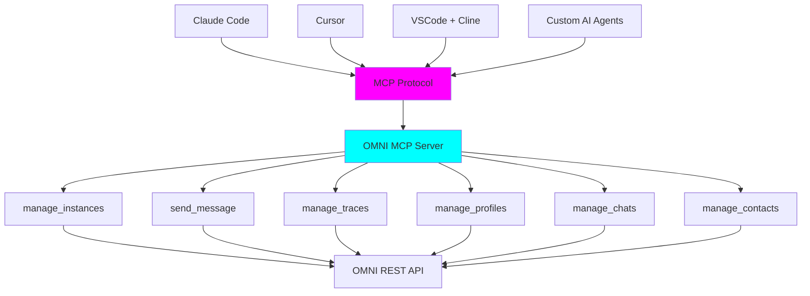

<div style={{ textAlign: 'center', marginBottom: '2rem' }}>
  <h1 style={{ fontSize: '2.5rem', fontWeight: '300', marginBottom: '1rem' }}>
    <span style={{ fontWeight: '900', background: 'linear-gradient(to right, #FF00FF, #00FFFF)', WebkitBackgroundClip: 'text', WebkitTextFillColor: 'transparent' }}>MCP-Native Architecture</span>
  </h1>
  <p style={{ fontSize: '1.2rem', color: '#888' }}>
    AI Agents Control Messaging Infrastructure
  </p>
</div>

## What is MCP?

**Model Context Protocol (MCP)** is an open standard that enables AI agents to securely access external tools, data sources, and APIs. Think of it as **USB for AI** - a universal connector that lets any MCP-compatible AI (like Claude, Cursor, or custom agents) use OMNI's messaging capabilities.



---

## Why OMNI is MCP-Native

### The Vision

Traditional messaging platforms require developers to:
1. Learn platform-specific APIs
2. Write integration code
3. Manage webhooks and authentication
4. Handle errors and retries

**With MCP**, AI agents can:
1. Discover OMNI's capabilities automatically
2. Use natural language to control messaging
3. Compose complex workflows programmatically
4. Integrate with any MCP-compatible tool ecosystem

<Info>
**MCP-Native**: OMNI isn't just "MCP-compatible" - it's designed from the ground up to be controlled by AI agents via MCP.
</Info>

### Real-World Example

<Tabs>
  <Tab title="Without MCP">
    **Traditional Approach**: Developer writes code

    ```python
    # Developer must write this code
    import requests

    # Create instance
    response = requests.post(
        "http://localhost:8882/api/v1/instances",
        headers={"x-api-key": "secret"},
        json={
            "name": "support-bot",
            "channel_type": "whatsapp",
            "agent_url": "https://agent.com"
        }
    )

    # Get QR code
    qr = requests.get(
        "http://localhost:8882/api/v1/instances/support-bot/qr",
        headers={"x-api-key": "secret"}
    )

    # Send message
    requests.post(
        "http://localhost:8882/api/v1/instances/support-bot/send-text",
        headers={"x-api-key": "secret"},
        json={"phone": "+44123456789", "message": "Hello!"}
    )
    ```
  </Tab>

  <Tab title="With MCP">
    **AI-Native Approach**: Natural language commands

    ```
    User (in Claude Code):
    "Create a WhatsApp instance called support-bot,
     show me the QR code, and send a test message
     to +44123456789"

    Claude (via MCP):
    → Uses manage_instances to create instance
    → Uses manage_instances to get QR code
    → Uses send_message to deliver test message
    → Returns QR code and confirmation

    # No code written. Just intent expressed.
    ```
  </Tab>
</Tabs>

---

## Available MCP Tools

OMNI exposes six powerful MCP tools:

### 1. manage_instances

Complete instance lifecycle management:

```python
{
  "name": "manage_instances",
  "description": "Manage messaging instances (CRUD operations)",
  "operations": [
    "list",        # List all instances
    "get",         # Get specific instance
    "create",      # Create new instance
    "update",      # Update configuration
    "delete",      # Delete instance
    "set_default", # Set as default
    "status",      # Connection status
    "qr",          # Get QR code (WhatsApp)
    "restart",     # Restart connection
    "logout"       # Logout/disconnect
  ],
  "parameters": {
    "operation": "string (required)",
    "instance_name": "string (optional)",
    "config": "object (optional)",
    "include_status": "boolean (default: true)"
  }
}
```

**Usage Examples**:

```python
# List all instances with health status
manage_instances(operation="list", include_status=true)

# Create WhatsApp instance
manage_instances(
    operation="create",
    config={
        "name": "sales-bot",
        "channel_type": "whatsapp",
        "evolution_url": "http://localhost:18082",
        "evolution_key": "secret",
        "agent_api_url": "https://agent.com"
    }
)

# Get QR code for connection
manage_instances(operation="qr", instance_name="sales-bot")

# Check instance status
manage_instances(operation="status", instance_name="sales-bot")

# Restart connection
manage_instances(operation="restart", instance_name="sales-bot")
```

### 2. send_message

Send messages across all supported channels:

```python
{
  "name": "send_message",
  "description": "Send messages to any channel",
  "message_types": [
    "text",      # Text messages
    "media",     # Images, videos, documents
    "audio",     # Audio/voice notes
    "sticker",   # WhatsApp stickers
    "contact",   # Contact cards
    "reaction"   # Emoji reactions
  ],
  "parameters": {
    "message_type": "string (required)",
    "instance_name": "string (optional, uses default)",
    "phone": "string (required for most types)",
    "message": "string (for text)",
    "media_url": "string (for media)",
    "emoji": "string (for reaction)",
    # ... more parameters per message type
  }
}
```

**Usage Examples**:

```python
# Send text message
send_message(
    message_type="text",
    instance_name="sales-bot",
    phone="+44123456789",
    message="Hello! How can I help you today?"
)

# Send image with caption
send_message(
    message_type="media",
    phone="+44123456789",
    media_url="https://example.com/product.jpg",
    media_type="image",
    caption="Check out this amazing product!"
)

# Send voice note
send_message(
    message_type="audio",
    phone="+44123456789",
    audio_url="https://example.com/message.mp3"
)

# Send reaction
send_message(
    message_type="reaction",
    phone="+44123456789",
    message_id="msg_xyz123",
    emoji="👍"
)
```

### 3. manage_traces

Query message history and analytics:

```python
{
  "name": "manage_traces",
  "description": "Message traces and analytics",
  "operations": [
    "list",         # List traces with filters
    "get",          # Get specific trace
    "get_payloads", # Get trace payloads (debugging)
    "analytics",    # Analytics summary
    "by_phone",     # Traces for specific user
    "cleanup"       # Clean up old traces
  ],
  "parameters": {
    "operation": "string (required)",
    "trace_id": "string (optional)",
    "phone": "string (optional)",
    "instance_name": "string (optional)",
    "start_date": "string (ISO format)",
    "end_date": "string (ISO format)",
    "limit": "integer (default: 50)"
  }
}
```

**Usage Examples**:

```python
# List recent traces
manage_traces(
    operation="list",
    instance_name="sales-bot",
    limit=20
)

# Get user's message history
manage_traces(
    operation="by_phone",
    phone="+44123456789"
)

# Analytics for date range
manage_traces(
    operation="analytics",
    start_date="2025-11-01",
    end_date="2025-11-07"
)

# Debug specific trace
manage_traces(
    operation="get_payloads",
    trace_id="tr_abc123",
    include_payload=true
)

# Clean up old traces
manage_traces(
    operation="cleanup",
    days_old=90,
    dry_run=true  # Preview first
)
```

### 4. manage_profiles

User profile management:

```python
{
  "name": "manage_profiles",
  "description": "Fetch and update user profiles",
  "operations": [
    "fetch",          # Fetch user profile
    "update_picture"  # Update profile picture
  ],
  "parameters": {
    "operation": "string (required)",
    "instance_name": "string (optional)",
    "phone_number": "string (for fetch)",
    "picture_url": "string (for update_picture)"
  }
}
```

**Usage Examples**:

```python
# Fetch user profile
manage_profiles(
    operation="fetch",
    instance_name="sales-bot",
    phone_number="+44123456789"
)

# Update bot profile picture
manage_profiles(
    operation="update_picture",
    instance_name="sales-bot",
    picture_url="https://example.com/logo.jpg"
)
```

### 5. manage_chats

Chat/conversation management:

```python
{
  "name": "manage_chats",
  "description": "List and manage chats",
  "operations": [
    "list",  # List all chats
    "get"    # Get specific chat
  ],
  "parameters": {
    "operation": "string (required)",
    "instance_name": "string (required)",
    "chat_id": "string (for get)",
    "page": "integer (default: 1)",
    "page_size": "integer (default: 50)",
    "chat_type_filter": "string (direct, group, channel)",
    "archived": "boolean (optional)"
  }
}
```

**Usage Examples**:

```python
# List all chats
manage_chats(
    operation="list",
    instance_name="sales-bot",
    page_size=20
)

# List only group chats
manage_chats(
    operation="list",
    instance_name="sales-bot",
    chat_type_filter="group"
)

# Get specific chat details
manage_chats(
    operation="get",
    instance_name="sales-bot",
    chat_id="chat_xyz123"
)
```

### 6. manage_contacts

Contact management:

```python
{
  "name": "manage_contacts",
  "description": "List and search contacts",
  "operations": [
    "list",  # List all contacts
    "get"    # Get specific contact
  ],
  "parameters": {
    "operation": "string (required)",
    "instance_name": "string (required)",
    "contact_id": "string (for get)",
    "page": "integer (default: 1)",
    "page_size": "integer (default: 50)",
    "search_query": "string (optional)"
  }
}
```

**Usage Examples**:

```python
# List all contacts
manage_contacts(
    operation="list",
    instance_name="sales-bot",
    page_size=50
)

# Search contacts
manage_contacts(
    operation="list",
    instance_name="sales-bot",
    search_query="John"
)

# Get contact details
manage_contacts(
    operation="get",
    instance_name="sales-bot",
    contact_id="555196644761@s.whatsapp.net"
)
```

---

## MCP Setup Guide

### Claude Code Configuration

Add OMNI to your Claude Code MCP configuration:

```json
{
  "mcpServers": {
    "omni": {
      "command": "uvx",
      "args": ["--from", "automagik-omni", "mcp-server-omni"],
      "env": {
        "OMNI_URL": "http://localhost:8882",
        "OMNI_API_KEY": "your-api-key-here"
      }
    }
  }
}
```

**Configuration File Location**:
- **macOS**: `~/Library/Application Support/Claude/claude_desktop_config.json`
- **Windows**: `%APPDATA%\Claude\claude_desktop_config.json`
- **Linux**: `~/.config/Claude/claude_desktop_config.json`

### Cursor Configuration

Add to Cursor's MCP settings:

```json
{
  "mcp.servers": {
    "omni": {
      "command": "uvx",
      "args": ["--from", "automagik-omni", "mcp-server-omni"],
      "env": {
        "OMNI_URL": "http://localhost:8882",
        "OMNI_API_KEY": "your-api-key-here"
      }
    }
  }
}
```

**Configuration File**: `.cursor/mcp.json` in your project root

### VSCode + Cline Extension

For the Cline extension in VSCode:

```json
{
  "cline.mcpServers": [
    {
      "name": "omni",
      "command": "uvx",
      "args": ["--from", "automagik-omni", "mcp-server-omni"],
      "env": {
        "OMNI_URL": "http://localhost:8882",
        "OMNI_API_KEY": "your-api-key-here"
      }
    }
  ]
}
```

**Configuration File**: `.vscode/settings.json`

### Generic MCP Client

For any MCP-compatible tool:

```json
{
  "command": "uvx",
  "args": ["--from", "automagik-omni", "mcp-server-omni"],
  "env": {
    "OMNI_URL": "http://localhost:8882",
    "OMNI_API_KEY": "your-api-key-here"
  }
}
```

<Tip>
**Environment Variables**:
- `OMNI_URL`: Your OMNI API endpoint (default: `http://localhost:8882`)
- `OMNI_API_KEY`: API key from your `.env` file (`AUTOMAGIK_OMNI_API_KEY`)
</Tip>

---

## Real-World Workflows

### Workflow 1: Quick Customer Support Setup

**Task**: "Set up a WhatsApp support bot for Acme Corp"

```
User (in Claude Code):
"Create a WhatsApp instance called acme-support, connect it,
 and send a test message to +44123456789 saying the bot is live"

Claude executes:
1. manage_instances(operation="create", config={
     name: "acme-support",
     channel_type: "whatsapp",
     evolution_url: "http://localhost:18082",
     evolution_key: "...",
     agent_api_url: "https://acme.agents.com"
   })

2. manage_instances(operation="qr", instance_name="acme-support")
   → Displays QR code for user to scan

3. [User scans QR code]

4. send_message(
     message_type="text",
     instance_name="acme-support",
     phone="+44123456789",
     message="Acme Support Bot is now live and ready to help! 🚀"
   )

Result: Bot created, connected, and tested - all in natural language
```

### Workflow 2: Debug Failed Messages

**Task**: "Why didn't John receive my message?"

```
User (in Claude Code):
"Check if John at +44123456789 received messages today
 on the sales-bot instance. If there are failures, tell me why."

Claude executes:
1. manage_traces(
     operation="by_phone",
     phone="+44123456789",
     instance_name="sales-bot",
     start_date="2025-11-04T00:00:00Z"
   )

2. Analyses traces, finds failure:
   {
     "trace_id": "tr_fail123",
     "processing_status": "failed",
     "processing_error": "Agent timeout after 30s"
   }

3. manage_traces(operation="get_payloads", trace_id="tr_fail123")
   → Gets full debugging data

Claude responds:
"John didn't receive 1 message at 14:23 today because the
 agent server timed out after 30 seconds. The agent_url
 (https://sales.agents.com) appears to be experiencing high
 load. I recommend checking agent server health."

Result: Issue identified and diagnosed automatically
```

### Workflow 3: Analytics Report

**Task**: "Show me this week's messaging performance"

```
User (in Claude Code):
"Generate a report of all messages sent this week across
 all instances, including success rates and top users"

Claude executes:
1. manage_traces(
     operation="analytics",
     start_date="2025-11-01",
     end_date="2025-11-07"
   )

2. manage_instances(operation="list", include_status=true)

3. For each instance with high volume:
   manage_traces(operation="by_phone", ...)
   to identify top users

Claude responds:
"📊 Weekly Messaging Report (Nov 1-7, 2025)

Total Messages: 3,247
Success Rate: 97.3%
Avg Response Time: 1.8s

By Instance:
- sales-bot: 1,523 messages (98.1% success)
- support-bot: 1,102 messages (96.4% success)
- marketing-bot: 622 messages (97.9% success)

Top Users:
1. +44123456789: 89 messages
2. +44987654321: 67 messages
3. +44555111222: 54 messages

Issues:
- 87 failed messages (2.7%)
- Most common error: Agent timeout (45 failures)

Recommendation: Scale agent infrastructure"

Result: Comprehensive analytics without writing queries
```

### Workflow 4: Bulk Operations

**Task**: "Update all instances to use the new agent endpoint"

```
User (in Claude Code):
"Update all my WhatsApp instances to point to the new
 agent at https://v2.agents.company.com"

Claude executes:
1. manage_instances(operation="list")

2. For each WhatsApp instance:
   manage_instances(
     operation="update",
     instance_name=instance.name,
     config={
       "agent_api_url": "https://v2.agents.company.com"
     }
   )

3. manage_instances(operation="restart", instance_name=...)
   for each updated instance

Claude responds:
"Updated 12 WhatsApp instances to v2 agent:
✅ sales-bot
✅ support-bot
✅ marketing-bot
... (9 more)

All instances restarted and healthy."

Result: Bulk update completed safely with validation
```

---

## MCP Server Implementation

### Architecture

OMNI's MCP server is a lightweight wrapper around the REST API:

```python
# Simplified MCP server implementation
from mcp.server import Server
from mcp.types import Tool, TextContent

app = Server("automagik-omni")

@app.list_tools()
async def list_tools() -> list[Tool]:
    """Expose OMNI tools to MCP clients"""
    return [
        Tool(
            name="manage_instances",
            description="Manage messaging instances",
            inputSchema={
                "type": "object",
                "properties": {
                    "operation": {"type": "string"},
                    "instance_name": {"type": "string"},
                    # ... more parameters
                }
            }
        ),
        # ... other tools
    ]

@app.call_tool()
async def call_tool(name: str, arguments: dict) -> list[TextContent]:
    """Execute tool by calling OMNI REST API"""
    if name == "manage_instances":
        return await handle_manage_instances(arguments)
    elif name == "send_message":
        return await handle_send_message(arguments)
    # ... other handlers

async def handle_manage_instances(args: dict) -> list[TextContent]:
    """Forward to OMNI REST API"""
    operation = args["operation"]

    if operation == "list":
        response = await omni_api.get("/api/v1/instances")
    elif operation == "create":
        response = await omni_api.post("/api/v1/instances", json=args["config"])
    # ... handle other operations

    return [TextContent(type="text", text=json.dumps(response))]
```

### Benefits of MCP Layer

<AccordionGroup>
  <Accordion title="Natural Language Interface">
    AI agents translate user intent into API calls automatically - no code required
  </Accordion>

  <Accordion title="Composability">
    MCP tools can be chained with other MCP tools from different providers
  </Accordion>

  <Accordion title="Discovery">
    AI agents discover capabilities automatically through MCP protocol
  </Accordion>

  <Accordion title="Type Safety">
    Input schemas ensure AI agents call tools correctly
  </Accordion>

  <Accordion title="Error Handling">
    Structured error responses help AI agents recover gracefully
  </Accordion>
</AccordionGroup>

---

## Advanced MCP Patterns

### Chaining with Other MCP Tools

Combine OMNI with other MCP servers:

```
User (in Claude Code with multiple MCP servers):
"Search our knowledge base for the return policy,
 then send it to customer +44123456789 on WhatsApp"

Claude executes:
1. knowledge_base.search(query="return policy")
   → Uses knowledge base MCP server

2. send_message(
     message_type="text",
     phone="+44123456789",
     message=knowledge_base_result
   )
   → Uses OMNI MCP server

Result: AI orchestrates multiple tools seamlessly
```

### Conditional Logic

AI agents handle branching automatically:

```
User: "Send order confirmation to +44123456789 if
       the order status is 'confirmed' in our database"

Claude executes:
1. database.query(order_id="12345")
   → Checks order status

2. IF status == "confirmed":
     send_message(
       message_type="text",
       phone="+44123456789",
       message="Your order #12345 is confirmed!"
     )
   ELSE:
     [does nothing]

Result: Conditional messaging without code
```

### Error Recovery

MCP enables intelligent error handling:

```
send_message(phone="+44123456789", message="Hello")

IF error == "rate_limit":
  → Wait and retry
ELIF error == "instance_disconnected":
  → manage_instances(operation="restart")
  → Retry message
ELSE:
  → Report error to user

Result: Self-healing workflows
```

---

## Security Considerations

### API Key Management

<Warning>
**Never hardcode API keys** in MCP configuration files committed to version control.
</Warning>

**Best Practices**:

```bash
# Use environment variables
export OMNI_API_KEY="your-secret-key"

# Or load from secure vault
export OMNI_API_KEY=$(vault read -field=api_key secret/omni)

# MCP config references environment variable
{
  "env": {
    "OMNI_API_KEY": "${OMNI_API_KEY}"  # Reads from environment
  }
}
```

### Network Security

```yaml
Production Deployment:
  - Use HTTPS for OMNI_URL
  - Restrict MCP server to localhost
  - Use VPN for remote access
  - Implement IP whitelisting

Development:
  - localhost-only access acceptable
  - Use development API keys
  - Rotate keys regularly
```

### Audit Logging

Track MCP usage:

```python
# OMNI logs all MCP operations
logger.info(
    "mcp_tool_call",
    tool_name="send_message",
    instance_name="sales-bot",
    user="claude_code_session_123",
    timestamp="2025-11-04T12:00:00Z"
)

# Review MCP audit trail
grep "mcp_tool_call" omni.log
```

---

## Comparison: REST vs MCP

| Aspect | REST API | MCP Integration |
|--------|----------|-----------------|
| **Interface** | HTTP endpoints | AI-native tools |
| **Usage** | Code required | Natural language |
| **Discovery** | Documentation | Automatic |
| **Composition** | Manual chaining | AI orchestration |
| **Error Handling** | Developer implements | AI handles |
| **Learning Curve** | Read docs, write code | Express intent |
| **Flexibility** | Full control | AI-interpreted |
| **Use Case** | Programmatic integration | AI-driven workflows |

<Info>
**Both Coexist**: MCP doesn't replace REST - it adds an AI-native layer. Use REST for programmatic integrations, MCP for AI workflows.
</Info>

---

## Future MCP Enhancements

### Roadmap

<Steps>
  <Step title="Q4 2025: Enhanced Tools">
    - Bulk operations support
    - Advanced filtering in all tools
    - Streaming responses for long operations
  </Step>

  <Step title="Q1 2026: Workflow Templates">
    - Pre-built MCP workflow templates
    - Industry-specific templates (e-commerce, support, etc.)
    - Template marketplace
  </Step>

  <Step title="Q2 2026: Multi-Instance Orchestration">
    - Cross-instance workflows via MCP
    - Instance groups and tags
    - Coordinated multi-channel campaigns
  </Step>

  <Step title="Q3 2026: Advanced Analytics">
    - Natural language analytics queries
    - Predictive insights via MCP
    - Automated reporting
  </Step>
</Steps>

---

## Next Steps

<CardGroup cols={2}>
  <Card title="Quick Start" icon="rocket" href="/omni/quickstart">
    Set up OMNI and start using MCP tools
  </Card>

  <Card title="Channel Handlers" icon="plug" href="/omni/concepts/channel-handlers">
    Understand what MCP tools control under the hood
  </Card>

  <Card title="Message Tracing" icon="chart-line" href="/omni/concepts/message-tracing">
    Debug and analyse messages via MCP
  </Card>

  <Card title="API Reference" icon="code" href="/omni/api/mcp">
    Complete MCP tools documentation
  </Card>
</CardGroup>

---

<Card title="MCP: The AI-Native Interface" icon="robot">
**Model Context Protocol transforms OMNI from a REST API into an AI-controllable messaging platform.**

No code, no complexity - just natural language commands that make messaging infrastructure accessible to AI agents.

This is the future of developer tools: **AI-first, human-friendly**.
</Card>
