<div style={{ textAlign: 'center', marginBottom: '2rem' }}>
  <h1 style={{ fontSize: '2.5rem', fontWeight: '300', marginBottom: '1rem' }}>
    <span style={{ fontWeight: '900', background: 'linear-gradient(to right, #FF00FF, #00FFFF)', WebkitBackgroundClip: 'text', WebkitTextFillColor: 'transparent' }}>Message Tracing</span>
  </h1>
  <p style={{ fontSize: '1.2rem', color: '#888' }}>
    Complete Observability from Input to Output
  </p>
</div>

## What is Message Tracing?

**Message tracing** in Automagik OMNI provides complete visibility into every message's journey through the system - from the moment a user sends a message on WhatsApp, through AI agent processing, to the final response delivery.

Think of it as **flight tracking for messages** - you can see exactly where each message is, what happened to it, and how it performed.


---

## The Complete Trace Lifecycle

### Three-Phase Tracking

Every message trace captures three distinct phases:

<Tabs>
  <Tab title="1. Input Phase">
    **What OMNI Received**

    ```json
    {
      "trace_id": "tr_abc123",
      "phase": "input",
      "timestamp": "2025-11-04T12:00:00Z",
      "instance_name": "client-acme",
      "platform": "whatsapp",
      "user_id": "+44123456789",
      "message_id": "msg_xyz789",
      "input_payload": {
        "text": "What's the weather today?",
        "media": null,
        "timestamp": 1730721600
      },
      "raw_webhook": { /* full platform payload */ }
    }
    ```

    **Captured Data:**
    - Original user message
    - Platform metadata (WhatsApp, Discord, etc.)
    - Webhook timestamp
    - Raw platform payload for debugging
  </Tab>

  <Tab title="2. Processing Phase">
    **What Happened During Processing**

    ```json
    {
      "trace_id": "tr_abc123",
      "phase": "processing",
      "timestamp": "2025-11-04T12:00:01Z",
      "agent_url": "https://agent.example.com/chat",
      "agent_request": {
        "message": "What's the weather today?",
        "user_id": "whatsapp:+44123456789",
        "context": { /* conversation history */ }
      },
      "agent_response": {
        "response": "It's sunny, 22°C in London!",
        "processing_time_ms": 850
      },
      "status": "completed"
    }
    ```

    **Captured Data:**
    - Agent endpoint called
    - Request sent to agent
    - Agent response received
    - Processing time
    - Success/failure status
  </Tab>

  <Tab title="3. Output Phase">
    **What Was Sent Back**

    ```json
    {
      "trace_id": "tr_abc123",
      "phase": "output",
      "timestamp": "2025-11-04T12:00:02Z",
      "output_payload": {
        "text": "It's sunny, 22°C in London!",
        "platform": "whatsapp",
        "sent_to": "+44123456789"
      },
      "delivery_status": "sent",
      "delivery_time_ms": 120,
      "total_time_ms": 2000
    }
    ```

    **Captured Data:**
    - Final message sent to user
    - Platform delivery confirmation
    - Delivery time
    - Total end-to-end latency
  </Tab>
</Tabs>

---

## Trace Data Model

### Complete Trace Schema

```python
@dataclass
class MessageTrace:
    """Complete message trace record"""

    # Identifiers
    id: str                          # tr_abc123
    instance_id: str                 # UUID of instance
    instance_name: str               # client-acme
    trace_id: str                    # Same as id, for consistency

    # Input Phase
    platform: str                    # whatsapp, discord, slack
    user_id: str                     # Platform-specific user ID
    phone: str | None                # Phone number (WhatsApp)
    channel_id: str | None           # Channel ID (Discord/Slack)
    message_id: str                  # Platform message ID
    message_type: str                # text, media, audio, etc.
    input_text: str | None           # User's message text
    input_media_url: str | None      # Media attachment URL
    input_payload: dict              # Structured input data
    raw_webhook_payload: dict        # Original platform webhook

    # Processing Phase
    agent_url: str                   # Agent endpoint
    agent_request_payload: dict      # Request sent to agent
    agent_response_payload: dict     # Response from agent
    processing_status: str           # pending, completed, failed
    processing_error: str | None     # Error message if failed
    processing_time_ms: int | None   # Agent processing duration

    # Output Phase
    output_text: str | None          # Response sent to user
    output_media_url: str | None     # Media in response
    output_payload: dict             # Structured output data
    delivery_status: str             # sent, failed, pending
    delivery_error: str | None       # Delivery error if any
    delivery_time_ms: int | None     # Platform delivery time
    total_time_ms: int | None        # End-to-end latency

    # Metadata
    session_name: str | None         # Conversation session
    has_media: bool                  # Quick filter for media
    created_at: datetime             # Trace creation time
    updated_at: datetime             # Last update time
```

---

## Querying Traces

### List Traces with Filters

The Trace API supports powerful filtering:

```bash
# Get all traces for an instance
GET /api/v1/traces?instance_name=client-acme&limit=50

# Filter by phone number
GET /api/v1/traces?phone=+44123456789&limit=20

# Filter by status
GET /api/v1/traces?trace_status=failed

# Filter by message type
GET /api/v1/traces?message_type=media&has_media=true

# Date range filtering
GET /api/v1/traces?start_date=2025-11-01&end_date=2025-11-04

# Session-based queries
GET /api/v1/traces?session_name=weather_conversation
```

<Info>
**Pagination**: All trace queries support `limit` and `offset` for efficient pagination through large result sets.
</Info>

### Get Specific Trace

Retrieve complete details of a single trace:

```bash
GET /api/v1/traces/{trace_id}

Response:
{
  "trace_id": "tr_abc123",
  "instance_name": "client-acme",
  "platform": "whatsapp",
  "user_id": "+44123456789",
  "input_text": "What's the weather?",
  "output_text": "It's sunny, 22°C!",
  "processing_status": "completed",
  "total_time_ms": 2000,
  "created_at": "2025-11-04T12:00:00Z"
}
```

### Get Trace Payloads

Fetch the complete payload data for debugging:

```bash
GET /api/v1/traces/{trace_id}/payloads

Response:
{
  "trace_id": "tr_abc123",
  "input_payload": { /* full input data */ },
  "raw_webhook_payload": { /* original webhook */ },
  "agent_request_payload": { /* sent to agent */ },
  "agent_response_payload": { /* received from agent */ },
  "output_payload": { /* sent to platform */ }
}
```

<Tip>
**Debugging**: Payloads contain the complete data at each stage, making it easy to identify where issues occurred.
</Tip>

---

## Analytics & Insights

### Analytics Summary

Get aggregated metrics across all traces:

```bash
GET /api/v1/traces/analytics/summary?start_date=2025-11-01

Response:
{
  "total_messages": 1547,
  "successful_messages": 1489,
  "failed_messages": 58,
  "success_rate": 96.2,
  "avg_processing_time_ms": 850,
  "avg_total_time_ms": 1920,
  "messages_by_platform": {
    "whatsapp": 1203,
    "discord": 344
  },
  "messages_by_type": {
    "text": 1320,
    "media": 189,
    "audio": 38
  },
  "messages_by_status": {
    "completed": 1489,
    "failed": 58
  }
}
```

### Per-Instance Analytics

Track performance per instance:

```bash
GET /api/v1/traces/analytics/summary?instance_name=client-acme

Response:
{
  "instance_name": "client-acme",
  "total_messages": 423,
  "success_rate": 98.1,
  "avg_response_time_ms": 720,
  "peak_hour": "14:00-15:00",
  "busiest_day": "2025-11-03",
  "top_users": [
    {"+44123456789": 89},
    {"+44987654321": 67}
  ]
}
```

### Error Analysis

Identify and debug failures:

```bash
GET /api/v1/traces?trace_status=failed&limit=20

# Common error patterns
{
  "traces": [
    {
      "trace_id": "tr_error1",
      "processing_error": "Agent timeout after 30s",
      "created_at": "2025-11-04T10:23:45Z"
    },
    {
      "trace_id": "tr_error2",
      "delivery_error": "WhatsApp number not registered",
      "created_at": "2025-11-04T11:15:22Z"
    }
  ]
}
```

---

## Real-World Use Cases

### 1. Debugging Failed Messages

<Tabs>
  <Tab title="Scenario">
    **User reports**: "I sent a message but got no response"

    **Your investigation**:
    1. Find trace by phone number
    2. Check processing status
    3. Inspect payloads
    4. Identify root cause
  </Tab>

  <Tab title="Investigation">
    ```bash
    # Step 1: Find user's recent traces
    GET /api/v1/traces?phone=+44123456789&limit=10

    # Step 2: Check specific trace
    GET /api/v1/traces/tr_xyz123

    Response:
    {
      "trace_id": "tr_xyz123",
      "processing_status": "failed",
      "processing_error": "Agent API returned 504 Gateway Timeout",
      "agent_url": "https://agent.example.com/chat"
    }

    # Step 3: Get full payloads
    GET /api/v1/traces/tr_xyz123/payloads

    # Root cause identified: Agent server timeout
    ```
  </Tab>

  <Tab title="Resolution">
    **Root Cause**: Agent server experiencing high load, timing out

    **Fix**:
    1. Increase agent timeout configuration
    2. Scale agent infrastructure
    3. Implement retry logic

    **Prevention**:
    - Set up alerts for failed traces
    - Monitor agent response times
    - Auto-scale agent on high load
  </Tab>
</Tabs>

### 2. Performance Optimization

Track and optimize message latency:

```python
# Query slow messages
slow_traces = get_traces(
    total_time_ms_gt=5000,  # Messages taking > 5 seconds
    limit=100
)

# Analyse bottlenecks
for trace in slow_traces:
    print(f"Trace: {trace.trace_id}")
    print(f"  Processing: {trace.processing_time_ms}ms")
    print(f"  Delivery: {trace.delivery_time_ms}ms")
    print(f"  Total: {trace.total_time_ms}ms")

# Output:
# Trace: tr_slow1
#   Processing: 4800ms  ← Agent is slow
#   Delivery: 150ms
#   Total: 5200ms

# Action: Optimise agent or add caching
```

### 3. User Behavior Analysis

Understand how users interact with your agents:

```bash
# Get user's conversation history
GET /api/v1/traces?phone=+44123456789&limit=50

Response:
[
  {
    "created_at": "2025-11-04T09:00:00Z",
    "input_text": "Show me product catalogue",
    "output_text": "Here are our top products..."
  },
  {
    "created_at": "2025-11-04T09:05:00Z",
    "input_text": "What's the price of item #123?",
    "output_text": "Item #123 costs £49.99"
  },
  {
    "created_at": "2025-11-04T09:10:00Z",
    "input_text": "Add to cart",
    "output_text": "Added to cart! Total: £49.99"
  }
]

# Insights:
# - User journey: Browse → Query → Purchase
# - Conversion within 10 minutes
# - No friction points (all successful)
```

### 4. Compliance & Auditing

Maintain complete audit trails:

<AccordionGroup>
  <Accordion title="Message History Export">
    ```bash
    # Export all messages for compliance
    GET /api/v1/traces?start_date=2025-01-01&end_date=2025-12-31&format=csv

    # Exported CSV contains:
    # - timestamp, user_id, message, response
    # - Full audit trail for regulatory compliance
    ```
  </Accordion>

  <Accordion title="Data Retention">
    ```bash
    # Clean up old traces (GDPR compliance)
    POST /api/v1/traces/cleanup
    {
      "days_old": 90,      # Delete traces older than 90 days
      "dry_run": false     # Actually delete (true = preview)
    }

    Response:
    {
      "deleted_count": 15423,
      "freed_space_mb": 234
    }
    ```
  </Accordion>

  <Accordion title="User Data Export">
    ```bash
    # GDPR: Export all user data
    GET /api/v1/traces?phone=+44123456789&format=json

    # Provides complete message history for user
    # User can request deletion via:
    DELETE /api/v1/traces/user/+44123456789
    ```
  </Accordion>
</AccordionGroup>

---

## MCP Integration

Manage traces via Model Context Protocol:

```python
# From Claude Code, Cursor, or any MCP client

"Show me the last 10 messages from instance client-acme"
→ manage_traces(operation="list", instance_name="client-acme", limit=10)

"Get details for trace tr_abc123"
→ manage_traces(operation="get", trace_id="tr_abc123")

"Show me all failed messages from yesterday"
→ manage_traces(
    operation="list",
    trace_status="failed",
    start_date="2025-11-03",
    end_date="2025-11-04"
  )

"Get analytics summary for this week"
→ manage_traces(
    operation="analytics",
    start_date="2025-11-01",
    end_date="2025-11-07"
  )

"Clean up traces older than 30 days (dry run)"
→ manage_traces(operation="cleanup", days_old=30, dry_run=true)
```

---

## Trace Visualisation

### Message Flow Diagram

Visualise a trace's complete journey:

```mermaid
sequenceDiagram
    participant U as User
    participant P as Platform
    participant O as OMNI
    participant A as Agent

    U->>P: "What's the weather?"
    Note over O: Input Phase<br/>tr_abc123 created<br/>0ms

    P->>O: Webhook received
    Note over O: Parsed & validated<br/>50ms

    O->>A: POST /chat
    Note over A: Processing...<br/>850ms

    A-->>O: "It's sunny, 22°C!"
    Note over O: Processing Phase<br/>900ms

    O->>P: Send response
    Note over O: Output Phase<br/>1020ms

    P-->>U: "It's sunny, 22°C!"
    Note over O: Trace completed<br/>2000ms total
```



### Performance Dashboard

Build monitoring dashboards using trace analytics:

| Metric | Value | Status |
|--------|-------|--------|
| **Messages Today** | 1,547 | ✅ Normal |
| **Success Rate** | 96.2% | ✅ Healthy |
| **Avg Response Time** | 1.92s | ✅ Good |
| **Failed Messages** | 58 | ⚠️ Monitor |
| **Peak Hour** | 14:00-15:00 | 📊 Info |

---

## Advanced Features

### Session Tracking

Group related messages into sessions:

```python
# Messages within the same conversation
session_traces = get_traces(
    session_name="weather_conversation",
    order_by="created_at"
)

# Useful for:
# - Multi-turn conversations
# - Workflow tracking
# - Context continuity analysis
```

### Media Tracking

Filter and analyse media messages:

```bash
# All media messages
GET /api/v1/traces?has_media=true&message_type=media

# Images only
GET /api/v1/traces?message_type=media&media_type=image

# Audio messages
GET /api/v1/traces?message_type=audio
```

### Custom Metadata

Enrich traces with custom data:

```python
# Add custom metadata to trace
trace.metadata = {
    "campaign_id": "summer_sale_2025",
    "customer_segment": "premium",
    "conversion_value": 149.99
}

# Query by metadata
get_traces(metadata__campaign_id="summer_sale_2025")
```

---

## Performance Considerations

### Indexing

Traces are indexed for fast queries:

```sql
-- Database indices for performance
CREATE INDEX idx_traces_instance ON traces(instance_id);
CREATE INDEX idx_traces_phone ON traces(phone);
CREATE INDEX idx_traces_created ON traces(created_at);
CREATE INDEX idx_traces_status ON traces(processing_status);
```

### Storage Management

Traces can grow large - manage storage proactively:

<Tabs>
  <Tab title="Retention Policy">
    ```python
    # Auto-cleanup old traces
    TRACE_RETENTION_DAYS = 90  # Keep 3 months

    # Scheduled job (daily)
    cleanup_old_traces(days_old=TRACE_RETENTION_DAYS)
    ```
  </Tab>

  <Tab title="Archiving">
    ```python
    # Archive old traces to cold storage
    archive_traces(
        start_date="2025-01-01",
        end_date="2025-03-31",
        destination="s3://traces-archive/"
    )
    ```
  </Tab>

  <Tab title="Payload Pruning">
    ```python
    # Remove large payloads, keep metadata
    prune_trace_payloads(
        days_old=30,
        keep_fields=["input_text", "output_text"]
    )
    # Saves ~70% storage whilst retaining key data
    ```
  </Tab>
</Tabs>

---

## Privacy & Security

### Data Minimisation

<Warning>
**Privacy First**: Only store necessary data. Avoid logging sensitive information in payloads.
</Warning>

```python
# Redact sensitive data before storing
def create_trace(message: dict) -> Trace:
    trace = Trace(
        input_text=message["text"],
        # Don't store: passwords, credit cards, PII
        input_payload=redact_sensitive_fields(message)
    )
    return trace

def redact_sensitive_fields(payload: dict) -> dict:
    """Remove sensitive data before storage"""
    redacted = payload.copy()
    sensitive_keys = ["password", "credit_card", "ssn"]

    for key in sensitive_keys:
        if key in redacted:
            redacted[key] = "[REDACTED]"

    return redacted
```

### Access Controls

Restrict trace access per instance:

```python
# Users can only access their instance's traces
@require_instance_access
def get_traces(instance_name: str) -> list[Trace]:
    # Automatically filtered by instance
    return Trace.query.filter_by(instance_name=instance_name).all()
```

---

## Next Steps

<CardGroup cols={2}>
  <Card title="MCP Architecture" icon="microchip" href="/omni/concepts/mcp-architecture">
    Control tracing via Model Context Protocol
  </Card>

  <Card title="Multi-Tenancy" icon="users" href="/omni/concepts/multi-tenancy">
    Understand instance-level trace isolation
  </Card>

  <Card title="API Reference" icon="code" href="/omni/api/traces">
    Complete tracing API documentation
  </Card>

  <Card title="Quick Start" icon="rocket" href="/omni/quickstart">
    Start tracking messages immediately
  </Card>
</CardGroup>

---

<Card title="Traces: Your Black Box Recorder" icon="box">
**Complete observability** from input to output - debug issues, optimise performance, understand users, and maintain compliance.

Every message tells a story. Traces make sure you never lose the plot.
</Card>
