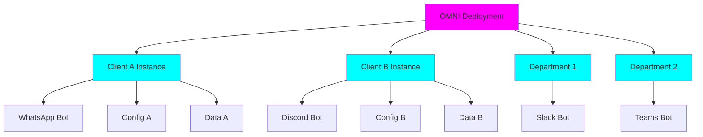
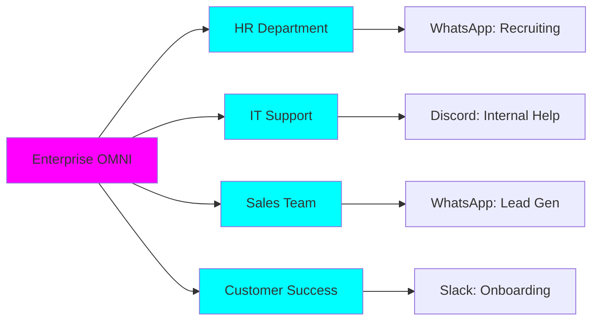

<div style={{ textAlign: 'center', marginBottom: '2rem' }}>
  <h1 style={{ fontSize: '2.5rem', fontWeight: '300', marginBottom: '1rem' }}>
    <span style={{ fontWeight: '900', background: 'linear-gradient(to right, #FF00FF, #00FFFF)', WebkitBackgroundClip: 'text', WebkitTextFillColor: 'transparent' }}>Multi-Tenant by Design</span>
  </h1>
  <p style={{ fontSize: '1.2rem', color: '#888' }}>
    One Deployment, Infinite Isolated Instances
  </p>
</div>

## What is Multi-Tenancy?

**Multi-tenancy** in Automagik OMNI means running multiple completely isolated messaging instances from a single deployment. Each instance operates independently with its own configuration, connections, and data - perfect for agencies managing client bots, SaaS platforms offering messaging features, or enterprises with departmental separation.



---

## Core Principles

### Complete Isolation

Each instance is a **completely separate tenant** with zero cross-contamination:

<CardGroup cols={2}>
  <Card title="Data Isolation" icon="database">
    Messages, traces, and user data never mix between instances
  </Card>

  <Card title="Configuration Isolation" icon="gear">
    Each instance has unique credentials, webhooks, and settings
  </Card>

  <Card title="Connection Isolation" icon="plug">
    Separate platform connections (QR codes, bot tokens) per instance
  </Card>

  <Card title="Operational Isolation" icon="shield">
    One instance's failure never affects others
  </Card>
</CardGroup>

### Instance-Level Control

Every aspect is configured and managed per-instance:

```yaml
Instance: "client-acme-support"
  channel_type: whatsapp
  evolution_url: https://evolution.example.com
  agent_url: https://acme-agent.example.com
  agent_api_key: secret_key_acme
  config:
    timezone: "America/New_York"
    language: "en-US"

Instance: "client-widgets-sales"
  channel_type: discord
  discord_token: bot_token_widgets
  agent_url: https://widgets-agent.example.com
  config:
    timezone: "Europe/London"
    language: "en-GB"
```

<Info>
**Zero Shared State**: Instances know nothing about each other. This is intentional and fundamental to security and scalability.
</Info>

---

## Use Cases

### 1. Agencies Managing Client Bots

Perfect for marketing agencies, development shops, and consultancies managing messaging for multiple clients:

<Tabs>
  <Tab title="Scenario">
    **Digital Agency with 50 Clients**

    Each client needs:
    - WhatsApp customer support bot
    - Branded responses
    - Separate billing
    - Independent configuration
    - Data privacy guarantees
  </Tab>

  <Tab title="OMNI Solution">
    ```bash
    # Deploy OMNI once
    make install && make dev

    # Create isolated instance per client
    curl -X POST /api/v1/instances \
      -d '{
        "name": "client-acme",
        "channel_type": "whatsapp",
        "agent_url": "https://acme.clients.agency.com"
      }'

    curl -X POST /api/v1/instances \
      -d '{
        "name": "client-widgets",
        "channel_type": "whatsapp",
        "agent_url": "https://widgets.clients.agency.com"
      }'

    # Each client operates independently
    # One OMNI deployment, 50 isolated bots
    ```
  </Tab>

  <Tab title="Benefits">
    ✅ **Single Infrastructure**: One deployment, minimal ops overhead
    ✅ **Client Isolation**: Data never mixes, compliance guaranteed
    ✅ **Easy Onboarding**: New client = new instance in 60 seconds
    ✅ **Flexible Billing**: Per-instance metering and cost tracking
    ✅ **Scalable**: Add clients without architectural changes
  </Tab>
</Tabs>

### 2. SaaS Platforms

Embed messaging capabilities into your SaaS product:

<AccordionGroup>
  <Accordion title="Customer Support SaaS">
    **Scenario**: SaaS offering WhatsApp support to e-commerce stores

    - Each store gets isolated instance
    - Store branding and configuration
    - Per-store analytics and tracing
    - API access for store owners
    - Automatic provisioning on signup

    **Value**: Offer messaging without building platform integrations
  </Accordion>

  <Accordion title="Marketing Automation Platform">
    **Scenario**: Marketing tool with multi-channel campaigns

    - Instance per marketing campaign
    - A/B testing with separate instances
    - Channel-specific targeting
    - Campaign isolation prevents cross-talk
    - Unified analytics dashboard

    **Value**: Multi-channel messaging without integration complexity
  </Accordion>

  <Accordion title="CRM with Messaging">
    **Scenario**: CRM adding WhatsApp and Discord to communication suite

    - Instance per CRM account/workspace
    - Integrate with existing CRM data
    - Multi-channel contact management
    - Compliance and data residency per tenant
    - White-label customisation

    **Value**: Extend CRM to messaging without building from scratch
  </Accordion>
</AccordionGroup>

### 3. Enterprises with Departmental Separation

Large organisations needing internal separation:



| Department | Instance | Use Case |
|------------|----------|----------|
| **HR** | `hr-recruiting` | Candidate communication via WhatsApp |
| **IT Support** | `it-helpdesk` | Internal support on Discord |
| **Sales** | `sales-outreach` | Lead nurturing via WhatsApp Business |
| **Customer Success** | `cs-onboarding` | Customer onboarding in Slack |

**Benefits**:
- 🔐 Data separation for compliance
- 📊 Department-specific analytics
- ⚙️ Independent configuration and policies
- 🚀 Department autonomy over their instances

---

## Technical Architecture

### Instance Lifecycle

<Steps>
  <Step title="Creation">
    Provision new instance with unique name and configuration
    ```bash
    POST /api/v1/instances
    {
      "name": "unique-instance-name",
      "channel_type": "whatsapp|discord",
      "evolution_url": "...",
      "agent_url": "..."
    }
    ```
  </Step>

  <Step title="Configuration">
    Set instance-specific settings, credentials, webhooks
    ```bash
    PATCH /api/v1/instances/unique-instance-name
    {
      "agent_api_key": "new-secret",
      "config": {"timezone": "UTC"}
    }
    ```
  </Step>

  <Step title="Connection">
    Connect to messaging platform (QR code, bot token)
    ```bash
    GET /api/v1/instances/unique-instance-name/qr
    # Scan QR code with WhatsApp
    ```
  </Step>

  <Step title="Operation">
    Messages flow through instance, isolated from all others
  </Step>

  <Step title="Monitoring">
    Track instance-specific metrics, traces, health
    ```bash
    GET /api/v1/traces?instance_name=unique-instance-name
    ```
  </Step>

  <Step title="Decommission">
    Delete instance, clean up resources
    ```bash
    DELETE /api/v1/instances/unique-instance-name
    ```
  </Step>
</Steps>

### Database Schema

Instances are first-class entities with complete isolation:

```sql
-- Instance table (simplified)
CREATE TABLE instances (
    id UUID PRIMARY KEY,
    name VARCHAR UNIQUE NOT NULL,
    channel_type VARCHAR NOT NULL,
    evolution_url VARCHAR,
    evolution_api_key VARCHAR, -- encrypted
    discord_token VARCHAR,     -- encrypted
    agent_api_url VARCHAR NOT NULL,
    agent_api_key VARCHAR,     -- encrypted
    config JSONB,
    created_at TIMESTAMP,
    updated_at TIMESTAMP
);

-- All related tables reference instance_id
CREATE TABLE message_traces (
    id UUID PRIMARY KEY,
    instance_id UUID REFERENCES instances(id) ON DELETE CASCADE,
    -- Cascade delete ensures cleanup
    ...
);
```

<Tip>
**Cascade Deletion**: Deleting an instance automatically removes all associated traces, ensuring complete cleanup.
</Tip>

---

## Security & Isolation Guarantees

### Data Isolation

<CardGroup cols={2}>
  <Card title="Separate Credentials" icon="key">
    API keys, tokens, and secrets stored per-instance with encryption
  </Card>

  <Card title="Query Filtering" icon="filter">
    All database queries automatically filter by instance_id
  </Card>

  <Card title="Trace Separation" icon="database">
    Message traces tagged and isolated by instance
  </Card>

  <Card title="No Cross-Talk" icon="ban">
    Impossible for one instance to access another's data
  </Card>
</CardGroup>

### Access Control

```python
# Every API request requires instance authentication
@router.get("/api/v1/instances/{name}/status")
async def get_status(
    name: str,
    api_key: str = Depends(verify_api_key)
):
    # Verify caller has access to this specific instance
    instance = await get_instance_by_name(name)
    if not instance:
        raise HTTPException(404, "Instance not found")

    # Return only this instance's data
    return instance.get_status()
```

### Compliance Features

<AccordionGroup>
  <Accordion title="GDPR Compliance">
    - **Data Portability**: Export all instance data
    - **Right to Deletion**: Delete instance and all traces
    - **Data Minimisation**: Only store necessary data per instance
    - **Consent Management**: Track consent per instance user
  </Accordion>

  <Accordion title="SOC 2 Readiness">
    - **Audit Logs**: All instance operations logged
    - **Access Controls**: Role-based access per instance
    - **Encryption**: At-rest and in-transit
    - **Backup/Recovery**: Per-instance backup policies
  </Accordion>

  <Accordion title="Data Residency">
    - **Regional Deployment**: Deploy OMNI in specific regions
    - **Instance Tagging**: Mark instances with data residency requirements
    - **Future: Multi-Region**: Route instances to compliant regions
  </Accordion>
</AccordionGroup>

---

## Management & Operations

### Instance Management API

Complete CRUD operations for instances:

```bash
# List all instances
GET /api/v1/instances
Response: [
  {"name": "client-a", "channel_type": "whatsapp", "status": "connected"},
  {"name": "client-b", "channel_type": "discord", "status": "active"}
]

# Get specific instance
GET /api/v1/instances/client-a
Response: {
  "name": "client-a",
  "channel_type": "whatsapp",
  "agent_url": "https://...",
  "created_at": "2025-11-01T10:00:00Z"
}

# Update instance
PATCH /api/v1/instances/client-a
Body: {"agent_url": "https://new-url.com"}

# Delete instance (with cascade)
DELETE /api/v1/instances/client-a
```

### MCP Integration

Manage instances programmatically via Model Context Protocol:

```python
# From Claude Code, Cursor, or any MCP client

"List all my OMNI instances"
→ Uses manage_instances(operation="list")

"Create a new WhatsApp instance for client Acme Corp"
→ Uses manage_instances(operation="create", config={...})

"Get QR code for instance acme-support"
→ Uses manage_instances(operation="qr", instance_name="acme-support")

"Restart the discord-community instance"
→ Uses manage_instances(operation="restart", instance_name="discord-community")
```

### Bulk Operations

Manage multiple instances efficiently:

<Tabs>
  <Tab title="Bulk Creation">
    ```python
    # Create instances for 50 clients
    clients = load_client_list()

    for client in clients:
        create_instance(
            name=f"client-{client.slug}",
            channel_type="whatsapp",
            agent_url=f"https://{client.slug}.agents.company.com",
            config=client.config
        )
    ```
  </Tab>

  <Tab title="Health Checks">
    ```python
    # Monitor all instances
    instances = list_instances()

    for instance in instances:
        status = get_instance_status(instance.name)
        if status.health != "healthy":
            alert(f"Instance {instance.name} unhealthy: {status.error}")
    ```
  </Tab>

  <Tab title="Batch Updates">
    ```python
    # Update all instances to new agent endpoint
    instances = list_instances()

    for instance in instances:
        update_instance(
            name=instance.name,
            agent_url=f"https://v2.agents.company.com/{instance.name}"
        )
    ```
  </Tab>
</Tabs>

---

## Scaling Multi-Tenant Deployments

### Horizontal Scaling

OMNI's stateless design enables horizontal scaling:

```yaml
Load Balancer
├── OMNI Instance 1 (handles instances A-M)
├── OMNI Instance 2 (handles instances N-Z)
└── OMNI Instance 3 (handles overflow)

Shared PostgreSQL Database
└── All instance metadata and traces
```

<Info>
**Stateless API**: All state in PostgreSQL enables seamless load balancing across OMNI replicas.
</Info>

### Performance at Scale

| Metric | Single OMNI Instance | Notes |
|--------|---------------------|-------|
| **Concurrent Instances** | 100+ | Tested with 100 active WhatsApp instances |
| **Messages/Second** | 500+ | Per OMNI instance, varies by channel |
| **Webhook Throughput** | 1000+ req/s | With proper PostgreSQL tuning |
| **Trace Storage** | Millions | PostgreSQL handles large trace volumes |

### Resource Planning

```yaml
Small Deployment (10-50 instances):
  CPU: 2-4 cores
  RAM: 4-8 GB
  Database: PostgreSQL with 2 cores, 4 GB RAM
  Cost: ~$50-100/month (cloud VPS)

Medium Deployment (50-200 instances):
  CPU: 4-8 cores
  RAM: 8-16 GB
  Database: PostgreSQL with 4 cores, 8 GB RAM
  Cost: ~$200-500/month

Large Deployment (200-1000+ instances):
  CPU: 8-16 cores (multiple replicas)
  RAM: 16-32 GB per replica
  Database: PostgreSQL with 8+ cores, 16+ GB RAM
  Cost: ~$1000+/month (with load balancing)
```

---

## Best Practices

### Instance Naming

Use clear, consistent naming conventions:

<Tabs>
  <Tab title="Agency Pattern">
    ```
    client-{company}-{purpose}

    Examples:
    - client-acme-support
    - client-widgets-sales
    - client-techcorp-onboarding
    ```
  </Tab>

  <Tab title="SaaS Pattern">
    ```
    tenant-{account_id}-{channel}

    Examples:
    - tenant-a1b2c3-whatsapp
    - tenant-x9y8z7-discord
    - tenant-m5n6o7-slack
    ```
  </Tab>

  <Tab title="Enterprise Pattern">
    ```
    {department}-{purpose}

    Examples:
    - hr-recruiting
    - it-support
    - sales-outreach
    - cs-onboarding
    ```
  </Tab>
</Tabs>

### Configuration Management

Store instance configs in version control:

```yaml
# instances/client-acme.yaml
name: client-acme-support
channel_type: whatsapp
evolution_url: https://evolution.company.com
agent_url: https://acme.agents.company.com
config:
  timezone: America/New_York
  language: en-US
  max_message_length: 1000
  enable_media: true
```

### Monitoring & Alerting

Set up per-instance monitoring:

```python
# Monitor instance health
for instance in critical_instances:
    metrics = get_instance_metrics(instance)

    if metrics.error_rate > 0.05:  # 5% error rate
        alert(f"High errors in {instance}")

    if metrics.response_time > 2000:  # 2 second threshold
        alert(f"Slow responses in {instance}")

    if metrics.connection_status != "connected":
        alert(f"Disconnected: {instance}")
```

---

## Migration & Onboarding

### Migrating Existing Bots

Move existing messaging bots to OMNI:

<Steps>
  <Step title="Assess Current State">
    Document existing bot configurations, webhooks, credentials
  </Step>

  <Step title="Create OMNI Instances">
    Provision one instance per existing bot
  </Step>

  <Step title="Configure Agents">
    Point instances to existing agent endpoints
  </Step>

  <Step title="Test in Parallel">
    Run OMNI alongside existing bots for validation
  </Step>

  <Step title="Switch Webhooks">
    Update platform webhooks to point to OMNI
  </Step>

  <Step title="Monitor & Validate">
    Ensure message flow matches expected behavior
  </Step>

  <Step title="Decommission Old">
    Retire original bot infrastructure
  </Step>
</Steps>

### Onboarding New Clients/Tenants

Streamline new tenant onboarding:

```python
# Automated onboarding flow
def onboard_new_client(client_name: str, config: dict):
    # 1. Create instance
    instance = create_instance(
        name=f"client-{client_name}",
        channel_type=config["channel"],
        agent_url=config["agent_url"]
    )

    # 2. Generate QR code (WhatsApp)
    if config["channel"] == "whatsapp":
        qr_code = get_qr_code(instance.name)
        email_qr_code(client_name, qr_code)

    # 3. Set up monitoring
    configure_alerts(instance.name, client_email)

    # 4. Send welcome message
    send_setup_instructions(client_name, instance.name)

    return instance
```

---

## Comparison: Multi-Tenant vs Single-Tenant

| Aspect | Multi-Tenant (OMNI) | Single-Tenant Deployments |
|--------|---------------------|---------------------------|
| **Infrastructure** | ✅ One deployment for all | ❌ Separate deployment per client |
| **Operational Overhead** | ✅ Minimal - manage one system | ❌ High - manage N systems |
| **Scaling** | ✅ Add instances on-demand | ❌ Provision new infrastructure |
| **Cost Efficiency** | ✅ Shared resources | ❌ Duplicated resources |
| **Updates** | ✅ Update once, all benefit | ❌ Update N deployments |
| **Data Isolation** | ✅ Database-level isolation | ✅ Complete separation |
| **Customisation** | ✅ Per-instance config | ✅ Per-deployment config |
| **Onboarding Speed** | ✅ Seconds (API call) | ❌ Hours/days (infrastructure) |

---

## Next Steps

<CardGroup cols={2}>
  <Card title="Channel Handlers" icon="plug" href="/omni/concepts/channel-handlers">
    Learn how platform-specific logic works per instance
  </Card>

  <Card title="Message Tracing" icon="chart-line" href="/omni/concepts/message-tracing">
    Track and debug messages per instance
  </Card>

  <Card title="Quick Start" icon="rocket" href="/omni/quickstart">
    Create your first multi-tenant deployment
  </Card>

  <Card title="API Reference" icon="code" href="/omni/api/instances">
    Complete instance management API docs
  </Card>
</CardGroup>

---

<Card title="Multi-Tenancy is OMNI's Superpower" icon="star">
**One deployment, infinite isolated instances** - this is what makes OMNI perfect for agencies, SaaS platforms, and enterprises.

You build the platform once. Your clients scale infinitely.
</Card>
