<div style={{ textAlign: 'center', marginBottom: '2rem' }}>
  <h1 style={{ fontSize: '2.5rem', fontWeight: '300', marginBottom: '1rem' }}>
    <span style={{ fontWeight: '900', background: 'linear-gradient(to right, #FF00FF, #00FFFF)', WebkitBackgroundClip: 'text', WebkitTextFillColor: 'transparent' }}>Omnipresent Messaging</span>
  </h1>
  <p style={{ fontSize: '1.2rem', color: '#888' }}>
    One Agent, Every Platform, Unified Context
  </p>
</div>

## The Vision

**Omnipresent messaging** is the north star of Automagik OMNI - a future where your AI agent doesn't just exist on multiple platforms, but truly understands **who you are** regardless of where you message from.


---

## The Intelligent Postman Analogy

Think of OMNI as an **intelligent postman** who:

<CardGroup cols={2}>
  <Card title="Knows Every Address" icon="map">
    WhatsApp, Discord, Slack, Instagram, Teams - every platform is a familiar route
  </Card>

  <Card title="Speaks Every Language" icon="language">
    Different protocols, APIs, webhooks - all translated seamlessly
  </Card>

  <Card title="Never Gets Lost" icon="compass">
    Messages always reach the right destination, formatted correctly
  </Card>

  <Card title="Remembers Everyone" icon="brain">
    Recognises you whether you send a letter, email, or text message
  </Card>
</CardGroup>

---

## Current State: Present, Not Omnipresent

### What Works Today (November 2025)

OMNI successfully enables AI agents to be **present** on multiple platforms:

- ✅ **WhatsApp**: Full messaging with media, reactions, presence
- ✅ **Discord**: Multi-server support with text and attachments
- ✅ **Independent Operation**: Each channel functions reliably
- ✅ **Multi-Tenant**: Multiple isolated instances per platform

<Info>
**Current Reality**: Your agent can respond on WhatsApp and Discord simultaneously, but it doesn't know that "john@discord" and "+44123456789@whatsapp" are the same person.
</Info>

### The Missing Piece: Unified Context

Today's limitation is **contextual isolation**:

```yaml
Scenario: User switches platforms mid-conversation

WhatsApp (10:00):
  User: "Hey, I'm looking for hiking boots"
  Agent: "Great! What's your budget?"

Discord (10:05):
  User: "I saw some on your site earlier"
  Agent: "Hello! What can I help you with?" ❌
  # Agent doesn't remember WhatsApp conversation
```

<Warning>
**The Gap**: Each platform operates independently. The agent is **present everywhere** but not **omnipresent** - it lacks the unified context to recognise you across platforms.
</Warning>

---

## The Future: True Omnipresence

### Unified User Management

The roadmap to omnipresence centres on **linking user identities** across platforms:

<Steps>
  <Step title="User Identity Linking">
    Connect "john@discord", "+44123456789@whatsapp", and "john_doe@slack" as the same person
  </Step>

  <Step title="Cross-Platform Context">
    Share conversation history, preferences, and state across all channels
  </Step>

  <Step title="Seamless Handoffs">
    Continue conversations naturally regardless of platform switches
  </Step>

  <Step title="Unified Analytics">
    Understand user behaviour holistically, not per-platform silos
  </Step>
</Steps>

### How It Will Work

```mermaid
sequenceDiagram
    participant U as User
    participant W as WhatsApp
    participant O as OMNI Hub
    participant D as Discord
    participant A as AI Agent
    participant C as Context Store

    U->>W: "Find me hiking boots"
    W->>O: Message received
    O->>C: Fetch user context
    C-->>O: User: john_doe, History: []
    O->>A: Process with context
    A-->>O: "What's your budget?"
    O->>C: Store: boot search started
    O->>W: Send response

    Note over U,C: User switches to Discord

    U->>D: "Under £100"
    D->>O: Message received
    O->>C: Fetch user context
    C-->>O: User: john_doe, History: [boot search]
    O->>A: Process with full context ✅
    A-->>O: "Perfect! I found 3 options..."
    O->>D: Send response with continuity
```



### Real-World Example

Imagine this seamless experience:

<Tabs>
  <Tab title="WhatsApp Morning">
    ```
    User (WhatsApp, 09:00):
    "I saw a cool product on Instagram -
     the wireless earbuds with active noise cancellation"

    Agent:
    "I found them! The AirPods Pro Max.
     Would you like me to check stock and pricing?"
    ```
  </Tab>

  <Tab title="Discord Afternoon">
    ```
    User (Discord, 14:00):
    "What was that product you showed me earlier?"

    Agent:
    "The AirPods Pro Max you asked about this morning.
     They're £549 and in stock. Ready to order?"

    # Agent remembers across platforms! ✅
    ```
  </Tab>

  <Tab title="Slack Evening">
    ```
    User (Slack, 18:00):
    "Did that order go through?"

    Agent:
    "Your AirPods Pro Max order from this afternoon
     is confirmed. Delivery: Friday. Tracking: ABC123"

    # Full continuity across WhatsApp → Discord → Slack
    ```
  </Tab>
</Tabs>

---

## Technical Architecture for Omnipresence

### User Identity Graph

```python
# Future: Unified user profile
{
  "user_id": "unified_john_doe_123",
  "identities": {
    "whatsapp": "+44123456789",
    "discord": "john@discord#1234",
    "slack": "U0123456789",
    "instagram": "@john_doe"
  },
  "preferences": {
    "language": "en-GB",
    "timezone": "Europe/London",
    "notification_preferences": {...}
  },
  "context": {
    "current_conversation": "product_search_boots",
    "history": [...],
    "state": {...}
  }
}
```

### Shared Context Store

<AccordionGroup>
  <Accordion title="Conversation Continuity">
    Store active conversations with full history accessible across platforms:
    - Message threads
    - User intents
    - Pending actions
    - Follow-up reminders
  </Accordion>

  <Accordion title="User Preferences">
    Remember settings regardless of platform:
    - Communication style
    - Response preferences
    - Privacy settings
    - Custom configurations
  </Accordion>

  <Accordion title="Cross-Platform State">
    Maintain state machines that work everywhere:
    - Shopping carts
    - Form submissions
    - Multi-step workflows
    - Pending approvals
  </Accordion>
</AccordionGroup>

---

## Roadmap to Omnipresence

### Q4 2025: Foundation
- ✅ Multi-platform presence (WhatsApp, Discord)
- ✅ Independent operation per channel
- 🔄 Improved reliability and scale

### Q1-Q2 2026: Unification
- 📅 **Unified User Management**: Link identities across platforms
- 📅 **Shared Context Store**: Cross-platform conversation history
- 📅 **Seamless Handoffs**: Continue conversations anywhere
- 📅 **Platform Expansion**: Instagram, Telegram, Teams

### Q2-Q4 2026: True Omnipresence
- 🎯 **Smart Recognition**: AI-powered identity linking
- 🎯 **Preference Learning**: Understand users holistically
- 🎯 **Predictive Context**: Anticipate needs across platforms
- 🎯 **Analytics Dashboard**: Unified user insights

---

## Business Value of Omnipresence

### For Users

<CardGroup cols={2}>
  <Card title="Natural Conversations" icon="comments">
    Talk to your AI like a person, not per-platform conversations
  </Card>

  <Card title="No Repetition" icon="rotate">
    Never repeat context when switching platforms
  </Card>

  <Card title="Consistent Experience" icon="equals">
    Same intelligence, same memory, every channel
  </Card>

  <Card title="Platform Freedom" icon="arrows-left-right">
    Use whatever app you prefer at the moment
  </Card>
</CardGroup>

### For Businesses

| Benefit | Impact |
|---------|--------|
| **Unified Customer View** | Understand customers across all touchpoints |
| **Reduced Friction** | Users don't re-explain on each platform |
| **Higher Engagement** | Meet users where they are, seamlessly |
| **Better Analytics** | Complete picture of user journeys |
| **Competitive Edge** | Offer experiences competitors can't match |

---

## Comparison: Present vs Omnipresent

| Capability | Present Today | Omnipresent Future |
|------------|---------------|-------------------|
| **Platform Coverage** | ✅ Multiple channels | ✅ Multiple channels |
| **Message Delivery** | ✅ Reliable sending | ✅ Reliable sending |
| **User Recognition** | ❌ Per-platform only | ✅ Cross-platform linking |
| **Context Sharing** | ❌ Isolated per channel | ✅ Unified context store |
| **Conversation Flow** | ❌ Starts fresh each platform | ✅ Continues seamlessly |
| **User Preferences** | ⚠️ Per-instance settings | ✅ Global user preferences |
| **Analytics** | ⚠️ Per-channel metrics | ✅ Unified user insights |

---

## Privacy & Security Considerations

<Warning>
**Privacy First**: Omnipresence must respect user privacy and consent.
</Warning>

### Guiding Principles

1. **Opt-In Only**: Users explicitly consent to cross-platform linking
2. **Transparent Control**: Clear visibility into linked identities
3. **Easy Unlinking**: One-click to separate platform identities
4. **Data Minimisation**: Only store necessary context
5. **Compliance Ready**: GDPR, CCPA, and regional regulations

### User Control Dashboard

```yaml
Future Feature: Identity Management
- View all linked platforms
- Revoke specific platform links
- Export all data
- Delete cross-platform context
- Platform-specific privacy settings
```

---

## Getting Started with Present OMNI

While omnipresence is on the roadmap, OMNI is **production-ready today** for multi-platform presence:

<Tip>
**Start Now**: Deploy agents on WhatsApp and Discord today. When omnipresence launches, your instances will upgrade seamlessly.
</Tip>

<Steps>
  <Step title="Deploy Multi-Platform">
    Set up instances on WhatsApp, Discord, and more
  </Step>

  <Step title="Build Platform-Aware Logic">
    Design agents that can handle platform-specific context
  </Step>

  <Step title="Prepare for Unification">
    Structure data to support future cross-platform linking
  </Step>

  <Step title="Stay Updated">
    Watch the roadmap for omnipresence features
  </Step>
</Steps>

---

## Next Steps

<CardGroup cols={2}>
  <Card title="Multi-Tenancy" icon="users" href="/omni/concepts/multi-tenancy">
    Understand instance isolation and multi-client management
  </Card>

  <Card title="Channel Handlers" icon="plug" href="/omni/concepts/channel-handlers">
    Learn how platform-specific logic works
  </Card>

  <Card title="Quick Start" icon="rocket" href="/omni/quickstart">
    Deploy your first multi-platform agent
  </Card>

  <Card title="Roadmap" icon="map" href="https://github.com/orgs/namastexlabs/projects/9">
    Track omnipresence features
  </Card>
</CardGroup>

---

<Card title="The Future is Omnipresent" icon="star">
**OMNI's vision**: AI agents that are truly everywhere your users are, with the intelligence to recognise them across every platform.

We're not there yet, but we're building it together - one platform at a time.
</Card>
