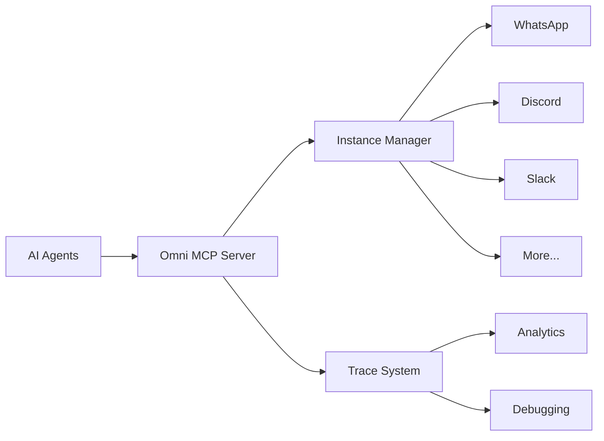

  <h1 style={{ fontSize: '2.5rem', fontWeight: '300', marginBottom: '1rem' }}>
    One Integration,
  </h1>
  <h1 style={{ fontSize: '2.5rem', fontWeight: '300', marginTop: '0' }}>
    All Channels
  </h1>

## What is Omni?

Omni is a **multi-tenant messaging hub** that connects AI agents to WhatsApp, Discord, Slack, and more through a single, unified API. MCP-native and built for scale, Omni eliminates the integration hell of connecting AI to real-world communication channels.

## The Problem

Connecting AI agents to messaging platforms is painful:
- **Multiple APIs**: Each platform has different protocols
- **Custom Code**: Every integration requires weeks of development
- **No Standards**: No common protocol for messaging
- **Tenant Isolation**: Hard to manage multiple clients/instances
- **Maintenance Burden**: Updates and changes across all platforms

## The Solution

Omni provides **universal messaging connectivity** for AI agents:

<CardGroup cols={2}>
  <Card title="Unified API" icon="plug">
    One API to rule them all. Send messages to WhatsApp, Discord, or Slack with the same code.
  </Card>
  <Card title="Multi-Tenant" icon="users">
    Manage multiple instances, clients, or teams from a single deployment. Perfect for agencies and SaaS.
  </Card>
  <Card title="MCP-Native" icon="microchip">
    Built on Model Context Protocol. Any MCP-compatible AI can use Omni instantly.
  </Card>
  <Card title="Message Tracing" icon="chart-line">
    Track every message, debug issues, and analyze conversations with built-in tracing.
  </Card>
</CardGroup>

## Key Features

### 📱 Omnichannel Support
Connect to every major platform:
- **WhatsApp**: Full Business API integration
- **Discord**: Servers, channels, DMs
- **Slack**: Workspaces, channels, threads
- **More Coming**: Telegram, Teams, and custom integrations

### 🏢 Multi-Tenant Architecture
- **Instance Management**: Multiple isolated instances
- **Profile Management**: Per-instance configuration
- **Access Control**: Fine-grained permissions
- **Scalable**: From single user to enterprise

### 🔍 Trace & Debug
- **Message Traces**: Complete audit trail
- **Payload Inspection**: Debug webhook data
- **Analytics**: Usage patterns and insights
- **Error Tracking**: Catch and resolve issues fast

### 🤖 AI-First Design
- **MCP Integration**: Native protocol support
- **Agent-Friendly**: Built for automation
- **Webhook Support**: Real-time event delivery
- **Context Preservation**: Maintain conversation state

## Who is Omni For?

<AccordionGroup>
  <Accordion title="AI Agent Builders">
    Connect your agents to real users without building integrations from scratch.
  </Accordion>
  <Accordion title="SaaS Platforms">
    Offer multi-channel messaging as a feature with multi-tenant isolation.
  </Accordion>
  <Accordion title="Agencies">
    Manage messaging for multiple clients from a single deployment.
  </Accordion>
  <Accordion title="Enterprises">
    Deploy internal AI assistants across your organization's communication stack.
  </Accordion>
</AccordionGroup>

## Why "Omni"?

**Omni** means "all" or "everywhere" - and that's exactly what this tool provides: **omnipresent messaging** that lets your AI agents exist on every platform your users love.

## Architecture

## Philosophy

Omni embodies our core philosophy:

<Card title="AI that elevates human potential, not replaces it" icon="users">
  - **You connect** - Omni manages channels
  - **You configure** - Omni handles protocols
  - **You monitor** - Omni provides insights
  - **You own** - Self-hostable infrastructure
</Card>

---

## Next Steps

<CardGroup cols={2}>
  <Card title="Installation" icon="download" href="/omni/installation">
    Get Omni installed and configured
  </Card>
  <Card title="Quick Start" icon="rocket" href="/omni/quickstart">
    Send your first omnichannel message
  </Card>
  <Card title="GitHub Repository" icon="github" href="https://github.com/namastexlabs/automagik-omni">
    View source code and contribute
  </Card>
  <Card title="PyPI Package" icon="python" href="https://pypi.org/project/automagik-omni">
    Install via PyPI
  </Card>
</CardGroup>
