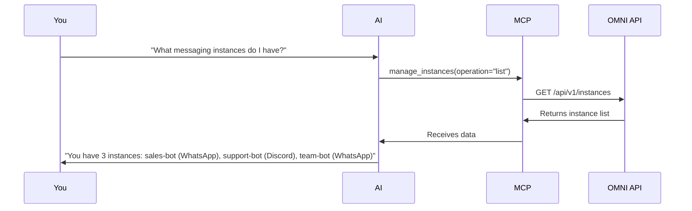
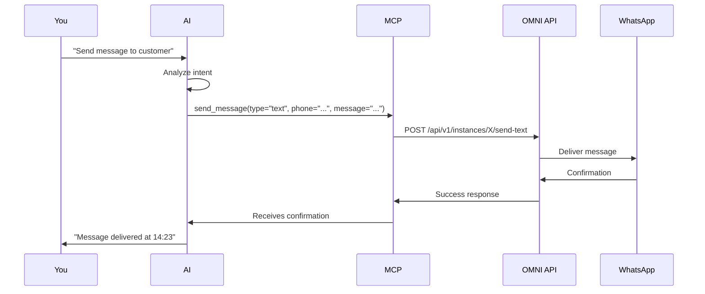
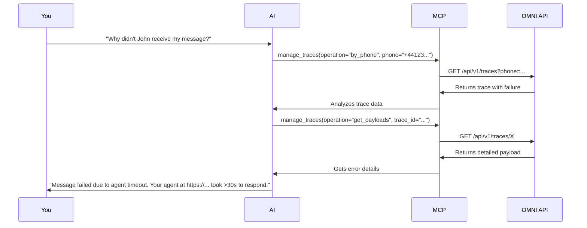

## Introduction

OMNI's **Model Context Protocol (MCP) integration** enables AI agents to control your entire messaging infrastructure through natural language. No code, no API calls - just conversational commands that manage WhatsApp, Discord, and more.

<Info>
**Quick value**: Ask Claude "send a WhatsApp message to +44123456789" and it's done. No API documentation, no code, just flow.
</Info>

---

## What is MCP?

**Model Context Protocol (MCP)** is an open standard that allows AI agents to interact with external tools and services in a structured way.

Think of it as **"USB for AI"** - instead of you making HTTP requests to OMNI's REST API, your AI agent does it automatically based on your conversation.

### The Magic

```
❌ Without MCP:
You → Read API docs → Write curl command → Execute → Parse response → Code
      30 minutes of work for a simple message

✅ With MCP:
You → "Send a WhatsApp message to John saying the meeting is at 3pm"
AI → [Automatically calls OMNI MCP tools]
AI → "Message sent to +44123456789. Delivered at 14:23."
      15 seconds, zero code
```

---

## Why Use MCP with OMNI?

<CardGroup cols={2}>
  <Card title="Natural Language Control" icon="message">
    Use conversational commands. No need to remember API endpoints or JSON syntax.
  </Card>

  <Card title="Stay in Flow" icon="brain">
    Never leave your editor. AI handles all messaging operations while you focus on building.
  </Card>

  <Card title="Cross-Platform Orchestration" icon="network-wired">
    "Send this to WhatsApp, Discord, and Slack" - AI handles all three channels automatically.
  </Card>

  <Card title="Intelligent Debugging" icon="bug">
    "Why didn't John receive my message?" - AI analyzes traces and explains the issue.
  </Card>
</CardGroup>

---

## Available MCP Tools

OMNI exposes **6 powerful MCP tools** for complete messaging control:

### Core Tools

<AccordionGroup>
  <Accordion title="manage_instances - Instance Lifecycle">
    Create, configure, and manage messaging instances across channels.

    **Operations**: list, get, create, update, delete, set_default, status, qr, restart, logout

    **Example**: "Create a WhatsApp instance called sales-bot"
  </Accordion>

  <Accordion title="send_message - Universal Messaging">
    Send any type of message to any channel - text, media, audio, reactions, and more.

    **Types**: text, media, audio, sticker, contact, reaction

    **Example**: "Send an image to +44123456789 with caption 'Check this out!'"
  </Accordion>

  <Accordion title="manage_traces - Message Analytics">
    Query message history, debug failures, generate analytics reports.

    **Operations**: list, get, get_payloads, analytics, by_phone, cleanup

    **Example**: "Show me all failed messages from today"
  </Accordion>

  <Accordion title="manage_profiles - User Profiles">
    Fetch user information and update bot profiles.

    **Operations**: fetch, update_picture

    **Example**: "Get profile for +44123456789"
  </Accordion>

  <Accordion title="manage_chats - Chat Management">
    List and filter chats across all instances.

    **Operations**: list, get

    **Example**: "Show me all group chats"
  </Accordion>

  <Accordion title="manage_contacts - Contact Management">
    Search and manage contacts.

    **Operations**: list, get

    **Example**: "Find contacts named John"
  </Accordion>
</AccordionGroup>

---

## Real-World Use Cases

### Customer Support Automation

```
You: "Check if customer +44123456789 received the order confirmation
     message I sent this morning. If not, resend it."

AI executes:
1. manage_traces(operation="by_phone", phone="+44123456789")
   → Finds message trace from 09:23 with status "delivered"

2. AI: "Yes, the order confirmation was delivered at 09:23 this morning.
       Status: Delivered and read at 09:45."

Result: Instant customer support insight, zero manual work
```

### Multi-Channel Broadcasting

```
You: "Send 'System maintenance at 3am tonight' to all my active instances"

AI executes:
1. manage_instances(operation="list", include_status=true)
   → Gets: sales-bot (WhatsApp), support-bot (Discord), team-bot (WhatsApp)

2. For each instance:
   send_message(
     message_type="text",
     instance_name=instance.name,
     message="System maintenance at 3am tonight"
   )

3. AI: "Sent to 3 instances:
       ✅ sales-bot (WhatsApp): 24 recipients
       ✅ support-bot (Discord): 156 members
       ✅ team-bot (WhatsApp): 8 recipients

       Total reach: 188 people"

Result: Broadcast to all channels with one command
```

### Debugging & Analytics

```
You: "Generate a report of message failures in the last 24 hours.
     For each failure, tell me the reason and which instance."

AI executes:
1. manage_traces(
     operation="analytics",
     start_date="2025-11-03T00:00:00Z"
   )

2. manage_traces(operation="list", trace_status="failed")
   → Analyzes each failure

3. AI: "📊 24-Hour Failure Report

   Total Messages: 1,247
   Failures: 12 (0.96%)

   By Reason:
   - Agent timeout (30s): 7 failures
     → Instance: sales-bot
     → Fix: Scale agent infrastructure

   - Rate limit exceeded: 3 failures
     → Instance: marketing-bot
     → Fix: Implement message queuing

   - Instance disconnected: 2 failures
     → Instance: support-bot
     → Fix: Restarted automatically at 14:32

   Recommendation: Focus on agent scaling first (58% of issues)"

Result: Comprehensive analysis with actionable insights
```

### Instance Setup & Deployment

```
You: "Set up a new WhatsApp instance for our London office.
     Use the agent at https://london.agents.company.com and
     show me the QR code to connect."

AI executes:
1. manage_instances(
     operation="create",
     config={
       "name": "london-office",
       "channel_type": "whatsapp",
       "evolution_url": "http://localhost:18082",
       "evolution_key": "***",
       "agent_api_url": "https://london.agents.company.com"
     }
   )

2. manage_instances(operation="qr", instance_name="london-office")
   → Displays QR code

3. AI: "London office instance created successfully!

       📱 Scan this QR code with WhatsApp:
       [QR code image]

       Once connected, send me 'test' and I'll verify it's working."

Result: Complete instance deployment with guided setup
```

---

## Getting Started

### Step 1: Ensure OMNI is Running

```bash
# Make sure OMNI API is accessible
curl http://localhost:8882/health

# Should return: {"status":"healthy"}
```

### Step 2: Choose Your AI Agent

OMNI MCP works with any MCP-compatible AI agent:

<CardGroup cols={2}>
  <Card title="Claude Code" icon="brain" href="/omni/mcp/claude-code-setup">
    Setup for Claude Desktop and Claude Code CLI
    **Setup time**: 3 minutes
  </Card>

  <Card title="Cursor" icon="terminal" href="/omni/mcp/cursor-setup">
    Setup for Cursor IDE
    **Setup time**: 3 minutes
  </Card>

  <Card title="VSCode + Cline" icon="code" href="/omni/mcp/vscode-cline-setup">
    Setup for VSCode with Cline extension
    **Setup time**: 4 minutes
  </Card>

  <Card title="Custom Client" icon="wrench" href="/omni/mcp/custom-clients">
    Generic setup for any MCP client
    **Setup time**: 5-10 minutes
  </Card>
</CardGroup>

### Step 3: Test Your Setup

After configuration, test with these commands:

```
1. "List all my OMNI instances"
   → Should show your configured instances

2. "Check the status of my WhatsApp instance"
   → Should return connection status

3. "Send a test message to +44123456789"
   → Should send message and confirm
```

---

## MCP vs REST API Comparison

| Aspect | REST API | MCP Integration |
|--------|----------|-----------------|
| **Interface** | HTTP endpoints with JSON | Natural language commands |
| **Learning Curve** | Read docs, understand schemas | Express intent conversationally |
| **Usage** | Code required (curl, SDKs) | Zero code, just talk |
| **Discovery** | Read documentation | AI discovers capabilities automatically |
| **Composition** | Manual API chaining | AI orchestrates multiple operations |
| **Error Handling** | Parse JSON, check status codes | AI explains errors in plain English |
| **Debugging** | Check logs, trace requests | "Why didn't this work?" gets answers |
| **Multi-Operation** | Write loops, batch scripts | "Do X for all Y" - AI handles iteration |
| **Best For** | Programmatic integrations | Ad-hoc operations, exploration, debugging |

<Info>
**Both Coexist**: MCP doesn't replace REST - it adds an AI-native layer. Use REST for production integrations, MCP for development workflows and operations.
</Info>

---

## MCP Workflow Patterns

### The Exploration Flow



### The Execution Flow



### The Debugging Flow



---

## Security & Best Practices

### API Key Management

<Warning>
**Never hardcode API keys** in MCP configuration files committed to version control.
</Warning>

**Best Practices**:

```bash
# Use environment variables
export OMNI_API_KEY="your-secret-key"

# Or load from secure vault
export OMNI_API_KEY=$(vault read -field=api_key secret/omni)

# MCP config references environment variable
{
  "env": {
    "OMNI_API_KEY": "${OMNI_API_KEY}"  # Reads from shell environment
  }
}
```

### Network Security

```yaml
Production:
  - OMNI_URL must use HTTPS
  - Restrict MCP server to localhost
  - Use VPN for remote access
  - Implement IP whitelisting on OMNI API

Development:
  - localhost-only acceptable
  - Use development API keys
  - Rotate keys regularly
  - Never share keys in chat logs
```

### Instance Isolation

Each MCP configuration should specify which instances it can access:

```json
{
  "env": {
    "OMNI_API_KEY": "key-with-limited-scope",
    "DEFAULT_INSTANCE": "sales-bot"  // Restrict to specific instance
  }
}
```

---

## Troubleshooting

<AccordionGroup>
  <Accordion title="MCP server not connecting">
    **Symptoms**: AI doesn't recognize OMNI tools

    **Solutions**:
    1. Verify OMNI is installed: `pip show automagik-omni`
    2. Test MCP server directly: `uvx --from automagik-omni mcp-server-omni`
    3. Check environment variables are set correctly
    4. Restart your AI agent after config changes

    **Verify**: Ask AI "What MCP servers do you have?" - should include "omni"
  </Accordion>

  <Accordion title="Connection refused to OMNI API">
    **Error**: `Connection error: http://localhost:8882`

    **Solutions**:
    1. Check OMNI is running: `curl http://localhost:8882/health`
    2. Verify OMNI_URL matches your server: `localhost:8882` vs `0.0.0.0:8882`
    3. Check firewall rules allow localhost connections
    4. Ensure correct port in environment variables
  </Accordion>

  <Accordion title="Authentication failed">
    **Error**: `401 Unauthorized` or `Invalid API key`

    **Solutions**:
    1. Verify OMNI_API_KEY matches your `.env` file
    2. Check for extra spaces or quotes in environment variable
    3. Ensure API key is active in OMNI configuration
    4. Try regenerating API key and updating config
  </Accordion>

  <Accordion title="AI gives confusing responses">
    **Symptom**: AI seems uncertain or lists too many options

    **Solutions**:
    1. Be more specific in your prompts
    2. Use concrete examples: phone numbers, instance names
    3. Break complex operations into steps
    4. Ask AI to "explain what OMNI MCP tools you have"
  </Accordion>

  <Accordion title="Messages not being sent">
    **Symptom**: AI confirms send but message doesn't arrive

    **Solutions**:
    1. Check instance status: "What's the status of my WhatsApp instance?"
    2. Verify phone number format: Must include country code like +44...
    3. Check traces: "Show me the trace for the last message I sent"
    4. Confirm instance is connected: "Get QR code for my-instance" to reconnect
  </Accordion>
</AccordionGroup>

---

## Advanced Patterns

### Chaining with Other MCP Tools

Combine OMNI with other MCP servers for powerful workflows:

```
You: "Search our knowledge base for 'return policy',
     then send the answer to customer +44123456789 on WhatsApp"

AI executes:
1. knowledge_base.search(query="return policy")
   → Uses knowledge base MCP server
   → Gets: "30-day returns with receipt..."

2. send_message(
     message_type="text",
     instance_name="support-bot",
     phone="+44123456789",
     message="Our return policy: 30-day returns with receipt..."
   )
   → Uses OMNI MCP server

Result: AI orchestrates multiple tools seamlessly
```

### Conditional Logic

AI agents handle branching automatically:

```
You: "If John (+44123456789) has any failed messages today,
     resend them. Otherwise, tell me everything is fine."

AI executes:
1. manage_traces(operation="by_phone", phone="+44123456789")
   → Checks trace status

2. IF failures found:
     For each failed message:
       send_message(...)
     Response: "Resent 2 failed messages"
   ELSE:
     Response: "No failures - all messages delivered"
```

### Scheduled Operations

```
You: "Every Monday at 9am, send a weekly report to the team
     on WhatsApp with message statistics from last week"

AI can:
1. Create reminder/schedule (varies by AI agent)
2. When triggered, execute:
   - manage_traces(operation="analytics", start_date=..., end_date=...)
   - Format report
   - send_message(message_type="text", message=report)
```

---

## Next Steps

<Steps>
  <Step title="Choose Your AI Agent">
    Pick which tool you use daily:
    - [Claude Code Setup](/omni/mcp/claude-code-setup) - 3 min
    - [Cursor Setup](/omni/mcp/cursor-setup) - 3 min
    - [VSCode + Cline Setup](/omni/mcp/vscode-cline-setup) - 4 min
    - [Custom Client Setup](/omni/mcp/custom-clients) - 5-10 min
  </Step>

  <Step title="Configure MCP">
    Follow the setup guide for your chosen agent. Just copy-paste config and restart.
  </Step>

  <Step title="Test It Out">
    Try these starter commands:
    ```
    "List my OMNI instances"
    "Send a test message to +[your-number]"
    "Show me message analytics from today"
    ```
  </Step>

  <Step title="Explore Capabilities">
    Learn more:
    - [MCP Architecture](/omni/concepts/mcp-architecture) - Deep dive into how it works
    - [API Reference](/omni/api/mcp-tools) - Complete tool documentation
    - [Message Tracing](/omni/concepts/message-tracing) - Debug with AI assistance
  </Step>
</Steps>

---

## Learn More

<CardGroup cols={2}>
  <Card title="MCP Architecture" icon="microchip" href="/omni/concepts/mcp-architecture">
    Deep dive into OMNI's MCP implementation
  </Card>

  <Card title="Quick Start" icon="rocket" href="/omni/quickstart">
    Get OMNI running with MCP in minutes
  </Card>

  <Card title="Channel Handlers" icon="plug" href="/omni/concepts/channel-handlers">
    Understand what MCP controls under the hood
  </Card>

  <Card title="REST API Reference" icon="code" href="/omni/api/rest">
    For programmatic integrations
  </Card>
</CardGroup>

---

<Card title="MCP: The Future of Developer Tools" icon="robot">
**Model Context Protocol transforms OMNI from a REST API into an AI-controllable messaging platform.**

No code, no complexity - just natural language commands that make multi-channel messaging accessible to everyone.

This is the future: **AI-first, human-friendly, universally accessible**.
</Card>
