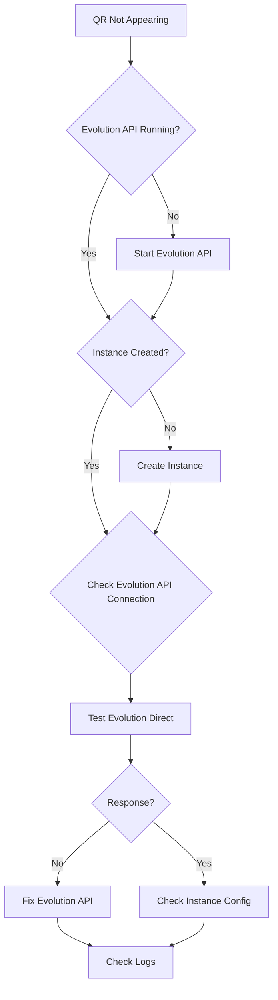

## WhatsApp Connection Issues

### QR Code Not Appearing

**Problem**: Cannot get QR code to connect WhatsApp device

**Symptom**:
```bash
curl http://localhost:8882/api/v1/instances/my-bot/qr
# Returns: error or timeout
```

**Diagnostic Steps**:



<AccordionGroup>
  <Accordion title="Solution 1: Verify Evolution API is Running">
    ```bash
    # Check Evolution API status
    pm2 status evolution-api

    # Or check manually
    curl http://localhost:18082
    # Should return Evolution API response

    # Start Evolution API if not running
    pm2 start evolution-api
    # Or
    make evo

    # Wait 5-10 seconds for startup
    sleep 10

    # Try QR code again
    curl -H "x-api-key: YOUR_KEY" \
      http://localhost:8882/api/v1/instances/my-bot/qr
    ```
  </Accordion>

  <Accordion title="Solution 2: Verify Instance Configuration">
    ```bash
    # Check instance exists and has correct Evolution URL
    curl -H "x-api-key: YOUR_KEY" \
      http://localhost:8882/api/v1/instances/my-bot | jq

    # Verify:
    # - evolution_url: "http://localhost:18082"
    # - evolution_api_key matches EVOLUTION_API_KEY in .env
    # - instance_name matches WhatsApp instance name

    # Update if incorrect
    curl -X PATCH http://localhost:8882/api/v1/instances/my-bot \
      -H "x-api-key: YOUR_KEY" \
      -H "Content-Type: application/json" \
      -d '{
        "evolution_url": "http://localhost:18082",
        "evolution_api_key": "CORRECT_KEY"
      }'
    ```
  </Accordion>

  <Accordion title="Solution 3: Test Evolution API Directly">
    ```bash
    # Get QR code directly from Evolution API
    curl -X POST http://localhost:18082/instance/create \
      -H "apikey: YOUR_EVOLUTION_KEY" \
      -H "Content-Type: application/json" \
      -d '{
        "instanceName": "test-instance",
        "qrcode": true
      }'

    # Should return QR code data
    # If this fails, Evolution API has issues

    # Check Evolution API logs
    pm2 logs evolution-api

    # Restart Evolution API
    pm2 restart evolution-api
    ```
  </Accordion>

  <Accordion title="Solution 4: Check Firewall/Network">
    ```bash
    # Ensure port 18082 is accessible
    netstat -tuln | grep 18082

    # Test from same machine
    curl http://localhost:18082

    # Test from network (if remote)
    curl http://YOUR_SERVER_IP:18082

    # Check firewall (Linux)
    sudo ufw status
    sudo ufw allow 18082

    # Check firewall (Windows)
    netsh advfirewall firewall show rule name=all | findstr 18082
    ```
  </Accordion>
</AccordionGroup>

---

### WhatsApp Phone Disconnects Frequently

**Problem**: WhatsApp session disconnects and requires re-scanning QR code

**Symptom**: Bot stops responding, QR code needed again after hours/days

**Causes and Solutions**:

<AccordionGroup>
  <Accordion title="Cause 1: Evolution API Restarts">
    **Problem**: Evolution API restarts lose session data

    **Solution - Enable Persistent Sessions**:
    ```bash
    # Check Evolution API configuration
    cd resources/evolution-api

    # Ensure SQLite database is enabled (default)
    # Check src/config/database.config.ts
    # Should have:
    # DB_ENABLED=true
    # DB_CONNECTION=sqlite

    # Verify database exists
    ls -la instances/

    # Should see .db files for each instance

    # If missing, configure in .env
    echo "EVOLUTION_DATABASE_ENABLED=true" >> ../../.env
    echo "EVOLUTION_DATABASE_CONNECTION=sqlite" >> ../../.env

    # Restart Evolution API
    pm2 restart evolution-api
    ```

    **Prevention**: Use PM2 to auto-restart Evolution API
    ```bash
    # PM2 keeps process running
    pm2 startup
    pm2 save

    # Check auto-restart is working
    pm2 list
    # Look for "restart: X" counter
    ```
  </Accordion>

  <Accordion title="Cause 2: WhatsApp Security Check">
    **Problem**: WhatsApp detects unusual activity and logs out

    **Solution - Follow Best Practices**:
    ```bash
    # 1. Don't send messages too fast
    # Add delay between messages (recommended: 1-2 seconds)

    # 2. Don't use same number on multiple instances
    # Each phone number = one instance only

    # 3. Warm up new accounts gradually
    # Day 1: 10 messages
    # Day 2-7: Gradually increase to 50
    # Week 2+: Normal usage (up to 100-200/day)

    # 4. Use official WhatsApp Business if possible
    # More stable for business use cases
    ```

    **Rate Limiting Example**:
    ```python
    import time

    # Send messages with delay
    messages = ["+1234567890", "+0987654321"]
    for phone in messages:
        # Send message
        requests.post(
            "http://localhost:8882/api/v1/instances/my-bot/send-text",
            headers={"x-api-key": "YOUR_KEY"},
            json={"phone": phone, "message": "Hello!"}
        )
        # Wait 2 seconds between messages
        time.sleep(2)
    ```
  </Accordion>

  <Accordion title="Cause 3: Network Instability">
    **Problem**: Poor network connection causes timeouts

    **Solution - Monitor and Improve Connectivity**:
    ```bash
    # Check network stability
    ping -c 100 web.whatsapp.com

    # Monitor Evolution API logs for disconnections
    pm2 logs evolution-api | grep -i "disconnect\|error\|websocket"

    # Configure reconnection settings in Evolution
    # Edit resources/evolution-api/.env:
    WEBSOCKET_ENABLED=true
    WEBSOCKET_RECONNECT_ENABLED=true
    WEBSOCKET_RECONNECT_MAX_RETRIES=5

    # Restart
    pm2 restart evolution-api

    # Use stable internet connection
    # - Dedicated server with stable connection
    # - Avoid WiFi, use wired Ethernet
    # - Monitor uptime
    ```
  </Accordion>

  <Accordion title="Cause 4: Multiple Devices">
    **Problem**: Same number used on multiple devices/locations

    **Solution - Use Single Device**:
    ```bash
    # WhatsApp allows only:
    # - 1 primary device (phone)
    # - Up to 4 linked devices (Web/Desktop)

    # For OMNI integration:
    # 1. Use dedicated phone number
    # 2. Don't login on WhatsApp Web elsewhere
    # 3. Keep phone connected to internet

    # Check active sessions
    # On phone: Settings → Linked Devices

    # If you see unknown devices, logout
    # Then re-scan QR code in OMNI
    ```
  </Accordion>
</AccordionGroup>

---

### Evolution API Connection Failed

**Problem**: OMNI cannot communicate with Evolution API

**Symptom**:
```bash
curl -H "x-api-key: YOUR_KEY" \
  http://localhost:8882/api/v1/instances/my-bot/status
# Returns: "Evolution API connection failed"
```

**Solutions**:

<AccordionGroup>
  <Accordion title="Check Evolution API Health">
    ```bash
    # 1. Verify Evolution API is running
    pm2 list | grep evolution

    # 2. Check Evolution API responds
    curl http://localhost:18082
    # Should return: {"status":"ok"} or similar

    # 3. Check specific instance
    curl -H "apikey: YOUR_EVOLUTION_KEY" \
      http://localhost:18082/instance/fetchInstances | jq

    # 4. View Evolution API logs
    pm2 logs evolution-api --lines 100

    # 5. Restart if needed
    pm2 restart evolution-api
    ```
  </Accordion>

  <Accordion title="Verify API Key Match">
    ```bash
    # Evolution API key must match in:
    # 1. .env file
    grep EVOLUTION_API_KEY .env

    # 2. Instance configuration
    curl -H "x-api-key: YOUR_OMNI_KEY" \
      http://localhost:8882/api/v1/instances/my-bot | jq '.evolution_api_key'

    # 3. Evolution API configuration
    cd resources/evolution-api
    grep AUTHENTICATION_API_KEY .env

    # Update instance if keys don't match
    curl -X PATCH http://localhost:8882/api/v1/instances/my-bot \
      -H "x-api-key: YOUR_OMNI_KEY" \
      -H "Content-Type: application/json" \
      -d '{"evolution_api_key": "CORRECT_EVOLUTION_KEY"}'
    ```
  </Accordion>

  <Accordion title="Check Network Connectivity">
    ```bash
    # If Evolution API is remote, test connectivity
    ping YOUR_EVOLUTION_HOST

    # Test HTTP connection with verbose output
    curl -v http://YOUR_EVOLUTION_HOST:18082

    # Check SSL/TLS if using HTTPS
    curl -v https://YOUR_EVOLUTION_HOST:443

    # Update instance with correct URL
    curl -X PATCH http://localhost:8882/api/v1/instances/my-bot \
      -H "x-api-key: YOUR_KEY" \
      -H "Content-Type: application/json" \
      -d '{"evolution_url": "https://evolution.yourdomain.com"}'
    ```
  </Accordion>
</AccordionGroup>

---

## Discord Connection Issues

### Bot Offline

**Problem**: Discord bot shows as offline, doesn't respond to messages

**Diagnostic Steps**:

```bash
# 1. Check Discord bot process status
pm2 status automagik-omni-discord

# 2. Check Discord bot logs
pm2 logs automagik-omni-discord

# 3. Verify bot token is valid
grep DISCORD_TOKEN .env

# 4. Test bot login manually
python -c "
import discord
import os
from dotenv import load_dotenv
load_dotenv()
client = discord.Client(intents=discord.Intents.all())
@client.event
async def on_ready():
    print(f'Logged in as {client.user}')
    await client.close()
client.run(os.getenv('DISCORD_TOKEN'))
"
```

<AccordionGroup>
  <Accordion title="Solution 1: Invalid Bot Token">
    **Symptom**: `Improper token has been passed` or `401 Unauthorized`

    **Cause**: Bot token is incorrect, revoked, or expired

    **Solution**:
    ```bash
    # 1. Get new bot token from Discord Developer Portal
    # https://discord.com/developers/applications

    # 2. Select your application → Bot → Reset Token

    # 3. Copy new token

    # 4. Update .env
    # Remove old token line
    sed -i '/DISCORD_TOKEN/d' .env
    # Add new token
    echo 'DISCORD_TOKEN=YOUR_NEW_TOKEN_HERE' >> .env

    # 5. Restart Discord bot
    pm2 restart automagik-omni-discord

    # 6. Verify connection
    pm2 logs automagik-omni-discord --lines 20
    # Should see: "Logged in as BotName#1234"
    ```
  </Accordion>

  <Accordion title="Solution 2: Missing Intents">
    **Symptom**: Bot connects but doesn't receive messages

    **Cause**: Missing privileged intents in Discord Developer Portal

    **Solution**:
    ```bash
    # 1. Go to Discord Developer Portal
    # https://discord.com/developers/applications

    # 2. Select your application → Bot

    # 3. Enable Privileged Gateway Intents:
    # ✅ PRESENCE INTENT
    # ✅ SERVER MEMBERS INTENT
    # ✅ MESSAGE CONTENT INTENT

    # 4. Save Changes

    # 5. Restart bot (no code changes needed)
    pm2 restart automagik-omni-discord

    # 6. Test by sending message to bot
    ```

    **Note**: MESSAGE CONTENT INTENT is required for bots to read message content.
  </Accordion>

  <Accordion title="Solution 3: Bot Not in Server">
    **Symptom**: Bot online but doesn't respond in your server

    **Cause**: Bot not invited to Discord server

    **Solution**:
    ```bash
    # 1. Create invite URL
    # Go to: https://discord.com/developers/applications
    # Select app → OAuth2 → URL Generator

    # 2. Select scopes:
    # ✅ bot
    # ✅ applications.commands

    # 3. Select permissions:
    # ✅ Send Messages
    # ✅ Read Message History
    # ✅ View Channels
    # ✅ Attach Files
    # ✅ Embed Links

    # 4. Copy generated URL

    # 5. Open URL in browser, select server, authorize

    # 6. Verify bot appears in server member list

    # 7. Test by sending message
    ```
  </Accordion>

  <Accordion title="Solution 4: Process Crashed">
    **Symptom**: PM2 shows bot as "errored" or high restart count

    **Cause**: Bot crashes on startup or during runtime

    **Solution**:
    ```bash
    # Check error logs
    pm2 logs automagik-omni-discord --err --lines 50

    # Common crashes:

    # 1. Missing dependencies
    uv pip install "discord.py>=2.3.0" aiohttp
    pm2 restart automagik-omni-discord

    # 2. Port/socket conflict (IPC)
    # Check if socket file exists
    ls -la /automagik-omni/sockets/discord-*.sock
    # Remove stale sockets
    rm -f /automagik-omni/sockets/discord-*.sock
    pm2 restart automagik-omni-discord

    # 3. Configuration error
    # Verify instance config in database
    sqlite3 data/automagik-omni.db "SELECT * FROM instances WHERE channel_type='discord';"

    # 4. Python version issue
    python --version  # Need 3.12+
    ```
  </Accordion>
</AccordionGroup>

---

### Permission Errors in Discord

**Problem**: Bot cannot send messages or perform actions

**Symptom**: `Missing Permissions` or `403 Forbidden` errors in logs

**Solution**:

<AccordionGroup>
  <Accordion title="Check Bot Permissions">
    ```bash
    # Verify bot has required permissions in server

    # Required permissions (minimum):
    # - View Channels
    # - Send Messages
    # - Read Message History

    # Recommended permissions:
    # - Embed Links (for rich messages)
    # - Attach Files (for media)
    # - Use External Emojis (for reactions)
    # - Add Reactions (for interaction)

    # To fix:
    # 1. Right-click server name → Server Settings
    # 2. Roles → Find your bot's role
    # 3. Enable required permissions
    # 4. Or move bot role higher in hierarchy
    ```
  </Accordion>

  <Accordion title="Check Channel Permissions">
    ```bash
    # Bot might have server permissions but not channel permissions

    # To fix:
    # 1. Right-click channel → Edit Channel
    # 2. Permissions → Add bot role
    # 3. Enable:
    #    - View Channel
    #    - Send Messages
    #    - Read Message History
    # 4. Save

    # Or use Discord's permission calculator:
    # https://discordapi.com/permissions.html
    ```
  </Accordion>
</AccordionGroup>

---

### IPC Socket Connection Failed

**Problem**: OMNI cannot communicate with Discord bot via Unix socket

**Symptom**:
```bash
# Logs show:
"Failed to connect to Discord bot socket"
"No such file or directory: /automagik-omni/sockets/discord-my-bot.sock"
```

**Solution**:

<AccordionGroup>
  <Accordion title="Verify Socket Directory Exists">
    ```bash
    # Create socket directory if missing
    sudo mkdir -p /automagik-omni/sockets
    sudo chown -R $USER:$USER /automagik-omni
    chmod 755 /automagik-omni/sockets

    # Restart Discord bot to create socket
    pm2 restart automagik-omni-discord

    # Wait 5 seconds for socket creation
    sleep 5

    # Verify socket file exists
    ls -la /automagik-omni/sockets/
    # Should see: discord-{instance_name}.sock

    # Check socket permissions
    stat /automagik-omni/sockets/discord-*.sock
    # Should be: rw------- (600)
    ```
  </Accordion>

  <Accordion title="Test Socket Connection">
    ```bash
    # Find Discord instance socket
    SOCKET_PATH=$(ls /automagik-omni/sockets/discord-*.sock | head -1)
    echo "Testing socket: $SOCKET_PATH"

    # Test socket with curl
    curl --unix-socket "$SOCKET_PATH" \
      http://localhost/health

    # Should return: {"status": "ok"}

    # If this works, but OMNI can't connect:
    # Check instance configuration
    curl -H "x-api-key: YOUR_KEY" \
      http://localhost:8882/api/v1/instances | jq

    # Verify instance name matches socket filename
    # discord-{instance_name}.sock
    ```
  </Accordion>

  <Accordion title="Fix Socket Permissions">
    ```bash
    # If permission denied errors:

    # 1. Check socket ownership
    ls -la /automagik-omni/sockets/

    # 2. Fix ownership if needed
    sudo chown $USER:$USER /automagik-omni/sockets/*.sock
    chmod 600 /automagik-omni/sockets/*.sock

    # 3. Ensure OMNI API runs as same user
    ps aux | grep "automagik-omni"

    # 4. If different users, either:
    # a) Run both as same user, or
    # b) Use group permissions
    sudo chgrp omni /automagik-omni/sockets/*.sock
    chmod 660 /automagik-omni/sockets/*.sock
    ```
  </Accordion>
</AccordionGroup>

---

## General Network Issues

### SSL/TLS Certificate Errors

**Problem**: HTTPS connections fail with certificate errors

**Symptom**:
```
SSL: CERTIFICATE_VERIFY_FAILED
```

**Solution**:

```bash
# For remote Evolution API with self-signed cert
# Update instance to skip SSL verification (NOT recommended for production)

# Or install proper SSL certificate
# Use Let's Encrypt for free SSL:
sudo apt install certbot
sudo certbot certonly --standalone -d evolution.yourdomain.com

# Update Evolution API to use SSL
# In Evolution API .env:
SSL_ENABLED=true
SSL_CERT_PATH=/etc/letsencrypt/live/evolution.yourdomain.com/fullchain.pem
SSL_KEY_PATH=/etc/letsencrypt/live/evolution.yourdomain.com/privkey.pem

# Update instance with HTTPS URL
curl -X PATCH http://localhost:8882/api/v1/instances/my-bot \
  -H "x-api-key: YOUR_KEY" \
  -H "Content-Type: application/json" \
  -d '{"evolution_url": "https://evolution.yourdomain.com"}'
```

---

### Timeout Errors

**Problem**: Requests timeout when sending messages

**Solution**:

```bash
# Increase timeout in instance configuration
curl -X PATCH http://localhost:8882/api/v1/instances/my-bot \
  -H "x-api-key: YOUR_KEY" \
  -H "Content-Type: application/json" \
  -d '{"agent_timeout": 120}'

# Check network latency
ping -c 10 YOUR_EVOLUTION_HOST
ping -c 10 YOUR_AGENT_HOST

# Monitor request times in traces
curl -H "x-api-key: YOUR_KEY" \
  "http://localhost:8882/api/v1/traces?limit=10" | \
  jq '.[] | {phone: .phone, processing_time: .processing_time_ms}'
```

---

## Health Check Procedures

### WhatsApp Health Check

```bash
#!/bin/bash
# save as: check-whatsapp-health.sh

OMNI_KEY="YOUR_OMNI_API_KEY"
INSTANCE="my-bot"

echo "=== WhatsApp Health Check ==="

# 1. Check OMNI API
echo -n "OMNI API: "
curl -s http://localhost:8882/health | jq -r '.status'

# 2. Check Evolution API
echo -n "Evolution API: "
curl -s http://localhost:18082 | jq -r '.status' || echo "FAILED"

# 3. Check Instance
echo -n "Instance Status: "
curl -s -H "x-api-key: $OMNI_KEY" \
  "http://localhost:8882/api/v1/instances/$INSTANCE/status" | jq -r '.status'

# 4. Check Connection
echo -n "WhatsApp Connected: "
curl -s -H "x-api-key: $OMNI_KEY" \
  "http://localhost:8882/api/v1/instances/$INSTANCE/status" | jq -r '.connected'

echo "=== End Health Check ==="
```

### Discord Health Check

```bash
#!/bin/bash
# save as: check-discord-health.sh

OMNI_KEY="YOUR_OMNI_API_KEY"
INSTANCE="my-discord-bot"

echo "=== Discord Health Check ==="

# 1. Check PM2 status
echo -n "Discord Process: "
pm2 jlist | jq -r '.[] | select(.name=="automagik-omni-discord") | .pm2_env.status'

# 2. Check socket
echo -n "IPC Socket: "
if [ -e "/automagik-omni/sockets/discord-$INSTANCE.sock" ]; then
    echo "EXISTS"
else
    echo "MISSING"
fi

# 3. Test socket connectivity
echo -n "Socket Response: "
curl -s --unix-socket "/automagik-omni/sockets/discord-$INSTANCE.sock" \
  http://localhost/health | jq -r '.status'

# 4. Check instance
echo -n "Instance Status: "
curl -s -H "x-api-key: $OMNI_KEY" \
  "http://localhost:8882/api/v1/instances/$INSTANCE" | jq -r '.channel_type'

echo "=== End Health Check ==="
```

---

## Next Steps

<CardGroup cols={2}>
  <Card title="Webhook Debugging" icon="webhook" href="/omni/troubleshooting/webhook-debugging">
    Debug message flow and webhooks
  </Card>
  <Card title="Common Issues" icon="circle-exclamation" href="/omni/troubleshooting/common-issues">
    General troubleshooting guide
  </Card>
  <Card title="Monitoring" icon="chart-line" href="/omni/advanced/monitoring-metrics">
    Set up production monitoring
  </Card>
  <Card title="Scaling" icon="server" href="/omni/advanced/scaling-production">
    Scale to production workloads
  </Card>
</CardGroup>
