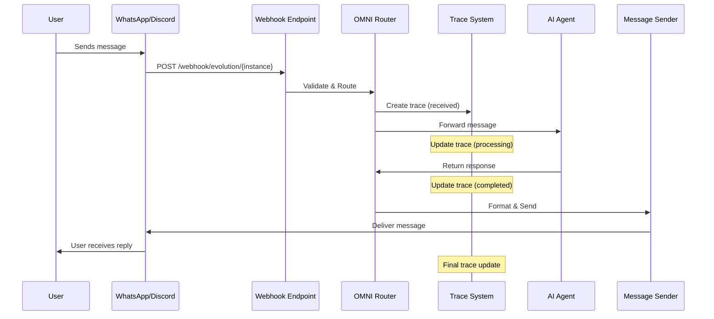
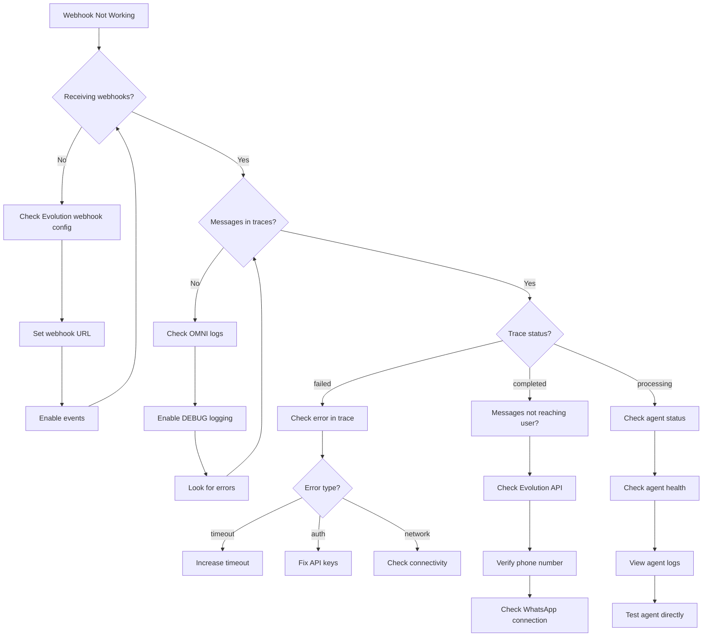

## Understanding Message Flow

### Complete Message Lifecycle



**Key Stages**:
1. **Received**: Webhook received from platform
2. **Processing**: Message sent to AI agent
3. **Completed**: Response sent back to user
4. **Failed**: Error occurred at any stage

---

## Webhook Not Receiving Messages

### Symptom: No webhook calls when users send messages

**Diagnostic Steps**:

```bash
# 1. Check webhook URL configuration
# For WhatsApp (Evolution API)
curl -H "apikey: YOUR_EVOLUTION_KEY" \
  http://localhost:18082/instance/fetchInstances | jq

# Look for webhook configuration in response
# Should show:
# "webhook": "http://localhost:8882/webhook/evolution/my-bot"

# 2. Check OMNI logs for incoming requests
pm2 logs omni-api | grep "webhook"

# 3. Check firewall/network
curl -v http://localhost:8882/webhook/evolution/test \
  -H "Content-Type: application/json" \
  -d '{"test": "message"}'

# Should NOT return 404
```

<AccordionGroup>
  <Accordion title="Solution 1: Configure Evolution API Webhook">
    **Problem**: Evolution API not configured to send webhooks to OMNI

    **Solution**:
    ```bash
    # Set webhook URL in Evolution API
    curl -X POST http://localhost:18082/webhook/set/{instance_name} \
      -H "apikey: YOUR_EVOLUTION_KEY" \
      -H "Content-Type: application/json" \
      -d '{
        "url": "http://localhost:8882/webhook/evolution/my-bot",
        "webhook_by_events": false,
        "webhook_base64": false,
        "events": [
          "MESSAGES_UPSERT",
          "MESSAGES_UPDATE",
          "MESSAGES_DELETE",
          "SEND_MESSAGE"
        ]
      }'

    # Verify webhook configured
    curl -H "apikey: YOUR_EVOLUTION_KEY" \
      http://localhost:18082/webhook/find/{instance_name} | jq

    # Test webhook
    # Send message to WhatsApp number
    # Check OMNI logs
    pm2 logs omni-api --lines 20
    ```
  </Accordion>

  <Accordion title="Solution 2: Fix Webhook URL">
    **Problem**: Webhook URL points to wrong host/port

    **Solution**:
    ```bash
    # If OMNI is on different server/port
    # Update webhook URL

    # For local development (same machine)
    WEBHOOK_URL="http://localhost:8882/webhook/evolution/my-bot"

    # For remote OMNI (different machine)
    WEBHOOK_URL="http://YOUR_OMNI_IP:8882/webhook/evolution/my-bot"

    # For production (with domain)
    WEBHOOK_URL="https://omni.yourdomain.com/webhook/evolution/my-bot"

    # Update in Evolution API
    curl -X POST http://localhost:18082/webhook/set/{instance_name} \
      -H "apikey: YOUR_EVOLUTION_KEY" \
      -H "Content-Type: application/json" \
      -d "{\"url\": \"$WEBHOOK_URL\"}"
    ```

    **Important**: If Evolution API and OMNI are on different machines, ensure:
    - OMNI port 8882 is accessible from Evolution API server
    - No firewall blocking
    - Use public IP or domain, not localhost
  </Accordion>

  <Accordion title="Solution 3: Enable Webhook Events">
    **Problem**: Webhook configured but specific events not enabled

    **Solution**:
    ```bash
    # Enable all message events
    curl -X POST http://localhost:18082/webhook/set/{instance_name} \
      -H "apikey: YOUR_EVOLUTION_KEY" \
      -H "Content-Type: application/json" \
      -d '{
        "url": "http://localhost:8882/webhook/evolution/my-bot",
        "enabled": true,
        "webhook_by_events": true,
        "events": [
          "QRCODE_UPDATED",
          "MESSAGES_SET",
          "MESSAGES_UPSERT",
          "MESSAGES_UPDATE",
          "MESSAGES_DELETE",
          "SEND_MESSAGE",
          "CONTACTS_SET",
          "CONTACTS_UPSERT",
          "CONTACTS_UPDATE",
          "PRESENCE_UPDATE",
          "CHATS_SET",
          "CHATS_UPSERT",
          "CHATS_UPDATE",
          "CHATS_DELETE",
          "GROUPS_UPSERT",
          "GROUP_UPDATE",
          "GROUP_PARTICIPANTS_UPDATE",
          "CONNECTION_UPDATE",
          "LABELS_EDIT",
          "LABELS_ASSOCIATION",
          "CALL"
        ]
      }'
    ```
  </Accordion>

  <Accordion title="Solution 4: Check Instance Name Match">
    **Problem**: Instance name mismatch between Evolution and OMNI

    **Solution**:
    ```bash
    # 1. Check Evolution API instance name
    curl -H "apikey: YOUR_EVOLUTION_KEY" \
      http://localhost:18082/instance/fetchInstances | jq -r '.[].instance.instanceName'

    # 2. Check OMNI instance name
    curl -H "x-api-key: YOUR_OMNI_KEY" \
      http://localhost:8882/api/v1/instances | jq -r '.[].name'

    # 3. Ensure webhook URL uses correct instance name
    # Format: /webhook/evolution/{instance_name}

    # 4. If mismatch, update OMNI instance or Evolution webhook
    curl -X PATCH http://localhost:8882/api/v1/instances/OLD_NAME \
      -H "x-api-key: YOUR_OMNI_KEY" \
      -H "Content-Type: application/json" \
      -d '{"name": "CORRECT_NAME"}'
    ```
  </Accordion>
</AccordionGroup>

---

## Payload Inspection

### View Webhook Payloads

**Using Trace System**:

```bash
# Get recent traces with full payload
curl -H "x-api-key: YOUR_KEY" \
  "http://localhost:8882/api/v1/traces?limit=10&include_payload=true" | jq

# Filter by phone number
curl -H "x-api-key: YOUR_KEY" \
  "http://localhost:8882/api/v1/traces?phone=%2B1234567890" | jq

# Filter by status
curl -H "x-api-key: YOUR_KEY" \
  "http://localhost:8882/api/v1/traces?status=failed" | jq

# Get specific trace details
curl -H "x-api-key: YOUR_KEY" \
  "http://localhost:8882/api/v1/traces/{trace_id}" | jq
```

**Understanding Trace Data**:

```json
{
  "id": "trace_abc123",
  "instance_name": "my-bot",
  "phone": "+1234567890",
  "message_type": "text",
  "status": "completed",
  "created_at": "2025-11-04T10:30:00Z",
  "processing_time_ms": 1523,
  "agent_response_time_ms": 1450,
  "payload": {
    "incoming": {
      "key": {...},
      "message": {
        "conversation": "Hello bot!"
      }
    },
    "agent_request": {
      "message": "Hello bot!",
      "user_id": "whatsapp:1234567890",
      "platform": "whatsapp"
    },
    "agent_response": {
      "response": "Hello! How can I help?"
    },
    "outgoing": {
      "phone": "+1234567890",
      "message": "Hello! How can I help?"
    }
  }
}
```

**Key Metrics**:
- `processing_time_ms`: Total time from webhook to response sent
- `agent_response_time_ms`: Time AI agent took to respond
- `status`: received, processing, completed, failed

---

### Request/Response Logging

**Enable Debug Logging**:

```bash
# Edit .env
LOG_LEVEL=DEBUG

# Restart OMNI
pm2 restart omni-api

# View detailed logs
pm2 logs omni-api

# You'll see:
# - Incoming webhook payloads
# - Agent API requests
# - Agent API responses
# - Error stack traces
```

**Log Format**:

```
2025-11-04 10:30:15 | DEBUG | Received webhook: instance=my-bot, event=MESSAGES_UPSERT
2025-11-04 10:30:15 | DEBUG | Message from: +1234567890, text=Hello bot!
2025-11-04 10:30:15 | DEBUG | Forwarding to agent: http://localhost:8886/chat
2025-11-04 10:30:16 | DEBUG | Agent response received: 1450ms
2025-11-04 10:30:16 | DEBUG | Sending reply: Hello! How can I help?
2025-11-04 10:30:17 | DEBUG | Message sent successfully
```

---

## Testing Webhooks Locally

### Using ngrok for External Testing

**Problem**: Evolution API on external server can't reach local OMNI

**Solution**: Expose local OMNI with ngrok

```bash
# 1. Install ngrok
# Download from: https://ngrok.com/download

# 2. Start ngrok tunnel
ngrok http 8882

# Output:
# Forwarding  https://abc123.ngrok.io -> http://localhost:8882

# 3. Update Evolution API webhook
curl -X POST http://YOUR_EVOLUTION_API:18082/webhook/set/{instance} \
  -H "apikey: YOUR_EVOLUTION_KEY" \
  -H "Content-Type: application/json" \
  -d '{
    "url": "https://abc123.ngrok.io/webhook/evolution/my-bot"
  }'

# 4. Monitor ngrok requests
# Open: http://127.0.0.1:4040
# See all webhook requests in web UI

# 5. Test by sending WhatsApp message
# Watch ngrok web UI for incoming requests
```

**ngrok Advantages**:
- See raw HTTP requests and responses
- Replay requests for debugging
- No firewall configuration needed
- Works from anywhere

---

### Manual Webhook Testing

**Simulate Webhook Locally**:

```bash
# Test OMNI webhook endpoint
curl -X POST http://localhost:8882/webhook/evolution/my-bot \
  -H "Content-Type: application/json" \
  -d '{
    "event": "messages.upsert",
    "instance": "my-bot",
    "data": {
      "key": {
        "remoteJid": "1234567890@s.whatsapp.net",
        "fromMe": false,
        "id": "test-message-id"
      },
      "message": {
        "conversation": "Test message from webhook"
      },
      "messageTimestamp": 1699024000,
      "pushName": "Test User"
    }
  }'

# Should return: 200 OK

# Check trace created
curl -H "x-api-key: YOUR_KEY" \
  "http://localhost:8882/api/v1/traces?limit=1" | jq

# Check logs
pm2 logs omni-api --lines 20
```

**Discord Webhook Test**:

```bash
# Test Discord message via IPC
curl --unix-socket /automagik-omni/sockets/discord-my-bot.sock \
  -X POST http://localhost/send \
  -H "Content-Type: application/json" \
  -d '{
    "channel_id": "1234567890123456",
    "text": "Test message"
  }'

# Should return: {"success": true, "message_id": "..."}
```

---

## Signature Verification Issues

### Webhook Signature Validation

**Problem**: Webhook rejected due to signature mismatch

<Info>
Currently, Automagik OMNI does not enforce webhook signature verification for Evolution API webhooks. This feature may be added in future versions.
</Info>

**Future Implementation**:

```python
# Example signature verification (not currently implemented)
import hmac
import hashlib

def verify_webhook_signature(payload: bytes, signature: str, secret: str) -> bool:
    """Verify webhook signature"""
    expected = hmac.new(
        secret.encode(),
        payload,
        hashlib.sha256
    ).hexdigest()
    return hmac.compare_digest(expected, signature)

# Usage
if not verify_webhook_signature(request.body, request.headers['X-Signature'], WEBHOOK_SECRET):
    raise HTTPException(status_code=401, detail="Invalid signature")
```

---

## Retry Logic and Idempotency

### Understanding Retry Behavior

**Evolution API Retry Logic**:
- Retries failed webhooks up to 3 times
- 5-second delay between retries
- After 3 failures, gives up

**OMNI Handling**:
- Each webhook creates a unique trace
- Duplicate webhooks (retries) create separate traces
- Use `message_id` to detect duplicates

### Implementing Idempotency

**Problem**: Duplicate messages sent on webhook retry

**Solution**: Track message IDs

```python
# Example idempotency implementation (pseudo-code)

# In your agent or OMNI customization:
processed_messages = set()  # Or use Redis for distributed systems

def handle_message(message_id: str, content: str):
    # Check if already processed
    if message_id in processed_messages:
        logger.info(f"Duplicate message {message_id}, skipping")
        return {"status": "duplicate"}

    # Process message
    response = ai_agent.process(content)

    # Mark as processed
    processed_messages.add(message_id)

    # Store in Redis with TTL for distributed systems
    # redis.setex(f"msg:{message_id}", 3600, "processed")

    return response
```

**Using Trace System for Deduplication**:

```bash
# Query traces by message ID
curl -H "x-api-key: YOUR_KEY" \
  "http://localhost:8882/api/v1/traces" | \
  jq '.[] | select(.payload.incoming.key.id == "MESSAGE_ID_HERE")'

# If trace exists, it's a duplicate
```

---

## Using Trace System for Debugging

### Trace System Queries

```bash
# Get all traces for specific phone number
curl -H "x-api-key: YOUR_KEY" \
  "http://localhost:8882/api/v1/traces?phone=%2B1234567890&limit=50" | jq

# Get failed traces only
curl -H "x-api-key: YOUR_KEY" \
  "http://localhost:8882/api/v1/traces?status=failed" | jq

# Get traces from last hour
START_TIME=$(date -u -d '1 hour ago' +%Y-%m-%dT%H:%M:%SZ)
curl -H "x-api-key: YOUR_KEY" \
  "http://localhost:8882/api/v1/traces?start_date=$START_TIME" | jq

# Get slow traces (processing time > 5 seconds)
curl -H "x-api-key: YOUR_KEY" \
  "http://localhost:8882/api/v1/traces?limit=100" | \
  jq '.[] | select(.processing_time_ms > 5000)'

# Analytics summary
curl -H "x-api-key: YOUR_KEY" \
  "http://localhost:8882/api/v1/traces/analytics/summary" | jq
```

### Trace Analytics

**Example Analytics Response**:

```json
{
  "total_messages": 1543,
  "completed": 1489,
  "failed": 54,
  "success_rate": 96.5,
  "avg_processing_time_ms": 1234,
  "avg_agent_response_time_ms": 1150,
  "by_instance": {
    "my-bot": {
      "total": 843,
      "completed": 820,
      "failed": 23
    },
    "support-bot": {
      "total": 700,
      "completed": 669,
      "failed": 31
    }
  },
  "by_status": {
    "completed": 1489,
    "failed": 54
  },
  "slowest_traces": [
    {
      "id": "trace_xyz",
      "processing_time_ms": 8934,
      "phone": "+1234567890"
    }
  ]
}
```

### Cleanup Old Traces

```bash
# Preview cleanup (dry run)
curl -X POST http://localhost:8882/api/v1/traces/cleanup \
  -H "x-api-key: YOUR_KEY" \
  -H "Content-Type: application/json" \
  -d '{
    "days_old": 30,
    "dry_run": true
  }' | jq

# Actually delete old traces
curl -X POST http://localhost:8882/api/v1/traces/cleanup \
  -H "x-api-key: YOUR_KEY" \
  -H "Content-Type: application/json" \
  -d '{
    "days_old": 30,
    "dry_run": false
  }' | jq

# Response shows how many traces were deleted
```

---

## Common Webhook Errors

### Error: "Agent API timeout"

**Symptom**: Traces show status "failed" with "Agent timeout" error

**Cause**: AI agent not responding within timeout (default: 60s)

**Solution**:

```bash
# Increase timeout for specific instance
curl -X PATCH http://localhost:8882/api/v1/instances/my-bot \
  -H "x-api-key: YOUR_KEY" \
  -H "Content-Type: application/json" \
  -d '{"agent_timeout": 120}'

# Or fix agent performance
# - Check agent health
curl http://localhost:8886/health

# - Check agent logs
# - Reduce context size
# - Use faster model
# - Optimize agent code
```

---

### Error: "Message too large"

**Symptom**: Failed to send media or long messages

**Solution**:

```bash
# Check Evolution API limits
# WhatsApp limits:
# - Text: 4096 characters
# - Media: 16MB (images), 64MB (videos/docs)

# Split long messages
# OMNI automatically splits messages > 4096 chars

# For media, ensure URL is accessible
curl -I https://your-media-url.com/image.jpg
# Should return: 200 OK
# Content-Length should be < 16MB for images
```

---

### Error: "Invalid phone number format"

**Symptom**: Messages fail to send with "invalid number" error

**Solution**:

```bash
# WhatsApp phone format: +[country_code][number]
# Examples:
# ✅ Correct: +14155551234
# ✅ Correct: +5511999998888
# ❌ Wrong: 4155551234 (missing +)
# ❌ Wrong: +1 (415) 555-1234 (has spaces/parens)
# ❌ Wrong: +1-415-555-1234 (has dashes)

# Format phone numbers properly in your code
import re

def format_phone(phone: str) -> str:
    # Remove all non-numeric characters except +
    phone = re.sub(r'[^\d+]', '', phone)
    # Ensure starts with +
    if not phone.startswith('+'):
        phone = '+' + phone
    return phone

# Test
print(format_phone("(415) 555-1234"))  # +4155551234
print(format_phone("+1-415-555-1234"))  # +14155551234
```

---

## Debugging Flowchart



---

## Next Steps

<CardGroup cols={2}>
  <Card title="Monitoring & Metrics" icon="chart-line" href="/omni/advanced/monitoring-metrics">
    Set up production monitoring
  </Card>
  <Card title="Common Issues" icon="circle-exclamation" href="/omni/troubleshooting/common-issues">
    General troubleshooting guide
  </Card>
  <Card title="Connection Errors" icon="wifi" href="/omni/troubleshooting/connection-errors">
    Debug connectivity problems
  </Card>
  <Card title="Custom Agents" icon="robot" href="/omni/advanced/custom-agents">
    Build custom AI agents
  </Card>
</CardGroup>
