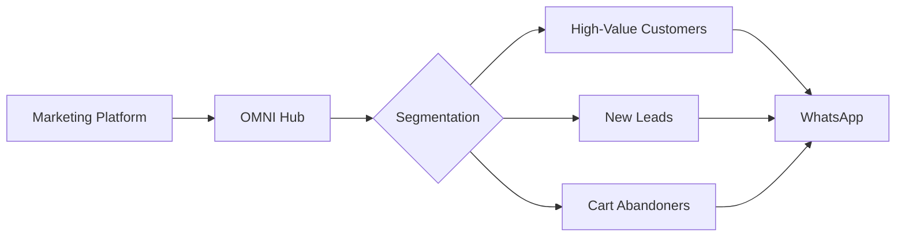

## Overview

Build powerful marketing automation with personalized campaigns, segmented messaging, A/B testing, and conversion tracking across WhatsApp, Discord, and other platforms.



---

## Use Cases

<CardGroup cols={2}>
  <Card title="Product Launches" icon="rocket">
    Announce new products with personalized messaging
  </Card>

  <Card title="Abandoned Cart Recovery" icon="cart-shopping">
    Recover abandoned carts with timely WhatsApp reminders
  </Card>

  <Card title="Customer Reactivation" icon="rotate">
    Win back inactive customers with special offers
  </Card>

  <Card title="Loyalty Programs" icon="award">
    Engage loyalty members with exclusive promotions
  </Card>

  <Card title="Event Marketing" icon="calendar-star">
    Promote events and send registration confirmations
  </Card>

  <Card title="Drip Campaigns" icon="droplet">
    Nurture leads with automated message sequences
  </Card>
</CardGroup>

---

## Campaign Implementation

### Abandoned Cart Recovery

```python abandoned_cart.py
from datetime import datetime, timedelta
import schedule

class AbandonedCartCampaign:
    def __init__(self):
        self.sent_reminders = set()

    async def check_abandoned_carts(self):
        """Check for abandoned carts and send reminders"""
        # Get carts abandoned 1 hour ago
        cutoff_time = datetime.now() - timedelta(hours=1)
        abandoned_carts = await db.carts.find({
            "status": "abandoned",
            "updated_at": {"$lt": cutoff_time},
            "reminder_sent": False
        })

        for cart in abandoned_carts:
            await self.send_recovery_message(cart)

    async def send_recovery_message(self, cart: dict):
        """Send personalized cart recovery message"""
        customer = await db.customers.find_one({"id": cart['customer_id']})

        # Personalize message
        message = f"""
Hi {customer['name']}! 👋

You left {len(cart['items'])} item(s) in your cart:

{self.format_cart_items(cart['items'])}

Complete your order now and get **10% off** with code: COMEBACK10

Shop now: {cart['checkout_url']}

Offer expires in 24 hours! ⏰
        """

        # Send via WhatsApp
        await send_whatsapp(customer['phone'], message)

        # Track campaign
        await db.campaigns.insert_one({
            "type": "abandoned_cart",
            "customer_id": customer['id'],
            "cart_id": cart['id'],
            "sent_at": datetime.now(),
            "status": "sent"
        })

        # Mark reminder as sent
        cart['reminder_sent'] = True
        await db.carts.update_one(
            {"id": cart['id']},
            {"$set": {"reminder_sent": True}}
        )

    def format_cart_items(self, items: list) -> str:
        """Format cart items for message"""
        lines = []
        total = 0

        for item in items:
            lines.append(f"• {item['name']} - ${item['price']}")
            total += item['price']

        lines.append(f"\n**Total:** ${total:.2f}")
        return "\n".join(lines)

# Schedule to run every hour
campaign = AbandonedCartCampaign()
schedule.every().hour.do(campaign.check_abandoned_carts)
```

### Product Launch Campaign

```python product_launch.py
class ProductLaunchCampaign:
    def __init__(self, product_id: str):
        self.product = get_product(product_id)
        self.segments = self.create_segments()

    def create_segments(self) -> dict:
        """Segment customers for personalized messaging"""
        return {
            "vip": get_customers({"tier": "vip"}),
            "frequent": get_customers({"orders_count": {"$gte": 5}}),
            "interested": get_customers({"interests": {"$in": [self.product['category']]}}),
            "all": get_customers({"opted_in": True})
        }

    async def launch(self):
        """Execute product launch campaign"""
        # Phase 1: VIP early access (2 days before)
        await self.send_vip_preview()

        # Phase 2: Frequent shoppers (1 day before)
        await asyncio.sleep(86400)  # Wait 24 hours
        await self.send_frequent_shopper_alert()

        # Phase 3: All customers (launch day)
        await asyncio.sleep(86400)
        await self.send_general_announcement()

    async def send_vip_preview(self):
        """VIP exclusive preview"""
        message = f"""
🌟 **VIP EXCLUSIVE ACCESS**

Hi {{name}}! As a valued VIP member, you get first access to our new product:

**{self.product['name']}**
{self.product['description']}

✨ VIP Price: ${self.product['vip_price']} (Save {self.product['discount']}%)

Shop now before it's available to everyone:
{self.product['url']}?vip=true

Available for VIP members only until {self.get_launch_date()}
        """

        for customer in self.segments['vip']:
            personalized = message.format(name=customer['name'])
            await send_whatsapp(customer['phone'], personalized)

            # Track
            await track_campaign_send(
                campaign_id="product_launch_vip",
                customer_id=customer['id']
            )

    async def send_frequent_shopper_alert(self):
        """Alert for frequent shoppers"""
        message = f"""
Hey {{name}}! 👋

Tomorrow we're launching something special:

**{self.product['name']}**

You're one of our best customers, so here's an exclusive 15% off code: EARLY15

Get notified when it drops:
{self.product['waitlist_url']}
        """

        for customer in self.segments['frequent']:
            if customer['id'] not in [c['id'] for c in self.segments['vip']]:  # Avoid duplicates
                personalized = message.format(name=customer['name'])
                await send_whatsapp(customer['phone'], personalized)

    async def send_general_announcement(self):
        """General product announcement"""
        message = f"""
🎉 **NEW PRODUCT LAUNCH**

Introducing: {self.product['name']}!

{self.product['description']}

💰 Launch Special: {self.product['launch_discount']}% off
⏰ Limited time offer

Shop now: {self.product['url']}
        """

        for customer in self.segments['all']:
            if customer['id'] not in [c['id'] for c in self.segments['vip'] + self.segments['frequent']]:
                personalized = message.format(name=customer.get('name', 'there'))
                await send_whatsapp(customer['phone'], personalized)

# Launch campaign
campaign = ProductLaunchCampaign(product_id="new-product-123")
asyncio.run(campaign.launch())
```

---

## Segmentation and Personalization

### Customer Segmentation

```python segmentation.py
class CustomerSegmentation:
    @staticmethod
    def segment_by_behavior(customers: list) -> dict:
        """Segment customers by purchase behavior"""
        segments = {
            "champions": [],      # Frequent + Recent + High Value
            "loyal": [],          # Frequent + Recent
            "potential": [],      # Recent but low frequency
            "at_risk": [],        # Was frequent, now inactive
            "lost": []            # Long time inactive
        }

        for customer in customers:
            rfm = calculate_rfm(customer)

            if rfm['frequency'] >= 5 and rfm['recency'] <= 30 and rfm['monetary'] >= 1000:
                segments['champions'].append(customer)
            elif rfm['frequency'] >= 3 and rfm['recency'] <= 60:
                segments['loyal'].append(customer)
            elif rfm['recency'] <= 30 and rfm['frequency'] < 3:
                segments['potential'].append(customer)
            elif rfm['frequency'] >= 3 and rfm['recency'] > 90:
                segments['at_risk'].append(customer)
            elif rfm['recency'] > 180:
                segments['lost'].append(customer)

        return segments

    @staticmethod
    def segment_by_demographics(customers: list) -> dict:
        """Segment by demographics"""
        return {
            "age_18_25": [c for c in customers if 18 <= c.get('age', 0) < 25],
            "age_26_35": [c for c in customers if 26 <= c.get('age', 0) < 35],
            "age_36_45": [c for c in customers if 36 <= c.get('age', 0) < 45],
            "age_45_plus": [c for c in customers if c.get('age', 0) >= 45]
        }

def calculate_rfm(customer: dict) -> dict:
    """Calculate RFM (Recency, Frequency, Monetary) scores"""
    last_order = customer.get('last_order_date')
    recency = (datetime.now() - last_order).days if last_order else 999

    return {
        "recency": recency,
        "frequency": customer.get('orders_count', 0),
        "monetary": customer.get('total_spent', 0)
    }
```

### Personalization Engine

```python personalization.py
class PersonalizationEngine:
    def personalize_message(self, template: str, customer: dict, product: dict = None) -> str:
        """Generate personalized message"""
        # Basic personalization
        replacements = {
            "{{name}}": customer.get('name', 'there'),
            "{{first_name}}": customer.get('name', 'there').split()[0],
        }

        # Product recommendations
        if product:
            replacements.update({
                "{{product_name}}": product['name'],
                "{{product_price}}": f"${product['price']:.2f}",
                "{{product_url}}": product['url']
            })

        # Behavioral triggers
        if customer.get('last_order_date'):
            days_since = (datetime.now() - customer['last_order_date']).days
            replacements["{{days_since_purchase}}"] = str(days_since)

        # Apply replacements
        message = template
        for placeholder, value in replacements.items():
            message = message.replace(placeholder, value)

        return message

    def get_product_recommendations(self, customer: dict, limit: int = 3) -> list:
        """Get personalized product recommendations"""
        # Based on purchase history and browsing behavior
        past_categories = customer.get('purchase_categories', [])
        browsing_history = customer.get('browsing_history', [])

        # Simplified recommendation logic
        recommended = []

        # Complementary products
        if past_categories:
            recommended.extend(
                get_products({"category": {"$in": past_categories}})
            )

        # Trending in browsed categories
        if browsing_history:
            recommended.extend(
                get_trending_products(categories=browsing_history)
            )

        # Remove duplicates and limit
        return list({p['id']: p for p in recommended}.values())[:limit]
```

---

## A/B Testing

```python ab_testing.py
import random

class ABTestManager:
    def __init__(self, campaign_id: str):
        self.campaign_id = campaign_id
        self.variants = {}

    def add_variant(self, name: str, message: str, weight: float = 0.5):
        """Add A/B test variant"""
        self.variants[name] = {
            "message": message,
            "weight": weight,
            "sent": 0,
            "opened": 0,
            "clicked": 0,
            "converted": 0
        }

    def get_variant(self) -> tuple:
        """Get variant based on weights"""
        r = random.random()
        cumulative = 0

        for name, variant in self.variants.items():
            cumulative += variant['weight']
            if r <= cumulative:
                return name, variant['message']

        # Fallback
        return list(self.variants.items())[0]

    async def send_test_message(self, customer: dict):
        """Send message with A/B testing"""
        variant_name, message = self.get_variant()

        # Personalize
        personalized = PersonalizationEngine().personalize_message(message, customer)

        # Send
        await send_whatsapp(customer['phone'], personalized)

        # Track
        self.variants[variant_name]['sent'] += 1

        await db.ab_tests.insert_one({
            "campaign_id": self.campaign_id,
            "customer_id": customer['id'],
            "variant": variant_name,
            "sent_at": datetime.now()
        })

    async def track_conversion(self, customer_id: str, action: str):
        """Track conversion for A/B test"""
        test_record = await db.ab_tests.find_one({
            "campaign_id": self.campaign_id,
            "customer_id": customer_id
        })

        if test_record:
            variant_name = test_record['variant']
            self.variants[variant_name][action] += 1

    def get_results(self) -> dict:
        """Get A/B test results"""
        results = {}

        for name, variant in self.variants.items():
            sent = variant['sent']
            results[name] = {
                "sent": sent,
                "open_rate": variant['opened'] / sent if sent > 0 else 0,
                "click_rate": variant['clicked'] / sent if sent > 0 else 0,
                "conversion_rate": variant['converted'] / sent if sent > 0 else 0
            }

        return results

# Example usage
ab_test = ABTestManager("summer_sale_2025")

ab_test.add_variant("control", """
Summer Sale! Get 20% off everything.
Shop now: https://shop.example.com/sale
""", weight=0.5)

ab_test.add_variant("urgency", """
🔥 FLASH SALE - 24 HOURS ONLY!
Get 20% off everything + FREE shipping
Shop now: https://shop.example.com/sale
Hurry, offer ends tomorrow!
""", weight=0.5)

# Send to customers
for customer in customers:
    await ab_test.send_test_message(customer)

# After campaign, check results
results = ab_test.get_results()
print(f"Winner: {max(results, key=lambda k: results[k]['conversion_rate'])}")
```

---

## Conversion Tracking

```python tracking.py
from urllib.parse import urlencode

class ConversionTracker:
    def generate_tracking_url(self, base_url: str, campaign_id: str, customer_id: str) -> str:
        """Generate UTM-tagged URL for tracking"""
        params = {
            "utm_source": "whatsapp",
            "utm_medium": "message",
            "utm_campaign": campaign_id,
            "customer_id": customer_id
        }

        return f"{base_url}?{urlencode(params)}"

    async def track_click(self, customer_id: str, campaign_id: str):
        """Track link click"""
        await db.campaign_clicks.insert_one({
            "campaign_id": campaign_id,
            "customer_id": customer_id,
            "clicked_at": datetime.now()
        })

    async def track_conversion(self, customer_id: str, campaign_id: str, value: float):
        """Track purchase conversion"""
        await db.campaign_conversions.insert_one({
            "campaign_id": campaign_id,
            "customer_id": customer_id,
            "value": value,
            "converted_at": datetime.now()
        })

    async def get_campaign_stats(self, campaign_id: str) -> dict:
        """Get campaign performance metrics"""
        sent = await db.campaign_sends.count_documents({"campaign_id": campaign_id})
        clicks = await db.campaign_clicks.count_documents({"campaign_id": campaign_id})
        conversions = await db.campaign_conversions.count_documents({"campaign_id": campaign_id})

        # Calculate revenue
        conversion_docs = await db.campaign_conversions.find({"campaign_id": campaign_id}).to_list()
        revenue = sum(doc['value'] for doc in conversion_docs)

        return {
            "sent": sent,
            "clicks": clicks,
            "conversions": conversions,
            "click_rate": clicks / sent if sent > 0 else 0,
            "conversion_rate": conversions / sent if sent > 0 else 0,
            "revenue": revenue,
            "revenue_per_send": revenue / sent if sent > 0 else 0
        }

tracker = ConversionTracker()

# Generate tracking URL
tracking_url = tracker.generate_tracking_url(
    "https://shop.example.com/product/123",
    campaign_id="summer_sale",
    customer_id="cust_456"
)
```

---

## Drip Campaigns

```python drip_campaign.py
class DripCampaign:
    def __init__(self, name: str):
        self.name = name
        self.messages = []

    def add_message(self, delay_days: int, message: str, condition: callable = None):
        """Add message to drip sequence"""
        self.messages.append({
            "delay_days": delay_days,
            "message": message,
            "condition": condition
        })

    async def enroll_customer(self, customer: dict):
        """Enroll customer in drip campaign"""
        await db.drip_enrollments.insert_one({
            "campaign_name": self.name,
            "customer_id": customer['id'],
            "enrolled_at": datetime.now(),
            "current_step": 0,
            "status": "active"
        })

    async def process_enrollments(self):
        """Process and send drip messages"""
        enrollments = await db.drip_enrollments.find({"status": "active"}).to_list()

        for enrollment in enrollments:
            customer = await db.customers.find_one({"id": enrollment['customer_id']})
            current_step = enrollment['current_step']

            if current_step >= len(self.messages):
                # Campaign complete
                await db.drip_enrollments.update_one(
                    {"_id": enrollment['_id']},
                    {"$set": {"status": "completed"}}
                )
                continue

            message_config = self.messages[current_step]
            days_since_enrollment = (datetime.now() - enrollment['enrolled_at']).days

            # Check if it's time to send this message
            if days_since_enrollment >= message_config['delay_days']:
                # Check condition if exists
                if message_config['condition']:
                    if not message_config['condition'](customer):
                        # Skip this message
                        enrollment['current_step'] += 1
                        continue

                # Send message
                personalized = PersonalizationEngine().personalize_message(
                    message_config['message'],
                    customer
                )
                await send_whatsapp(customer['phone'], personalized)

                # Update step
                await db.drip_enrollments.update_one(
                    {"_id": enrollment['_id']},
                    {"$set": {"current_step": current_step + 1}}
                )

# Example: Welcome series
welcome_series = DripCampaign("welcome_series")

welcome_series.add_message(0, """
Welcome to our store, {{name}}! 🎉

Thanks for signing up. Here's 10% off your first order:
Code: WELCOME10

Shop now: https://shop.example.com
""")

welcome_series.add_message(3, """
Hey {{name}}! 👋

Just checking in. Have you had a chance to browse our store?

Here are some of our bestsellers:
• Product A
• Product B
• Product C

Shop: https://shop.example.com
""")

welcome_series.add_message(7, """
Hi {{name}},

Your WELCOME10 code expires in 3 days! ⏰

Don't miss out on 10% off your first order.

Shop now: https://shop.example.com
""", condition=lambda c: c.get('orders_count', 0) == 0)  # Only if no purchase yet

# Run drip processor
schedule.every().hour.do(welcome_series.process_enrollments)
```

---

## Compliance and Best Practices

### Opt-In Management

```python
class OptInManager:
    async def opt_in(self, phone: str):
        """Opt customer into marketing messages"""
        await db.customers.update_one(
            {"phone": phone},
            {"$set": {"marketing_opt_in": True, "opted_in_at": datetime.now()}}
        )

    async def opt_out(self, phone: str):
        """Opt customer out of marketing messages"""
        await db.customers.update_one(
            {"phone": phone},
            {"$set": {"marketing_opt_in": False, "opted_out_at": datetime.now()}}
        )

    async def is_opted_in(self, phone: str) -> bool:
        """Check if customer is opted in"""
        customer = await db.customers.find_one({"phone": phone})
        return customer and customer.get('marketing_opt_in', False)

# Auto-handle opt-out keywords
OPTOUT_KEYWORDS = ["stop", "unsubscribe", "opt out", "opt-out"]

@app.post("/webhook/message")
async def handle_incoming_message(phone: str, message: str):
    if any(keyword in message.lower() for keyword in OPTOUT_KEYWORDS):
        await OptInManager().opt_out(phone)
        await send_whatsapp(phone, "You've been unsubscribed from marketing messages. Reply START to opt back in.")
```

---

## Next Steps

<CardGroup cols={2}>
  <Card title="Customer Support" icon="headset" href="/omni/workflows/customer-support">
    Build 24/7 AI support bots
  </Card>

  <Card title="Notifications" icon="bell" href="/omni/workflows/notifications">
    Automated notifications and alerts
  </Card>

  <Card title="API Reference" icon="code" href="/omni/api/instances">
    Complete API documentation
  </Card>

  <Card title="Security" icon="shield" href="/omni/config/security-best-practices">
    Compliance and security best practices
  </Card>
</CardGroup>
