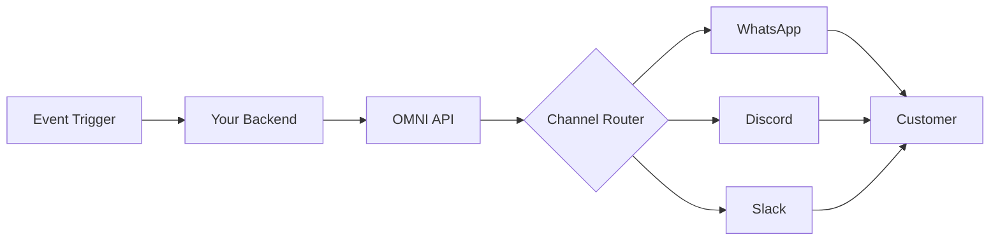

## Overview

Build powerful notification systems that deliver real-time updates to your users via WhatsApp, Discord, and other messaging platforms. Perfect for order updates, system alerts, appointment reminders, and event-driven messaging.



---

## Use Cases

<CardGroup cols={2}>
  <Card title="Order Status Updates" icon="box">
    Notify customers when orders are confirmed, shipped, out for delivery, and delivered
  </Card>

  <Card title="Appointment Reminders" icon="calendar">
    Send reminders 24 hours and 1 hour before appointments
  </Card>

  <Card title="System Alerts" icon="triangle-exclamation">
    Alert operations teams about system failures, high load, or security incidents
  </Card>

  <Card title="Payment Confirmations" icon="credit-card">
    Instant payment receipts and transaction notifications
  </Card>

  <Card title="Scheduled Broadcasts" icon="bullhorn">
    Send newsletters, promotions, or updates to user segments
  </Card>

  <Card title="Event-Driven Alerts" icon="bolt">
    Trigger notifications based on user actions or system events
  </Card>
</CardGroup>

---

## Architecture

### Notification Flow

```
Event Source → Backend API → OMNI → Messaging Platform → User
```

**Event Sources:**
- E-commerce platform (order updates)
- Payment gateway (transaction confirmations)
- CRM system (appointment reminders)
- Monitoring system (alerts)
- Cron jobs (scheduled messages)

---

## Implementation

### Step 1: Setup Notification Instance

```bash
# Create dedicated notification instance
curl -X POST http://localhost:8882/api/v1/instances \
  -H "x-api-key: your-omni-key" \
  -H "Content-Type: application/json" \
  -d '{
    "name": "order-notifications",
    "channel_type": "whatsapp",
    "evolution_url": "http://localhost:18082",
    "evolution_key": "your-evolution-key"
  }'

# Get QR code and connect
curl http://localhost:8882/api/v1/instances/order-notifications/qr \
  -H "x-api-key: your-omni-key"
```

### Step 2: Send Notifications from Your Backend

<Tabs>
  <Tab title="Node.js">
    ```javascript
    const axios = require('axios');

    class OmniNotifier {
      constructor(apiKey, baseUrl = 'http://localhost:8882') {
        this.apiKey = apiKey;
        this.baseUrl = baseUrl;
        this.headers = {
          'x-api-key': apiKey,
          'Content-Type': 'application/json'
        };
      }

      async sendNotification(instanceName, phone, message) {
        try {
          const response = await axios.post(
            `${this.baseUrl}/api/v1/instances/${instanceName}/send-text`,
            { phone, message },
            { headers: this.headers }
          );
          return response.data;
        } catch (error) {
          console.error('Notification failed:', error.response?.data || error.message);
          throw error;
        }
      }

      async sendOrderUpdate(phone, orderData) {
        const message = `
🎉 Order Update

Order #${orderData.orderId}
Status: ${orderData.status}
${orderData.trackingUrl ? `Track: ${orderData.trackingUrl}` : ''}

Thank you for your order!
        `.trim();

        return this.sendNotification('order-notifications', phone, message);
      }
    }

    // Usage
    const notifier = new OmniNotifier('your-omni-key');
    await notifier.sendOrderUpdate('+5511999999999', {
      orderId: '12345',
      status: 'Shipped',
      trackingUrl: 'https://track.example.com/12345'
    });
    ```
  </Tab>

  <Tab title="Python">
    ```python
    import requests
    from typing import Dict

    class OmniNotifier:
        def __init__(self, api_key: str, base_url: str = "http://localhost:8882"):
            self.api_key = api_key
            self.base_url = base_url
            self.headers = {
                "x-api-key": api_key,
                "Content-Type": "application/json"
            }

        def send_notification(self, instance_name: str, phone: str, message: str) -> Dict:
            url = f"{self.base_url}/api/v1/instances/{instance_name}/send-text"
            payload = {"phone": phone, "message": message}

            response = requests.post(url, json=payload, headers=self.headers)
            response.raise_for_status()
            return response.json()

        def send_order_update(self, phone: str, order_data: Dict) -> Dict:
            message = f"""
🎉 Order Update

Order #{order_data['order_id']}
Status: {order_data['status']}
{f"Track: {order_data['tracking_url']}" if order_data.get('tracking_url') else ''}

Thank you for your order!
            """.strip()

            return self.send_notification('order-notifications', phone, message)

    # Usage
    notifier = OmniNotifier('your-omni-key')
    result = notifier.send_order_update('+5511999999999', {
        'order_id': '12345',
        'status': 'Shipped',
        'tracking_url': 'https://track.example.com/12345'
    })
    print(f"Message sent! ID: {result.get('message_id')}")
    ```
  </Tab>

  <Tab title="PHP">
    ```php
    <?php

    class OmniNotifier {
        private $apiKey;
        private $baseUrl;

        public function __construct($apiKey, $baseUrl = 'http://localhost:8882') {
            $this->apiKey = $apiKey;
            $this->baseUrl = $baseUrl;
        }

        public function sendNotification($instanceName, $phone, $message) {
            $url = "{$this->baseUrl}/api/v1/instances/{$instanceName}/send-text";

            $data = [
                'phone' => $phone,
                'message' => $message
            ];

            $options = [
                'http' => [
                    'header' => "Content-type: application/json\r\nx-api-key: {$this->apiKey}\r\n",
                    'method' => 'POST',
                    'content' => json_encode($data)
                ]
            ];

            $context = stream_context_create($options);
            $result = file_get_contents($url, false, $context);

            return json_decode($result, true);
        }

        public function sendOrderUpdate($phone, $orderData) {
            $message = "🎉 Order Update\n\n";
            $message .= "Order #{$orderData['order_id']}\n";
            $message .= "Status: {$orderData['status']}\n";
            if (isset($orderData['tracking_url'])) {
                $message .= "Track: {$orderData['tracking_url']}\n";
            }
            $message .= "\nThank you for your order!";

            return $this->sendNotification('order-notifications', $phone, $message);
        }
    }

    // Usage
    $notifier = new OmniNotifier('your-omni-key');
    $notifier->sendOrderUpdate('+1234567890', [
        'order_id' => '12345',
        'status' => 'Shipped',
        'tracking_url' => 'https://track.example.com/12345'
    ]);
    ```
  </Tab>
</Tabs>

---

## Notification Templates

### Order Status Notifications

```javascript
const orderTemplates = {
  orderConfirmed: (order) => `
✅ Order Confirmed!

Order #${order.id}
Items: ${order.itemCount}
Total: $${order.total}

We'll notify you when it ships!
  `,

  orderShipped: (order) => `
📦 Your Order Has Shipped!

Order #${order.id}
Carrier: ${order.carrier}
Tracking: ${order.trackingNumber}

Track here: ${order.trackingUrl}
Expected delivery: ${order.estimatedDelivery}
  `,

  outForDelivery: (order) => `
🚚 Out for Delivery!

Order #${order.id}
Your package will arrive today.

Please be available to receive it.
  `,

  delivered: (order) => `
🎉 Delivered!

Order #${order.id} was delivered at ${order.deliveredAt}

Enjoy your purchase! We'd love to hear your feedback.
  `,

  orderCancelled: (order) => `
❌ Order Cancelled

Order #${order.id} has been cancelled.
${order.refund ? `Refund of $${order.refund} will be processed in 3-5 business days.` : ''}

Questions? Reply to this message.
  `
};

// Usage
await notifier.sendNotification(
  'order-notifications',
  customer.phone,
  orderTemplates.orderShipped(orderData)
);
```

### Appointment Reminders

```javascript
const appointmentTemplates = {
  reminder24h: (appt) => `
📅 Reminder: Appointment Tomorrow

Date: ${appt.date}
Time: ${appt.time}
Location: ${appt.location}
With: ${appt.provider}

Reply CONFIRM to confirm or RESCHEDULE to change.
  `,

  reminder1h: (appt) => `
⏰ Your Appointment is in 1 Hour

Time: ${appt.time}
Location: ${appt.location}

See you soon!
  `,

  appointmentConfirmed: (appt) => `
✅ Appointment Confirmed

Date: ${appt.date}
Time: ${appt.time}
Location: ${appt.location}

You'll receive a reminder 24 hours before.
  `
};
```

### Payment Notifications

```javascript
const paymentTemplates = {
  paymentReceived: (payment) => `
💳 Payment Received

Amount: $${payment.amount}
Method: ${payment.method}
Transaction ID: ${payment.transactionId}

Receipt: ${payment.receiptUrl}
  `,

  paymentFailed: (payment) => `
⚠️ Payment Failed

Amount: $${payment.amount}
Reason: ${payment.failureReason}

Please update your payment method.
Update here: ${payment.updateUrl}
  `,

  subscriptionRenewal: (sub) => `
🔄 Subscription Renewed

Plan: ${sub.plan}
Amount: $${sub.amount}
Next billing: ${sub.nextBillingDate}

Manage subscription: ${sub.manageUrl}
  `
};
```

---

## Advanced Features

### Rich Media Notifications

```javascript
// Send notification with image
async function sendOrderShippedWithImage(phone, order) {
  await axios.post(
    `${baseUrl}/api/v1/instances/order-notifications/send-media`,
    {
      phone: phone,
      media_url: order.packageImageUrl,
      media_type: 'image',
      caption: `📦 Your order #${order.id} has shipped! Track: ${order.trackingUrl}`
    },
    { headers: { 'x-api-key': apiKey } }
  );
}

// Send notification with document (invoice PDF)
async function sendInvoice(phone, invoice) {
  await axios.post(
    `${baseUrl}/api/v1/instances/order-notifications/send-media`,
    {
      phone: phone,
      media_url: invoice.pdfUrl,
      media_type: 'document',
      caption: `Invoice for order #${invoice.orderId}`
    },
    { headers: { 'x-api-key': apiKey } }
  );
}
```

### Scheduled Notifications

```javascript
// Using node-cron for scheduled notifications
const cron = require('node-cron');

// Send daily summary at 9 AM
cron.schedule('0 9 * * *', async () => {
  const users = await getActiveUsers();

  for (const user of users) {
    const summary = await generateDailySummary(user.id);

    await notifier.sendNotification(
      'daily-summary',
      user.phone,
      `
📊 Your Daily Summary

${summary.stats}

Have a great day!
      `
    );
  }
});

// Send appointment reminders 24h before
cron.schedule('*/30 * * * *', async () => { // Every 30 minutes
  const tomorrow = new Date();
  tomorrow.setDate(tomorrow.getDate() + 1);

  const appointments = await getAppointmentsTomorrow(tomorrow);

  for (const appt of appointments) {
    if (!appt.reminder_sent) {
      await notifier.sendNotification(
        'appointments',
        appt.customer_phone,
        appointmentTemplates.reminder24h(appt)
      );

      await markReminderSent(appt.id);
    }
  }
});
```

### Bulk Notifications

```javascript
async function sendBulkNotifications(userPhones, message, batchSize = 50) {
  // Split into batches to avoid rate limits
  for (let i = 0; i < userPhones.length; i += batchSize) {
    const batch = userPhones.slice(i, i + batchSize);

    // Send batch in parallel
    await Promise.all(
      batch.map(phone =>
        notifier.sendNotification('bulk-notifications', phone, message)
          .catch(err => console.error(`Failed to send to ${phone}:`, err))
      )
    );

    // Wait between batches
    if (i + batchSize < userPhones.length) {
      await new Promise(resolve => setTimeout(resolve, 2000));
    }
  }
}

// Usage: Send promotion to 1000 users
const userPhones = await getUserPhones({ opted_in: true });
await sendBulkNotifications(
  userPhones,
  `
🎉 Flash Sale Alert!

50% off everything for the next 24 hours!
Shop now: https://shop.example.com/sale

Use code: FLASH50
  `
);
```

### Notification Queue with Redis

```javascript
const Queue = require('bull');
const notificationQueue = new Queue('notifications', 'redis://localhost:6379');

// Add notification to queue
async function queueNotification(phone, message, priority = 'normal') {
  await notificationQueue.add(
    {
      phone,
      message,
      instance: 'order-notifications'
    },
    {
      priority: priority === 'high' ? 1 : priority === 'urgent' ? 0 : 2,
      attempts: 3,
      backoff: {
        type: 'exponential',
        delay: 2000
      }
    }
  );
}

// Process notifications
notificationQueue.process(async (job) => {
  const { phone, message, instance } = job.data;

  try {
    await notifier.sendNotification(instance, phone, message);
    console.log(`Notification sent to ${phone}`);
  } catch (error) {
    console.error(`Failed to send to ${phone}:`, error);
    throw error; // Will retry
  }
});

// Usage
await queueNotification('+1234567890', 'Your order has shipped!', 'high');
```

---

## Monitoring and Analytics

### Track Notification Delivery

```javascript
async function sendTrackedNotification(phone, message) {
  const startTime = Date.now();

  try {
    const result = await notifier.sendNotification('order-notifications', phone, message);

    // Log success
    await db.notifications.create({
      phone,
      message,
      status: 'delivered',
      response_time_ms: Date.now() - startTime,
      message_id: result.message_id,
      sent_at: new Date()
    });

    return result;
  } catch (error) {
    // Log failure
    await db.notifications.create({
      phone,
      message,
      status: 'failed',
      error: error.message,
      sent_at: new Date()
    });

    throw error;
  }
}
```

### Analytics Dashboard

```sql
-- Get notification stats
SELECT
  DATE(sent_at) as date,
  COUNT(*) as total_sent,
  SUM(CASE WHEN status = 'delivered' THEN 1 ELSE 0 END) as delivered,
  SUM(CASE WHEN status = 'failed' THEN 1 ELSE 0 END) as failed,
  AVG(response_time_ms) as avg_response_time
FROM notifications
WHERE sent_at >= NOW() - INTERVAL '30 days'
GROUP BY DATE(sent_at)
ORDER BY date DESC;

-- Top notification types
SELECT
  notification_type,
  COUNT(*) as count,
  AVG(response_time_ms) as avg_time
FROM notifications
GROUP BY notification_type
ORDER BY count DESC;
```

---

## Production Best Practices

### Rate Limiting

```javascript
const rateLimit = require('express-rate-limit');

// Limit notification API endpoints
const notificationLimiter = rateLimit({
  windowMs: 60 * 1000, // 1 minute
  max: 100, // 100 requests per minute
  message: 'Too many notifications, please try again later'
});

app.post('/api/notify', notificationLimiter, async (req, res) => {
  const { phone, message } = req.body;
  await notifier.sendNotification('notifications', phone, message);
  res.json({ success: true });
});
```

### Retry Logic

```javascript
async function sendNotificationWithRetry(phone, message, maxRetries = 3) {
  let lastError;

  for (let i = 0; i < maxRetries; i++) {
    try {
      return await notifier.sendNotification('notifications', phone, message);
    } catch (error) {
      lastError = error;
      console.log(`Retry ${i + 1}/${maxRetries} for ${phone}`);

      // Exponential backoff
      await new Promise(resolve => setTimeout(resolve, Math.pow(2, i) * 1000));
    }
  }

  throw new Error(`Failed after ${maxRetries} retries: ${lastError.message}`);
}
```

### User Preferences

```javascript
// Check user notification preferences before sending
async function sendRespectingPreferences(userId, notificationType, message) {
  const prefs = await db.userPreferences.findOne({ userId });

  if (!prefs) {
    // Default: all notifications enabled
    await sendNotification(userId, message);
    return;
  }

  // Check if user opted into this notification type
  if (prefs.notifications[notificationType]) {
    await sendNotification(userId, message);
  } else {
    console.log(`User ${userId} has opted out of ${notificationType}`);
  }
}

// Allow users to manage preferences
app.post('/api/preferences', async (req, res) => {
  const { userId, notifications } = req.body;

  await db.userPreferences.upsert({
    userId,
    notifications: {
      order_updates: notifications.order_updates ?? true,
      marketing: notifications.marketing ?? false,
      reminders: notifications.reminders ?? true
    }
  });

  res.json({ success: true });
});
```

---

## Integration Examples

### Shopify Webhook Integration

```javascript
app.post('/webhooks/shopify/order-update', async (req, res) => {
  const order = req.body;

  const customer_phone = order.shipping_address.phone;
  const status = order.fulfillment_status;

  if (status === 'fulfilled') {
    await notifier.sendOrderUpdate(customer_phone, {
      order_id: order.order_number,
      status: 'Shipped',
      tracking_url: order.tracking_url
    });
  }

  res.status(200).send('OK');
});
```

### Stripe Payment Webhook

```javascript
app.post('/webhooks/stripe', async (req, res) => {
  const event = req.body;

  if (event.type === 'payment_intent.succeeded') {
    const payment = event.data.object;
    const customer = await stripe.customers.retrieve(payment.customer);

    await notifier.sendNotification(
      'payments',
      customer.phone,
      paymentTemplates.paymentReceived({
        amount: (payment.amount / 100).toFixed(2),
        method: payment.payment_method_types[0],
        transactionId: payment.id,
        receiptUrl: payment.charges.data[0].receipt_url
      })
    );
  }

  res.status(200).send('OK');
});
```

---

## Next Steps

<CardGroup cols={2}>
  <Card title="Customer Support" icon="headset" href="/omni/workflows/customer-support">
    Build 24/7 AI support bots
  </Card>

  <Card title="Multi-Platform Agents" icon="layer-group" href="/omni/workflows/multi-platform-agents">
    Deploy across multiple channels
  </Card>

  <Card title="Marketing Automation" icon="bullhorn" href="/omni/workflows/marketing-automation">
    Automated marketing campaigns
  </Card>

  <Card title="API Reference" icon="code" href="/omni/api/instances">
    Complete API documentation
  </Card>
</CardGroup>
