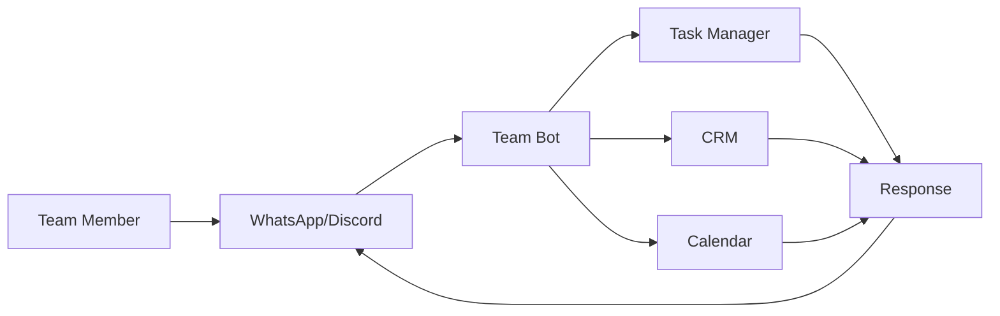

## Overview

Automate internal team communication with AI-powered bots that handle routine tasks, coordinate workflows, send updates, and integrate with your existing tools. Perfect for remote teams, distributed workforces, and async communication.



---

## Use Cases

<CardGroup cols={2}>
  <Card title="Daily Standups" icon="clipboard-list">
    Automate daily standup collection and summaries
  </Card>

  <Card title="Task Management" icon="list-check">
    Create, assign, and track tasks via messaging
  </Card>

  <Card title="Meeting Scheduling" icon="calendar-days">
    Schedule meetings and send reminders automatically
  </Card>

  <Card title="Status Updates" icon="chart-line">
    Collect and share project status across the team
  </Card>

  <Card title="On-Call Alerts" icon="bell-exclamation">
    Route alerts to on-call engineers via WhatsApp/Discord
  </Card>

  <Card title="Leave Requests" icon="plane-departure">
    Submit and approve time-off requests conversationally
  </Card>
</CardGroup>

---

## Implementation

### Daily Standup Bot

```python standup_bot.py
from fastapi import FastAPI
from datetime import datetime, time
import schedule
from typing import List, Dict

app = FastAPI()

# Team members
TEAM = [
    {"name": "Alice", "phone": "+1234567890", "timezone": "US/Eastern"},
    {"name": "Bob", "phone": "+0987654321", "timezone": "Europe/London"},
    {"name": "Carol", "phone": "+1122334455", "timezone": "Asia/Tokyo"}
]

class StandupManager:
    def __init__(self):
        self.responses = {}  # date -> {member: response}

    async def send_standup_request(self, member: dict):
        """Send standup prompt to team member"""
        message = f"""
Good morning {member['name']}! 🌅

Time for your daily standup. Please share:

1️⃣ What did you accomplish yesterday?
2️⃣ What are you working on today?
3️⃣ Any blockers?

Reply with your update!
        """

        # Send via OMNI
        await send_whatsapp_message(member['phone'], message)

    async def collect_response(self, phone: str, response: str):
        """Collect standup response"""
        today = datetime.now().date().isoformat()

        if today not in self.responses:
            self.responses[today] = {}

        # Find member by phone
        member = next((m for m in TEAM if m['phone'] == phone), None)
        if member:
            self.responses[today][member['name']] = response

            # Acknowledge
            await send_whatsapp_message(
                phone,
                f"Thanks {member['name']}! Your standup has been recorded. ✅"
            )

            # Check if all responses collected
            if len(self.responses[today]) == len(TEAM):
                await self.send_summary()

    async def send_summary(self):
        """Send standup summary to the team"""
        today = datetime.now().date().isoformat()
        responses = self.responses.get(today, {})

        summary = f"📊 **Daily Standup Summary - {today}**\n\n"

        for name, response in responses.items():
            summary += f"**{name}:**\n{response}\n\n"

        # Send to team channel (Discord/Slack)
        await send_to_team_channel(summary)

standup_manager = StandupManager()

# Schedule standup requests (9 AM in each timezone)
schedule.every().day.at("09:00").do(lambda: [
    standup_manager.send_standup_request(member)
    for member in TEAM
])

@app.post("/webhook/message")
async def handle_message(phone: str, message: str):
    """Handle incoming standup responses"""
    await standup_manager.collect_response(phone, message)
    return {"status": "ok"}
```

### Task Management Bot

```python task_bot.py
from fastapi import FastAPI
import re
from typing import Optional

app = FastAPI()

class TaskManager:
    def __init__(self):
        self.tasks = []  # In production, use database

    async def parse_command(self, message: str, user: str) -> str:
        """Parse task management commands"""
        message = message.lower().strip()

        # Create task: "create task: Fix login bug @alice priority:high"
        if message.startswith("create task"):
            return await self.create_task(message, user)

        # List tasks: "list tasks" or "my tasks"
        elif "list tasks" in message or "my tasks" in message:
            return await self.list_tasks(user if "my" in message else None)

        # Complete task: "complete task 5"
        elif "complete task" in message:
            task_id = self.extract_number(message)
            return await self.complete_task(task_id, user)

        # Assign task: "assign task 3 to @bob"
        elif "assign task" in message:
            task_id = self.extract_number(message)
            assignee = self.extract_mention(message)
            return await self.assign_task(task_id, assignee, user)

        else:
            return """
Available commands:

• create task: [description] @[assignee] priority:[low|medium|high]
• list tasks - List all tasks
• my tasks - List your tasks
• complete task [id] - Mark task as complete
• assign task [id] to @[user] - Reassign task

Examples:
• create task: Fix API bug @alice priority:high
• complete task 5
• assign task 3 to @bob
            """

    async def create_task(self, message: str, creator: str) -> str:
        # Extract task details
        match = re.search(r'create task:(.+)', message, re.IGNORECASE)
        if not match:
            return "❌ Invalid format. Use: create task: [description]"

        description = match.group(1).strip()
        assignee = self.extract_mention(description) or "unassigned"
        priority = self.extract_priority(description) or "medium"

        # Clean description
        description = re.sub(r'@\w+', '', description)
        description = re.sub(r'priority:\w+', '', description).strip()

        # Create task
        task = {
            "id": len(self.tasks) + 1,
            "description": description,
            "assignee": assignee,
            "priority": priority,
            "status": "open",
            "creator": creator,
            "created_at": datetime.now().isoformat()
        }
        self.tasks.append(task)

        # Notify assignee
        if assignee != "unassigned":
            await notify_user(
                assignee,
                f"📋 New task assigned to you:\n\n**Task #{task['id']}**\n{description}\nPriority: {priority}\n\nCreated by {creator}"
            )

        return f"✅ Task #{task['id']} created and assigned to {assignee}"

    async def list_tasks(self, user: Optional[str] = None) -> str:
        tasks = self.tasks
        if user:
            tasks = [t for t in tasks if t['assignee'] == user]

        if not tasks:
            return "No tasks found."

        result = f"📋 **{'Your' if user else 'All'} Tasks:**\n\n"
        for task in tasks:
            status_emoji = "✅" if task['status'] == "completed" else "🔄"
            priority_emoji = {"high": "🔴", "medium": "🟡", "low": "🟢"}[task['priority']]

            result += f"{status_emoji} **#{task['id']}** {priority_emoji}\n"
            result += f"{task['description']}\n"
            result += f"Assigned to: {task['assignee']}\n\n"

        return result

    async def complete_task(self, task_id: int, user: str) -> str:
        task = next((t for t in self.tasks if t['id'] == task_id), None)

        if not task:
            return f"❌ Task #{task_id} not found"

        if task['assignee'] != user:
            return f"❌ Only {task['assignee']} can complete this task"

        task['status'] = "completed"
        task['completed_at'] = datetime.now().isoformat()

        # Notify creator
        await notify_user(
            task['creator'],
            f"✅ {user} completed task #{task_id}:\n{task['description']}"
        )

        return f"✅ Task #{task_id} marked as complete!"

    def extract_number(self, text: str) -> Optional[int]:
        match = re.search(r'\d+', text)
        return int(match.group()) if match else None

    def extract_mention(self, text: str) -> Optional[str]:
        match = re.search(r'@(\w+)', text)
        return match.group(1) if match else None

    def extract_priority(self, text: str) -> Optional[str]:
        match = re.search(r'priority:(low|medium|high)', text, re.IGNORECASE)
        return match.group(1).lower() if match else None

task_manager = TaskManager()

@app.post("/chat")
async def handle_task_command(user: str, message: str):
    response = await task_manager.parse_command(message, user)
    return {"response": response}
```

### Meeting Scheduler Bot

```python meeting_bot.py
from datetime import datetime, timedelta
from typing import List, Optional

class MeetingBot:
    def __init__(self):
        self.meetings = []

    async def schedule_meeting(self, organizer: str, message: str) -> str:
        """Parse and schedule meeting"""
        # Example: "schedule meeting: Sprint Planning tomorrow at 2pm with @alice @bob"

        # Extract details
        title = self.extract_title(message)
        when = self.parse_datetime(message)
        attendees = self.extract_mentions(message)

        if not when:
            return "❌ Couldn't parse date/time. Try: 'tomorrow at 2pm' or 'Friday at 10am'"

        # Create meeting
        meeting = {
            "id": len(self.meetings) + 1,
            "title": title,
            "organizer": organizer,
            "datetime": when,
            "attendees": attendees,
            "status": "scheduled"
        }
        self.meetings.append(meeting)

        # Send invites
        invite_msg = f"""
📅 **Meeting Invitation**

**{title}**
When: {when.strftime('%A, %B %d at %I:%M %p')}
Organizer: {organizer}
Attendees: {', '.join(attendees)}

Reply ACCEPT or DECLINE
        """

        for attendee in attendees:
            await notify_user(attendee, invite_msg)

        # Schedule reminders
        reminder_time = when - timedelta(hours=1)
        schedule_reminder(meeting['id'], reminder_time)

        return f"✅ Meeting scheduled! Invitations sent to {len(attendees)} attendees."

    def parse_datetime(self, message: str) -> Optional[datetime]:
        """Parse natural language datetime"""
        # Simplified - use dateparser library in production
        now = datetime.now()

        if "tomorrow" in message.lower():
            base = now + timedelta(days=1)
        elif "today" in message.lower():
            base = now
        elif "monday" in message.lower():
            # Calculate next Monday
            days_ahead = 0 - now.weekday()
            if days_ahead <= 0:
                days_ahead += 7
            base = now + timedelta(days=days_ahead)
        else:
            return None

        # Extract time
        time_match = re.search(r'(\d{1,2})(:\d{2})?\s*(am|pm)?', message.lower())
        if time_match:
            hour = int(time_match.group(1))
            minute = int(time_match.group(2)[1:]) if time_match.group(2) else 0
            is_pm = time_match.group(3) == 'pm'

            if is_pm and hour < 12:
                hour += 12

            return base.replace(hour=hour, minute=minute, second=0, microsecond=0)

        return None

meeting_bot = MeetingBot()
```

### On-Call Alert Router

```python oncall_bot.py
from datetime import datetime
import requests

class OnCallManager:
    def __init__(self):
        # On-call schedule (in production, fetch from PagerDuty/Opsgenie)
        self.schedule = {
            "monday": {"primary": "alice", "secondary": "bob"},
            "tuesday": {"primary": "bob", "secondary": "carol"},
            "wednesday": {"primary": "carol", "secondary": "alice"},
            # ... rest of week
        }

    def get_oncall_engineer(self, level: str = "primary") -> dict:
        """Get current on-call engineer"""
        day = datetime.now().strftime("%A").lower()
        engineer_name = self.schedule[day][level]

        # Get engineer details
        return get_engineer_by_name(engineer_name)

    async def send_alert(self, severity: str, title: str, description: str, source: str):
        """Send alert to on-call engineer"""
        # Route based on severity
        if severity in ["critical", "high"]:
            engineer = self.get_oncall_engineer("primary")
        else:
            engineer = self.get_oncall_engineer("secondary")

        # Format alert
        severity_emoji = {
            "critical": "🚨",
            "high": "⚠️",
            "medium": "ℹ️",
            "low": "📝"
        }

        alert_msg = f"""
{severity_emoji[severity]} **{severity.upper()} ALERT**

**{title}**

{description}

Source: {source}
Time: {datetime.now().strftime('%Y-%m-%d %H:%M:%S')}

Reply ACK to acknowledge
        """

        # Send via WhatsApp for immediate delivery
        await send_whatsapp_message(engineer['phone'], alert_msg)

        # Also send to on-call Discord channel
        await send_to_discord_channel("oncall-alerts", alert_msg)

        return {"status": "sent", "engineer": engineer['name']}

oncall_manager = OnCallManager()

# Integration with monitoring systems
@app.post("/webhook/alert")
async def handle_alert(alert: dict):
    """Receive alerts from monitoring systems"""
    await oncall_manager.send_alert(
        severity=alert['severity'],
        title=alert['title'],
        description=alert['description'],
        source=alert['source']
    )
    return {"status": "ok"}
```

---

## Integration with Tools

### Jira Integration

```python
from jira import JIRA

jira = JIRA(server='https://your-domain.atlassian.net', basic_auth=('email', 'api_token'))

def create_jira_task(description: str, assignee: str, priority: str) -> str:
    """Create Jira ticket from chat command"""
    issue = jira.create_issue(
        project='TEAM',
        summary=description,
        description=f"Created via Team Bot\nAssignee: {assignee}",
        issuetype={'name': 'Task'},
        priority={'name': priority.capitalize()},
        assignee={'name': assignee}
    )

    return f"✅ Created Jira ticket: {issue.key}\n{issue.permalink()}"
```

### Google Calendar Integration

```python
from google.oauth2.credentials import Credentials
from googleapiclient.discovery import build

def create_calendar_event(meeting: dict) -> str:
    """Create Google Calendar event"""
    service = build('calendar', 'v3', credentials=creds)

    event = {
        'summary': meeting['title'],
        'start': {'dateTime': meeting['datetime'].isoformat()},
        'end': {'dateTime': (meeting['datetime'] + timedelta(hours=1)).isoformat()},
        'attendees': [{'email': f"{a}@company.com"} for a in meeting['attendees']]
    }

    event = service.events().insert(calendarId='primary', body=event).execute()
    return f"📅 Event created: {event.get('htmlLink')}"
```

### Slack Integration

```python
from slack_sdk import WebClient

slack_client = WebClient(token='your-slack-token')

def send_to_slack_channel(channel: str, message: str):
    """Send message to Slack channel"""
    response = slack_client.chat_postMessage(
        channel=channel,
        text=message,
        mrkdwn=True
    )
    return response
```

---

## Production Deployment

```bash
# Setup team collaboration instance
curl -X POST http://localhost:8882/api/v1/instances \
  -H "x-api-key: your-key" \
  -d '{
    "name": "team-bot",
    "channel_type": "whatsapp",
    "evolution_url": "http://localhost:18082",
    "evolution_key": "your-key",
    "agent_api_url": "http://localhost:8886/chat"
  }'

# Start team bot
pm2 start team_bot.py --name team-bot
```

---

## Next Steps

<CardGroup cols={2}>
  <Card title="Marketing Automation" icon="bullhorn" href="/omni/workflows/marketing-automation">
    Automate marketing campaigns
  </Card>

  <Card title="Multi-Platform Agents" icon="layer-group" href="/omni/workflows/multi-platform-agents">
    Deploy across multiple channels
  </Card>

  <Card title="API Reference" icon="code" href="/omni/api/instances">
    Complete API documentation
  </Card>

  <Card title="Deployment Options" icon="rocket" href="/omni/config/deployment-options">
    Production deployment guide
  </Card>
</CardGroup>
