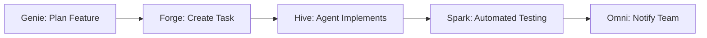
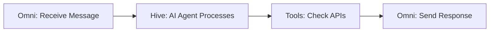
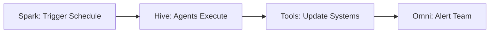

<div style={{ textAlign: 'center', marginBottom: '2rem' }}>
  <h1 style={{ fontSize: '2.5rem', fontWeight: '300', marginBottom: '1rem' }}>
    Start Building with <span style={{ fontWeight: '900', background: 'linear-gradient(to right, #FF00FF, #00FFFF)', WebkitBackgroundClip: 'text', WebkitTextFillColor: 'transparent' }}>Automagik</span>
  </h1>
</div>

## Start with Genie

**The fastest way to get started with AI-powered development:**

```bash
bash -c "$(curl -fsSL https://install.namastex.ai/get-genie.sh)"
```

This one command installs:
- ✅ Genie CLI
- ✅ Forge Backend
- ✅ MCP Server
- ✅ 44 AI Agents

<Card title="Continue to Genie Quick Start" icon="rocket" href="/genie/quickstart">
  Get up and running in 5 minutes
</Card>

---

## Add Python Tools (Optional)

After you have Genie running, add specialized capabilities:

<CardGroup cols={2}>
  <Card title="🐝 Hive" href="/hive/quickstart">
    **Multi-Agent Teams**

    Production-ready AI teams in YAML

    Install: `pip install automagik-hive`
  </Card>

  <Card title="📱 Omni" href="/omni/quickstart">
    **Messaging Automation**

    Connect AI to WhatsApp, Discord, Slack

    Install: `pip install automagik-omni`
  </Card>

  <Card title="⚡ Spark" href="/spark/quickstart">
    **Scheduled Workflows**

    24/7 automated task execution

    Install: `pip install automagik-spark`
  </Card>

  <Card title="🛠️ Tools" href="/tools/quickstart">
    **MCP Generator**

    Convert APIs to AI tools instantly

    Install: `uvx automagik-tools`
  </Card>
</CardGroup>

---

## The Complete Stack

Here's how the tools work together when you need the full automation suite:

<Steps>
  <Step title="Genie: Your Foundation">
    Start with Genie - includes Forge backend and MCP server.

    ```bash
    bash -c "$(curl -fsSL https://install.namastex.ai/get-genie.sh)"
    cd your-project
    genie
    ```

    ✅ You now have: Genie CLI, Forge Backend, MCP Server, 44 Agents
  </Step>

  <Step title="Hive: Add Python Agent Teams">
    Deploy multi-agent teams for complex workflows.

    ```bash
    pip install automagik-hive
    hive init
    hive start
    ```
  </Step>

  <Step title="Omni: Connect Messaging">
    Enable agents to communicate via WhatsApp, Discord, Slack.

    ```bash
    pip install automagik-omni
    omni init
    omni serve
    ```
  </Step>

  <Step title="Spark: Schedule Automation">
    Add 24/7 scheduled workflows and autonomous execution.

    ```bash
    pip install automagik-spark
    spark init
    spark start
    ```
  </Step>

  <Step title="Tools: Generate MCP Tools">
    Convert any API to AI-ready MCP tools instantly.

    ```bash
    uvx automagik-tools generate --spec https://api.example.com/openapi.json
    ```
  </Step>
</Steps>

---

## Quick Wins

### 5-Minute Wins (Pick One)

<AccordionGroup>
  <Accordion title="Send a WhatsApp Message with AI (Omni)">
    ```bash
    # Install and start
    pip install automagik-omni
    omni init
    omni serve

    # Connect WhatsApp
    omni instance create --name my-whatsapp
    omni instance qr --name my-whatsapp
    # Scan QR code with WhatsApp

    # Send message
    omni send --to "+1234567890" --message "Hello from Omni!"
    ```

    ✅ You just sent your first omnichannel message!
  </Accordion>

  <Accordion title="Generate an API Tool (Tools)">
    ```bash
    # Generate MCP tool from PetStore API
    uvx automagik-tools generate \
      --spec https://petstore3.swagger.io/api/v3/openapi.json \
      --name petstore

    # Serve it
    uvx automagik-tools serve --tools petstore
    ```

    ✅ You just created an AI-ready API tool in 30 seconds!
  </Accordion>

  <Accordion title="Compare AI Models (Forge)">
    ```bash
    # Install Forge
    npm install -g automagik-forge
    forge init

    # Create task with multiple LLMs
    forge task create \
      --title "Add dark mode toggle" \
      --llm claude

    forge task fork 1 --llm gemini

    # Compare results
    forge task compare 1
    ```

    ✅ You just compared Claude vs Gemini on the same task!
  </Accordion>

  <Accordion title="Schedule Daily Reports (Spark)">
    ```bash
    # Install Spark
    pip install automagik-spark
    spark init

    # Create workflow
    cat > workflows/daily-report.yaml <<EOF
    name: daily-report
    schedule: "0 9 * * *"  # 9 AM daily
    tasks:
      - name: generate-report
        type: script
        script: echo "Daily report generated!"
    EOF

    # Start scheduler
    spark start
    ```

    ✅ You just automated a daily workflow!
  </Accordion>
</AccordionGroup>

---

## Common Patterns

### Pattern 1: AI-Powered Development Workflow



**Use Case:** Building features with AI assistance while keeping humans in control.

<Card title="Learn This Pattern" icon="book" href="/forge/quickstart">
  Follow the Forge quickstart to see this in action
</Card>

---

### Pattern 2: Customer Support Automation



**Use Case:** AI-powered customer support across multiple channels.

<Card title="Learn This Pattern" icon="book" href="/omni/quickstart">
  Follow the Omni quickstart to see this in action
</Card>

---

### Pattern 3: Automated Operations



**Use Case:** 24/7 automated operations and monitoring.

<Card title="Learn This Pattern" icon="book" href="/spark/quickstart">
  Follow the Spark quickstart to see this in action
</Card>

---

## Prerequisites

Before getting started, ensure you have:

<AccordionGroup>
  <Accordion title="For NPM Tools (Forge, Genie)">
    - Node.js v18 or higher
    - npm or yarn
    - Git
  </Accordion>

  <Accordion title="For Python Tools (Hive, Omni, Spark, Tools)">
    - Python 3.10 or higher
    - pip or uv
    - Virtual environment (recommended)
  </Accordion>

  <Accordion title="API Keys">
    You'll need API keys for the LLMs you want to use:
    - **Claude**: [Anthropic Console](https://console.anthropic.com)
    - **OpenAI**: [OpenAI Platform](https://platform.openai.com)
    - **Gemini**: [Google AI Studio](https://makersuite.google.com)
  </Accordion>
</AccordionGroup>

---

## Need Help?

<CardGroup cols={2}>
  <Card title="Join Discord" icon="discord" href="https://discord.gg/xcW8c7fF3R">
    Get help from the community and team
  </Card>

  <Card title="View Roadmap" icon="map" href="https://github.com/orgs/namastexlabs/projects/9">
    See what's coming next
  </Card>

  <Card title="Report Issues" icon="github" href="https://github.com/namastexlabs">
    Found a bug? Let us know!
  </Card>

  <Card title="Read Blog" icon="newspaper" href="https://namastex.ai">
    Learn more about our philosophy
  </Card>
</CardGroup>

---

## What's Next?

Now that you know what's available, dive into the tool that matches your needs:

<CardGroup cols={3}>
  <Card title="Forge" icon="hammer" href="/suite/forge">
    AI Orchestration Kanban
  </Card>
  <Card title="Hive" icon="hexagon" href="/suite/hive">
    Multi-Agent Factory
  </Card>
  <Card title="Omni" icon="messages" href="/suite/omni">
    Omnipresent Messaging
  </Card>
  <Card title="Spark" icon="bolt" href="/suite/spark">
    Temporal Automation
  </Card>
  <Card title="Genie" icon="wand-magic-sparkles" href="/suite/genie">
    Universal AI Companion
  </Card>
  <Card title="Tools" icon="wrench" href="/suite/tools">
    Instant MCP Generator
  </Card>
</CardGroup>
