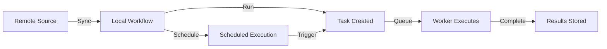

## Overview

Workflows are synced from external sources (LangFlow, Hive, Agents) and stored locally in Spark. Once synced, workflows can be run manually or scheduled for automatic execution.

---

## List Workflows

Retrieve all synced workflows with pagination support.

<ParamField query="limit" type="integer" default="50">
  Number of items per page (min: 1, max: 100)
</ParamField>

<ParamField query="offset" type="integer" default="0">
  Number of items to skip for pagination
</ParamField>

<CodeGroup>

```bash cURL
curl -X GET "http://localhost:8883/api/v1/workflows?limit=10&offset=0" \
  -H "X-API-Key: your-api-key"
```

```python Python
import requests

response = requests.get(
    "http://localhost:8883/api/v1/workflows",
    headers={"X-API-Key": "your-api-key"},
    params={"limit": 10, "offset": 0}
)

workflows = response.json()
```

```javascript JavaScript
const response = await fetch(
  'http://localhost:8883/api/v1/workflows?limit=10&offset=0',
  {
    headers: {
      'X-API-Key': 'your-api-key'
    }
  }
);

const workflows = await response.json();
```

</CodeGroup>

### Response

```json 200 Success
{
  "items": [
    {
      "id": "550e8400-e29b-41d4-a716-446655440000",
      "name": "Daily Report Generator",
      "description": "Generates daily project reports",
      "source": "my-langflow",
      "remote_flow_id": "abc123",
      "flow_version": 1,
      "input_component": "ChatInput-xyz",
      "output_component": "ChatOutput-abc",
      "is_component": false,
      "folder_id": null,
      "folder_name": null,
      "icon": "FileText",
      "icon_bg_color": "#4CAF50",
      "liked": false,
      "tags": ["reporting", "automation"],
      "created_at": "2025-11-04T12:00:00Z",
      "updated_at": "2025-11-04T12:00:00Z",
      "latest_run": "SUCCESS",
      "task_count": 15,
      "failed_task_count": 2
    }
  ],
  "total": 1,
  "limit": 10,
  "offset": 0,
  "has_more": false
}
```

<Tip>
**Status Indicators**:
- `latest_run`: Status of most recent task (`NEW`, `PENDING`, `RUNNING`, `SUCCESS`, `FAILED`)
- `task_count`: Total number of tasks executed
- `failed_task_count`: Number of failed tasks
</Tip>

---

## Get Workflow

Retrieve a specific workflow by ID, including full workflow data.

<ParamField path="workflow_id" type="uuid" required>
  UUID of the workflow to retrieve
</ParamField>

<CodeGroup>

```bash cURL
curl -X GET http://localhost:8883/api/v1/workflows/550e8400-e29b-41d4-a716-446655440000 \
  -H "X-API-Key: your-api-key"
```

```python Python
import requests

workflow_id = "550e8400-e29b-41d4-a716-446655440000"

response = requests.get(
    f"http://localhost:8883/api/v1/workflows/{workflow_id}",
    headers={"X-API-Key": "your-api-key"}
)

workflow = response.json()
```

</CodeGroup>

### Response

```json 200 Success
{
  "id": "550e8400-e29b-41d4-a716-446655440000",
  "name": "Daily Report Generator",
  "description": "Generates daily project reports",
  "source": "my-langflow",
  "remote_flow_id": "abc123",
  "flow_version": 1,
  "input_component": "ChatInput-xyz",
  "output_component": "ChatOutput-abc",
  "is_component": false,
  "folder_id": null,
  "folder_name": null,
  "icon": "FileText",
  "icon_bg_color": "#4CAF50",
  "liked": false,
  "tags": ["reporting", "automation"],
  "data": {
    "nodes": [...],
    "edges": [...],
    "viewport": {...}
  },
  "created_at": "2025-11-04T12:00:00Z",
  "updated_at": "2025-11-04T12:00:00Z"
}
```

```json 404 Not Found
{
  "detail": "Workflow not found"
}
```

<Warning>
**Full Data**: The `data` field contains the complete workflow definition (nodes, edges, etc.). This can be large for complex workflows.
</Warning>

---

## List Remote Flows

List all workflows available from external sources **without syncing** them locally. Use this to browse available workflows before syncing.

<ParamField query="simplified" type="boolean" default="true">
  Return simplified view (only essential fields) or full workflow data
</ParamField>

<ParamField query="source_url" type="string" optional>
  Filter by specific source URL or source name
</ParamField>

<CodeGroup>

```bash cURL
curl -X GET "http://localhost:8883/api/v1/workflows/remote?simplified=true" \
  -H "X-API-Key: your-api-key"
```

```python Python
import requests

response = requests.get(
    "http://localhost:8883/api/v1/workflows/remote",
    headers={"X-API-Key": "your-api-key"},
    params={
        "simplified": True,
        "source_url": "http://localhost:7860"
    }
)

remote_flows = response.json()
```

</CodeGroup>

### Response

```json 200 Success (Simplified)
[
  {
    "id": "abc123",
    "name": "Customer Support Bot",
    "description": "AI-powered customer support agent",
    "origin": {
      "instance": "my-langflow",
      "source_url": "http://localhost:7860"
    },
    "components": [
      {
        "id": "ChatInput-xyz",
        "name": "ChatInput",
        "description": "User input component"
      },
      {
        "id": "ChatOutput-abc",
        "name": "ChatOutput",
        "description": "Bot response output"
      }
    ]
  }
]
```

```json 200 Success (Full Data)
[
  {
    "id": "abc123",
    "name": "Customer Support Bot",
    "description": "AI-powered customer support agent",
    "instance": "my-langflow",
    "source_url": "http://localhost:7860",
    "data": {
      "nodes": [...],
      "edges": [...],
      "viewport": {...}
    }
  }
]
```

<Tip>
**Performance**: Use `simplified=true` for faster responses when you only need to list available workflows. Use `simplified=false` when you need full workflow details.
</Tip>

---

## Get Remote Flow

Get full details of a specific remote flow **without syncing** it.

<ParamField path="flow_id" type="string" required>
  ID of the remote flow to retrieve
</ParamField>

<ParamField query="source_url" type="string" optional>
  Source URL to get the flow from (required if flow_id exists in multiple sources)
</ParamField>

<CodeGroup>

```bash cURL
curl -X GET "http://localhost:8883/api/v1/workflows/remote/abc123?source_url=http://localhost:7860" \
  -H "X-API-Key: your-api-key"
```

```python Python
import requests

flow_id = "abc123"

response = requests.get(
    f"http://localhost:8883/api/v1/workflows/remote/{flow_id}",
    headers={"X-API-Key": "your-api-key"},
    params={"source_url": "http://localhost:7860"}
)

flow = response.json()
```

</CodeGroup>

### Response

```json 200 Success
{
  "id": "abc123",
  "name": "Customer Support Bot",
  "description": "AI-powered customer support agent",
  "instance": "my-langflow",
  "source_url": "http://localhost:7860",
  "data": {
    "nodes": [...],
    "edges": [...],
    "viewport": {...}
  }
}
```

```json 404 Not Found
{
  "detail": "Flow abc123 not found in source http://localhost:7860"
}
```

---

## Sync Flow

Sync a remote workflow into Spark's local database. This creates a local copy that can be scheduled and executed.

<ParamField path="flow_id" type="string" required>
  ID of the remote flow to sync
</ParamField>

<ParamField query="source_url" type="string" required>
  URL of the workflow source (e.g., `http://localhost:7860`)
</ParamField>

<ParamField query="input_component" type="string" optional>
  ID of the input component (auto-detected if not provided)
</ParamField>

<ParamField query="output_component" type="string" optional>
  ID of the output component (auto-detected if not provided)
</ParamField>

<CodeGroup>

```bash cURL
curl -X POST "http://localhost:8883/api/v1/workflows/sync/abc123?source_url=http://localhost:7860" \
  -H "X-API-Key: your-api-key"
```

```bash cURL (with explicit components)
curl -X POST "http://localhost:8883/api/v1/workflows/sync/abc123?source_url=http://localhost:7860&input_component=ChatInput-xyz&output_component=ChatOutput-abc" \
  -H "X-API-Key: your-api-key"
```

```python Python
import requests

flow_id = "abc123"
source_url = "http://localhost:7860"

response = requests.post(
    f"http://localhost:8883/api/v1/workflows/sync/{flow_id}",
    headers={"X-API-Key": "your-api-key"},
    params={
        "source_url": source_url,
        "input_component": "ChatInput-xyz",
        "output_component": "ChatOutput-abc"
    }
)

workflow = response.json()
```

</CodeGroup>

### Response

```json 200 Success
{
  "id": "550e8400-e29b-41d4-a716-446655440000",
  "name": "Customer Support Bot",
  "description": "AI-powered customer support agent",
  "source": "my-langflow",
  "remote_flow_id": "abc123",
  "flow_version": 1,
  "input_component": "ChatInput-xyz",
  "output_component": "ChatOutput-abc",
  "is_component": false,
  "created_at": "2025-11-04T12:00:00Z",
  "updated_at": "2025-11-04T12:00:00Z"
}
```

```json 404 Not Found
{
  "detail": "Flow abc123 not found"
}
```

<Warning>
**Component Detection**: Spark automatically detects input/output components based on source type:
- **LangFlow**: Looks for `ChatInput` and `ChatOutput` components
- **Hive**: Uses source-specific defaults
- **Agents**: Uses source-specific defaults

Specify components manually if auto-detection fails.
</Warning>

---

## Run Workflow

Execute a workflow immediately with the provided input data. This creates a task that is queued for execution by workers.

<ParamField path="workflow_id" type="uuid" required>
  UUID of the workflow to run
</ParamField>

<ParamField body="input_data" type="string" required>
  Input string to pass to the workflow's input component
</ParamField>

<CodeGroup>

```bash cURL
curl -X POST http://localhost:8883/api/v1/workflows/550e8400-e29b-41d4-a716-446655440000/run \
  -H "Content-Type: application/json" \
  -H "X-API-Key: your-api-key" \
  -d '"Generate a report for today"'
```

```python Python
import requests

workflow_id = "550e8400-e29b-41d4-a716-446655440000"
input_text = "Generate a report for today"

response = requests.post(
    f"http://localhost:8883/api/v1/workflows/{workflow_id}/run",
    headers={
        "Content-Type": "application/json",
        "X-API-Key": "your-api-key"
    },
    json=input_text
)

task = response.json()
```

```javascript JavaScript
const workflowId = '550e8400-e29b-41d4-a716-446655440000';
const inputText = 'Generate a report for today';

const response = await fetch(
  `http://localhost:8883/api/v1/workflows/${workflowId}/run`,
  {
    method: 'POST',
    headers: {
      'Content-Type': 'application/json',
      'X-API-Key': 'your-api-key'
    },
    body: JSON.stringify(inputText)
  }
);

const task = await response.json();
```

</CodeGroup>

### Response

```json 200 Success
{
  "id": "660e8400-e29b-41d4-a716-446655440001",
  "workflow_id": "550e8400-e29b-41d4-a716-446655440000",
  "status": "pending",
  "input_data": {
    "value": "Generate a report for today"
  },
  "output_data": null,
  "error": null,
  "tries": 0,
  "max_retries": 3,
  "next_retry_at": null,
  "started_at": null,
  "finished_at": null,
  "created_at": "2025-11-04T12:00:00Z",
  "updated_at": "2025-11-04T12:00:00Z"
}
```

```json 404 Not Found
{
  "detail": "Workflow not found"
}
```

```json 400 Bad Request
{
  "detail": "Error running workflow: [error details]"
}
```

<Tip>
**Task Status**: The workflow is executed asynchronously. Use the returned task ID to check execution status via the [Tasks API](/spark/api/tasks).
</Tip>

---

## Delete Workflow

Delete a local workflow. This does **not** delete the workflow from the remote source, only from Spark's local database.

<ParamField path="workflow_id" type="uuid" required>
  UUID of the workflow to delete
</ParamField>

<CodeGroup>

```bash cURL
curl -X DELETE http://localhost:8883/api/v1/workflows/550e8400-e29b-41d4-a716-446655440000 \
  -H "X-API-Key: your-api-key"
```

```python Python
import requests

workflow_id = "550e8400-e29b-41d4-a716-446655440000"

response = requests.delete(
    f"http://localhost:8883/api/v1/workflows/{workflow_id}",
    headers={"X-API-Key": "your-api-key"}
)

result = response.json()
```

</CodeGroup>

### Response

```json 200 Success
{
  "success": true
}
```

```json 404 Not Found
{
  "detail": "Workflow not found"
}
```

<Warning>
**Cascade Impact**: Deleting a workflow will also delete all associated schedules and tasks. This action cannot be undone.
</Warning>

---

## Error Codes

| Status | Detail | Cause |
|--------|--------|-------|
| **400** | Error running workflow | Invalid input data or execution error |
| **404** | Workflow not found | Invalid workflow ID or workflow was deleted |
| **404** | Flow not found | Remote flow ID does not exist in source |
| **401** | Invalid API key | Missing or incorrect X-API-Key header |

---

## Workflow Lifecycle



1. **Discover**: List remote flows from sources
2. **Sync**: Copy workflow to local database
3. **Run**: Execute manually or via schedule
4. **Monitor**: Track execution via tasks

---

## Next Steps

<CardGroup cols={2}>
  <Card title="Schedules API" icon="clock" href="/spark/api/schedules">
    Schedule workflows to run automatically
  </Card>

  <Card title="Tasks API" icon="play" href="/spark/api/tasks">
    Monitor workflow execution results
  </Card>

  <Card title="Sources API" icon="database" href="/spark/api/sources">
    Manage workflow sources
  </Card>

  <Card title="CLI: Workflows" icon="terminal" href="/spark/cli/commands#workflows">
    Manage workflows via command line
  </Card>
</CardGroup>
