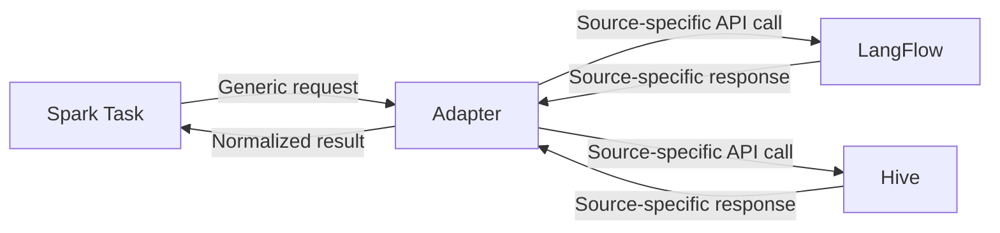

## Overview

Spark's **adapter system** provides a unified interface for executing workflows across different sources (LangFlow, Hive, etc.). Adapters handle the complexity of source-specific APIs, input/output formats, and authentication, allowing Spark to work with multiple workflow platforms seamlessly.

## What Adapters Do

Adapters serve as translators between Spark's generic task model and source-specific APIs:



### Key Responsibilities

1. **API Communication**: Handle HTTP requests to workflow sources
2. **Input Transformation**: Convert Spark's input data to source-specific format
3. **Output Normalization**: Convert source responses to unified format
4. **Authentication**: Manage API keys and authentication headers
5. **Error Handling**: Catch and normalize errors across sources
6. **Flow Discovery**: List and retrieve workflows from sources

## Common Adapter Interface

All adapters inherit from `BaseWorkflowAdapter` ([source](https://github.com/automagik-labs/automagik-spark/blob/main/automagik_spark/core/workflows/adapters/base.py)):

```python
class BaseWorkflowAdapter(ABC):
    """Abstract base adapter for workflow sources."""

    def __init__(self, api_url: str, api_key: str, source_id: Optional[Any] = None):
        self.api_url = api_url
        self.api_key = api_key
        self.source_id = source_id

    @property
    @abstractmethod
    def source_type(self) -> str:
        """Return the source type identifier."""
        pass

    @abstractmethod
    def list_flows_sync(self) -> List[Dict[str, Any]]:
        """List available flows from this source."""
        pass

    @abstractmethod
    def get_flow_sync(self, flow_id: str) -> Optional[Dict[str, Any]]:
        """Get a specific flow by ID."""
        pass

    @abstractmethod
    def run_flow_sync(
        self,
        flow_id: str,
        input_data: Any,
        session_id: Optional[str] = None
    ) -> WorkflowExecutionResult:
        """Execute a flow and return normalized result."""
        pass

    @abstractmethod
    async def validate(self) -> Dict[str, Any]:
        """Validate connection to the source."""
        pass
```

### Unified Result Format

All adapters return a `WorkflowExecutionResult`:

```python
@dataclass
class WorkflowExecutionResult:
    """Unified result format across all workflow sources."""

    success: bool                           # Execution succeeded?
    result: Any                            # The actual response content
    session_id: Optional[str] = None       # Session ID for tracking
    run_id: Optional[str] = None          # Execution run ID
    metadata: Dict[str, Any] = field(default_factory=dict)  # Source-specific metadata
    error: Optional[str] = None           # Error message if failed
```

This ensures consistent handling regardless of the workflow source.

## LangFlow Adapter

The LangFlow adapter ([source](https://github.com/automagik-labs/automagik-spark/blob/main/automagik_spark/core/workflows/adapters/langflow_adapter.py)) handles **component-based workflows** where inputs and outputs are tied to specific components.

### Component-Based I/O

LangFlow flows consist of connected components (nodes):

```
┌─────────────┐    ┌──────────────┐    ┌──────────────┐
│  ChatInput  │───→│  LLM Model   │───→│  ChatOutput  │
│  (Input)    │    │  (Processing)│    │  (Output)    │
└─────────────┘    └──────────────┘    └──────────────┘
```

When syncing a LangFlow flow, Spark needs to know:
- **input_component**: ID of the component that receives input (e.g., `ChatInput-abc123`)
- **output_component**: ID of the component that produces output (e.g., `ChatOutput-xyz789`)

### Auto-Detection

The LangFlow adapter automatically detects input/output components:

```python
def get_default_sync_params(self, flow_data: Dict[str, Any]) -> Dict[str, Optional[str]]:
    """Auto-detect input/output components from flow data."""
    input_component = None
    output_component = None

    if "data" in flow_data and "nodes" in flow_data["data"]:
        nodes = flow_data["data"]["nodes"]

        # Look for ChatInput component
        input_node = next(
            (n for n in nodes if n.get("data", {}).get("type") == "ChatInput"),
            None
        )
        if input_node:
            input_component = input_node.get("id")

        # Look for ChatOutput component
        output_node = next(
            (n for n in nodes if n.get("data", {}).get("type") == "ChatOutput"),
            None
        )
        if output_node:
            output_component = output_node.get("id")

    return {
        "input_component": input_component,
        "output_component": output_component,
    }
```

### Flow Execution

When executing a LangFlow workflow:

```python
def run_flow_sync(
    self,
    flow_id: str,
    input_data: Any,
    session_id: Optional[str] = None
) -> WorkflowExecutionResult:
    """Execute a LangFlow flow."""
    # LangFlowManager handles the actual API call
    result = self.manager.run_workflow_sync(flow_id, input_data)

    return WorkflowExecutionResult(
        success=True,
        result=result,
        session_id=session_id,
        metadata={}
    )
```

### API Communication

The underlying `LangFlowManager` makes HTTP requests:

```python
# Simplified from LangFlowManager.run_workflow_sync()
response = requests.post(
    f"{self.api_url}/api/v1/run/{flow_id}",
    headers={
        "Content-Type": "application/json",
        "x-api-key": self.api_key
    },
    json={
        "input_value": input_data,
        "input_type": "chat",
        "output_type": "chat",
        "tweaks": {}
    }
)

# Returns JSON with outputs from all components
return response.json()
```

### Input/Output Example

**Spark Input**:
```json
"What is the weather in San Francisco?"
```

**LangFlow API Request**:
```json
{
  "input_value": "What is the weather in San Francisco?",
  "input_type": "chat",
  "output_type": "chat",
  "tweaks": {}
}
```

**LangFlow API Response**:
```json
{
  "outputs": [
    {
      "component_id": "ChatOutput-xyz789",
      "result": "The weather in San Francisco is sunny with a high of 68°F"
    }
  ]
}
```

**Spark Output** (stored in `task.output_data`):
```json
{
  "outputs": [
    {
      "component_id": "ChatOutput-xyz789",
      "result": "The weather in San Francisco is sunny with a high of 68°F"
    }
  ]
}
```

## Hive Adapter

The Hive adapter ([source](https://github.com/automagik-labs/automagik-spark/blob/main/automagik_spark/core/workflows/adapters/hive_adapter.py)) handles **three different entity types**: agents, teams, and workflows, each with distinct APIs.

### Agent vs Team vs Workflow

Hive supports three types of executable entities:

| Entity | Description | API Endpoint | Use Case |
|--------|-------------|--------------|----------|
| **Agent** | Single AI agent with tools | `/api/v1/agents/{id}/run` | Individual task execution |
| **Team** | Multiple agents working together | `/api/v1/teams/{id}/run` | Collaborative task solving |
| **Workflow** | Multi-step orchestrated process | `/api/v1/workflows/{id}/run` | Complex multi-stage tasks |

### API Variations

Each entity type has a different execution endpoint:

```python
# Agent execution
POST /api/v1/agents/{agent_id}/run
{
  "prompt": "What is the weather?",
  "session_id": "task-123"
}

# Team execution
POST /api/v1/teams/{team_id}/run
{
  "prompt": "Research and summarize recent AI news",
  "session_id": "task-123"
}

# Workflow execution
POST /api/v1/workflows/{workflow_id}/run
{
  "input": "Process quarterly sales data",
  "session_id": "task-123"
}
```

### Unified Execution

The Hive adapter handles all three types through a single interface:

```python
def run_flow_sync(
    self,
    flow_id: str,
    input_data: Any,
    session_id: Optional[str] = None
) -> WorkflowExecutionResult:
    """Execute a Hive flow (agent/team/workflow)."""
    # HiveManager determines entity type and calls appropriate endpoint
    result = self.manager.run_flow_sync(flow_id, input_data, session_id)

    # Extract relevant information
    return WorkflowExecutionResult(
        success=result.get("success", True),
        result=result.get("result"),
        session_id=result.get("session_id", session_id),
        run_id=result.get("run_id"),
        metadata={
            "agent_id": result.get("agent_id"),
            "team_id": result.get("team_id"),
            "workflow_id": result.get("workflow_id"),
            "status": result.get("status"),
            "coordinator_response": result.get("coordinator_response"),
            "member_responses": result.get("member_responses"),
            "steps_completed": result.get("steps_completed"),
            "final_output": result.get("final_output"),
        },
    )
```

### Response Normalization

Hive returns different response structures for each entity type:

**Agent Response**:
```json
{
  "agent_id": "weather-agent",
  "result": "The weather is sunny",
  "session_id": "task-123",
  "status": "completed"
}
```

**Team Response**:
```json
{
  "team_id": "research-team",
  "coordinator_response": "Task delegation complete",
  "member_responses": [
    {"agent": "researcher", "result": "Found 3 articles"},
    {"agent": "summarizer", "result": "Summary: ..."}
  ],
  "final_output": "AI news summary: ...",
  "status": "completed"
}
```

**Workflow Response**:
```json
{
  "workflow_id": "sales-workflow",
  "steps_completed": 5,
  "final_output": "Sales analysis complete",
  "status": "completed"
}
```

The adapter normalizes these into a consistent `WorkflowExecutionResult` that Spark can process uniformly.

### Default Sync Parameters

Unlike LangFlow, Hive doesn't use component IDs:

```python
def get_default_sync_params(self, flow_data: Dict[str, Any]) -> Dict[str, Optional[str]]:
    """Hive uses simple message/result convention."""
    return {
        "input_component": "message",
        "output_component": "result"
    }
```

## Comparison Table

### LangFlow vs Hive Adapter Behavior

| Feature | LangFlow Adapter | Hive Adapter |
|---------|-----------------|--------------|
| **Source Type** | `langflow` | `automagik-hive` |
| **Entity Types** | Single type (Flow) | Three types (Agent, Team, Workflow) |
| **Component IDs** | Required (auto-detected) | Not used |
| **Input Format** | `input_value` + component ID | `prompt` or `input` |
| **Output Structure** | Component outputs array | Entity-specific response |
| **Session Tracking** | Optional | Recommended |
| **Metadata** | Minimal | Rich (coordinator, members, steps) |
| **API Authentication** | `x-api-key` header | `Authorization: Bearer` header |

### API Request Comparison

**LangFlow**:
```bash
curl -X POST http://langflow:7860/api/v1/run/{flow_id} \
  -H "x-api-key: sk-abc123" \
  -H "Content-Type: application/json" \
  -d '{
    "input_value": "Hello",
    "input_type": "chat",
    "output_type": "chat"
  }'
```

**Hive**:
```bash
curl -X POST http://hive:8000/api/v1/agents/{agent_id}/run \
  -H "Authorization: Bearer sk-xyz789" \
  -H "Content-Type: application/json" \
  -d '{
    "prompt": "Hello",
    "session_id": "task-123"
  }'
```

## Adapter Registration

Adapters are registered in the `AdapterRegistry` ([source](https://github.com/automagik-labs/automagik-spark/blob/main/automagik_spark/core/workflows/adapters/registry.py)):

```python
class AdapterRegistry:
    """Registry for workflow adapters."""

    _adapters: Dict[str, Type[BaseWorkflowAdapter]] = {
        "langflow": LangFlowAdapter,
        "automagik-hive": HiveAdapter,
        # Add custom adapters here
    }

    @classmethod
    def get_adapter(
        cls,
        source_type: str,
        api_url: str,
        api_key: str,
        source_id: Optional[Any] = None
    ) -> BaseWorkflowAdapter:
        """Get adapter instance for a source type."""
        adapter_class = cls._adapters.get(source_type)
        if not adapter_class:
            raise ValueError(f"No adapter registered for source type: {source_type}")

        return adapter_class(api_url, api_key, source_id)

    @classmethod
    def register_adapter(cls, source_type: str, adapter_class: Type[BaseWorkflowAdapter]):
        """Register a new adapter."""
        cls._adapters[source_type] = adapter_class
```

## When to Create Custom Adapters

You should create a custom adapter when:

1. **Integrating a new workflow platform** (e.g., n8n, Zapier, custom system)
2. **Source has unique authentication** not covered by standard API keys
3. **Complex input/output transformation** required
4. **Custom error handling** needed for specific source behavior
5. **Source requires special configuration** (webhooks, polling, etc.)

### Custom Adapter Example

Here's a skeleton for a custom adapter:

```python
from typing import Dict, List, Optional, Any
from .base import BaseWorkflowAdapter, WorkflowExecutionResult

class CustomSourceAdapter(BaseWorkflowAdapter):
    """Adapter for custom workflow source."""

    @property
    def source_type(self) -> str:
        return "custom-source"

    def list_flows_sync(self) -> List[Dict[str, Any]]:
        """List flows from custom source."""
        response = requests.get(
            f"{self.api_url}/api/workflows",
            headers={"Authorization": f"Bearer {self.api_key}"}
        )
        return response.json()["workflows"]

    def get_flow_sync(self, flow_id: str) -> Optional[Dict[str, Any]]:
        """Get specific flow."""
        response = requests.get(
            f"{self.api_url}/api/workflows/{flow_id}",
            headers={"Authorization": f"Bearer {self.api_key}"}
        )
        return response.json()

    def run_flow_sync(
        self,
        flow_id: str,
        input_data: Any,
        session_id: Optional[str] = None
    ) -> WorkflowExecutionResult:
        """Execute flow."""
        try:
            response = requests.post(
                f"{self.api_url}/api/workflows/{flow_id}/execute",
                headers={"Authorization": f"Bearer {self.api_key}"},
                json={"input": input_data, "session": session_id}
            )

            result = response.json()
            return WorkflowExecutionResult(
                success=True,
                result=result["output"],
                session_id=session_id,
                metadata={"execution_id": result["id"]}
            )
        except Exception as e:
            return WorkflowExecutionResult(
                success=False,
                result=None,
                error=str(e)
            )

    async def validate(self) -> Dict[str, Any]:
        """Validate connection."""
        try:
            response = requests.get(
                f"{self.api_url}/api/health",
                headers={"Authorization": f"Bearer {self.api_key}"}
            )
            return {"status": "success", "service": "CustomSource"}
        except Exception as e:
            raise ConnectionError(f"Validation failed: {e}")
```

### Register Custom Adapter

```python
# In your Spark initialization
from automagik_spark.core.workflows.adapters import AdapterRegistry
from .custom_adapter import CustomSourceAdapter

AdapterRegistry.register_adapter("custom-source", CustomSourceAdapter)
```

Now you can add sources with `type="custom-source"`:

```bash
automagik-spark sources add \
  --name my-custom-source \
  --type custom-source \
  --url http://custom-source:8080 \
  --api-key sk-custom123
```

## Error Handling Patterns

Adapters should catch and normalize errors:

### Connection Errors

```python
try:
    response = requests.post(url, json=data, timeout=30)
except requests.exceptions.ConnectionError as e:
    return WorkflowExecutionResult(
        success=False,
        error=f"Connection failed: {e}"
    )
except requests.exceptions.Timeout as e:
    return WorkflowExecutionResult(
        success=False,
        error=f"Request timed out: {e}"
    )
```

### Authentication Errors

```python
if response.status_code == 401:
    return WorkflowExecutionResult(
        success=False,
        error="Authentication failed: Invalid API key"
    )
elif response.status_code == 403:
    return WorkflowExecutionResult(
        success=False,
        error="Authorization failed: Insufficient permissions"
    )
```

### Workflow Errors

```python
result = response.json()
if result.get("status") == "error":
    return WorkflowExecutionResult(
        success=False,
        error=f"Workflow execution failed: {result.get('message')}"
    )
```

## Testing Strategy

When creating custom adapters, test:

1. **Connection**: `validate()` method works
2. **Discovery**: `list_flows_sync()` returns flows
3. **Retrieval**: `get_flow_sync()` fetches individual flows
4. **Execution**: `run_flow_sync()` executes and returns results
5. **Error handling**: All error types are caught and normalized

### Example Test

```python
def test_custom_adapter():
    adapter = CustomSourceAdapter(
        api_url="http://test-source:8080",
        api_key="test-key"
    )

    # Test connection
    result = await adapter.validate()
    assert result["status"] == "success"

    # Test listing flows
    flows = adapter.list_flows_sync()
    assert len(flows) > 0

    # Test execution
    result = adapter.run_flow_sync(
        flow_id="test-flow",
        input_data="test input"
    )
    assert result.success == True
    assert result.result is not None
```

## Performance Considerations

### HTTP Client Reuse

Adapters should reuse HTTP clients:

```python
class MyAdapter(BaseWorkflowAdapter):
    def __init__(self, api_url: str, api_key: str, source_id: Optional[Any] = None):
        super().__init__(api_url, api_key, source_id)
        self.client = requests.Session()  # Reuse connection
        self.client.headers.update({"Authorization": f"Bearer {api_key}"})

    def __exit__(self, exc_type, exc_val, exc_tb):
        self.client.close()
```

### Timeout Configuration

Always set timeouts:

```python
response = requests.post(
    url,
    json=data,
    timeout=30  # 30 second timeout
)
```

### Connection Pooling

For high-volume workloads, configure connection pools:

```python
from requests.adapters import HTTPAdapter
from requests.packages.urllib3.util.retry import Retry

session = requests.Session()
retry = Retry(total=3, backoff_factor=0.5)
adapter = HTTPAdapter(pool_connections=10, pool_maxsize=20, max_retries=retry)
session.mount('http://', adapter)
session.mount('https://', adapter)
```

## Source Code References

- **BaseWorkflowAdapter**: [`automagik_spark/core/workflows/adapters/base.py`](https://github.com/automagik-labs/automagik-spark/blob/main/automagik_spark/core/workflows/adapters/base.py)
- **LangFlowAdapter**: [`automagik_spark/core/workflows/adapters/langflow_adapter.py`](https://github.com/automagik-labs/automagik-spark/blob/main/automagik_spark/core/workflows/adapters/langflow_adapter.py)
- **HiveAdapter**: [`automagik_spark/core/workflows/adapters/hive_adapter.py`](https://github.com/automagik-labs/automagik-spark/blob/main/automagik_spark/core/workflows/adapters/hive_adapter.py)
- **AdapterRegistry**: [`automagik_spark/core/workflows/adapters/registry.py`](https://github.com/automagik-labs/automagik-spark/blob/main/automagik_spark/core/workflows/adapters/registry.py)

## Next Steps

- Learn about [Task Execution](/spark/concepts/task-execution) to see how adapters are invoked
- See [Scheduling Internals](/spark/concepts/scheduling-internals) for the complete workflow execution flow
- Explore [Custom Adapters](/spark/advanced/custom-adapters) for detailed custom adapter development guide
