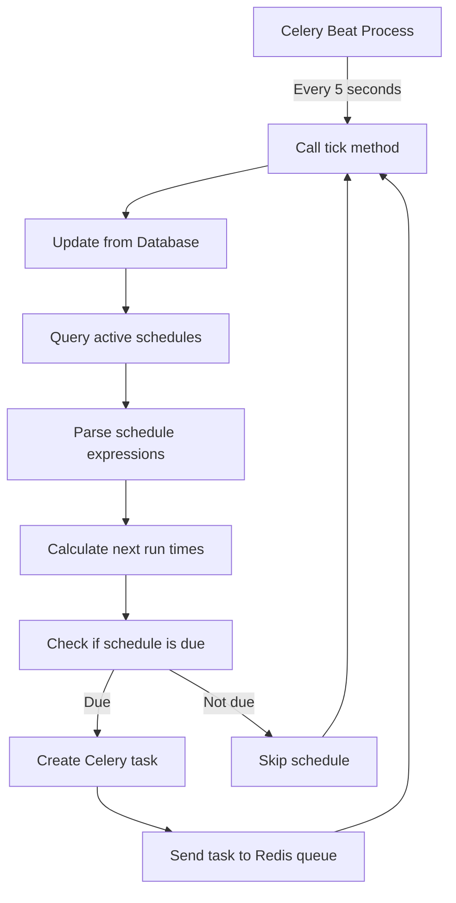
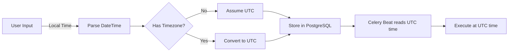
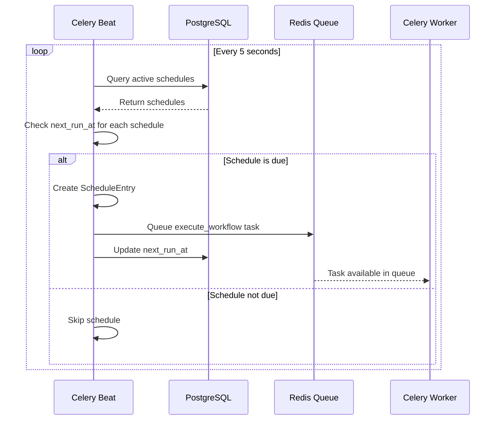

## Overview

Spark's scheduling system is built on **Celery Beat**, which continuously monitors schedules stored in PostgreSQL and triggers task execution when schedules are due. This document explains the complete flow from schedule creation to task execution.

## Key Components

### Database Scheduler

The heart of Spark's scheduling system is the `DatabaseScheduler` class ([source](https://github.com/automagik-labs/automagik-spark/blob/main/automagik_spark/core/celery/scheduler.py)), which extends Celery's base `Scheduler` class to load schedules directly from the PostgreSQL database instead of using a file-based schedule.

**Why database-backed scheduling?**
- Dynamic schedules can be added/updated without restarting the beat process
- Multiple beat instances can read from the same database (high availability)
- Schedule state is persistent across restarts
- Integration with the rest of Spark's data model

## Schedule Monitoring Loop

Celery Beat runs a continuous loop that checks schedules every **5 seconds** (configured via `beat_max_loop_interval`):



### The Tick Method

The `tick()` method in `DatabaseScheduler` is called by Celery Beat every 5 seconds:

```python
def tick(self, *args, **kwargs):
    """Called by the beat service periodically."""
    self.update_from_database()
    result = super().tick(*args, **kwargs)
    return result
```

This method:
1. **Refreshes schedules** from the database
2. **Delegates to parent** Celery's `Scheduler.tick()` to evaluate schedules
3. **Returns control** back to the beat process

## Schedule Types Compared

Spark supports three types of schedules, each with different behavior:

| Type | Expression Format | Example | Next Run Calculation | Use Case |
|------|------------------|---------|---------------------|----------|
| **interval** | `{value}{unit}` where unit is `m`, `h`, or `d` | `30m`, `2h`, `1d` | Current time + interval | Regular recurring tasks |
| **cron** | Standard 5-part cron expression | `0 9 * * 1-5` (9am weekdays) | Next cron match from current time | Complex schedules with specific timing |
| **one-time** | ISO datetime or `now` | `2024-12-25T09:00:00Z` or `now` | Scheduled time (or immediate) | One-off task execution |

### Interval Schedules

Interval schedules are parsed and converted to seconds:

```python
# Parse interval string (e.g., "30m")
value = int(schedule_expr[:-1])  # Extract numeric value
unit = schedule_expr[-1]          # Extract unit (m, h, d)

# Convert to seconds
seconds = {
    "m": lambda x: x * 60,       # minutes
    "h": lambda x: x * 3600,     # hours
    "d": lambda x: x * 86400,    # days
}.get(unit)(value)

# Calculate next run
now = datetime.now(timezone.utc)
next_run = now + timedelta(seconds=seconds)
```

**Important**: Interval schedules are **relative** - if a schedule fires at 10:00 with a 30-minute interval, the next run will be 10:30, then 11:00, etc.

### Cron Schedules

Cron expressions use the standard 5-part format:

```
┌───────────── minute (0 - 59)
│ ┌───────────── hour (0 - 23)
│ │ ┌───────────── day of month (1 - 31)
│ │ │ ┌───────────── month (1 - 12)
│ │ │ │ ┌───────────── day of week (0 - 6) (Sunday to Saturday)
│ │ │ │ │
* * * * *
```

Spark uses the **croniter** library to parse cron expressions:

```python
from croniter import croniter

# Calculate next run from cron expression
now = datetime.now(timezone.utc)
cron = croniter(schedule_expr, now)
next_run = cron.get_next(datetime)
```

**Examples**:
- `0 9 * * *` - Daily at 9:00 AM UTC
- `0 */2 * * *` - Every 2 hours
- `0 9 * * 1-5` - Weekdays at 9:00 AM
- `*/15 * * * *` - Every 15 minutes

### One-Time Schedules

One-time schedules execute once at a specific time:

```python
if schedule_expr.lower() == "now":
    # Execute immediately (with 2-second buffer)
    run_time = datetime.now(timezone.utc) + timedelta(seconds=2)
else:
    # Parse datetime string
    run_time = parser.parse(schedule_expr)
    if not run_time.tzinfo:
        # Assume local timezone if not specified
        run_time = run_time.replace(tzinfo=timezone.utc)
```

**After execution**: One-time schedules remain in the database with `status="active"` but will not trigger again since their scheduled time has passed.

## Cron Expression Parsing

Spark uses the **croniter** library to validate and parse cron expressions. The validation happens at schedule creation time:

```python
def _validate_cron(self, cron: str) -> bool:
    """Validate cron expression."""
    try:
        croniter(cron)
        return True
    except (ValueError, TypeError):
        return False
```

If a cron expression is invalid, schedule creation fails with an error.

### Common Cron Patterns

```bash
# Every minute
* * * * *

# Every hour at minute 0
0 * * * *

# Daily at midnight UTC
0 0 * * *

# Every Monday at 9:00 AM
0 9 * * 1

# First day of every month
0 0 1 * *

# Every weekday at 6:00 PM
0 18 * * 1-5
```

## Timezone Handling

All schedules in Spark are stored and executed in **UTC**. This is critical for consistent behavior across deployments.

### Timezone Conversion Flow



### Configuration

The Celery timezone is configured in `celery_config.py`:

```python
# Get timezone from environment (defaults to UTC)
timezone = os.getenv("AUTOMAGIK_TIMEZONE", "UTC")

config = {
    "timezone": timezone,
    # ... other config
}
```

**Recommendation**: Keep `AUTOMAGIK_TIMEZONE=UTC` unless you have specific requirements. If you need schedules in local time, calculate the UTC equivalent when creating schedules.

## Task Creation from Schedules

When a schedule fires, Celery Beat doesn't directly execute the workflow. Instead, it creates a **Celery task** that gets queued in Redis for workers to process.

### What Happens When a Schedule Fires

1. **Beat detects due schedule** (during tick loop)
2. **Creates ScheduleEntry** with task details:
   ```python
   entry = ScheduleEntry(
       name=f"schedule_{schedule_id}",
       schedule=celery_schedule(timedelta(seconds=seconds)),
       task="automagik_spark.core.tasks.workflow_tasks.execute_workflow",
       args=(schedule_id,),  # Pass schedule ID to task
       kwargs={},
       options={
           "expires": 600,  # Task expires after 10 minutes
           "retry": True,
           "retry_policy": {
               "max_retries": 3,
               "interval_start": 0,
               "interval_step": 0.2,
               "interval_max": 0.2,
           },
       },
       app=self.app,
   )
   ```
3. **Celery sends task to Redis** queue
4. **Worker picks up task** from queue (covered in [Task Execution](/spark/concepts/task-execution))

### Schedule-to-Task Mapping

The relationship between schedules and tasks:

```
Schedule (PostgreSQL) → Celery Task (Redis Queue) → Task Record (PostgreSQL)
     ↓                           ↓                          ↓
  schedule_id              executed by worker       execution results
  schedule_expr                                     (status, output, error)
  next_run_at
```

When the Celery task executes, it:
1. Reads the schedule from the database using `schedule_id`
2. Creates a `Task` database record
3. Executes the workflow associated with the schedule
4. Updates the `Task` record with results
5. Calculates and updates the schedule's `next_run_at`

## Complete Schedule Fire Flow

Here's the complete flow from schedule detection to task queuing:



### Retry Policy

When a task is queued from a schedule, it includes a retry policy:

```python
"retry_policy": {
    "max_retries": 3,        # Retry up to 3 times
    "interval_start": 0,     # Start immediately
    "interval_step": 0.2,    # Increase delay by 0.2s each retry
    "interval_max": 0.2,     # Maximum delay between retries
}
```

This means:
- **Attempt 1**: Execute immediately
- **Attempt 2** (if failed): Wait 0.2 seconds, retry
- **Attempt 3** (if failed): Wait 0.2 seconds, retry
- **Attempt 4** (if failed): Wait 0.2 seconds, retry
- **After 3 retries**: Task fails permanently

## Schedule Updates and Notifications

When you update a schedule through the API or CLI, Spark notifies the beat process to reload schedules immediately instead of waiting for the next tick:

```python
from ..celery_config import notify_scheduler_change

# After creating/updating a schedule
notify_scheduler_change()
```

This calls:

```python
def notify_scheduler_change():
    """Notify the scheduler that schedules have changed."""
    global _scheduler_instance
    if _scheduler_instance is not None:
        _scheduler_instance.update_from_database()
```

This ensures schedule changes take effect within seconds, not minutes.

## Performance Considerations

### Database Queries

Every 5 seconds, Celery Beat queries:
```sql
SELECT * FROM schedules WHERE status = 'active' FOR UPDATE;
```

The `FOR UPDATE` lock ensures:
- Only one beat instance processes each schedule
- No race conditions with simultaneous updates
- Consistent read/write behavior

### Schedule Limits

The 5-second tick interval means:
- **Minimum practical interval**: 5 seconds (though `1m` is recommended minimum)
- **Schedule evaluation overhead**: ~10-50ms for typical deployments
- **Maximum schedules**: Tested with 1000+ active schedules without issues

### High Availability

You can run multiple Celery Beat instances, but:
- Only **one instance should be active** at a time
- Use a **leader election** mechanism (not built into Spark)
- Alternative: Run single beat instance with monitoring/restart

## Debugging Schedules

### Check Schedule Status

View active schedules when beat starts:

```bash
# When you start the beat process, it prints:
Active Schedules
┌────────────────────────────────────────┬─────────────┬──────────┬──────────────────────┬────────┐
│ ID                                     │ Workflow    │ Type     │ Next Run             │ Input  │
├────────────────────────────────────────┼─────────────┼──────────┼──────────────────────┼────────┤
│ 123e4567-e89b-12d3-a456-426614174000   │ My Flow     │ cron     │ 2024-11-05 09:00:00  │ {...}  │
└────────────────────────────────────────┴─────────────┴──────────┴──────────────────────┴────────┘
```

### Schedule Not Firing?

Common issues:

1. **Schedule status is not "active"**
   ```bash
   automagik-spark schedules list
   # Check the status column
   ```

2. **next_run_at is in the past**
   - Beat only fires schedules where `next_run_at <= now`
   - Update the schedule to recalculate `next_run_at`

3. **Beat process not running**
   ```bash
   # Check if beat is running
   ps aux | grep "celery.*beat"

   # Check beat logs
   tail -f /var/log/spark/beat.log
   ```

4. **Invalid cron expression**
   - Beat logs will show: `Invalid cron expression for schedule {id}`
   - Validate your cron expression: https://crontab.guru/

## Source Code References

- **DatabaseScheduler**: [`automagik_spark/core/celery/scheduler.py`](https://github.com/automagik-labs/automagik-spark/blob/main/automagik_spark/core/celery/scheduler.py)
- **SchedulerManager**: [`automagik_spark/core/scheduler/manager.py`](https://github.com/automagik-labs/automagik-spark/blob/main/automagik_spark/core/scheduler/manager.py)
- **Schedule validation**: [`automagik_spark/core/scheduler/utils.py`](https://github.com/automagik-labs/automagik-spark/blob/main/automagik_spark/core/scheduler/utils.py)

## Next Steps

- Learn about [Task Execution](/spark/concepts/task-execution) to understand what happens after a schedule fires
- Explore [Adapter System](/spark/concepts/adapter-system) to see how workflows are executed
- See [Scaling Production](/spark/advanced/scaling-production) for running multiple workers
