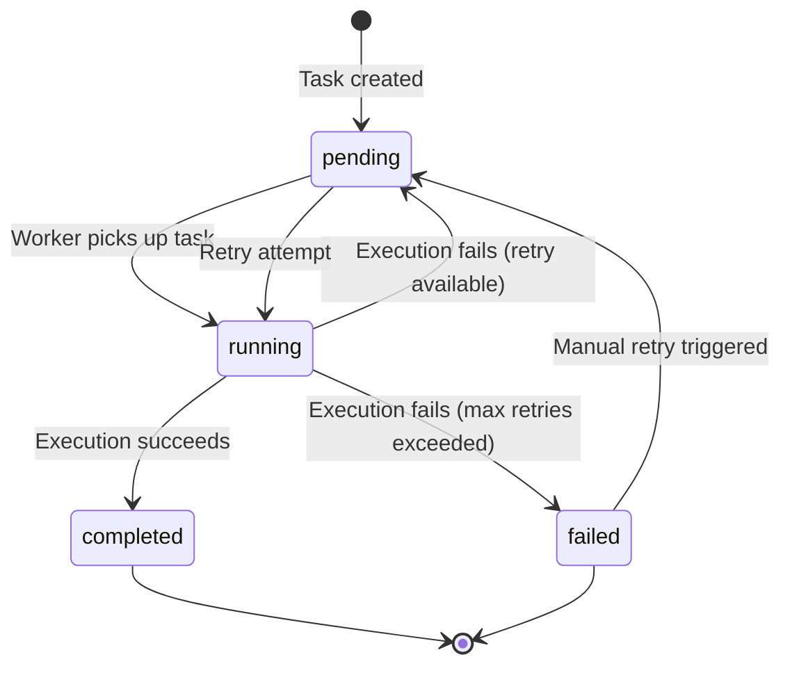
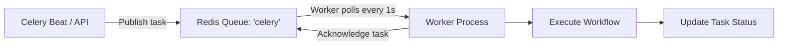
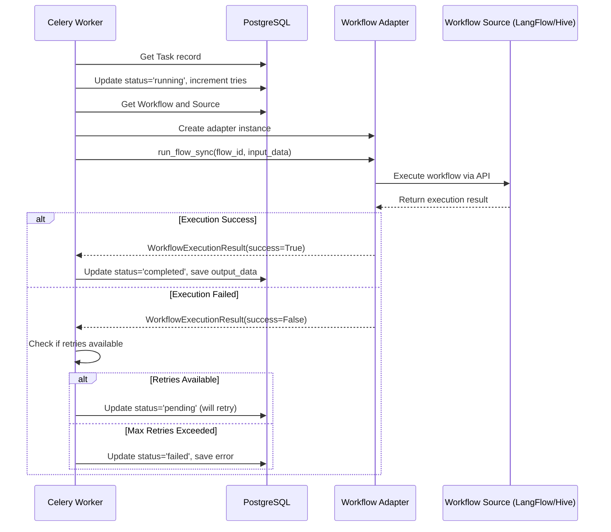
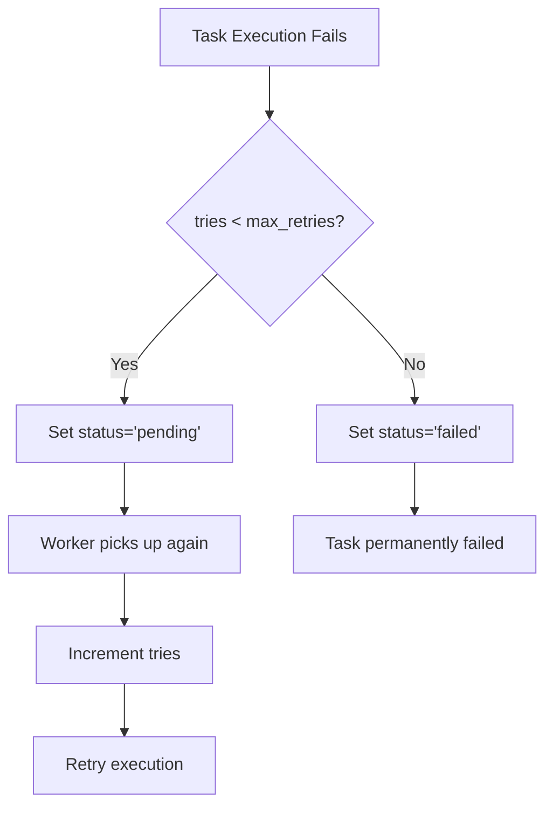

## Overview

When a schedule fires or you manually trigger a workflow, Spark creates a **Task** record that tracks the execution from start to finish. This document explains the complete task lifecycle, from creation to completion or failure.

## Task Lifecycle States

Tasks in Spark progress through several states:



### State Definitions

| State | Meaning | Database Fields Updated |
|-------|---------|------------------------|
| **pending** | Task created, waiting for worker | `status='pending'`, `created_at` |
| **running** | Worker is executing the workflow | `status='running'`, `started_at`, `tries` incremented |
| **completed** | Workflow executed successfully | `status='completed'`, `completed_at`, `output_data` |
| **failed** | Execution failed after max retries | `status='failed'`, `completed_at`, `error` |

## Task Creation

Tasks are created in two ways:

### 1. From Schedules

When Celery Beat detects a due schedule, it queues a Celery task that creates a Task record:

```python
# In workflow_tasks.py
@app.task(name="automagik_spark.core.tasks.workflow_tasks.execute_workflow")
def execute_workflow(schedule_id: str):
    """Execute a workflow from a schedule."""
    with get_sync_session() as session:
        # Get schedule
        schedule = session.get(Schedule, UUID(schedule_id))

        # Create Task record
        task = Task(
            id=uuid4(),
            workflow_id=schedule.workflow_id,
            schedule_id=schedule.id,
            input_data=schedule.input_data or "",
            status="pending",
            created_at=datetime.now(timezone.utc),
            tries=0,
            max_retries=3,
        )
        session.add(task)
        session.commit()

        # Execute the task
        run_workflow_sync(task, session)
```

### 2. Manual Execution

When you trigger a workflow via API or CLI:

```python
# Via API: POST /api/v1/workflows/{id}/run
task = await workflow_manager.create_task(
    workflow_id=workflow_id,
    input_data=input_data,
    max_retries=3
)

# Execute immediately
result = await workflow_manager.run_workflow(
    workflow_id=workflow_id,
    input_data=input_data,
    existing_task=task
)
```

## Worker Task Pickup

Workers continuously poll the **Redis queue** for new tasks using Celery's task protocol.

### How Redis Queue Works



### Worker Configuration

Workers are configured to process tasks one at a time:

```python
# In celery_config.py
config = {
    "worker_prefetch_multiplier": 1,  # Process 1 task at a time
    "task_track_started": True,       # Track when task starts
    "task_queues": [
        Queue("celery", Exchange("celery"), routing_key="celery"),
        Queue("direct", Exchange("direct"), routing_key="direct"),
    ],
}
```

**Why `prefetch_multiplier=1`?**
- Ensures fair distribution across workers
- Prevents one worker from hogging all tasks
- Better for long-running workflow executions

## Task Execution Flow

Once a worker picks up a task, here's the complete execution flow:



### Step-by-Step Breakdown

#### Step 1: Get Task and Update Status

```python
# In TaskRunner.execute_task()
task = await self.session.execute(
    select(Task).filter(Task.id == task_id)
).scalar_one_or_none()

# Update status to running
task.status = "running"
task.started_at = datetime.now(timezone.utc)
task.tries += 1  # Increment attempt counter
task.error = None  # Clear previous errors
await self.session.commit()
```

#### Step 2: Get Workflow Source

```python
# Get workflow and its source
workflow = await self.get_workflow(workflow_id)
source = workflow.workflow_source

# Decrypt API key
api_key = WorkflowSource.decrypt_api_key(source.encrypted_api_key)
```

#### Step 3: Create Adapter

Spark uses the **adapter pattern** to support different workflow sources (LangFlow, Hive):

```python
# Get appropriate adapter for source type
adapter = AdapterRegistry.get_adapter(
    source_type=source.source_type,  # "langflow" or "automagik-hive"
    api_url=source.url,
    api_key=api_key,
    source_id=source.id,
)
```

See [Adapter System](/spark/concepts/adapter-system) for details on how adapters work.

#### Step 4: Execute Workflow

```python
# Execute via adapter
with adapter:
    execution_result = adapter.run_flow_sync(
        workflow.remote_flow_id,
        task.input_data,
        str(task.id)  # Pass task ID for tracking
    )
```

The adapter handles:
- **Authentication** with the workflow source
- **Input transformation** (convert input_data to source-specific format)
- **API request** to execute the workflow
- **Output normalization** (convert response to standard format)
- **Error handling** (catch and format errors)

#### Step 5: Handle Result

```python
if execution_result.success:
    # Store output (JSON or string)
    if isinstance(execution_result.result, (dict, list)):
        task.output_data = json.dumps(execution_result.result)
    else:
        task.output_data = str(execution_result.result)

    task.status = "completed"
    task.finished_at = datetime.now(timezone.utc)
else:
    task.status = "failed"
    task.error = execution_result.error
    task.finished_at = datetime.now(timezone.utc)

await self.session.commit()
```

## Input/Output Handling

### Input Data

Input data flows from the schedule or API request to the workflow source:

```
Schedule.input_data → Task.input_data → Adapter.run_flow_sync() → Source API
        ↓                    ↓                      ↓
  JSON string          JSON string         Source-specific format
```

**Example transformations**:

- **LangFlow**: Input becomes the message for the ChatInput component
  ```json
  {
    "input_value": "What is the weather?",
    "input_type": "chat",
    "output_type": "chat"
  }
  ```

- **Hive**: Input becomes the prompt for agent/team/workflow
  ```json
  {
    "prompt": "What is the weather?",
    "session_id": "task-123"
  }
  ```

### Output Data

Output data is normalized by adapters and stored in `task.output_data`:

```python
# LangFlow output
{
  "result": "The weather is sunny with a high of 75°F",
  "session_id": "abc123",
  "metadata": {}
}

# Hive agent output
{
  "result": "The weather is sunny with a high of 75°F",
  "session_id": "task-123",
  "run_id": "run-456",
  "metadata": {
    "agent_id": "weather-agent",
    "status": "completed"
  }
}
```

The `output_data` field can store up to **10,000 characters** in PostgreSQL. Larger outputs are truncated.

## Retry Logic

Spark implements automatic retry logic for failed tasks:

### Default Retry Configuration

```python
task = Task(
    # ... other fields
    max_retries=3,      # Default: try up to 3 times
    tries=0,            # Incremented on each attempt
)
```

### Retry Decision Flow



### Retry Implementation

```python
try:
    # Execute workflow
    output = await self.workflow_manager.run_workflow(...)
    task.status = "completed"

except Exception as e:
    # Check if should retry
    if task.tries < task.max_retries:
        task.status = "pending"  # Will be retried
        logger.info(f"Task {task_id} will be retried ({task.tries}/{task.max_retries})")
    else:
        task.status = "failed"   # Max retries exceeded
        logger.info(f"Task {task_id} failed after {task.tries} attempts")

    task.error = str(e)
    task.completed_at = datetime.now(timezone.utc)
    await self.session.commit()
```

### Backoff Strategy

Celery's built-in retry policy adds delays between attempts:

```python
"retry_policy": {
    "max_retries": 3,
    "interval_start": 0,      # No delay on first retry
    "interval_step": 0.2,     # Add 0.2s per retry
    "interval_max": 0.2,      # Maximum 0.2s delay
}
```

**Retry timeline**:
- **Attempt 1**: Execute immediately (t=0s)
- **Attempt 2**: Wait 0.2s, retry (t=0.2s)
- **Attempt 3**: Wait 0.2s, retry (t=0.4s)
- **After 3 retries**: Mark as failed (t=0.6s)

### Manual Retry

You can manually retry a failed task via API or CLI:

```bash
# Via CLI
automagik-spark tasks retry <task-id>

# Via API
POST /api/v1/tasks/{task_id}/retry
```

This resets the task:
```python
task.status = "pending"
task.error = None
task.started_at = None
task.completed_at = None
# tries counter is NOT reset - respects max_retries
await self.session.commit()
```

## Error Capture

When a task fails, Spark captures detailed error information:

### Error Storage

```python
task.error = str(e)  # Store error message in Task.error field
task.status = "failed"
task.completed_at = datetime.now(timezone.utc)
```

### Error Logging

Errors are logged at multiple levels:

```python
# Worker logs
logger.error(f"Task {task_id} failed: {error_msg}")

# Database TaskLog (optional)
log = TaskLog(
    task_id=task.id,
    level="error",
    message=error_msg,
    created_at=datetime.now(timezone.utc)
)
session.add(log)
```

### Common Error Types

| Error Type | Cause | Resolution |
|------------|-------|------------|
| **Connection Error** | Can't reach workflow source | Check source URL and network connectivity |
| **Authentication Error** | Invalid API key | Verify API key in source configuration |
| **Workflow Not Found** | Remote flow ID doesn't exist | Re-sync the workflow from the source |
| **Input Validation Error** | Invalid input format | Check input_data format for the source type |
| **Execution Timeout** | Workflow takes too long | Increase timeout or optimize workflow |
| **Rate Limit Error** | Too many requests to source | Add delay between tasks or scale workers |

### Viewing Error Details

```bash
# Via CLI
automagik-spark tasks view <task-id>

# Output shows error field:
Status: failed
Error: HTTPStatusError: 404 Not Found - Workflow abc123 not found

# Via API
GET /api/v1/tasks/{task_id}
{
  "id": "...",
  "status": "failed",
  "error": "HTTPStatusError: 404 Not Found",
  "tries": 3,
  "started_at": "2024-11-04T10:00:00Z",
  "completed_at": "2024-11-04T10:00:01Z"
}
```

## Result Storage

Task results are stored in the `output_data` field of the Task record.

### Storage Format

```python
# Dictionaries and lists are JSON-encoded
if isinstance(execution_result.result, (dict, list)):
    task.output_data = json.dumps(execution_result.result)
else:
    # Strings and other types are converted to string
    task.output_data = str(execution_result.result)
```

### Database Schema

```sql
CREATE TABLE tasks (
    id UUID PRIMARY KEY,
    workflow_id UUID REFERENCES workflows(id),
    schedule_id UUID REFERENCES schedules(id) NULL,
    input_data TEXT,          -- Input data (JSON string)
    output_data TEXT,         -- Output data (JSON string)
    status VARCHAR(20),       -- pending, running, completed, failed
    error TEXT,               -- Error message if failed
    tries INTEGER DEFAULT 0,  -- Number of execution attempts
    max_retries INTEGER DEFAULT 3,
    started_at TIMESTAMP,     -- When task started
    completed_at TIMESTAMP,   -- When task finished (success or failure)
    created_at TIMESTAMP,
    updated_at TIMESTAMP
);
```

### Accessing Results

```python
# Via API
GET /api/v1/tasks/{task_id}

# Response
{
  "id": "123e4567-e89b-12d3-a456-426614174000",
  "workflow_id": "...",
  "status": "completed",
  "input_data": "What is the weather?",
  "output_data": "{\"result\": \"The weather is sunny\"}",
  "started_at": "2024-11-04T10:00:00Z",
  "completed_at": "2024-11-04T10:00:05Z"
}
```

### Result Retention

Task results are stored **indefinitely** by default. You can implement cleanup:

```bash
# Delete old completed tasks (custom script)
DELETE FROM tasks
WHERE status = 'completed'
  AND completed_at < NOW() - INTERVAL '30 days';
```

## Performance Characteristics

### Typical Task Timing

| Phase | Duration | Notes |
|-------|----------|-------|
| **Queue to pickup** | 0.1-2s | Depends on worker availability |
| **Status update** | 10-50ms | Database write |
| **Adapter invocation** | 5-20ms | Object creation overhead |
| **Workflow execution** | 1-30s | Depends on workflow complexity |
| **Result storage** | 10-50ms | Database write |
| **Total** | 1-35s | For typical workflows |

### Scaling Considerations

- **Workers**: Run multiple workers to handle concurrent tasks
  ```bash
  celery -A automagik_spark.core.celery_config.app worker --concurrency=4
  ```

- **Database connections**: Each worker uses a connection pool
  ```python
  # In database config
  pool_size=10          # 10 connections per worker
  max_overflow=20       # Additional 20 connections when busy
  ```

- **Redis queue depth**: Monitor queue length
  ```bash
  redis-cli LLEN celery
  # Returns number of queued tasks
  ```

See [Scaling Production](/spark/advanced/scaling-production) for detailed scaling guidance.

## Debugging Task Execution

### Task Not Running?

1. **Check worker is running**:
   ```bash
   ps aux | grep "celery.*worker"
   ```

2. **Check Redis queue**:
   ```bash
   redis-cli LLEN celery
   # If > 0, tasks are queued but workers aren't processing
   ```

3. **Check task status**:
   ```bash
   automagik-spark tasks view <task-id>
   ```

4. **Check worker logs**:
   ```bash
   tail -f /var/log/spark/worker.log
   ```

### Task Stuck in "running"?

- **Worker crashed** during execution
  - Task remains in "running" state
  - Manually update: `UPDATE tasks SET status='failed' WHERE id='...'`

- **Long-running workflow**
  - Check if workflow source is still processing
  - Consider increasing timeout

### High Failure Rate?

- **Check workflow source health**:
  ```bash
  curl -X GET http://langflow:7860/api/v1/flows/{flow_id}
  ```

- **Review error patterns**:
  ```sql
  SELECT error, COUNT(*) as count
  FROM tasks
  WHERE status = 'failed'
  GROUP BY error
  ORDER BY count DESC;
  ```

- **Adjust retry settings**:
  ```python
  task = await workflow_manager.create_task(
      workflow_id=workflow_id,
      input_data=input_data,
      max_retries=5  # Increase retries for flaky workflows
  )
  ```

## Source Code References

- **TaskRunner**: [`automagik_spark/core/scheduler/task_runner.py`](https://github.com/automagik-labs/automagik-spark/blob/main/automagik_spark/core/scheduler/task_runner.py)
- **WorkflowManager**: [`automagik_spark/core/workflows/manager.py`](https://github.com/automagik-labs/automagik-spark/blob/main/automagik_spark/core/workflows/manager.py)
- **Celery tasks**: [`automagik_spark/core/tasks/workflow_tasks.py`](https://github.com/automagik-labs/automagik-spark/blob/main/automagik_spark/core/tasks/workflow_tasks.py)
- **Task model**: [`automagik_spark/core/database/models.py`](https://github.com/automagik-labs/automagik-spark/blob/main/automagik_spark/core/database/models.py)

## Next Steps

- Learn about [Adapter System](/spark/concepts/adapter-system) to understand workflow execution
- See [Scheduling Internals](/spark/concepts/scheduling-internals) for how tasks are created from schedules
- Explore [Scaling Production](/spark/advanced/scaling-production) for handling high task volumes
