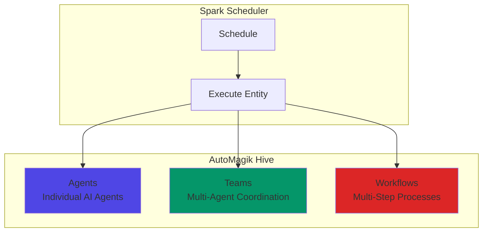
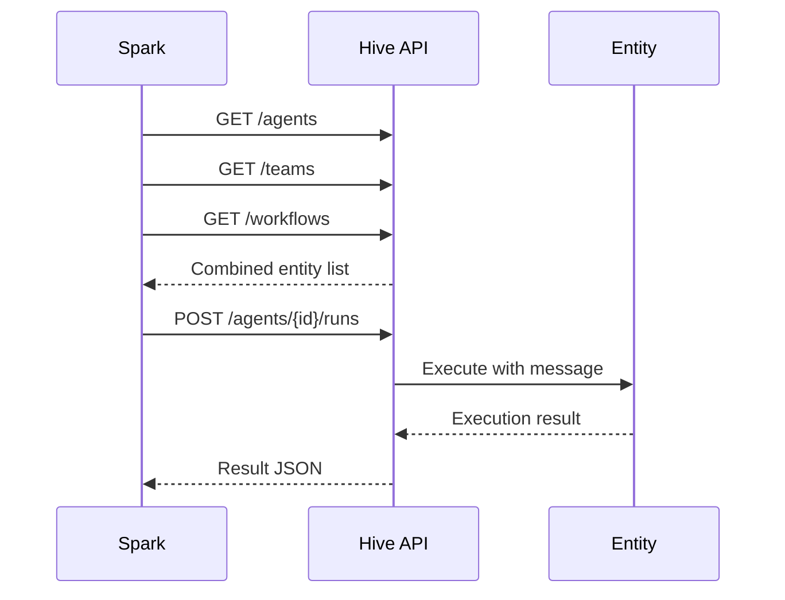
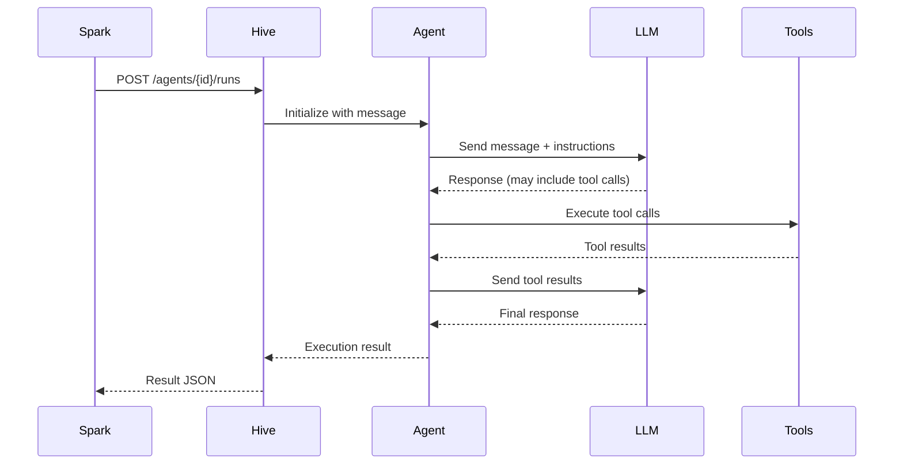
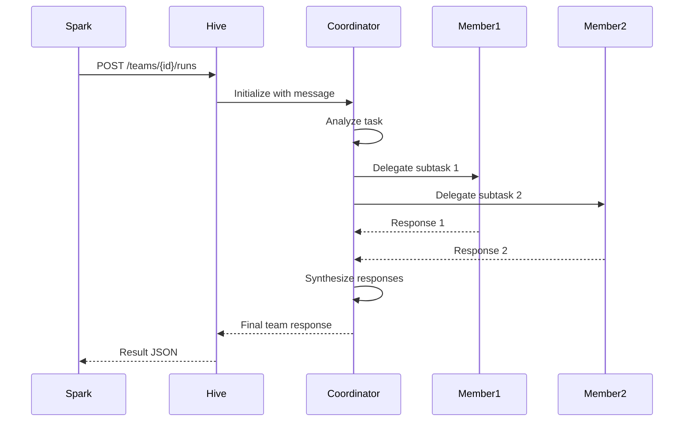
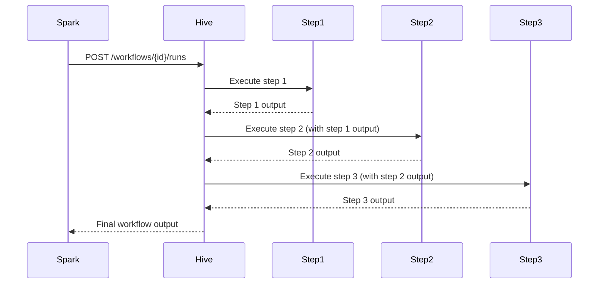
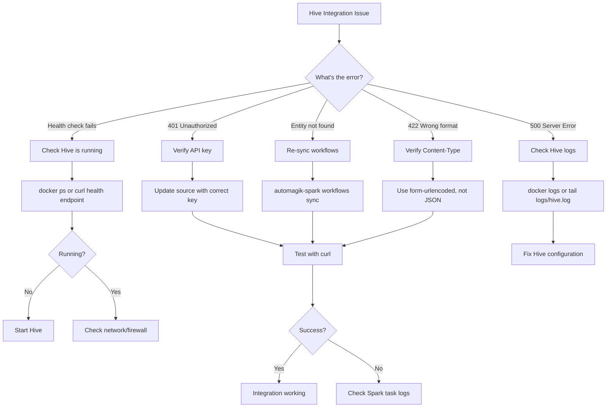
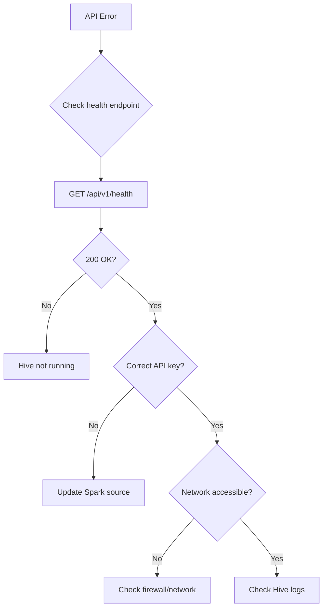

## Overview

AutoMagik Hive is a multi-agent AI system that provides three distinct execution entity types: **Agents**, **Teams**, and **Workflows**. This guide covers everything you need to integrate Hive with Spark for scheduled automation of AI agent tasks.

<Info>
**Prerequisites**:
- Hive installed and running on port 8000 (default)
- Spark installed with PostgreSQL and Redis running
- At least one agent, team, or workflow created in Hive
</Info>

### Hive Architecture

Hive organizes AI capabilities into three entity types:



### Integration Flow



---

## Understanding Hive Entities

Hive provides three types of execution entities, and **all three become "workflows" in Spark terminology**:

<CardGroup cols={3}>
  <Card title="Agents" icon="robot">
    **Single AI agents** with specific roles and tools. Best for focused, individual tasks like Q&A or simple automation.
  </Card>
  <Card title="Teams" icon="users">
    **Multi-agent groups** that coordinate to solve complex problems. Multiple agents working together with specialized roles.
  </Card>
  <Card title="Workflows" icon="diagram-project">
    **Structured multi-step processes** with defined sequences and logic. Linear task execution with dependencies.
  </Card>
</CardGroup>

<Warning>
**Important**: In Spark, agents, teams, and workflows are all treated as "workflows" that can be scheduled and executed. The distinction is preserved in metadata but the interface is unified.
</Warning>

### Complete Entity Comparison

| Feature | Agent | Team | Workflow |
|---------|-------|------|----------|
| **Purpose** | Single AI agent tasks | Multi-agent coordination | Multi-step processes |
| **Execution** | Single LLM call + tools | Coordinator + member agents | Sequential step execution |
| **Input** | Simple message | Task/objective | Task/context |
| **Output** | Agent response | Combined team response | Final workflow output |
| **Memory** | Agent-level memory | Team-level memory | Workflow context |
| **Tools** | Agent-specific tools | Per-member tools | Step-specific tools |
| **Coordination** | N/A | Coordinator agent | Workflow engine |
| **Use Case** | Chat, Q&A, simple tasks | Complex problem-solving | Business processes |
| **API Endpoint** | `/agents/{id}/runs` | `/teams/{id}/runs` | `/workflows/{id}/runs` |

<Info>
**Spark handles all three types identically** from a scheduling perspective. The adapter automatically detects the entity type and calls the appropriate Hive API endpoint.
</Info>

### Agent Entity Type

**What it is:** A single AI agent with specific instructions, tools, and memory.

**When to use:**
- Simple conversational tasks
- Q&A with knowledge base
- Single-purpose automation
- Quick responses needed

**Example Configuration:**
```json
{
  "id": "support-agent",
  "name": "Customer Support Agent",
  "description": "Answers customer questions about products",
  "model": {
    "provider": "openai",
    "name": "gpt-4"
  },
  "instructions": "You are a helpful customer support agent...",
  "tools": ["search_knowledge_base", "check_order_status"],
  "memory": {
    "enabled": true,
    "type": "conversation"
  }
}
```

**Execution Flow:**
```
User Message → Agent (LLM + Tools) → Response
```

### Team Entity Type

**What it is:** Multiple agents coordinated by a coordinator agent.

**When to use:**
- Complex tasks requiring multiple perspectives
- Division of labor across specialized agents
- Tasks needing different expertise areas
- Collaborative problem-solving

**Team Modes:**
- `coordinate` - Coordinator delegates to members and synthesizes responses
- `sequential` - Members work in sequence, passing context
- `parallel` - Members work independently, results combined

**Example Configuration:**
```json
{
  "id": "research-team",
  "name": "Research Team",
  "description": "Multi-agent team for comprehensive research",
  "mode": "coordinate",
  "model": {
    "provider": "openai",
    "name": "gpt-4"
  },
  "members": [
    {
      "agent_id": "web-researcher",
      "role": "Web research specialist"
    },
    {
      "agent_id": "data-analyst",
      "role": "Data analysis expert"
    },
    {
      "agent_id": "summarizer",
      "role": "Summary writer"
    }
  ]
}
```

**Execution Flow:**
```
User Task → Coordinator Agent → Delegates to Members → Coordinator Synthesizes → Final Response
```

### Workflow Entity Type

**What it is:** A multi-step process with defined steps and transitions.

**When to use:**
- Structured business processes
- Multi-stage data processing
- Sequential task execution
- Workflows with branching logic

**Example Configuration:**
```json
{
  "id": "onboarding-workflow",
  "name": "Customer Onboarding",
  "description": "Automated customer onboarding process",
  "steps": [
    {
      "step_id": "collect_info",
      "agent_id": "data-collector",
      "description": "Collect customer information"
    },
    {
      "step_id": "verify_data",
      "agent_id": "validator",
      "description": "Verify customer data"
    },
    {
      "step_id": "create_account",
      "agent_id": "account-creator",
      "description": "Create customer account"
    },
    {
      "step_id": "send_welcome",
      "agent_id": "communicator",
      "description": "Send welcome email"
    }
  ]
}
```

**Execution Flow:**
```
Input → Step 1 → Step 2 → Step 3 → Step 4 → Final Output
```

---

## Step-by-Step Integration

<Steps>
  <Step title="Get Your Hive API Key">
    Hive uses API key authentication. Get your key from Hive:

    ```bash
    # Start Hive if not already running
    hive start

    # Get or create an API key
    hive config show | grep API_KEY
    ```

    If you don't have an API key, create one:

    ```bash
    # Generate new API key
    hive config set API_KEY "your-secure-api-key-here"
    ```

    **Test authentication:**
    ```bash
    curl -X GET "http://localhost:8000/api/v1/health" \
      -H "x-api-key: your-hive-api-key"
    ```

    **Expected response:**
    ```json
    {
      "status": "success",
      "service": "Automagik Hive Multi-Agent System",
      "utc": "2024-01-20T15:30:00Z"
    }
    ```

    <Tip>
    For development, you can use a simple key like `dev-key-12345`. For production, use a secure random string.
    </Tip>
  </Step>

  <Step title="Add Hive as a Spark Source">
    Connect Spark to your Hive instance:

    ```bash
    automagik-spark sources add \
      --name "my-hive" \
      --type "automagik-hive" \
      --url "http://localhost:8000" \
      --api-key "your-hive-api-key"
    ```

    **Expected output:**
    ```
    Health check passed: status success
    Version check passed: Automagik Hive Multi-Agent System
    Successfully added source: http://localhost:8000
    ```

    <Note>
    The source type **must be** `automagik-hive` (not just `hive`). This tells Spark to use the correct adapter.
    </Note>

    **Verify the connection:**

    ```bash
    automagik-spark sources list
    ```

    You should see your Hive source with status "active".
  </Step>

  <Step title="Discover Available Workflows">
    List all agents, teams, and workflows from your Hive instance:

    ```bash
    # View all available Hive entities
    automagik-spark workflows sync
    ```

    **Expected output:**
    ```
    ┌────────────────────┬──────────────┬────────────────────────────────┬─────────────┐
    │ ID                 │ Name         │ Description                    │ Source      │
    ├────────────────────┼──────────────┼────────────────────────────────┼─────────────┤
    │ researcher         │ researcher   │ AutoMagik Hive Agent: research │ my-hive     │
    │ dev-team           │ dev-team     │ Hive Team with 3 members       │ my-hive     │
    │ data-pipeline      │ data-pipeline│ AutoMagik Hive Workflow: data  │ my-hive     │
    └────────────────────┴──────────────┴────────────────────────────────┴─────────────┘
    ```

    You'll see:
    - **Agents** - Individual AI agents
    - **Teams** - Multi-agent teams
    - **Workflows** - Structured processes
  </Step>

  <Step title="Sync an Entity to Spark">
    Import the Hive entity you want to schedule:

    ```bash
    # Sync a specific agent/team/workflow
    automagik-spark workflows sync researcher
    ```

    **Expected output:**
    ```
    Successfully synced flow researcher
    ```

    **Verify it was synced:**

    ```bash
    automagik-spark workflows list
    ```

    **Expected output:**
    ```
    ┌──────────┬────────────┬────────────┬─────────┬───────────┬──────────┬──────┬──────────────┐
    │ ID       │ Name       │ Latest Run │ Tasks   │ Schedules │ Instance │ Type │ Last Updated │
    ├──────────┼────────────┼────────────┼─────────┼───────────┼──────────┼──────┼──────────────┤
    │ wf-123   │ researcher │ NEW        │ 0 (0)   │ 0         │ my-hive  │ ...  │ 2 mins ago   │
    └──────────┴────────────┴────────────┴─────────┴───────────┴──────────┴──────┴──────────────┘
    ```
  </Step>

  <Step title="Test Manual Execution">
    Before scheduling, test the entity manually:

    ```bash
    # Run the workflow with a test message
    automagik-spark workflows run wf-123 \
      --input "Research the latest AI trends in 2024"
    ```

    **Expected output:**
    ```
    Task task-abc-123 completed successfully
    Input: Research the latest AI trends in 2024
    Output: {
      "content": "Here are the key AI trends for 2024:...",
      "session_id": "...",
      "run_id": "..."
    }
    ```

    <Tip>
    Check the task details for full output:
    ```bash
    automagik-spark tasks view task-abc-123
    ```
    </Tip>
  </Step>

  <Step title="Create an Automated Schedule">
    Set up the entity to run on a schedule:

    ```bash
    # Create schedule interactively
    automagik-spark schedules create
    ```

    **Interactive prompts:**
    ```
    Available Workflows:
    0: researcher (0 schedules)

    Select a workflow: 0

    Schedule Type:
      0: Interval (e.g., every 30 minutes)
      1: Cron (e.g., every day at 8 AM)
      2: One-time (run once at a specific time)

    Select schedule type: 1

    Enter cron expression: 0 9 * * 1-5

    Enter input value: Daily market research report
    ```

    **Verify the schedule:**

    ```bash
    automagik-spark schedules list
    ```

    **Expected output:**
    ```
    ┌──────────────┬────────────┬──────┬─────────────┬────────────┬────────┬───────┬────────┐
    │ ID           │ Workflow   │ Type │ Expression  │ Next Run   │ Tasks  │ Input │ Status │
    ├──────────────┼────────────┼──────┼─────────────┼────────────┼────────┼───────┼────────┤
    │ schedule-123 │ researcher │ cron │ 0 9 * * 1-5 │ Tomorrow   │ 0 (0)  │ {...} │ ACTIVE │
    │              │            │      │             │ 09:00 AM   │        │       │        │
    └──────────────┴────────────┴──────┴─────────────┴────────────┴────────┴───────┴────────┘
    ```
  </Step>

  <Step title="Monitor Execution Results">
    Check the execution history and results:

    ```bash
    # View all task executions
    automagik-spark tasks list
    ```

    **Expected output:**
    ```
    ┌──────────────┬────────────┬─────────────┬────────┬────────────┬──────────┐
    │ ID           │ Workflow   │ Schedule    │ Status │ Created    │ Duration │
    ├──────────────┼────────────┼─────────────┼────────┼────────────┼──────────┤
    │ task-abc-123 │ researcher │ schedule-12 │ ✓ OK   │ 5 mins ago │ 2.3s     │
    │ task-def-456 │ researcher │ schedule-12 │ ✓ OK   │ 1 day ago  │ 1.8s     │
    └──────────────┴────────────┴─────────────┴────────┴────────────┴──────────┘
    ```

    **View detailed output:**

    ```bash
    automagik-spark tasks view task-abc-123
    ```

    This shows the full response from the Hive agent/team/workflow, including:
    - Agent response content
    - Session ID (for conversation continuity)
    - Run ID (Hive's internal execution ID)
    - Metadata (metrics, status, etc.)
  </Step>
</Steps>

---

## API Endpoint Variations

### Complete Endpoint Reference

| Entity Type | List Endpoint | Run Endpoint | HTTP Method | Content Type |
|-------------|---------------|--------------|-------------|--------------|
| Agent | `/agents` | `/agents/{id}/runs` | POST | `application/x-www-form-urlencoded` |
| Team | `/teams` | `/teams/{id}/runs` | POST | `application/x-www-form-urlencoded` |
| Workflow | `/workflows` | `/workflows/{id}/runs` | POST | `application/x-www-form-urlencoded` |

<Warning>
**Critical: Content-Type Must Be Form-Urlencoded**

All Hive execution endpoints use `application/x-www-form-urlencoded`, **NOT JSON**. This is the most common mistake when integrating with Hive.

```bash
# ✅ CORRECT
curl -X POST "http://localhost:8000/agents/{id}/runs" \
  -H "x-api-key: your-key" \
  -H "Content-Type: application/x-www-form-urlencoded" \
  -d "message=Hello&stream=false&session_id=session-123"

# ❌ WRONG - Will return 422 error
curl -X POST "http://localhost:8000/agents/{id}/runs" \
  -H "Content-Type: application/json" \
  -d '{"message": "Hello"}'
```
</Warning>

### List Entities Examples

#### List Agents

**Request:**
```bash
curl -X GET "http://localhost:8000/agents" \
  -H "x-api-key: your-hive-api-key"
```

**Response:**
```json
[
  {
    "id": "support-agent",
    "name": "Customer Support Agent",
    "description": "Answers customer questions",
    "model": {
      "provider": "openai",
      "name": "gpt-4"
    },
    "tools": ["search", "order_lookup"],
    "memory": {
      "enabled": true
    }
  }
]
```

#### List Teams

**Request:**
```bash
curl -X GET "http://localhost:8000/teams" \
  -H "x-api-key: your-hive-api-key"
```

**Response:**
```json
[
  {
    "id": "research-team",
    "name": "Research Team",
    "description": "Multi-agent research team",
    "mode": "coordinate",
    "members": [
      {"agent_id": "researcher", "role": "Web researcher"},
      {"agent_id": "analyst", "role": "Data analyst"}
    ]
  }
]
```

#### List Workflows

**Request:**
```bash
curl -X GET "http://localhost:8000/workflows" \
  -H "x-api-key: your-hive-api-key"
```

**Response:**
```json
[
  {
    "id": "onboarding-workflow",
    "name": "Customer Onboarding",
    "description": "Automated onboarding process",
    "steps": [
      {"step_id": "collect", "agent_id": "collector"},
      {"step_id": "verify", "agent_id": "validator"}
    ]
  }
]
```

### Execute Entity Examples

#### Execute Agent

**Request:**
```bash
curl -X POST "http://localhost:8000/agents/support-agent/runs" \
  -H "x-api-key: your-hive-api-key" \
  -H "Content-Type: application/x-www-form-urlencoded" \
  -d "message=What is the status of order 12345?&stream=false&session_id=user-456"
```

**Response:**
```json
{
  "run_id": "run-abc123",
  "agent_id": "support-agent",
  "session_id": "user-456",
  "status": "COMPLETED",
  "content": "Order 12345 is currently in transit and will arrive on Monday.",
  "metrics": {
    "tokens_used": 245,
    "duration_ms": 1234
  }
}
```

#### Execute Team

**Request:**
```bash
curl -X POST "http://localhost:8000/teams/research-team/runs" \
  -H "x-api-key: your-hive-api-key" \
  -H "Content-Type: application/x-www-form-urlencoded" \
  -d "message=Research the impact of AI on healthcare&stream=false&mode=coordinate"
```

**Response:**
```json
{
  "run_id": "run-def456",
  "team_id": "research-team",
  "session_id": "session-789",
  "status": "COMPLETED",
  "coordinator_response": {
    "content": "Based on research from our team, AI is transforming healthcare through...",
    "agent_id": "coordinator"
  },
  "member_responses": [
    {
      "agent_id": "researcher",
      "response": "Found 15 recent studies on AI in healthcare..."
    },
    {
      "agent_id": "analyst",
      "response": "Analysis shows 45% improvement in diagnostic accuracy..."
    }
  ]
}
```

#### Execute Workflow

**Request:**
```bash
curl -X POST "http://localhost:8000/workflows/onboarding-workflow/runs" \
  -H "x-api-key: your-hive-api-key" \
  -H "Content-Type: application/x-www-form-urlencoded" \
  -d "message=Start onboarding for John Doe&stream=false"
```

**Response:**
```json
{
  "run_id": "run-ghi789",
  "workflow_id": "onboarding-workflow",
  "session_id": "session-012",
  "status": "COMPLETED",
  "steps_completed": [
    {
      "step_id": "collect_info",
      "status": "completed",
      "output": "Collected customer information"
    },
    {
      "step_id": "verify_data",
      "status": "completed",
      "output": "Data verified successfully"
    },
    {
      "step_id": "create_account",
      "status": "completed",
      "output": "Account created: john.doe@example.com"
    }
  ],
  "final_output": "Onboarding completed successfully for John Doe"
}
```

---

## Input Data Format

### How Spark Sends Data to Hive

Spark normalizes input data before sending to Hive:

```python
# From hive_adapter.py
def normalize_input(input_data):
    if isinstance(input_data, dict) and "value" in input_data:
        message = input_data["value"]
    elif not input_data:
        message = "Hello"  # Default greeting
    elif not isinstance(input_data, str):
        message = str(input_data)
    else:
        message = input_data
    return message
```

### Simple String Input

```bash
# Pass a plain text message
automagik-spark workflows run wf-123 \
  --input "Analyze the latest sales data"
```

Spark converts this to: `{"message": "Analyze the latest sales data"}`

### JSON Input

```bash
# Pass structured data (Spark extracts the 'value' field)
automagik-spark workflows run wf-123 \
  --input '{"value": "Research AI trends", "context": "Q1 2024"}'
```

Spark converts this to: `{"message": "Research AI trends"}`

<Note>
**How Spark Processes Input**:
1. If input is a dict with `"value"` key → extract the value
2. If input is empty/null → use default "Hello"
3. If input is not a string → convert to string
4. Otherwise → pass as-is
</Note>

### Input Format for Each Entity Type

**For Agents:**
```python
payload = {
    "message": "What is the weather today?",
    "stream": False,
    "session_id": "user-123"  # Optional
}
```

**For Teams:**
```python
payload = {
    "message": "Research AI trends in 2024",
    "stream": False,
    "mode": "coordinate",  # Team coordination mode
    "session_id": "team-session-456"
}
```

**For Workflows:**
```python
payload = {
    "message": "Process new customer application",
    "stream": False,
    "session_id": "workflow-session-789"
}
```

### Session Continuity

For conversation-based agents, Spark automatically manages session IDs:

```bash
# First run creates a session
automagik-spark workflows run wf-123 --input "Who are you?"

# Subsequent runs with the same workflow maintain session
automagik-spark workflows run wf-123 --input "What was my first question?"
```

Session ID format: `{source_id}_{flow_id}`

---

## Execution Behavior

### Agent Execution Sequence



**Key Characteristics:**
- Single execution path
- May use multiple tool calls
- Memory preserved per session
- Fast execution (typically < 5s)

### Team Execution Sequence



**Key Characteristics:**
- Coordinator delegates to members
- Members may work in parallel or sequence
- Coordinator synthesizes final response
- Slower execution (typically 10-30s)

### Workflow Execution Sequence



**Key Characteristics:**
- Sequential step execution
- Each step receives previous step's output
- Steps can have conditional branching
- Execution time varies by step count

---

## Common Hive Integration Issues

<AccordionGroup>
  <Accordion title="Error: 'Connection refused' or 'Failed to validate'">
    **Problem**: Spark cannot connect to Hive.

    **Solutions**:

    ```bash
    # 1. Check if Hive is running
    curl http://localhost:8000/api/v1/health

    # 2. Verify the port number (default is 8000)
    # If Hive runs on a different port, update the source:
    automagik-spark sources update \
      --url "http://localhost:YOUR_PORT"

    # 3. Check firewall/network settings
    # Ensure port 8000 is accessible

    # 4. Test with API key
    curl -X GET "http://localhost:8000/api/v1/health" \
      -H "x-api-key: your-hive-api-key"
    ```
  </Accordion>

  <Accordion title="Error: 'Flow not found' after sync">
    **Problem**: Entity ID doesn't match between Hive and Spark.

    **Solutions**:

    ```bash
    # 1. List available entities from Hive
    automagik-spark workflows sync

    # 2. Use the exact ID shown in the list
    # Hive prioritizes: 'id' field > 'agent_id'/'team_id'/'workflow_id' > 'name'

    # 3. Check Hive directly
    curl http://localhost:8000/agents \
      -H "x-api-key: your-key"

    # 4. Re-sync workflows
    automagik-spark workflows delete {workflow_id}
    automagik-spark workflows list --source my-hive --sync
    ```
  </Accordion>

  <Accordion title="Error: 'Invalid API key' or 401 Unauthorized">
    **Problem**: API key is incorrect or missing.

    **Solutions**:

    ```bash
    # 1. Verify your Hive API key
    hive config show | grep API_KEY

    # 2. Update Spark source with correct key
    automagik-spark sources update \
      --api-key "correct-api-key"

    # 3. Test authentication directly
    curl http://localhost:8000/api/v1/health \
      -H "x-api-key: your-key"
    ```
  </Accordion>

  <Accordion title="Error: 422 Unprocessable Entity - Wrong Content Type">
    **Problem**: Sending JSON instead of form-urlencoded data.

    **Cause**: This is the most common Hive integration mistake.

    **Solution**:

    Spark automatically uses the correct content type. If manually testing:

    ```bash
    # ✅ CORRECT
    curl -X POST "http://localhost:8000/agents/{id}/runs" \
      -H "x-api-key: your-key" \
      -H "Content-Type: application/x-www-form-urlencoded" \
      -d "message=Hello&stream=false"

    # ❌ WRONG
    curl -X POST "http://localhost:8000/agents/{id}/runs" \
      -H "Content-Type: application/json" \
      -d '{"message": "Hello"}'
    ```

    The adapter handles this automatically:
    ```python
    # From hive_adapter.py
    response = client.post(
        f"/agents/{agent_id}/runs",
        data=payload,  # Form data, not JSON
        headers={"Content-Type": "application/x-www-form-urlencoded"}
    )
    ```
  </Accordion>

  <Accordion title="Task completes but output is empty">
    **Problem**: Hive entity executed but produced no output.

    **Solutions**:

    ```bash
    # 1. Check task details for Hive-specific errors
    automagik-spark tasks view task-abc-123

    # 2. Verify the agent/team/workflow works in Hive directly
    hive task assign researcher "Test message"

    # 3. Check Hive logs
    hive logs --tail 100
    # Or if using Docker:
    docker logs automagik-hive

    # 4. Ensure the agent has proper tools and API keys
    hive agents status researcher

    # 5. Test entity manually
    curl -X POST "http://localhost:8000/agents/{id}/runs" \
      -H "x-api-key: your-key" \
      -H "Content-Type: application/x-www-form-urlencoded" \
      -d "message=test&stream=false"
    ```
  </Accordion>

  <Accordion title="Wrong entity type detected">
    **Problem**: Spark treats a team as an agent or vice versa.

    **Solutions**:

    ```bash
    # 1. Check the entity type in Hive's API response
    curl http://localhost:8000/agents \
      -H "x-api-key: your-key"
    curl http://localhost:8000/teams \
      -H "x-api-key: your-key"

    # 2. Ensure your Hive configuration uses correct format
    # agents.yaml should have proper 'agents' vs 'teams' sections

    # 3. Re-sync the entity after fixing Hive config
    automagik-spark workflows sync entity-id --force
    ```

    **Entity type detection:**
    ```json
    // Agent response includes:
    {
      "id": "researcher",
      "data": {
        "type": "hive_agent"  // <-- Determines execution path
      }
    }

    // Team response includes:
    {
      "id": "dev-team",
      "data": {
        "type": "hive_team"  // <-- Different type
      }
    }
    ```
  </Accordion>
</AccordionGroup>

---

## Debugging Guide

### Troubleshooting Flowchart



### Connection Debugging

```bash
# 1. Test Hive health endpoint
curl http://localhost:8000/api/v1/health \
  -H "x-api-key: your-api-key"

# Expected response:
# {
#   "status": "success",
#   "service": "Automagik Hive Multi-Agent System",
#   "utc": "2024-11-04T..."
# }

# 2. List agents directly from Hive
curl http://localhost:8000/agents \
  -H "x-api-key: your-api-key"

# 3. Test agent execution in Hive
curl -X POST http://localhost:8000/agents/researcher/runs \
  -H "x-api-key: your-api-key" \
  -H "Content-Type: application/x-www-form-urlencoded" \
  -d "message=Test&stream=false"
```

### Spark-Hive Communication

```bash
# Enable verbose logging in Spark
# Edit your .env file:
# LOG_LEVEL=DEBUG

# Restart Spark workers
automagik-spark worker stop
automagik-spark worker start

# Run a test workflow and check logs
automagik-spark workflows run wf-123 --input "test"
automagik-spark worker logs | grep -i hive
```

### API Error Diagnosis



---

## Advanced Configuration

### Multiple Hive Instances

You can connect Spark to multiple Hive instances:

```bash
# Development Hive
automagik-spark sources add \
  --name "hive-dev" \
  --type "automagik-hive" \
  --url "http://localhost:8000" \
  --api-key "dev-key"

# Production Hive
automagik-spark sources add \
  --name "hive-prod" \
  --type "automagik-hive" \
  --url "http://production-server:8000" \
  --api-key "prod-key"

# Sync from specific instance
automagik-spark workflows sync --source hive-prod
```

### Custom Hive Ports

If Hive runs on a non-standard port:

```bash
automagik-spark sources add \
  --name "hive-custom" \
  --type "automagik-hive" \
  --url "http://localhost:8881" \
  --api-key "your-key"
```

### Team Coordination Modes

**Coordinate Mode (default):**
- Coordinator analyzes task
- Delegates to appropriate members
- Synthesizes member responses
- Returns unified answer

**Sequential Mode:**
- Members execute in order
- Each receives previous member's output
- Final member's output returned

**Parallel Mode:**
- All members execute simultaneously
- Results aggregated
- Fastest execution for independent tasks

### Custom Session Management

For fine-grained session control, use the API directly:

```python
import requests

# Manual execution with custom session ID
response = requests.post(
    "http://localhost:8883/api/v1/workflows/wf-123/run",
    headers={"X-API-Key": "your-spark-api-key"},
    json={
        "input_data": {"value": "Custom message"},
        "session_id": "user-session-abc-123"
    }
)
```

---

## Complete Example: Daily Research Agent

Here's a complete end-to-end example:

### 1. Create Agent in Hive

```yaml
# agents.yaml in Hive
agents:
  - name: market-researcher
    role: "Research market trends and generate daily reports"
    llm: claude
    model: "claude-3-5-sonnet-20241022"
    memory: true
    tools:
      - web-search
      - wikipedia
      - arxiv
```

Start Hive:
```bash
hive start
```

### 2. Connect to Spark

```bash
# Add Hive source
automagik-spark sources add \
  --name "research-hive" \
  --type "automagik-hive" \
  --url "http://localhost:8000" \
  --api-key "research-key-123"

# Sync the researcher agent
automagik-spark workflows sync
automagik-spark workflows sync market-researcher
```

### 3. Test Manually

```bash
# Run a test research task
automagik-spark workflows run market-researcher \
  --input "Research AI agent trends in Q4 2024"

# Check output
automagik-spark tasks list
automagik-spark tasks view <task-id>
```

### 4. Schedule Daily Execution

```bash
# Create daily schedule (weekdays at 9 AM)
automagik-spark schedules create
# Select: market-researcher
# Type: Cron
# Expression: 0 9 * * 1-5
# Input: Generate daily market research report on AI trends
```

### 5. Monitor Results

```bash
# Check schedule status
automagik-spark schedules list

# View execution history
automagik-spark tasks list --workflow market-researcher

# Get detailed results
automagik-spark tasks view <task-id>
```

Your research agent now runs automatically every weekday morning!

---

## Common Hive Patterns

### Pattern 1: Simple Agent Task

**Use Case:** Daily report generation

```bash
# Agent: report-generator
# Execution: Every day at 9 AM
automagik-spark schedules create \
  --workflow report-workflow \
  --cron "0 9 * * *" \
  --input '{"message": "Generate daily sales report"}'
```

### Pattern 2: Research Team

**Use Case:** Market research automation

```bash
# Team: market-research-team
# Members: web-researcher, analyst, writer
# Execution: Weekly on Monday
automagik-spark schedules create \
  --workflow market-research-workflow \
  --cron "0 10 * * 1" \
  --input '{"message": "Research AI market trends this week"}'
```

### Pattern 3: Customer Onboarding Workflow

**Use Case:** Automated customer onboarding

```bash
# Workflow: customer-onboarding
# Steps: collect → verify → create → notify
# Execution: Triggered by webhook/API
automagik-spark tasks create \
  --workflow onboarding-workflow \
  --input '{"message": "Onboard customer: John Doe, john@example.com"}'
```

### Pattern 4: Multi-Team Coordination

**Use Case:** Complex project execution

```bash
# Multiple teams working on different aspects
# Team 1: Requirements analysis
# Team 2: Technical implementation
# Team 3: Testing and QA

# Schedule each team
automagik-spark schedules create \
  --workflow requirements-team-workflow \
  --cron "0 9 * * 1"

automagik-spark schedules create \
  --workflow implementation-team-workflow \
  --cron "0 14 * * 1-5"

automagik-spark schedules create \
  --workflow qa-team-workflow \
  --cron "0 16 * * 5"
```

---

## Version Compatibility

### Spark Version Support

| Spark Version | Hive Versions | Notes |
|---------------|---------------|-------|
| 0.1.x - 0.5.x | N/A | Hive support not available |
| 0.6.x+ | 0.1.x+ | Full Hive integration |

### Hive API Versions

Hive uses a stable API structure:

```
Base: /api/v1
Entities: /agents, /teams, /workflows
Execution: /{entity_type}/{id}/runs
```

**Breaking Changes:**
- Hive 0.1.x to 0.2.x: No breaking changes
- Future versions will maintain backward compatibility

### Migration Notes

When upgrading Hive:

1. **Check health endpoint:**
   ```bash
   curl http://localhost:8000/api/v1/health
   ```

2. **Re-sync all workflows:**
   ```bash
   automagik-spark workflows sync --source my-hive --all
   ```

3. **Test execution:**
   ```bash
   automagik-spark workflows run {workflow_id} \
     --input '{"message": "test"}'
   ```

---

## Next Steps

<CardGroup cols={2}>
  <Card title="LangFlow Integration" icon="diagram-project" href="/spark/examples/langflow-integration">
    Learn how to integrate LangFlow workflows with Spark
  </Card>
  <Card title="API Reference" icon="code" href="/spark/api/rest-overview">
    Use Spark's REST API for programmatic access
  </Card>
  <Card title="Scheduling Guide" icon="clock" href="/spark/concepts/scheduling-internals">
    Deep dive into Spark's scheduling system
  </Card>
  <Card title="Troubleshooting" icon="wrench" href="/spark/troubleshooting/common-errors">
    Common issues and solutions
  </Card>
</CardGroup>

---

## Summary

You've learned how to:

- ✅ Connect Hive to Spark as a workflow source
- ✅ Understand the differences between agents, teams, and workflows
- ✅ Navigate Hive's API endpoints and content-type requirements
- ✅ Sync Hive entities to Spark
- ✅ Test and schedule automated executions
- ✅ Monitor results and troubleshoot issues
- ✅ Handle Hive-specific API behaviors and execution patterns
- ✅ Debug common integration problems

**Key Takeaway**: Hive's agents, teams, and workflows all become "workflows" in Spark, but Spark's adapter automatically handles the different API endpoints, content types, and response formats for each entity type. The most critical detail is using form-urlencoded data instead of JSON for all execution requests.
