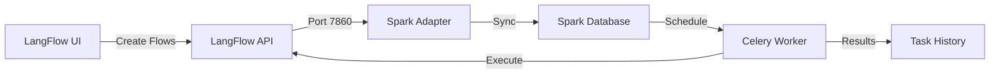
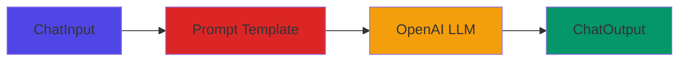
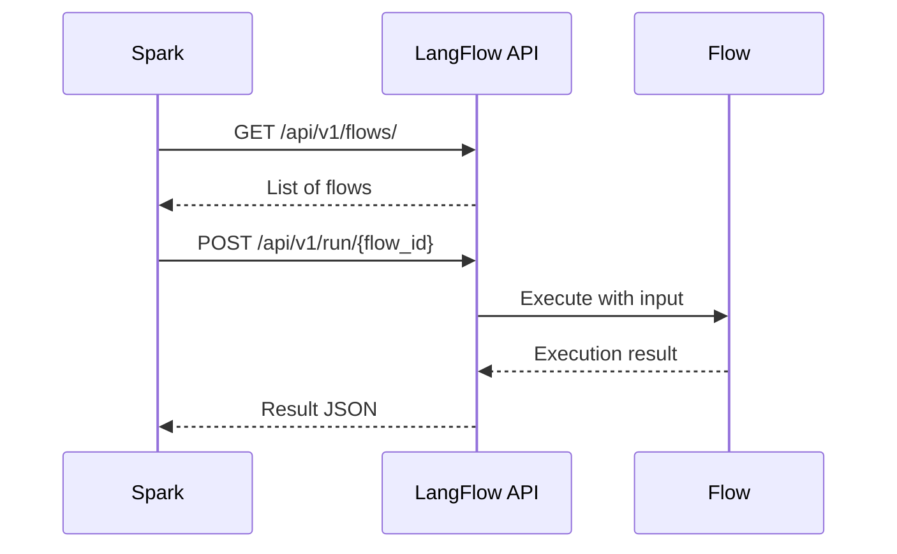
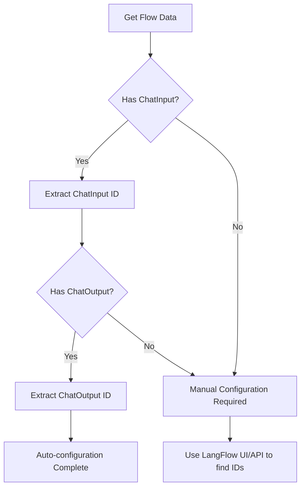
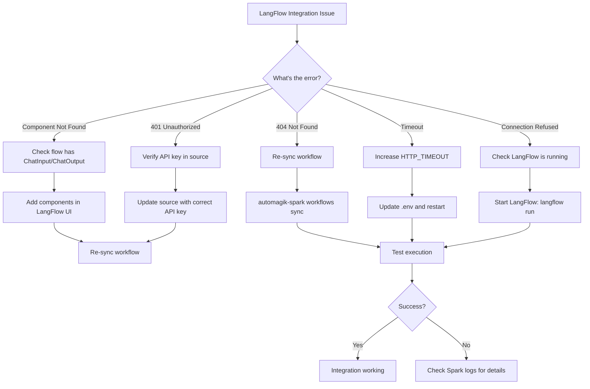

## Overview

LangFlow is a visual workflow builder for creating AI agents and chatbots using a drag-and-drop interface. Spark integrates with LangFlow to schedule and automate flow executions. This guide covers everything from initial setup to advanced troubleshooting.

<Info>
**Prerequisites**:
- LangFlow installed and running (default port 7860)
- Spark installed with PostgreSQL and Redis running
- Basic understanding of LangFlow's visual workflow builder
</Info>

---

## Architecture Overview

### How LangFlow and Spark Work Together



**The Flow**:
1. Create workflows visually in LangFlow
2. Spark discovers them via LangFlow API
3. Create schedules in Spark
4. Workers execute workflows automatically
5. Results stored in Spark's task history

### LangFlow Architecture

LangFlow workflows (called "flows") are built using a node-based graph system:

- **Nodes**: Individual components like ChatInput, ChatOutput, LLM, Prompt, etc.
- **Edges**: Connections between nodes that define data flow
- **Projects/Folders**: Containers for organizing flows
- **Components**: Reusable templates (excluded from Spark sync)



### Integration Sequence



---

## Prerequisites

### Installing LangFlow

If you don't have LangFlow running yet:

```bash
# Install LangFlow
pip install langflow

# Run LangFlow (starts on port 7860)
langflow run
```

<Accordion title="Alternative: Run LangFlow with Docker">
```bash
# Using the provided docker-compose file
docker-compose -f docker-langflow.yml up -d

# Check it's running
curl http://localhost:7860/api/v1/health
```

**Environment variables** (optional):
```bash
LANGFLOW_PORT=7860
LANGFLOW_SUPERUSER=automagik
LANGFLOW_SUPERUSER_PASSWORD=automagik_pass
LANGFLOW_SECRET_KEY=your-langflow-secret-key-2024
```
</Accordion>

### Verify LangFlow is Running

```bash
# Health check
curl http://localhost:7860/api/v1/health

# Expected response:
# {"status": "ok"}
```

**Access the UI**: Open http://localhost:7860 in your browser

---

## Creating a LangFlow Flow

<Warning>
**Important**: Spark only syncs flows that are saved in a **Project or Folder**. Template flows (without a project) are ignored.
</Warning>

<Steps>
  <Step title="Create a new project">
    1. Open LangFlow UI at http://localhost:7860
    2. Click **"New Project"** or select an existing project
    3. Name your project (e.g., "Spark Workflows")
  </Step>

  <Step title="Create a simple flow">
    1. Click **"New Flow"** inside your project
    2. Name it (e.g., "Daily Report")
    3. Add components from the left sidebar:
       - **ChatInput** component (for input data)
       - **ChatOutput** component (for results)
       - Add any processing components in between
    4. Connect components by dragging from output to input nodes
  </Step>

  <Step title="Identify component IDs (Important!)">
    Spark needs to know which components handle input/output:

    1. Click on the **ChatInput** component
    2. Look at the URL or component properties panel
    3. Note the component ID (e.g., `ChatInput-abc123`)
    4. Do the same for **ChatOutput** (e.g., `ChatOutput-def456`)

    <Tip>
    **Pro tip**: Spark attempts to auto-detect ChatInput and ChatOutput components during sync, but knowing the IDs helps with troubleshooting.
    </Tip>
  </Step>

  <Step title="Save and test the flow">
    1. Click **"Save"** in the top right
    2. Click **"Run"** to test the flow
    3. Verify it produces the expected output
  </Step>
</Steps>

---

## Step-by-Step Integration

<Steps>
  <Step title="Get LangFlow API Key">
    ### Finding your API key

    **Option 1: Via LangFlow UI**
    1. Click your profile icon in the top right
    2. Navigate to **"Settings"** or **"API Keys"**
    3. Generate a new API key or copy existing one
    4. Format: `sk-...` or similar

    **Option 2: Via API** (if auto-login enabled)
    ```bash
    # Default with auto-login
    # No API key required - use any placeholder
    API_KEY="auto-login-enabled"
    ```

    <Warning>
    **Security**: Never commit API keys to version control. Use environment variables or `.env` files.
    </Warning>
  </Step>

  <Step title="Add LangFlow as Source">
    Add LangFlow to Spark's list of workflow sources:

    ```bash
    automagik-spark sources add \
      --name "my-langflow" \
      --type "langflow" \
      --url "http://localhost:7860" \
      --api-key "sk-your-api-key-here"
    ```

    **Expected output**:
    ```
    Health check passed: status ok
    Version check passed: 1.0.65
    Successfully added source: http://localhost:7860
    ```

    **Verify the source**:
    ```bash
    automagik-spark sources list
    ```

    Expected:
    ```
    ┌──────────────────────────────────────┬──────────────────────┬──────────┬────────┬─────────┐
    │ ID                                   │ URL                  │ Type     │ Status │ Version │
    ├──────────────────────────────────────┼──────────────────────┼──────────┼────────┼─────────┤
    │ abc123-def456                        │ http://localhost:... │ langflow │ active │ 1.0.65  │
    └──────────────────────────────────────┴──────────────────────┴──────────┴────────┴─────────┘
    ```
  </Step>

  <Step title="Discover Flows">
    List all available flows from your LangFlow instance:

    ```bash
    # Discover flows from all sources
    automagik-spark workflows sync
    ```

    **Expected output**:
    ```
    ┌────────────────────────┬──────────────────┬──────────────────────┬──────────┐
    │ ID                     │ Name             │ Description          │ Source   │
    ├────────────────────────┼──────────────────┼──────────────────────┼──────────┤
    │ flow-abc-123           │ daily-report     │ Generate daily stats │ langflow │
    │ flow-def-456           │ data-processor   │ Process CSV data     │ langflow │
    └────────────────────────┴──────────────────┴──────────────────────┴──────────┘

    Command: sync <flow_id> • Sources: my-langflow
    ```

    <Info>
    **What you're seeing**:
    - **ID**: LangFlow's flow ID (needed for sync)
    - **Name**: Flow name from LangFlow
    - **Source**: Which LangFlow instance it came from
    </Info>

    <Warning>
    **Don't see your flow?** Check:
    - Flow is saved in a Project/Folder (not a template)
    - LangFlow API is accessible: `curl http://localhost:7860/api/v1/flows/`
    - Flow is not marked as a "Component" (`is_component=True`)
    </Warning>
  </Step>

  <Step title="Sync the Flow">
    Import a specific flow into Spark:

    ```bash
    # Sync the flow you want to schedule
    automagik-spark workflows sync flow-abc-123
    ```

    **Expected output**:
    ```
    Successfully synced flow flow-abc-123
    ```

    **What happens during sync**:
    1. Spark fetches flow metadata from LangFlow
    2. Identifies ChatInput/ChatOutput components
    3. Stores component IDs for execution
    4. Normalizes flow data to Spark's format
    5. Creates a local workflow record

    **Verify the sync**:
    ```bash
    automagik-spark workflows list
    ```

    Expected:
    ```
    ┌────────────┬──────────────┬────────────┬─────────────┬───────────┬──────────┬──────┬──────────────┐
    │ ID         │ Name         │ Latest Run │ Tasks       │ Schedules │ Instance │ Type │ Last Updated │
    ├────────────┼──────────────┼────────────┼─────────────┼───────────┼──────────┼──────┼──────────────┤
    │ workflow-1 │ daily-report │ NEW        │ 0 (0)       │ 0         │ langflow │ flow │ 2 mins ago   │
    └────────────┴──────────────┴────────────┴─────────────┴───────────┴──────────┴──────┴──────────────┘
    ```
  </Step>

  <Step title="Test Execution">
    Before scheduling, test the workflow manually:

    ```bash
    # Run the workflow with test input
    automagik-spark workflows run workflow-1 --input "test message"
    ```

    **Expected output** (success):
    ```
    Task abc-def-123 completed successfully
    Input: test message
    Output: {
      "result": "...",
      "session_id": "...",
      "outputs": [...]
    }
    ```

    **Expected output** (failure):
    ```
    Task abc-def-123 failed
    Error: Could not find chat input and output components in flow
    ```

    <Accordion title="Understanding LangFlow execution results">
    LangFlow returns a complex response structure:

    ```json
    {
      "outputs": [
        {
          "outputs": [
            {
              "results": {
                "message": {
                  "text": "Your actual result here"
                }
              }
            }
          ]
        }
      ],
      "session_id": "abc-123"
    }
    ```

    Spark normalizes this to:
    ```json
    {
      "success": true,
      "result": { "outputs": [...] },
      "session_id": "abc-123",
      "metadata": {}
    }
    ```
    </Accordion>
  </Step>

  <Step title="Create Schedule">
    Schedule the workflow to run automatically:

    ```bash
    # Interactive schedule creation
    automagik-spark schedules create
    ```

    **Follow the prompts**:
    ```
    Available Workflows:
    0: daily-report (0 schedules)

    Select a workflow: 0

    Schedule Type:
      0: Interval (e.g., every 30 minutes)
      1: Cron (e.g., every day at 8 AM)
      2: One-time (run once)

    Select schedule type: 1

    Enter cron expression: 0 9 * * *

    Enter input value: {"message": "Generate daily report"}

    Schedule created successfully with ID: schedule-abc-123
    ```

    **Common schedule patterns**:
    - Every 5 minutes: `*/5 * * * *`
    - Every hour: `0 * * * *`
    - Daily at 9 AM: `0 9 * * *`
    - Weekdays at 9 AM: `0 9 * * 1-5`
  </Step>

  <Step title="Monitor Tasks">
    View execution history and results:

    ```bash
    # List all task executions
    automagik-spark tasks list
    ```

    Expected:
    ```
    ┌──────────────┬──────────────┬─────────────┬────────┬────────────┬───────────────┐
    │ ID           │ Workflow     │ Schedule    │ Status │ Created    │ Duration      │
    ├──────────────┼──────────────┼─────────────┼────────┼────────────┼───────────────┤
    │ task-abc-123 │ daily-report │ schedule-12 │ ✓ OK   │ 2 mins ago │ 1.2s          │
    └──────────────┴──────────────┴─────────────┴────────┴────────────┴───────────────┘
    ```

    **View detailed output**:
    ```bash
    automagik-spark tasks view task-abc-123
    ```
  </Step>
</Steps>

---

## Component Identification

### How Spark Finds Components

When syncing a flow, Spark's adapter:

1. **Fetches flow data** from LangFlow API
2. **Scans nodes** in the flow structure
3. **Identifies components** by type:
   ```python
   for node in flow_data["data"]["nodes"]:
       node_type = node["data"]["type"]
       if node_type == "ChatInput":
           input_component = node["id"]
       elif node_type == "ChatOutput":
           output_component = node["id"]
   ```
4. **Stores component IDs** for execution

**Auto-detected types:**
- `ChatInput` - User message input
- `ChatOutput` - Bot response output

### Finding Component IDs Manually

#### Method 1: LangFlow UI

1. Open your flow in LangFlow
2. Click on a component (e.g., ChatInput)
3. Look for the component ID in the browser URL or component properties
4. Format: `ComponentType-randomId` (e.g., `ChatInput-abc123`)

#### Method 2: API Inspection

```bash
# Get flow details
curl -X GET "http://localhost:7860/api/v1/flows/{flow_id}" \
  -H "x-api-key: sk-abc123..."

# Extract component IDs from response
{
  "data": {
    "nodes": [
      {"id": "ChatInput-abc123", "data": {"type": "ChatInput"}},
      {"id": "ChatOutput-def456", "data": {"type": "ChatOutput"}}
    ]
  }
}
```

#### Method 3: Using jq to Extract Components

```bash
curl -X GET "http://localhost:7860/api/v1/flows/flow-abc-123" \
  -H "x-api-key: sk-abc123..." | \
  jq '.data.nodes[] | {id, type: .data.type}'
```

### Component ID Extraction Flow



### Manual Component Specification

If auto-detection fails, you can specify components manually (advanced):

```python
# In the workflow metadata (requires database access)
{
    "input_component": "ChatInput-custom-id",
    "output_component": "ChatOutput-custom-id"
}
```

### Custom Component Types

<Warning>
**Limitation**: Spark currently only supports ChatInput/ChatOutput components. If your flow uses custom input/output components, it may not work correctly.
</Warning>

**Workaround**: Wrap your custom components with standard ChatInput/ChatOutput nodes.

---

## Input/Output Mapping

### How Spark Maps Data to LangFlow

When Spark executes a flow:

1. **Input Data** → Sent to `input_component` (usually ChatInput)
2. **Flow Execution** → LangFlow processes the flow
3. **Output Data** ← Retrieved from `output_component` (usually ChatOutput)

### Understanding LangFlow Inputs

LangFlow's ChatInput component accepts various input formats:

**Simple string input**:
```bash
automagik-spark workflows run workflow-1 --input "Hello, world!"
```

**Structured JSON input**:
```bash
automagik-spark workflows run workflow-1 --input '{"message": "Hello", "context": "greeting"}'
```

### Input Data Format

Spark sends input as FlowExecuteRequest:

```python
{
  "input_value": "What is the weather today?",  # User's message
  "output_type": "debug",
  "input_type": "chat",
  "tweaks": {
    "ChatInput-abc123": {},   # Input component config
    "ChatOutput-def456": {}   # Output component config
  }
}
```

### Configuring Schedule Inputs

When creating a schedule, provide input in the format your flow expects:

```bash
# During schedule creation
Enter input value: {"query": "What's the weather?", "location": "San Francisco"}
```

**Update schedule input later**:
```bash
automagik-spark schedules set-input schedule-abc-123 '{"new": "input data"}'
```

### Input Transformation

The LangFlow adapter automatically wraps your input:

```python
# Your input
"test message"

# What LangFlow receives
{
    "input_value": "test message",
    "output_type": "debug",
    "input_type": "chat",
    "tweaks": {
        "ChatInput-abc123": {},
        "ChatOutput-def456": {}
    }
}
```

### Tweaks and Advanced Configuration

**Tweaks** allow runtime customization of component parameters:

```json
{
  "tweaks": {
    "ChatInput-abc123": {
      "input_value": "Override input"
    },
    "OpenAI-xyz789": {
      "model_name": "gpt-4",
      "temperature": 0.7,
      "max_tokens": 500
    },
    "ChatOutput-def456": {
      "should_store_message": true
    }
  }
}
```

<Info>
**Future enhancement**: Spark may support flow tweaks via schedule configuration for advanced use cases.
</Info>

---

## Common LangFlow Patterns

### Pattern 1: Simple Chat Bot

```
ChatInput → Prompt Template → OpenAI → ChatOutput
```

**Sync Configuration:**
- `input_component`: ChatInput node ID
- `output_component`: ChatOutput node ID

### Pattern 2: RAG (Retrieval-Augmented Generation)

```
ChatInput → VectorStore Retriever → Context Combiner → OpenAI → ChatOutput
```

**Sync Configuration:**
- Same as simple chatbot
- Input/output remain at endpoints
- Middle components handled internally

### Pattern 3: Multi-Step Agent

```
ChatInput → Agent → Tools (Search, Calculator, etc.) → Memory → ChatOutput
```

**Sync Configuration:**
- `input_component`: ChatInput
- `output_component`: ChatOutput
- Session ID used for memory continuity

### Pattern 4: Conditional Flow

```
ChatInput → Router → [Path A: Support Agent | Path B: Sales Agent] → ChatOutput
```

**Sync Configuration:**
- Multiple ChatOutput nodes possible
- Spark captures the active output path

---

## Troubleshooting

### Common Issues

<AccordionGroup>
  <Accordion title="Error: Could not find chat input and output components in flow" icon="circle-xmark">
    ### What it means
    Spark couldn't identify ChatInput/ChatOutput components in your flow.

    ### Common causes
    - Flow doesn't have ChatInput or ChatOutput components
    - Components have custom types
    - Flow structure changed after sync
    - Using a template flow (not in a project)

    ### How to fix

    **Step 1: Verify components in LangFlow**
    1. Open your flow in LangFlow UI
    2. Check for ChatInput and ChatOutput nodes
    3. Ensure they're connected to your processing chain

    **Step 2: Re-sync the flow**
    ```bash
    # Sync again to update component IDs
    automagik-spark workflows sync flow-abc-123
    ```

    **Step 3: Inspect flow structure**
    ```bash
    curl http://localhost:7860/api/v1/flows/flow-abc-123 | jq '.data.nodes[] | {id, type: .data.type}'
    ```

    **Step 4: Add missing components**
    If ChatInput/ChatOutput are missing:
    1. Add them to your flow in LangFlow
    2. Connect them appropriately
    3. Save and re-sync
  </Accordion>

  <Accordion title="Error: Flow {flow_id} not found" icon="circle-xmark">
    ### What it means
    LangFlow API returned 404 for the flow ID.

    ### Common causes
    - Flow was deleted in LangFlow
    - Wrong flow ID
    - Flow moved to different project
    - LangFlow database reset

    ### How to fix

    **Step 1: List available flows**
    ```bash
    automagik-spark workflows sync
    ```

    **Step 2: Verify flow exists in LangFlow**
    ```bash
    curl http://localhost:7860/api/v1/flows/
    ```

    **Step 3: Re-sync with correct flow ID**
    ```bash
    automagik-spark workflows sync correct-flow-id
    ```

    **Step 4: Delete stale workflow from Spark**
    ```bash
    automagik-spark workflows delete workflow-1
    ```
  </Accordion>

  <Accordion title="Error: HTTP error 401 or 403" icon="lock">
    ### What it means
    Authentication failed with LangFlow API.

    ### Common causes
    - Invalid or expired API key
    - API key not set in source
    - LangFlow authentication settings changed
    - CORS or security policy blocking requests

    ### How to fix

    **Step 1: Generate new API key**
    1. Open LangFlow UI
    2. Go to Settings → API Keys
    3. Create new key

    **Step 2: Update source in Spark**
    ```bash
    automagik-spark sources update \
      --api-key "sk-new-api-key"
    ```

    **Step 3: Test authentication**
    ```bash
    curl -H "x-api-key: sk-your-key" http://localhost:7860/api/v1/flows/
    ```

    **Step 4: Check LangFlow settings**
    Ensure `LANGFLOW_AUTO_LOGIN` is configured correctly.
  </Accordion>

  <Accordion title="Flow structure changed after sync" icon="diagram-next">
    ### What it means
    You modified the flow in LangFlow after syncing to Spark.

    ### Common causes
    - Added/removed components
    - Changed component IDs
    - Renamed flow
    - Restructured flow logic

    ### How to fix

    **Step 1: Re-sync the flow**
    ```bash
    automagik-spark workflows sync flow-abc-123
    ```

    **Step 2: Test execution**
    ```bash
    automagik-spark workflows run workflow-1 --input "test"
    ```

    **Step 3: Update schedules if needed**
    If input format changed:
    ```bash
    automagik-spark schedules set-input schedule-123 '{"new": "format"}'
    ```

    ### Prevention
    - Re-sync after major flow changes
    - Test manually before relying on schedules
    - Use version control for flow exports
  </Accordion>

  <Accordion title="Execution successful but no output" icon="circle-question">
    ### What it means
    LangFlow executed the flow but returned no output data.

    ### Common causes
    - ChatOutput not connected to processing chain
    - Flow error not captured by LangFlow
    - Output component configured incorrectly
    - Async execution not completed

    ### How to fix

    **Step 1: Test in LangFlow UI**
    1. Run the flow manually in LangFlow
    2. Verify output appears
    3. Check for any warnings/errors

    **Step 2: Inspect task result in Spark**
    ```bash
    automagik-spark tasks view task-abc-123
    ```

    Look for:
    - `"result": null` → Flow returned nothing
    - `"result": {}` → Empty result
    - `"result": {"outputs": []}` → No outputs generated

    **Step 3: Check component connections**
    Ensure ChatOutput receives data from your processing nodes.

    **Step 4: Enable debug logging**
    ```bash
    # Check worker logs for detailed execution info
    automagik-spark worker logs
    ```
  </Accordion>

  <Accordion title="API Connection Errors" icon="plug">
    ### Error: Connection Refused or Timeout

    **Common causes:**
    - LangFlow not running
    - Wrong URL or port
    - Network/firewall issues
    - Execution timeout

    **Solutions:**

    **Check LangFlow is running:**
    ```bash
    curl http://localhost:7860/api/v1/health
    # Expected: {"status": "ok"}
    ```

    **View LangFlow logs:**
    ```bash
    # If running via Docker
    docker logs automagik-langflow

    # If running directly
    # Logs appear in terminal where you ran `langflow run`
    ```

    **Verify source configuration:**
    ```bash
    automagik-spark sources list
    ```

    **Increase timeout for long-running flows:**
    ```bash
    # In .env file
    HTTP_TIMEOUT=120.0  # Increase timeout to 120 seconds

    # Restart Spark API and workers
    automagik-spark api start
    automagik-spark workers start
    ```
  </Accordion>
</AccordionGroup>

### Debugging Tips

**Check LangFlow is accessible:**
```bash
# Health check
curl http://localhost:7860/api/v1/health

# Expected: {"status": "ok"}
```

**Test LangFlow API directly:**
```bash
# List all flows
curl -H "x-api-key: YOUR_KEY" http://localhost:7860/api/v1/flows/

# Get specific flow
curl -H "x-api-key: YOUR_KEY" http://localhost:7860/api/v1/flows/flow-abc-123

# Run flow manually
curl -X POST \
  -H "x-api-key: YOUR_KEY" \
  -H "Content-Type: application/json" \
  -d '{"input_value": "test", "output_type": "debug"}' \
  http://localhost:7860/api/v1/run/flow-abc-123
```

**Check adapter initialization:**
```bash
# Verify source configuration
automagik-spark sources list

# Should show langflow type and active status
```

**View worker logs:**
```bash
# Check for adapter errors
automagik-spark worker logs | grep -i langflow
```

**Common adapter issues:**
- Timeout errors → Increase `AUTOMAGIK_SPARK_HTTP_TIMEOUT` (default: 30s)
- Connection refused → Verify LangFlow URL and port
- SSL errors → LangFlow adapter uses `verify=False` for development

### Retry Failed Tasks

If a task failed due to temporary issues:

```bash
# Retry a failed task
automagik-spark tasks retry task-abc-123
```

### Troubleshooting Decision Tree



---

## API Endpoint Reference

### Base URL Configuration

```
Base URL: {langflow_url}/api/v1
Authentication: x-api-key header
```

### Endpoints Used by Spark

| Method | Endpoint | Purpose | Spark Usage |
|--------|----------|---------|-------------|
| GET | `/flows/` | List all flows | Discovery/sync |
| GET | `/flows/{flow_id}` | Get flow details | Component detection |
| GET | `/flows/{flow_id}/components/` | Get flow components | Component mapping |
| POST | `/run/{flow_id}?stream=false` | Execute flow | Task execution |
| GET | `/folders/` | List folders (legacy) | Filter templates |
| GET | `/projects/` | List projects (modern) | Filter templates |

### Request/Response Examples

#### List Flows

**Request:**
```bash
curl -X GET "http://localhost:7860/api/v1/flows/" \
  -H "x-api-key: sk-abc123..."
```

**Response:**
```json
[
  {
    "id": "550e8400-e29b-41d4-a716-446655440000",
    "name": "Support Bot",
    "description": "Customer support chatbot",
    "data": {...},
    "folder_id": "project-123",
    "is_component": false,
    "created_at": "2024-01-15T10:30:00Z",
    "updated_at": "2024-01-20T14:45:00Z"
  }
]
```

#### Get Flow Details

**Request:**
```bash
curl -X GET "http://localhost:7860/api/v1/flows/{flow_id}" \
  -H "x-api-key: sk-abc123..."
```

**Response:**
```json
{
  "id": "550e8400-e29b-41d4-a716-446655440000",
  "name": "Support Bot",
  "data": {
    "nodes": [
      {
        "id": "ChatInput-abc123",
        "data": {
          "type": "ChatInput",
          "node": {
            "template": {
              "input_value": {
                "type": "str"
              }
            }
          }
        }
      },
      {
        "id": "ChatOutput-def456",
        "data": {
          "type": "ChatOutput"
        }
      }
    ],
    "edges": [...]
  }
}
```

#### Execute Flow

**Request:**
```bash
curl -X POST "http://localhost:7860/api/v1/run/{flow_id}?stream=false" \
  -H "x-api-key: sk-abc123..." \
  -H "Content-Type: application/json" \
  -d '{
    "input_value": "I need help with my order",
    "output_type": "debug",
    "input_type": "chat",
    "tweaks": {}
  }'
```

**Response:**
```json
{
  "session_id": "session-550e8400",
  "outputs": [
    {
      "outputs": [
        {
          "results": {
            "message": {
              "text": "I'll help you with your order. Please provide your order number.",
              "sender": "Bot",
              "timestamp": "2024-01-20T15:30:00Z"
            }
          },
          "component_id": "ChatOutput-def456"
        }
      ]
    }
  ]
}
```

---

## Advanced Configuration

### Flow-specific Settings

When syncing flows, Spark stores these metadata fields:

```json
{
  "id": "workflow-1",
  "name": "daily-report",
  "remote_id": "flow-abc-123",
  "source_type": "langflow",
  "metadata": {
    "input_component": "ChatInput-abc123",
    "output_component": "ChatOutput-def456",
    "flow_data": { /* full flow structure */ }
  }
}
```

### Session Tracking

LangFlow supports session IDs for conversation continuity:

```python
# Spark automatically includes session_id in results
{
  "success": true,
  "result": {...},
  "session_id": "abc-123-def-456"
}
```

Use session IDs to:
- Track conversation history
- Debug execution flow
- Correlate multiple task runs

### Custom Component Handling

For flows with non-standard components:

```python
# Manual workflow configuration in Spark database
UPDATE workflows
SET input_component = 'CustomInput-xyz789',
    output_component = 'CustomOutput-uvw456'
WHERE id = 'workflow-id';
```

### Session Management

LangFlow supports session-based conversations:

```bash
# Spark automatically generates session IDs
session_id = f"{source_id}_{flow_id}"

# Sessions maintain conversation context
# Useful for multi-turn chatbots with memory
```

### Performance Optimization

**Retry Configuration:**
```python
@retry(
    stop=stop_after_attempt(3),
    wait=wait_exponential(multiplier=1, min=4, max=10),
    retry=retry_if_exception_type(APIServerError)
)
```

**Timeout Tuning:**
```bash
# For long-running flows
HTTP_TIMEOUT=300.0  # 5 minutes

# For quick chatbots
HTTP_TIMEOUT=30.0   # 30 seconds (default)
```

---

## Version Compatibility

### Spark Version Support

| Spark Version | LangFlow Versions | Notes |
|---------------|-------------------|-------|
| 0.1.x - 0.5.x | 0.6.x - 1.0.x | Legacy folders endpoint |
| 0.6.x+ | 1.0.x+ | Projects endpoint support |

### API Endpoint Evolution

**Legacy (LangFlow < 1.0):**
```
GET /api/v1/folders/  # List folders
GET /api/v1/flows/    # List flows in folders
```

**Modern (LangFlow 1.0+):**
```
GET /api/v1/projects/ # List projects
GET /api/v1/flows/    # List flows in projects
```

**Spark Adapter Behavior:**
```python
# Automatic fallback logic
try:
    folders = await get("/api/v1/folders/")  # Try legacy first
except:
    folders = await get("/api/v1/projects/")  # Fallback to new
```

### Breaking Changes

**LangFlow 1.0 Changes:**
- `folder_id` → `project_id` (field rename)
- Flow structure changes in some component types
- New authentication methods (still supports `x-api-key`)

**Migration:**
```bash
# Re-sync all workflows after LangFlow upgrade
automagik-spark workflows list --source my-langflow
automagik-spark workflows sync --source my-langflow --all
```

---

## Complete Example

Here's a full end-to-end example:

```bash
# Step 1: Install and start LangFlow
pip install langflow
langflow run  # Runs on port 7860

# Step 2: Create a flow in LangFlow UI
# - Go to http://localhost:7860
# - Create new project: "Spark Workflows"
# - Create flow: "Hello World"
# - Add ChatInput → Processing → ChatOutput
# - Save the flow
# - Note the flow ID from URL: flow-abc-123

# Step 3: Add LangFlow to Spark
automagik-spark sources add \
  --name "local-langflow" \
  --type "langflow" \
  --url "http://localhost:7860" \
  --api-key "sk-your-api-key"

# Step 4: Discover and sync
automagik-spark workflows sync
# Note flow ID from output
automagik-spark workflows sync flow-abc-123

# Step 5: Test execution
automagik-spark workflows run workflow-1 --input "Hello from Spark!"

# Step 6: Create schedule
automagik-spark schedules create
# Select workflow: 0
# Select type: 1 (Cron)
# Expression: */10 * * * *  (every 10 minutes)
# Input: {"message": "Automated hello"}

# Step 7: Monitor executions
automagik-spark tasks list
automagik-spark tasks view task-abc-123

# Step 8: Check worker is processing schedules
automagik-spark worker status
automagik-spark worker logs
```

---

## Best Practices

<CardGroup cols={2}>
  <Card title="Flow Design" icon="paintbrush">
    - Always include ChatInput and ChatOutput
    - Keep flows simple and focused
    - Test in LangFlow before syncing
    - Use descriptive component names
  </Card>

  <Card title="Scheduling" icon="clock">
    - Start with manual tests before scheduling
    - Use appropriate intervals (avoid every minute)
    - Monitor task success rates
    - Set up alerts for failures
  </Card>

  <Card title="Maintenance" icon="wrench">
    - Re-sync after flow changes
    - Update API keys regularly
    - Monitor LangFlow version updates
    - Clean up old tasks periodically
  </Card>

  <Card title="Security" icon="shield">
    - Never commit API keys
    - Use environment variables
    - Restrict LangFlow network access
    - Validate input data
  </Card>
</CardGroup>

---

## Quick Reference

### Essential Commands

```bash
# Source management
automagik-spark sources add --name NAME --type langflow --url URL --api-key KEY
automagik-spark sources list
automagik-spark sources update --api-key NEW_KEY

# Workflow discovery and sync
automagik-spark workflows sync                # Discover all
automagik-spark workflows sync FLOW_ID        # Sync specific
automagik-spark workflows list                # List synced
automagik-spark workflows run WORKFLOW_ID --input "data"

# Scheduling
automagik-spark schedules create
automagik-spark schedules list
automagik-spark schedules set-input SCHEDULE_ID '{"new": "input"}'

# Task monitoring
automagik-spark tasks list
automagik-spark tasks view TASK_ID
automagik-spark tasks retry TASK_ID

# Workers
automagik-spark worker start
automagik-spark worker status
automagik-spark worker logs
```

### LangFlow API Endpoints

```bash
# Health check
GET http://localhost:7860/api/v1/health

# List flows
GET http://localhost:7860/api/v1/flows/

# Get flow details
GET http://localhost:7860/api/v1/flows/{flow_id}

# Run flow
POST http://localhost:7860/api/v1/run/{flow_id}
```

---

## Next Steps

<CardGroup cols={2}>
  <Card title="Simple Schedule Example" icon="calendar" href="/spark/examples/simple-schedule">
    Learn basic scheduling concepts
  </Card>
  <Card title="Hive Integration" icon="hexagon-nodes" href="/spark/examples/hive-integration">
    Connect Automagik Hive agents
  </Card>
  <Card title="Production Deployment" icon="server" href="/spark/examples/production-deployment">
    Deploy Spark to production
  </Card>
  <Card title="CLI Reference" icon="terminal" href="/spark/cli/commands">
    Complete command reference
  </Card>
</CardGroup>

---

**Congratulations!** Your LangFlow workflows are now automated with Spark. Build once, schedule everywhere.
