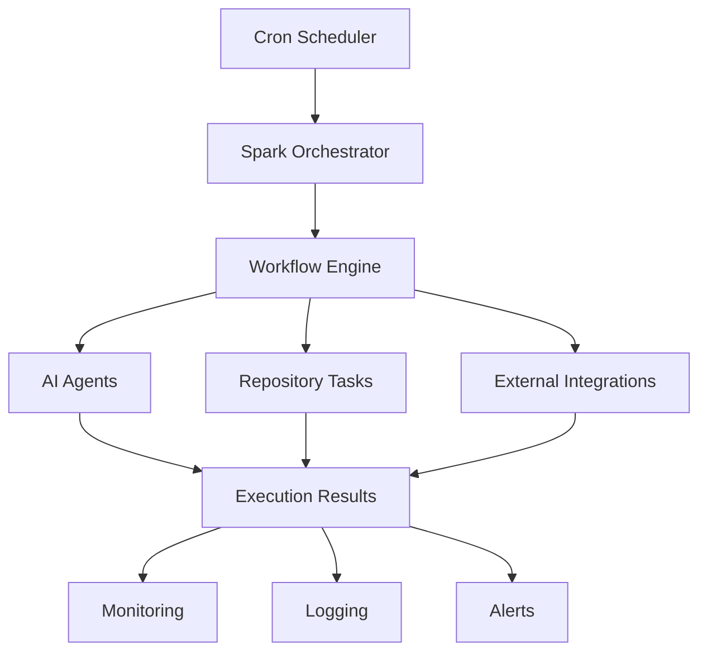

  <h1 style={{ fontSize: '2.5rem', fontWeight: '300', marginBottom: '1rem' }}>
    AI That Works
  </h1>
  <h1 style={{ fontSize: '2.5rem', fontWeight: '300', marginTop: '0' }}>
    While You Sleep
  </h1>

## What is Spark?

Spark is a **temporal automation system** that transforms reactive AI agents into proactive, autonomous workers. The "smart alarm clock" for your AI agents - scheduling workflows, orchestrating executions, and making your repositories work 24/7.

## The Problem

AI agents are typically reactive - they only work when you ask:
- **Always On-Demand**: Agents wait for human input
- **No Autonomy**: Can't run tasks on schedules
- **Manual Triggers**: You have to remember to run things
- **Wasted Time**: Repetitive tasks done manually
- **No Continuous Work**: Development stops when you stop

## The Solution

Spark gives AI agents **autonomous temporal life**:

<CardGroup cols={2}>
  <Card title="Cron-Based Scheduling" icon="clock">
    Define workflows that run on any schedule. Every hour, daily, weekly, or custom intervals.
  </Card>
  <Card title="Workflow Orchestration" icon="diagram-project">
    Chain multiple tasks together. Run complex multi-step processes automatically.
  </Card>
  <Card title="24/7 Autonomous Execution" icon="moon">
    Your AI agents work around the clock, even when you're asleep or on vacation.
  </Card>
  <Card title="Monitoring & Logging" icon="chart-line">
    Track every execution, see what worked, debug what didn't, measure productivity.
  </Card>
</CardGroup>

## Key Features

### ⏰ Flexible Scheduling
- **Cron Expressions**: Industry-standard scheduling
- **Timezone Support**: Run tasks in any timezone
- **One-Time or Recurring**: Single executions or ongoing automation
- **Smart Retries**: Automatic retry on failures

### 🔄 Workflow Automation
- **Multi-Step Tasks**: Chain operations together
- **Conditional Logic**: Run tasks based on conditions
- **Parallel Execution**: Run multiple workflows simultaneously
- **State Management**: Maintain context between runs

### 📊 Monitoring & Observability
- **Execution History**: See every run and its results
- **Error Tracking**: Catch and analyze failures
- **Performance Metrics**: Measure execution times
- **Alerts**: Get notified when things go wrong

### 🎯 Repository Automation
- **Code Analysis**: Run linters and tests automatically
- **Documentation Updates**: Keep docs in sync with code
- **Dependency Updates**: Check for updates on schedule
- **Build & Deploy**: Automate CI/CD workflows

## Who is Spark For?

<AccordionGroup>
  <Accordion title="Solo Developers">
    Automate repetitive tasks and let your AI agents maintain your projects while you focus on building.
  </Accordion>
  <Accordion title="DevOps Teams">
    Schedule maintenance tasks, monitoring, and automated responses to common issues.
  </Accordion>
  <Accordion title="AI Researchers">
    Run long-running experiments and data collection tasks on autopilot.
  </Accordion>
  <Accordion title="Product Teams">
    Automate report generation, metric collection, and stakeholder updates.
  </Accordion>
</AccordionGroup>

## Why "Spark"?

A **spark** ignites action - and that's exactly what this tool does. It **sparks your repositories into autonomous life**, transforming passive codebases into active, self-maintaining systems.

## Architecture

## Use Cases

<CardGroup cols={2}>
  <Card title="Daily Reports" icon="file-chart-line">
    Generate and send reports every morning automatically.
  </Card>
  <Card title="Dependency Updates" icon="arrows-rotate">
    Check for security updates and create PRs weekly.
  </Card>
  <Card title="Code Quality Checks" icon="magnifying-glass">
    Run linters and tests on a schedule, catch issues early.
  </Card>
  <Card title="Content Generation" icon="pen">
    Create and publish content based on data analysis daily.
  </Card>
</CardGroup>

## Philosophy

Spark embodies our core philosophy:

<Card title="AI that elevates human potential, not replaces it" icon="users">
  - **You define schedules** - Spark executes
  - **You create workflows** - Spark orchestrates
  - **You monitor** - Spark reports
  - **You control** - Spark automates
</Card>

---

## Next Steps

<CardGroup cols={2}>
  <Card title="Installation" icon="download" href="/spark/installation">
    Get Spark installed and configured
  </Card>
  <Card title="Quick Start" icon="rocket" href="/spark/quickstart">
    Create your first automated workflow
  </Card>
  <Card title="GitHub Repository" icon="github" href="https://github.com/namastexlabs/automagik-spark">
    View source code and contribute
  </Card>
  <Card title="PyPI Package" icon="python" href="https://pypi.org/project/automagik-spark">
    Install via PyPI
  </Card>
</CardGroup>
