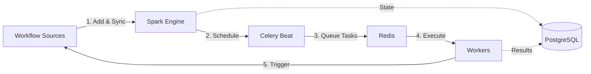
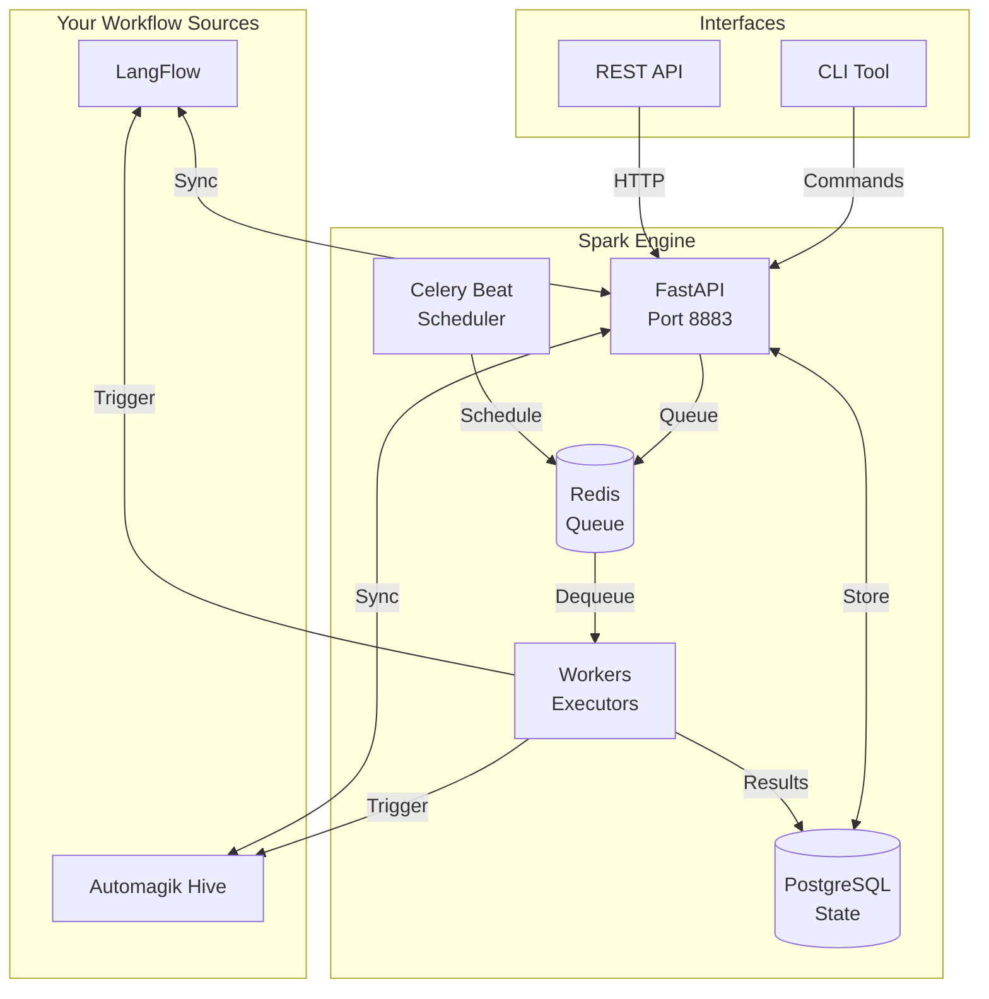

  <h1 style={{ fontSize: '2.5rem', fontWeight: '300', marginBottom: '1rem' }}>
    AI That Works
  </h1>
  <h1 style={{ fontSize: '2.5rem', fontWeight: '300', marginTop: '0' }}>
    While You Sleep
  </h1>

<Warning>
**Version Notice**: This documentation is for Spark v0.3.8+. If you're using an older version, some commands and API endpoints may differ. Check the [changelog](https://github.com/namastexlabs/automagik-spark/releases) for version-specific details.
</Warning>

## What is Spark?

Spark is the **automation engine that gives your AI workflows a sense of time**. While LangFlow and Hive create powerful workflows and agents, Spark makes them proactive by scheduling automatic execution on intervals, cron expressions, or one-time triggers.

Think of it as the alarm clock for your entire AI infrastructure.

## The Real Problem

Your AI workflows are brilliant—but they sit idle until you manually trigger them:

- Daily reports you have to remember to generate
- Monitoring tasks requiring constant attention
- Routine automations needing manual execution
- Agents that only respond when directly invoked

## How Spark Works

Spark connects to your workflow sources (LangFlow, Hive), syncs available workflows, and executes them automatically based on schedules you define.

### The Flow

**The four-step process:**

1. **Add Sources**: Connect your LangFlow or Hive instances
2. **Sync Workflows**: Discover available workflows from your sources
3. **Create Schedules**: Define when workflows should run (cron, interval, one-time)
4. **Execute Automatically**: Workers trigger workflows and store results

## Real Features (No Fluff)

<CardGroup cols={2}>
  <Card title="Cron-Based Scheduling" icon="clock">
    Standard cron expressions, intervals (5m, 1h, 1d), or one-time execution.
  </Card>
  <Card title="Multi-Source Management" icon="server">
    Connect multiple LangFlow and Hive instances. Track them all from one place.
  </Card>
  <Card title="Distributed Workers" icon="users">
    Celery-powered workers execute workflows. Scale horizontally as needed.
  </Card>
  <Card title="Execution History" icon="list">
    Every task execution stored with input, output, status, and timestamps.
  </Card>
</CardGroup>

## Architecture Overview

Spark is built on battle-tested components:

- **FastAPI** (REST API server)
- **PostgreSQL** (persistent state and task history)
- **Redis** (task queue and message broker)
- **Celery Beat** (cron scheduler)
- **Celery Workers** (distributed task execution)

## What Spark is NOT

<Warning>
Spark does **not** create workflows or define agent logic. It schedules and executes workflows that already exist in your LangFlow or Hive instances.
</Warning>

## Spark's Role in Automagik

Spark is part of the broader Automagik ecosystem:

- **[LangFlow](https://github.com/langflow-ai/langflow)**: Visual workflow builder
- **[Automagik Hive](https://github.com/namastexlabs/automagik-hive)**: Multi-agent orchestration
- **[Automagik Omni](https://github.com/namastexlabs/automagik-omni)**: Messaging integration
- **Spark**: Temporal scheduling for all workflows

## Real Use Cases

<AccordionGroup>
  <Accordion title="Daily Reports">
    Schedule a LangFlow workflow to generate and send reports every morning at 8 AM.
  </Accordion>
  <Accordion title="Continuous Monitoring">
    Run a Hive agent every 15 minutes to check system health and alert on issues.
  </Accordion>
  <Accordion title="Weekly Maintenance">
    Schedule dependency checks, backups, or cleanup tasks every Sunday at 2 AM.
  </Accordion>
  <Accordion title="One-Time Triggers">
    Queue a workflow to run once at a specific future time.
  </Accordion>
</AccordionGroup>

## Next Steps

<CardGroup cols={2}>
  <Card title="Installation" icon="download" href="/spark/installation">
    Get Spark installed with PostgreSQL and Redis
  </Card>
  <Card title="Quick Start" icon="rocket" href="/spark/quickstart">
    Schedule your first workflow in under 30 minutes
  </Card>
  <Card title="GitHub Repository" icon="github" href="https://github.com/namastexlabs/automagik-spark">
    View source code and contribute
  </Card>
  <Card title="PyPI Package" icon="python" href="https://pypi.org/project/automagik-spark">
    Install via pip
  </Card>
</CardGroup>
